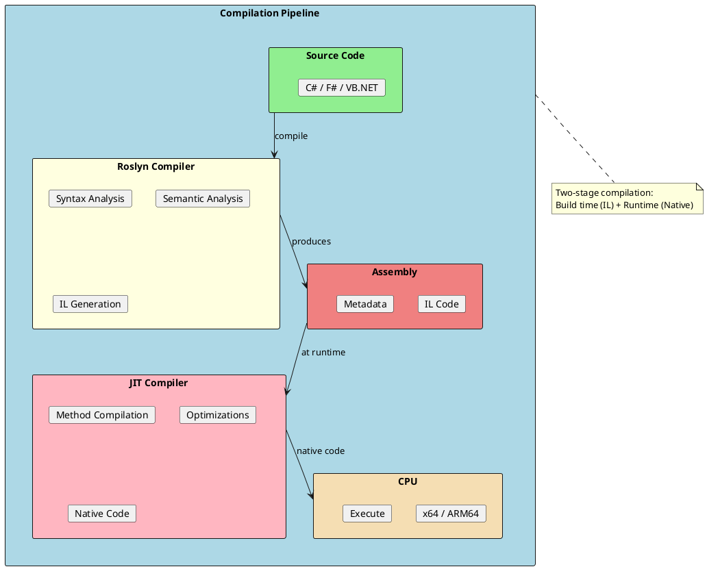
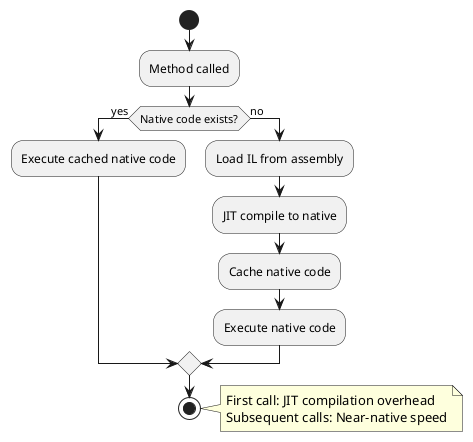
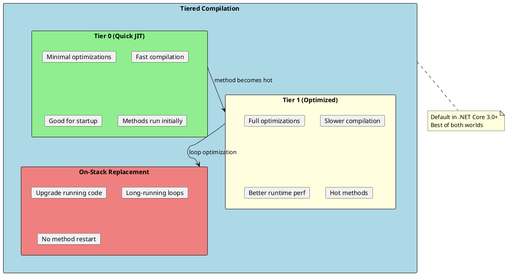
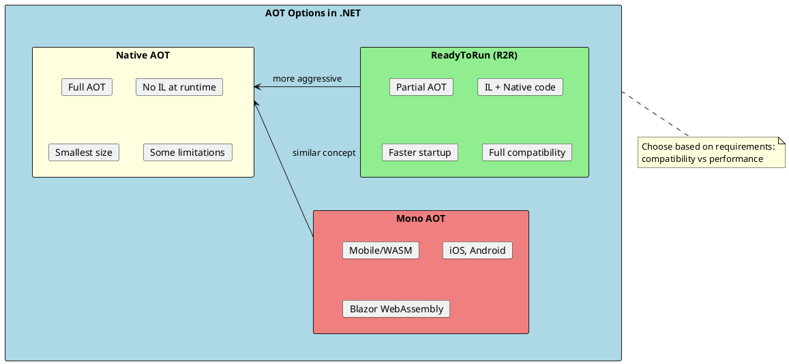
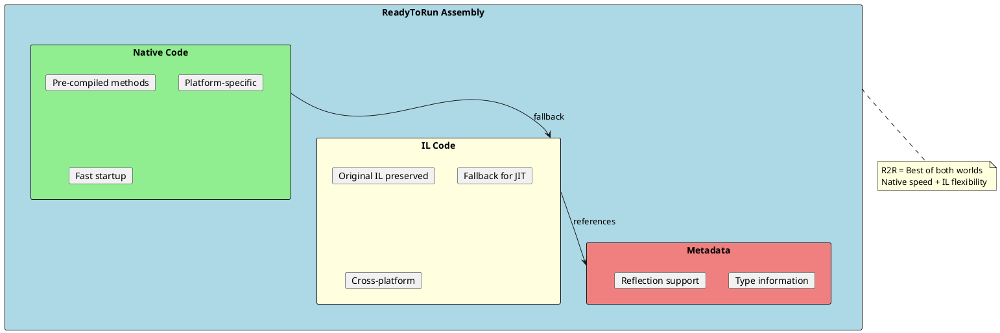
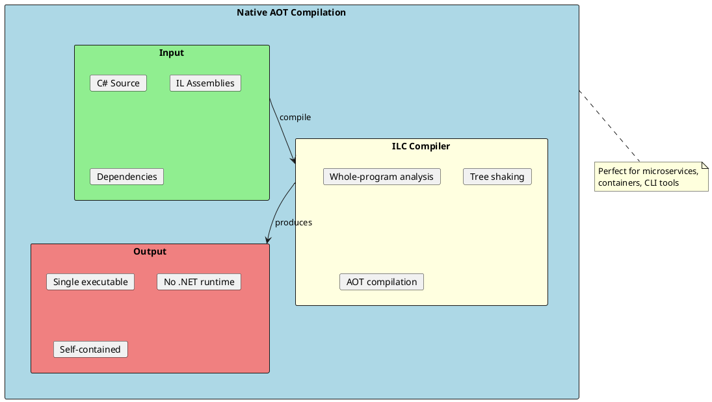
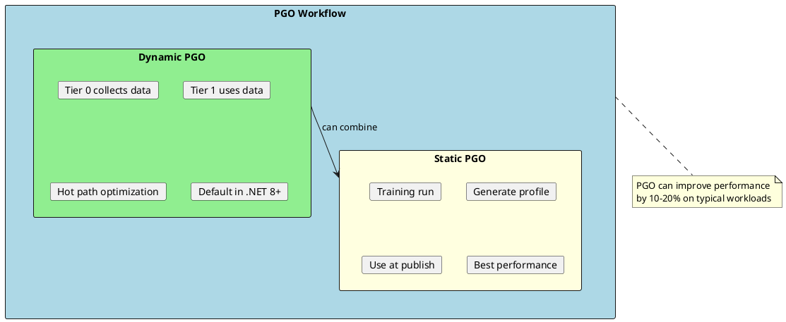

# JIT Compilation

Just-In-Time (JIT) compilation is the process of converting Intermediate Language (IL) code to native machine code at runtime. Understanding JIT compilation helps you optimize application startup time and runtime performance.



## How JIT Works

When a method is called for the first time, the JIT compiler converts its IL to native code. This native code is cached and reused for subsequent calls.



### JIT Compilation Example

```csharp
public class JITExample
{
    // When this method is first called:
    // 1. CLR loads the IL code
    // 2. JIT compiles IL to native x64/ARM64
    // 3. Native code is cached
    // 4. Method executes

    public int Calculate(int x, int y)
    {
        return x * y + x / y;
    }

    // IL for Calculate method (simplified):
    /*
    .method public hidebysig instance int32 Calculate(int32 x, int32 y) cil managed
    {
        .maxstack 3
        ldarg.1          // Load x
        ldarg.2          // Load y
        mul              // x * y
        ldarg.1          // Load x
        ldarg.2          // Load y
        div              // x / y
        add              // (x * y) + (x / y)
        ret
    }
    */

    // Native x64 code (approximate):
    /*
    mov eax, ecx       ; x to eax
    imul eax, edx      ; x * y
    mov ecx, edi       ; x to ecx
    cdq                ; sign extend
    idiv edi           ; x / y
    add eax, ecx       ; add results
    ret
    */
}
```

### JIT Compiler Optimizations

| Optimization | Description |
|--------------|-------------|
| **Inlining** | Replaces method call with method body |
| **Dead Code Elimination** | Removes unreachable code |
| **Constant Folding** | Evaluates constant expressions at compile time |
| **Loop Unrolling** | Expands small loops |
| **Bounds Check Elimination** | Removes redundant array bounds checks |
| **Register Allocation** | Assigns variables to CPU registers |
| **Devirtualization** | Converts virtual calls to direct calls |

```csharp
public class JITOptimizations
{
    // Inlining example
    [MethodImpl(MethodImplOptions.AggressiveInlining)]
    public int Add(int a, int b) => a + b;

    public int UseAdd(int x, int y)
    {
        // JIT may inline Add() here, becoming:
        // return x + y;
        return Add(x, y);
    }

    // Constant folding
    public int GetConstant()
    {
        // JIT evaluates at compile time
        return 10 * 20 + 5;  // Becomes: return 205;
    }

    // Bounds check elimination
    public int SumArray(int[] arr)
    {
        int sum = 0;
        // JIT knows arr.Length is constant during loop
        // Can eliminate bounds checks after first iteration
        for (int i = 0; i < arr.Length; i++)
        {
            sum += arr[i];
        }
        return sum;
    }
}
```

---

## Tiered Compilation

Tiered Compilation is a feature that improves both startup time and steady-state performance by compiling methods in multiple tiers.



### How Tiered Compilation Works

```csharp
public class TieredCompilationExample
{
    // First few calls: Tier 0 (quick, minimal optimization)
    // After 30 calls: Background thread recompiles with Tier 1
    // Hot methods get full optimization without blocking startup

    public int HotMethod(int x)
    {
        // Call 1-30: Tier 0 code (fast JIT, basic optimizations)
        // Call 31+: Tier 1 code (full optimizations, inlining, etc.)
        return x * x + x;
    }

    public void DemonstrateTiering()
    {
        // First calls are fast to JIT but run slower
        for (int i = 0; i < 30; i++)
        {
            HotMethod(i);  // Using Tier 0 code
        }

        // After threshold, method is recompiled in background
        // Subsequent calls use optimized Tier 1 code
        for (int i = 0; i < 1000; i++)
        {
            HotMethod(i);  // Using Tier 1 code (after recompilation)
        }
    }
}
```

### Controlling Tiered Compilation

```xml
<!-- In .csproj file -->
<PropertyGroup>
  <!-- Disable tiered compilation -->
  <TieredCompilation>false</TieredCompilation>

  <!-- Enable Quick JIT for loops (faster startup) -->
  <TieredCompilationQuickJitForLoops>true</TieredCompilationQuickJitForLoops>
</PropertyGroup>
```

```csharp
// Force full optimization for specific method
[MethodImpl(MethodImplOptions.AggressiveOptimization)]
public int AlwaysOptimized(int x, int y)
{
    // Skips Tier 0, compiles directly with full optimizations
    return x * y + x / y;
}

// Prevent inlining (sometimes needed for stack traces, debugging)
[MethodImpl(MethodImplOptions.NoInlining)]
public int NeverInlined(int x)
{
    return x * 2;
}

// Prevent optimization (for debugging)
[MethodImpl(MethodImplOptions.NoOptimization)]
public int NotOptimized(int x)
{
    return x * 2;
}
```

---

## AOT Compilation

Ahead-of-Time (AOT) compilation generates native code before runtime, eliminating JIT overhead.



### ReadyToRun (R2R)

ReadyToRun pre-compiles assemblies to native code while keeping IL for fallback.

```xml
<!-- Enable ReadyToRun in .csproj -->
<PropertyGroup>
  <PublishReadyToRun>true</PublishReadyToRun>
</PropertyGroup>

<!-- Publish command -->
<!-- dotnet publish -c Release -r win-x64 -->
```



### ReadyToRun Benefits and Trade-offs

| Aspect | Without R2R | With R2R |
|--------|-------------|----------|
| **Startup Time** | Slower (JIT needed) | Faster (pre-compiled) |
| **Assembly Size** | Smaller | ~2-3x larger |
| **Runtime Perf** | Same (after warmup) | Same |
| **Cross-platform** | Yes (IL) | No (native) |
| **Debugging** | Normal | Normal |

---

## Native AOT

Native AOT compiles the entire application to a single native executable with no dependency on the .NET runtime.



### Enabling Native AOT

```xml
<!-- In .csproj file -->
<PropertyGroup>
  <PublishAot>true</PublishAot>
</PropertyGroup>

<!-- Publish command -->
<!-- dotnet publish -c Release -r win-x64 -->
```

### Native AOT Considerations

```csharp
// ✅ Works with Native AOT
public class NativeAOTCompatible
{
    public void DirectCalls()
    {
        var list = new List<int> { 1, 2, 3 };
        Console.WriteLine(list.Count);
    }

    public void GenericMethods<T>(T value) where T : struct
    {
        Console.WriteLine(value.ToString());
    }
}

// ⚠️ May require configuration
public class NativeAOTCaution
{
    // Reflection needs explicit configuration
    public void UseReflection()
    {
        // Type must be preserved in rd.xml
        var type = Type.GetType("MyNamespace.MyClass");
    }

    // Dynamic code generation NOT supported
    public void DynamicCode()
    {
        // ❌ Reflection.Emit not available
        // ❌ Expression.Compile() limited
    }
}

// Configure reflection in rd.xml
/*
<Directives>
  <Application>
    <Assembly Name="MyApp">
      <Type Name="MyNamespace.MyClass" Dynamic="Required All" />
    </Assembly>
  </Application>
</Directives>
*/
```

### Native AOT Comparison

| Feature | JIT | ReadyToRun | Native AOT |
|---------|-----|------------|------------|
| **Startup Time** | Slow | Medium | Fastest |
| **File Size** | Small | Large | Smallest* |
| **Runtime Size** | + Runtime | + Runtime | Self-contained |
| **Reflection** | Full | Full | Limited |
| **Dynamic Code** | Yes | Yes | No |
| **Cross-platform** | Yes (IL) | No | No |

*Smallest after tree shaking removes unused code

---

## Profile-Guided Optimization (PGO)

PGO uses runtime profiling data to optimize code paths that are actually used.



### Enabling PGO

```xml
<!-- Dynamic PGO (default in .NET 8+) -->
<PropertyGroup>
  <TieredPGO>true</TieredPGO>
</PropertyGroup>

<!-- Static PGO workflow -->
<!-- 1. Build with instrumentation -->
<PropertyGroup>
  <PgoInstrument>true</PgoInstrument>
</PropertyGroup>

<!-- 2. Run training scenarios -->
<!-- 3. Collect .mibc profile files -->

<!-- 4. Build with profile -->
<PropertyGroup>
  <PgoOptimize>true</PgoOptimize>
  <MibcProfiles>path/to/profile.mibc</MibcProfiles>
</PropertyGroup>
```

### PGO Optimizations

```csharp
public class PGOExample
{
    // PGO can optimize virtual call dispatch
    public interface IProcessor
    {
        void Process();
    }

    public class FastProcessor : IProcessor
    {
        public void Process() { /* fast path */ }
    }

    public class SlowProcessor : IProcessor
    {
        public void Process() { /* slow path */ }
    }

    // If PGO observes FastProcessor used 99% of time:
    // JIT can devirtualize and inline the fast path
    public void DoWork(IProcessor processor)
    {
        // PGO might transform to:
        // if (processor is FastProcessor fp)
        //     fp.Process();  // Inlined fast path
        // else
        //     processor.Process();  // Virtual call fallback
        processor.Process();
    }

    // PGO optimizes hot branches
    public int BranchOptimization(int x)
    {
        // If PGO observes x > 10 is true 95% of time,
        // JIT arranges code for that path
        if (x > 10)
        {
            return x * 2;  // Hot path - optimized
        }
        else
        {
            return x / 2;  // Cold path
        }
    }
}
```

---

## Analyzing JIT Behavior

Understanding JIT behavior helps optimize performance-critical code.

```csharp
using System.Runtime.CompilerServices;

public class JITAnalysis
{
    // Check if method was JIT compiled
    public void AnalyzeMethod()
    {
        var method = typeof(JITAnalysis).GetMethod(nameof(TestMethod));

        // PrepareMethod forces JIT compilation
        RuntimeHelpers.PrepareMethod(method!.MethodHandle);

        Console.WriteLine("Method JIT compiled");
    }

    public int TestMethod(int x) => x * 2;

    // Run before any JIT to prepare delegates
    [MethodImpl(MethodImplOptions.AggressiveInlining)]
    public static void PrepareDelegate<T>(T d) where T : Delegate
    {
        RuntimeHelpers.PrepareDelegate(d);
    }
}

// BenchmarkDotNet for accurate JIT measurements
/*
[MemoryDiagnoser]
public class JITBenchmarks
{
    [Benchmark]
    public int WithInlining() => InlinedMethod(42);

    [Benchmark]
    public int WithoutInlining() => NotInlinedMethod(42);

    [MethodImpl(MethodImplOptions.AggressiveInlining)]
    private int InlinedMethod(int x) => x * 2;

    [MethodImpl(MethodImplOptions.NoInlining)]
    private int NotInlinedMethod(int x) => x * 2;
}
*/
```

### Viewing JIT Output

```bash
# Set environment variables to dump JIT output
# Windows PowerShell:
$env:DOTNET_JitDisasm = "Calculate"  # Method to disassemble
$env:DOTNET_JitDisasmOutputPath = "."
dotnet run

# Or use BenchmarkDotNet with [DisassemblyDiagnoser]
```

---

## Interview Questions & Answers

### Q1: What is JIT compilation?

**Answer**: JIT (Just-In-Time) compilation converts IL (Intermediate Language) to native machine code at runtime, when a method is first called. The native code is cached for subsequent calls. This provides platform independence (IL runs anywhere) while achieving near-native performance after compilation.

### Q2: What is Tiered Compilation?

**Answer**: Tiered Compilation compiles methods in two tiers:
- **Tier 0**: Quick compilation with minimal optimizations (fast startup)
- **Tier 1**: Full optimization after method is called ~30 times (background thread)

This balances startup time (quick Tier 0) with runtime performance (optimized Tier 1). Enabled by default in .NET Core 3.0+.

### Q3: What is the difference between ReadyToRun and Native AOT?

**Answer**:
- **ReadyToRun (R2R)**: Partial AOT - includes pre-compiled native code AND IL. Falls back to JIT when needed. Full .NET compatibility, larger file size.
- **Native AOT**: Complete AOT - no IL at runtime. Single native executable, smallest size after tree shaking. Limited reflection and no dynamic code generation.

### Q4: What optimizations does the JIT compiler perform?

**Answer**: Key JIT optimizations include:
1. **Inlining**: Replacing method calls with method body
2. **Dead code elimination**: Removing unreachable code
3. **Constant folding**: Evaluating constant expressions at compile time
4. **Devirtualization**: Converting virtual calls to direct calls
5. **Bounds check elimination**: Removing redundant array checks
6. **Register allocation**: Assigning variables to CPU registers

### Q5: When should you use Native AOT?

**Answer**: Use Native AOT for:
- **CLI tools**: Fast startup, small size
- **Microservices**: Containers benefit from small images
- **Lambda functions**: Cold start time critical
- **Embedded**: No runtime dependency

Avoid when you need:
- Full reflection capabilities
- Dynamic code generation (Reflection.Emit)
- Plugins loaded at runtime

### Q6: What is Profile-Guided Optimization (PGO)?

**Answer**: PGO uses runtime profiling data to optimize frequently-executed code paths. The JIT collects data about which branches are taken, which types are used, etc., then recompiles with optimizations specific to actual usage patterns. This can improve performance by 10-20%. Dynamic PGO is enabled by default in .NET 8+.

