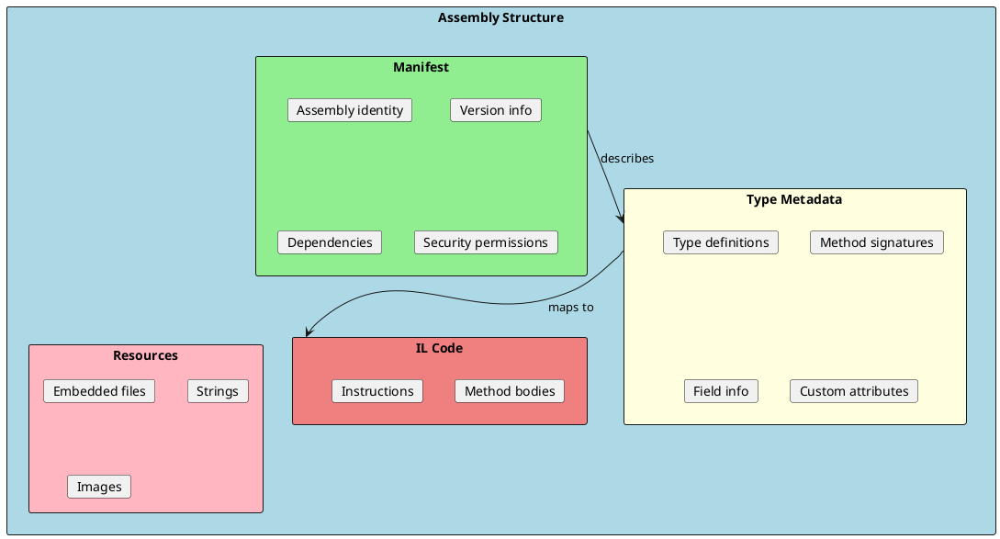
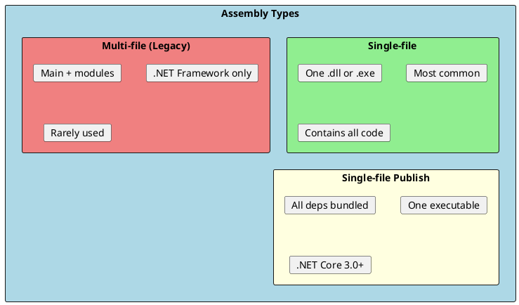
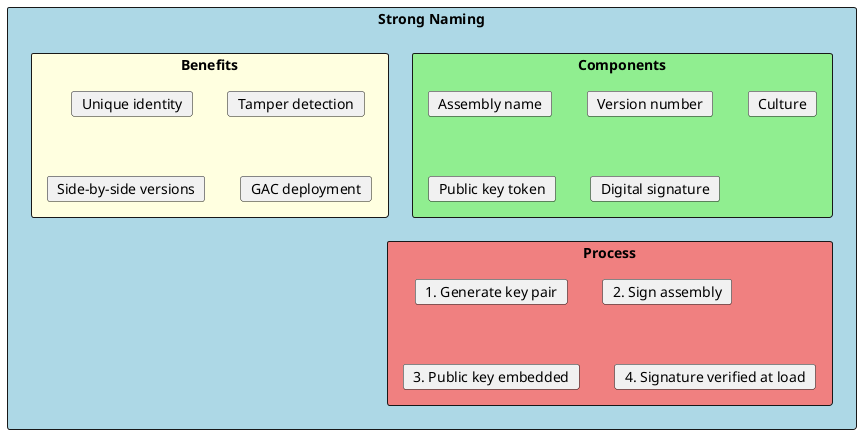
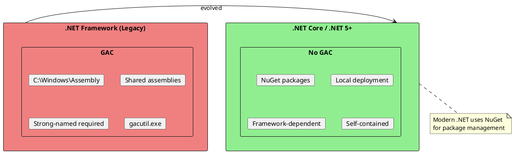
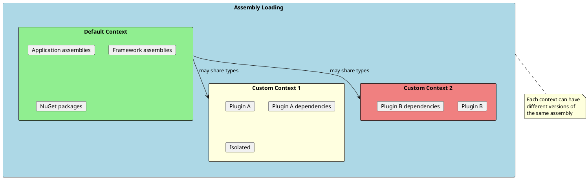
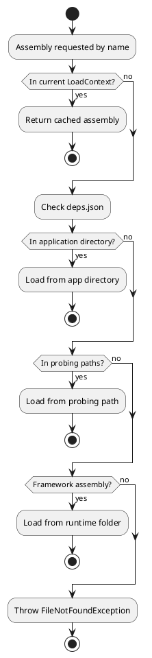
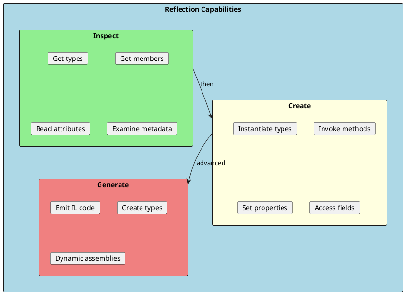
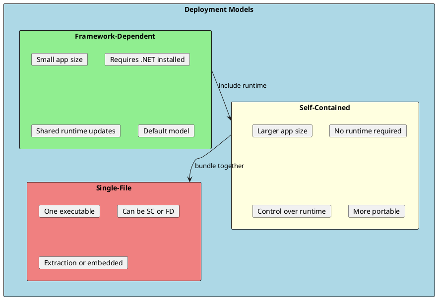

# Assemblies and Loading

Assemblies are the building blocks of .NET applications. Understanding how they are structured, loaded, and resolved is essential for building modular, maintainable applications and diagnosing deployment issues.



## Assembly Basics

An assembly is a logical unit of deployment, versioning, and security in .NET. It can be a DLL (library) or EXE (executable).



### Assembly Identity

```csharp
using System.Reflection;

public class AssemblyInfo
{
    public void ShowAssemblyIdentity()
    {
        var assembly = Assembly.GetExecutingAssembly();
        var name = assembly.GetName();

        Console.WriteLine($"Name: {name.Name}");
        Console.WriteLine($"Version: {name.Version}");
        Console.WriteLine($"Culture: {name.CultureInfo?.Name ?? "neutral"}");
        Console.WriteLine($"PublicKeyToken: {BitConverter.ToString(name.GetPublicKeyToken() ?? Array.Empty<byte>())}");

        // Full name format:
        // MyAssembly, Version=1.0.0.0, Culture=neutral, PublicKeyToken=b77a5c561934e089
        Console.WriteLine($"Full Name: {assembly.FullName}");
    }

    public void ShowAssemblyAttributes()
    {
        var assembly = Assembly.GetExecutingAssembly();

        // Assembly-level attributes
        var title = assembly.GetCustomAttribute<AssemblyTitleAttribute>();
        var company = assembly.GetCustomAttribute<AssemblyCompanyAttribute>();
        var version = assembly.GetCustomAttribute<AssemblyVersionAttribute>();

        Console.WriteLine($"Title: {title?.Title}");
        Console.WriteLine($"Company: {company?.Company}");
        Console.WriteLine($"Version: {version?.Version}");
    }
}

// Assembly attributes in .csproj (modern approach)
/*
<PropertyGroup>
  <AssemblyName>MyLibrary</AssemblyName>
  <Version>1.2.3</Version>
  <Company>My Company</Company>
  <Product>My Product</Product>
  <Copyright>Copyright © 2024</Copyright>
</PropertyGroup>
*/
```

---

## Strong Naming

Strong naming gives an assembly a unique identity using a public/private key pair. It enables side-by-side versioning and prevents tampering.



### Creating and Using Strong Names

```bash
# Generate key pair
sn -k MyCompany.snk

# Extract public key
sn -p MyCompany.snk MyCompany.pub

# Display public key token
sn -t MyCompany.pub
```

```xml
<!-- In .csproj file -->
<PropertyGroup>
  <SignAssembly>true</SignAssembly>
  <AssemblyOriginatorKeyFile>MyCompany.snk</AssemblyOriginatorKeyFile>
</PropertyGroup>
```

```csharp
// Reference strong-named assembly
public class StrongNameExample
{
    public void LoadStrongNamedAssembly()
    {
        // Load by full name (including public key token)
        var assembly = Assembly.Load(
            "MyLibrary, Version=1.0.0.0, Culture=neutral, PublicKeyToken=b77a5c561934e089"
        );

        // Verify if assembly is strong-named
        var name = assembly.GetName();
        var publicKey = name.GetPublicKey();
        var isStrongNamed = publicKey != null && publicKey.Length > 0;

        Console.WriteLine($"Is Strong Named: {isStrongNamed}");
    }
}
```

---

## Global Assembly Cache (GAC) - Legacy

The GAC was used in .NET Framework to store shared, strong-named assemblies. It's largely obsolete in .NET Core/.NET 5+.



---

## AssemblyLoadContext

`AssemblyLoadContext` is the modern mechanism for loading assemblies with isolation in .NET Core/.NET 5+. It replaced AppDomains for assembly isolation.



### Creating Custom AssemblyLoadContext

```csharp
using System.Reflection;
using System.Runtime.Loader;

public class PluginLoadContext : AssemblyLoadContext
{
    private readonly AssemblyDependencyResolver _resolver;

    public PluginLoadContext(string pluginPath) : base(isCollectible: true)
    {
        _resolver = new AssemblyDependencyResolver(pluginPath);
    }

    protected override Assembly? Load(AssemblyName assemblyName)
    {
        // Try to resolve from plugin directory
        string? assemblyPath = _resolver.ResolveAssemblyToPath(assemblyName);

        if (assemblyPath != null)
        {
            return LoadFromAssemblyPath(assemblyPath);
        }

        // Fall back to default context
        return null;
    }

    protected override IntPtr LoadUnmanagedDll(string unmanagedDllName)
    {
        string? libraryPath = _resolver.ResolveUnmanagedDllToPath(unmanagedDllName);

        if (libraryPath != null)
        {
            return LoadUnmanagedDllFromPath(libraryPath);
        }

        return IntPtr.Zero;
    }
}
```

### Plugin Loading System

```csharp
public interface IPlugin
{
    string Name { get; }
    void Execute();
}

public class PluginLoader
{
    private readonly List<PluginLoadContext> _contexts = new();

    public IPlugin? LoadPlugin(string pluginPath)
    {
        var context = new PluginLoadContext(pluginPath);
        _contexts.Add(context);

        var assembly = context.LoadFromAssemblyPath(pluginPath);

        // Find IPlugin implementation
        foreach (var type in assembly.GetTypes())
        {
            if (typeof(IPlugin).IsAssignableFrom(type) && !type.IsInterface)
            {
                return (IPlugin?)Activator.CreateInstance(type);
            }
        }

        return null;
    }

    public void UnloadPlugin(PluginLoadContext context)
    {
        // Collectible contexts can be unloaded
        context.Unload();
        _contexts.Remove(context);

        // Force GC to reclaim memory
        for (int i = 0; i < 10; i++)
        {
            GC.Collect();
            GC.WaitForPendingFinalizers();
        }
    }
}

// Usage
public class PluginHost
{
    public void LoadAndExecutePlugins()
    {
        var loader = new PluginLoader();

        // Load plugins from directory
        foreach (var pluginPath in Directory.GetFiles("plugins", "*.dll"))
        {
            var plugin = loader.LoadPlugin(pluginPath);
            if (plugin != null)
            {
                Console.WriteLine($"Loaded: {plugin.Name}");
                plugin.Execute();
            }
        }
    }
}
```

---

## Assembly Resolution

Understanding how .NET resolves assemblies helps diagnose "assembly not found" errors.



### Handling Assembly Resolution Events

```csharp
public class AssemblyResolver
{
    public void SetupResolver()
    {
        // Handle assembly resolution for the default context
        AssemblyLoadContext.Default.Resolving += OnResolving;

        // Handle native library resolution
        AssemblyLoadContext.Default.ResolvingUnmanagedDll += OnResolvingNative;
    }

    private Assembly? OnResolving(AssemblyLoadContext context, AssemblyName assemblyName)
    {
        Console.WriteLine($"Resolving: {assemblyName.Name}");

        // Custom resolution logic
        string? path = FindAssembly(assemblyName.Name!);
        if (path != null)
        {
            return context.LoadFromAssemblyPath(path);
        }

        // Return null to let default resolution continue
        return null;
    }

    private IntPtr OnResolvingNative(Assembly assembly, string libraryName)
    {
        Console.WriteLine($"Resolving native: {libraryName}");

        // Custom native library resolution
        string? path = FindNativeLibrary(libraryName);
        if (path != null)
        {
            return NativeLibrary.Load(path);
        }

        return IntPtr.Zero;
    }

    private string? FindAssembly(string name)
    {
        // Search custom paths
        var searchPaths = new[] { "libs", "plugins", "extensions" };

        foreach (var searchPath in searchPaths)
        {
            var path = Path.Combine(searchPath, $"{name}.dll");
            if (File.Exists(path))
            {
                return Path.GetFullPath(path);
            }
        }

        return null;
    }

    private string? FindNativeLibrary(string name)
    {
        // Platform-specific search
        var extensions = new[] { ".dll", ".so", ".dylib" };

        foreach (var ext in extensions)
        {
            var path = Path.Combine("native", $"{name}{ext}");
            if (File.Exists(path))
            {
                return Path.GetFullPath(path);
            }
        }

        return null;
    }
}
```

---

## deps.json and runtimeconfig.json

These files control assembly resolution and runtime behavior.

### deps.json

```json
{
  "runtimeTarget": {
    "name": ".NETCoreApp,Version=v8.0"
  },
  "targets": {
    ".NETCoreApp,Version=v8.0": {
      "MyApp/1.0.0": {
        "dependencies": {
          "Newtonsoft.Json": "13.0.3"
        },
        "runtime": {
          "MyApp.dll": {}
        }
      },
      "Newtonsoft.Json/13.0.3": {
        "runtime": {
          "lib/net8.0/Newtonsoft.Json.dll": {}
        }
      }
    }
  },
  "libraries": {
    "MyApp/1.0.0": {
      "type": "project"
    },
    "Newtonsoft.Json/13.0.3": {
      "type": "package",
      "serviceable": true,
      "sha512": "..."
    }
  }
}
```

### runtimeconfig.json

```json
{
  "runtimeOptions": {
    "tfm": "net8.0",
    "framework": {
      "name": "Microsoft.NETCore.App",
      "version": "8.0.0"
    },
    "configProperties": {
      "System.GC.Server": true,
      "System.GC.Concurrent": true,
      "System.Runtime.Serialization.EnableUnsafeBinaryFormatterSerialization": false
    }
  }
}
```

---

## Reflection and Dynamic Loading

Reflection allows you to inspect and interact with types at runtime.



### Reflection Examples

```csharp
public class ReflectionExamples
{
    // Load and inspect assembly
    public void InspectAssembly(string path)
    {
        var assembly = Assembly.LoadFrom(path);

        Console.WriteLine($"Assembly: {assembly.FullName}");
        Console.WriteLine("\nTypes:");

        foreach (var type in assembly.GetExportedTypes())
        {
            Console.WriteLine($"  {type.FullName}");

            var methods = type.GetMethods(BindingFlags.Public | BindingFlags.Instance);
            foreach (var method in methods.Where(m => m.DeclaringType == type))
            {
                var parameters = string.Join(", ",
                    method.GetParameters().Select(p => $"{p.ParameterType.Name} {p.Name}"));
                Console.WriteLine($"    {method.ReturnType.Name} {method.Name}({parameters})");
            }
        }
    }

    // Create instance and invoke method
    public object? CreateAndInvoke(string typeName, string methodName, params object[] args)
    {
        var type = Type.GetType(typeName);
        if (type == null) return null;

        var instance = Activator.CreateInstance(type);
        var method = type.GetMethod(methodName);

        return method?.Invoke(instance, args);
    }

    // Generic method invocation
    public void InvokeGenericMethod<T>()
    {
        var method = typeof(List<>).MakeGenericType(typeof(T))
            .GetMethod("Add");

        var list = Activator.CreateInstance(typeof(List<T>));
        method!.Invoke(list, new object[] { default(T)! });
    }
}
```

### MetadataLoadContext (Inspection Only)

```csharp
using System.Reflection;

public class MetadataInspector
{
    // Inspect assemblies without loading for execution
    public void InspectWithoutLoading(string assemblyPath)
    {
        var resolver = new PathAssemblyResolver(new[]
        {
            assemblyPath,
            typeof(object).Assembly.Location  // Include runtime
        });

        using var context = new MetadataLoadContext(resolver);

        var assembly = context.LoadFromAssemblyPath(assemblyPath);

        // Can inspect types but cannot create instances
        foreach (var type in assembly.GetTypes())
        {
            Console.WriteLine(type.FullName);

            // This would throw - execution not allowed
            // Activator.CreateInstance(type);
        }
    }
}
```

---

## Deployment Models

.NET supports various deployment options for assemblies.



### Deployment Commands

```bash
# Framework-dependent (small, requires .NET installed)
dotnet publish -c Release

# Self-contained (larger, includes runtime)
dotnet publish -c Release -r win-x64 --self-contained

# Single-file self-contained
dotnet publish -c Release -r win-x64 --self-contained -p:PublishSingleFile=true

# Single-file with trimming (smallest)
dotnet publish -c Release -r win-x64 --self-contained \
  -p:PublishSingleFile=true \
  -p:PublishTrimmed=true

# Native AOT (smallest, fastest startup)
dotnet publish -c Release -r win-x64 -p:PublishAot=true
```

### Deployment Configuration

```xml
<PropertyGroup>
  <!-- Framework-dependent executable -->
  <OutputType>Exe</OutputType>
  <TargetFramework>net8.0</TargetFramework>

  <!-- Self-contained options -->
  <SelfContained>true</SelfContained>
  <RuntimeIdentifier>win-x64</RuntimeIdentifier>

  <!-- Single file -->
  <PublishSingleFile>true</PublishSingleFile>
  <IncludeNativeLibrariesForSelfExtract>true</IncludeNativeLibrariesForSelfExtract>

  <!-- Trimming -->
  <PublishTrimmed>true</PublishTrimmed>
  <TrimMode>link</TrimMode>
</PropertyGroup>
```

---

## Interview Questions & Answers

### Q1: What is an assembly in .NET?

**Answer**: An assembly is the fundamental unit of deployment, versioning, and security in .NET. It contains:
- **Manifest**: Identity, version, dependencies
- **Metadata**: Type information
- **IL Code**: Method implementations
- **Resources**: Embedded files

Assemblies can be DLLs (libraries) or EXEs (executables).

### Q2: What is strong naming and why use it?

**Answer**: Strong naming assigns a unique identity to an assembly using:
- Name + Version + Culture + Public Key Token + Digital Signature

Benefits:
- **Unique identity**: Version specific references
- **Tamper detection**: Signature verifies integrity
- **Side-by-side**: Multiple versions can coexist
- **GAC**: Required for GAC deployment (legacy)

### Q3: What is AssemblyLoadContext?

**Answer**: `AssemblyLoadContext` is the modern way to load assemblies with isolation in .NET Core/.NET 5+. It replaced AppDomains for assembly isolation. Key features:
- **Isolation**: Different versions of same assembly
- **Collectible**: Can unload assemblies (`isCollectible: true`)
- **Dependency resolution**: Control over how dependencies are found

### Q4: How does .NET resolve assemblies?

**Answer**: Resolution follows this order:
1. Check if already loaded in current context
2. Check deps.json for dependency info
3. Look in application directory
4. Search probing paths
5. Check framework directories
6. Fire Resolving event for custom resolution
7. Throw FileNotFoundException

### Q5: What is the difference between framework-dependent and self-contained deployment?

**Answer**:
- **Framework-dependent**: Requires .NET runtime installed. Smaller size, shares runtime with other apps, gets runtime updates.
- **Self-contained**: Includes .NET runtime. Larger size, no external dependencies, control over exact runtime version.

### Q6: How do you implement a plugin system in .NET?

**Answer**:
1. Define a shared interface (in separate assembly)
2. Create `AssemblyLoadContext` per plugin (with `isCollectible: true`)
3. Load plugin assembly into its context
4. Find types implementing the interface via reflection
5. Create instances and use them
6. Unload context when done to free memory

Key: Use collectible contexts and handle dependency resolution properly.

