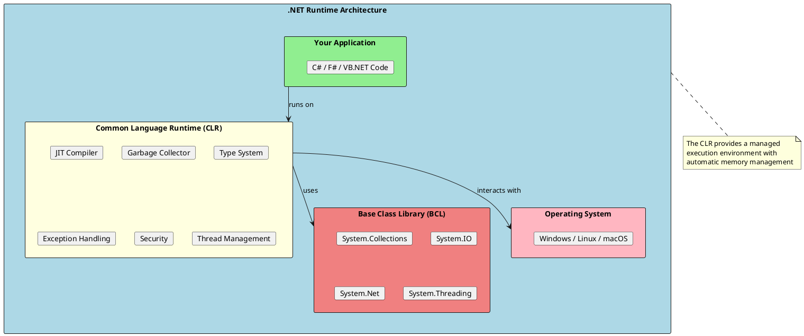
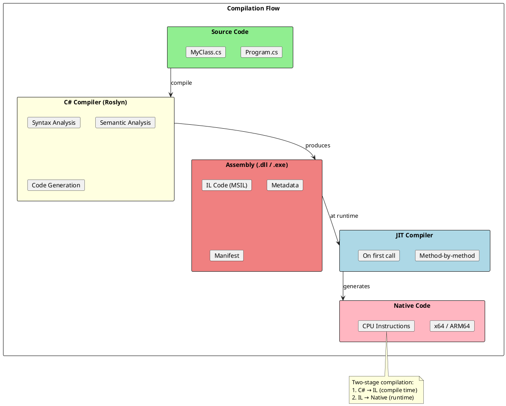
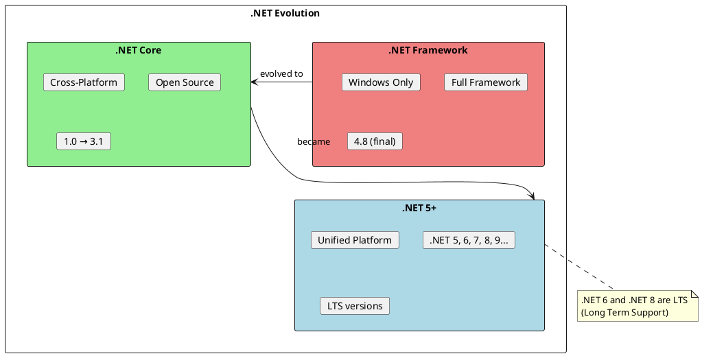

# .NET Runtime

The .NET Runtime is the execution engine that runs .NET applications. Understanding how it works under the hood is essential for writing performant, efficient code and for troubleshooting complex issues. This knowledge separates senior engineers from those who just write code that "works."



## What is the .NET Runtime?

The .NET Runtime (also called CoreCLR in .NET Core/.NET 5+) is a **virtual execution system** that provides:

1. **Memory Management** - Automatic allocation and garbage collection
2. **Type Safety** - Runtime type checking and verification
3. **Exception Handling** - Structured exception management
4. **Security** - Code access security and verification
5. **JIT Compilation** - Converting IL to native code
6. **Thread Management** - Thread pool and synchronization

## Compilation and Execution Flow



## Key Components

| Component | Purpose | Document |
|-----------|---------|----------|
| **CLR** | Core runtime engine | [01-CLRArchitecture.md](./01-CLRArchitecture.md) |
| **Memory Manager** | Stack and heap management | [02-MemoryManagement.md](./02-MemoryManagement.md) |
| **Garbage Collector** | Automatic memory reclamation | [03-GarbageCollection.md](./03-GarbageCollection.md) |
| **JIT Compiler** | IL to native compilation | [04-JITCompilation.md](./04-JITCompilation.md) |
| **Assembly Loader** | Loading and resolving assemblies | [05-AssembliesAndLoading.md](./05-AssembliesAndLoading.md) |

## .NET Versions Evolution



## Files in This Section

| File | Topics Covered |
|------|----------------|
| [01-CLRArchitecture.md](./01-CLRArchitecture.md) | CLR, CTS, CLS, managed execution, type system |
| [02-MemoryManagement.md](./02-MemoryManagement.md) | Stack vs Heap, value types, reference types, boxing |
| [03-GarbageCollection.md](./03-GarbageCollection.md) | GC generations, LOH, GC modes, finalization, IDisposable |
| [04-JITCompilation.md](./04-JITCompilation.md) | JIT compilation, AOT, tiered compilation, ReadyToRun |
| [05-AssembliesAndLoading.md](./05-AssembliesAndLoading.md) | Assemblies, GAC, assembly loading, reflection |

## Why This Matters for Senior Engineers

Understanding the runtime helps you:

1. **Write Performant Code** - Know what allocates, what doesn't, and when GC runs
2. **Debug Complex Issues** - Memory leaks, GC pauses, assembly loading failures
3. **Make Architectural Decisions** - AOT vs JIT, server vs workstation GC
4. **Optimize Applications** - Reduce allocations, manage large objects, tune GC
5. **Answer Interview Questions** - Deep runtime knowledge impresses interviewers

## Quick Reference

```
┌─────────────────────────────────────────────────────────────────────┐
│                    .NET Runtime Quick Reference                     │
├─────────────────────────────────────────────────────────────────────┤
│ CLR: Common Language Runtime - the execution engine                 │
│ IL:  Intermediate Language - platform-independent bytecode          │
│ JIT: Just-In-Time compiler - IL to native at runtime               │
│ GC:  Garbage Collector - automatic memory management               │
│ BCL: Base Class Library - fundamental .NET types                    │
├─────────────────────────────────────────────────────────────────────┤
│ Stack: Fast, automatic cleanup, value types, method locals         │
│ Heap:  Slower, GC managed, reference types, objects                │
├─────────────────────────────────────────────────────────────────────┤
│ Gen 0: Short-lived objects (collected frequently)                   │
│ Gen 1: Medium-lived objects (buffer between Gen 0 and 2)           │
│ Gen 2: Long-lived objects (collected infrequently)                 │
│ LOH:   Large Object Heap (objects ≥ 85KB)                          │
└─────────────────────────────────────────────────────────────────────┘
```

## Common Interview Topics

1. **What is the CLR?** - Managed execution environment
2. **Stack vs Heap?** - Where different types are stored
3. **How does GC work?** - Generational, mark-and-sweep
4. **What is JIT?** - Just-in-time compilation
5. **Value vs Reference types?** - Storage, copying, performance
6. **What is boxing?** - Converting value type to object
7. **Finalization vs Dispose?** - Deterministic vs non-deterministic cleanup
