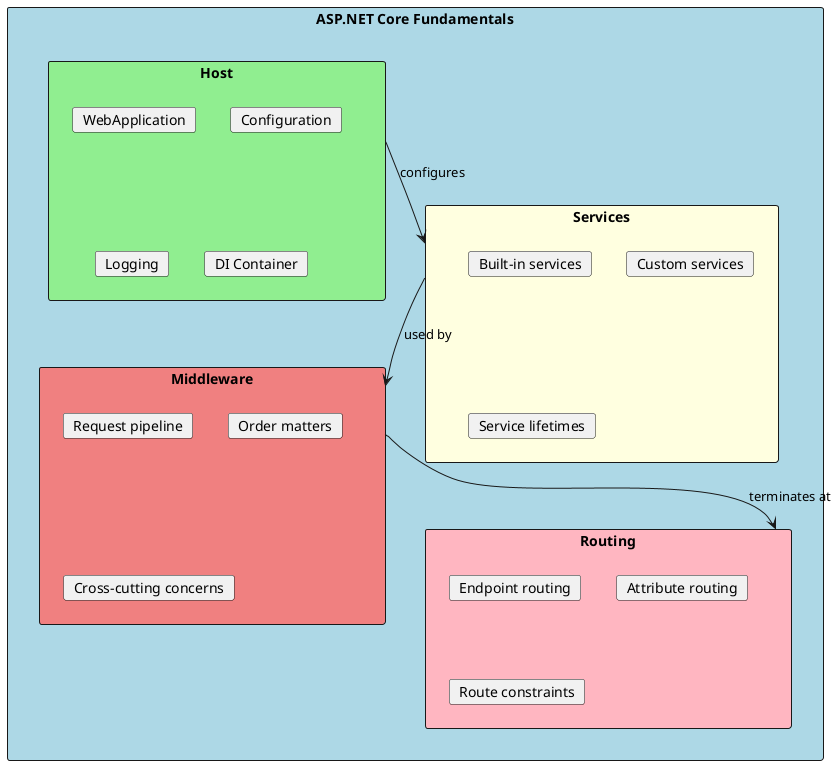
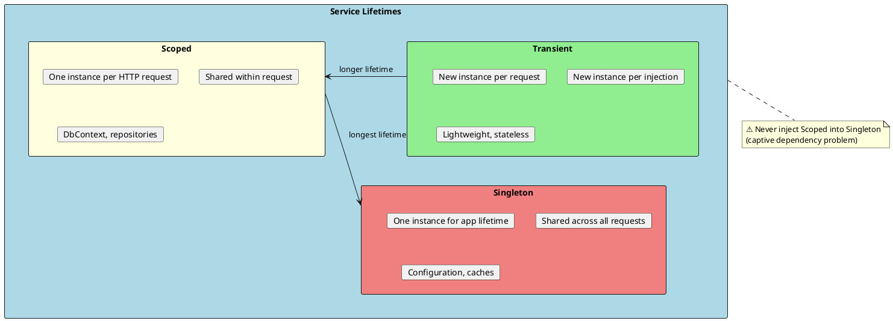
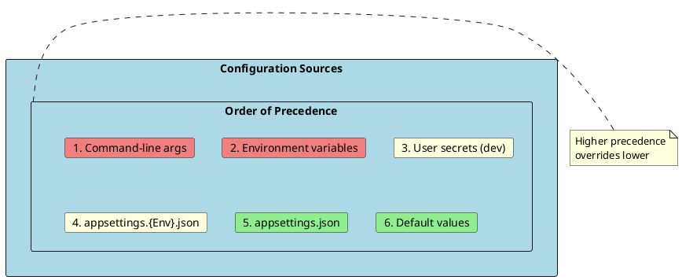
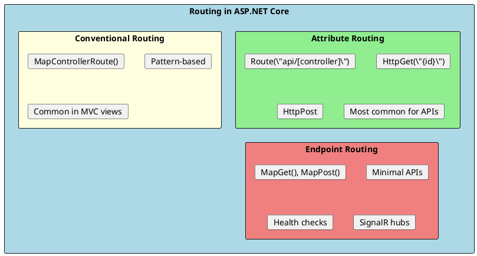
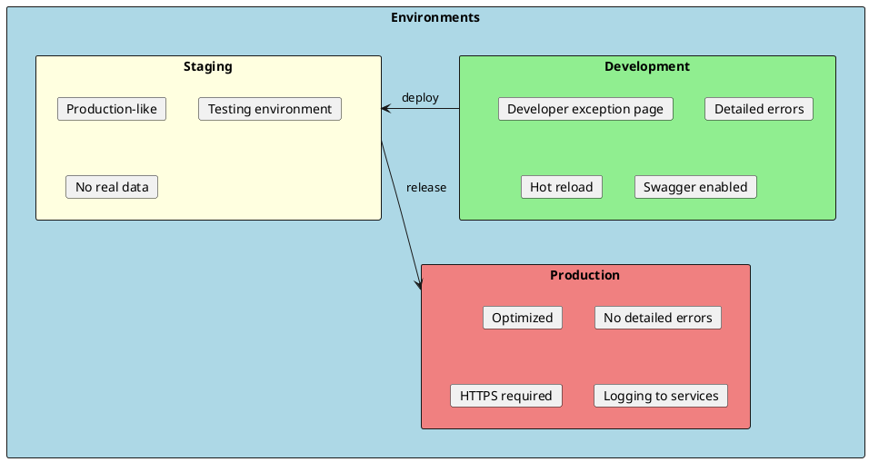

# ASP.NET Core Fundamentals

Understanding the fundamentals of ASP.NET Core is essential for building robust web APIs. This includes the request pipeline, routing, configuration, dependency injection, and environment management.



## Program.cs and WebApplication

The entry point for ASP.NET Core applications. The minimal hosting model introduced in .NET 6 simplifies application startup.

```csharp
// Program.cs - Modern minimal hosting (.NET 6+)
var builder = WebApplication.CreateBuilder(args);

// ========================================
// 1. CONFIGURE SERVICES (DI Container)
// ========================================

// Add framework services
builder.Services.AddControllers();
builder.Services.AddEndpointsApiExplorer();
builder.Services.AddSwaggerGen();

// Add custom services
builder.Services.AddScoped<IProductRepository, ProductRepository>();
builder.Services.AddScoped<IProductService, ProductService>();

// Add database context
builder.Services.AddDbContext<AppDbContext>(options =>
    options.UseSqlServer(builder.Configuration.GetConnectionString("Default")));

// Add HTTP client
builder.Services.AddHttpClient<IExternalApiClient, ExternalApiClient>(client =>
{
    client.BaseAddress = new Uri("https://api.example.com");
    client.Timeout = TimeSpan.FromSeconds(30);
});

// Add caching
builder.Services.AddMemoryCache();
builder.Services.AddStackExchangeRedisCache(options =>
{
    options.Configuration = builder.Configuration.GetConnectionString("Redis");
});

var app = builder.Build();

// ========================================
// 2. CONFIGURE MIDDLEWARE PIPELINE
// ========================================

// Development-only middleware
if (app.Environment.IsDevelopment())
{
    app.UseDeveloperExceptionPage();
    app.UseSwagger();
    app.UseSwaggerUI();
}
else
{
    app.UseExceptionHandler("/error");
    app.UseHsts();
}

// Middleware order matters!
app.UseHttpsRedirection();
app.UseCors("AllowSpecificOrigins");
app.UseAuthentication();
app.UseAuthorization();

// Endpoint routing
app.MapControllers();
app.MapHealthChecks("/health");

app.Run();
```

---

## Dependency Injection

ASP.NET Core has built-in dependency injection. Understanding service lifetimes is crucial for proper resource management.



### Service Registration

```csharp
public static class ServiceCollectionExtensions
{
    public static IServiceCollection AddApplicationServices(this IServiceCollection services)
    {
        // Transient - new instance every time it's requested
        services.AddTransient<IEmailSender, SmtpEmailSender>();
        services.AddTransient<IValidator<Product>, ProductValidator>();

        // Scoped - one instance per HTTP request
        services.AddScoped<IUnitOfWork, UnitOfWork>();
        services.AddScoped<IProductRepository, ProductRepository>();
        services.AddScoped<ICurrentUser, CurrentUser>();

        // Singleton - one instance for entire application lifetime
        services.AddSingleton<IConfiguration>(sp =>
            sp.GetRequiredService<IConfiguration>());
        services.AddSingleton<ICacheService, MemoryCacheService>();

        return services;
    }
}

// Usage in Program.cs
builder.Services.AddApplicationServices();
```

### Common DI Patterns

```csharp
// ✅ Constructor injection (preferred)
public class ProductService : IProductService
{
    private readonly IProductRepository _repository;
    private readonly ILogger<ProductService> _logger;

    public ProductService(IProductRepository repository, ILogger<ProductService> logger)
    {
        _repository = repository;
        _logger = logger;
    }
}

// ✅ Primary constructor (C# 12)
public class ProductService(IProductRepository repository, ILogger<ProductService> logger)
    : IProductService
{
    public async Task<Product?> GetByIdAsync(int id)
    {
        logger.LogInformation("Getting product {Id}", id);
        return await repository.GetByIdAsync(id);
    }
}

// ✅ Factory pattern for complex creation
builder.Services.AddScoped<INotificationService>(sp =>
{
    var config = sp.GetRequiredService<IConfiguration>();
    var useEmail = config.GetValue<bool>("Notifications:UseEmail");

    return useEmail
        ? new EmailNotificationService(sp.GetRequiredService<IEmailSender>())
        : new SmsNotificationService(sp.GetRequiredService<ISmsSender>());
});

// ✅ Options pattern for configuration
builder.Services.Configure<EmailSettings>(
    builder.Configuration.GetSection("Email"));

public class EmailService
{
    private readonly EmailSettings _settings;

    public EmailService(IOptions<EmailSettings> options)
    {
        _settings = options.Value;
    }
}

// ❌ Avoid Service Locator pattern (anti-pattern)
public class BadService
{
    private readonly IServiceProvider _serviceProvider;

    public BadService(IServiceProvider serviceProvider)
    {
        _serviceProvider = serviceProvider;
    }

    public void DoWork()
    {
        // Anti-pattern: resolving dependencies at runtime
        var repository = _serviceProvider.GetRequiredService<IRepository>();
    }
}
```

### Service Lifetime Comparison

| Lifetime | Instance Per | Use Case | Thread Safety |
|----------|-------------|----------|---------------|
| **Transient** | Injection | Lightweight, stateless services | Not shared |
| **Scoped** | HTTP Request | DbContext, Unit of Work, User context | Same request |
| **Singleton** | Application | Configuration, caches, connection factories | Must be thread-safe |

---

## Configuration

ASP.NET Core supports multiple configuration sources with a layered approach.



### Configuration Files

```json
// appsettings.json
{
  "Logging": {
    "LogLevel": {
      "Default": "Information",
      "Microsoft.AspNetCore": "Warning"
    }
  },
  "ConnectionStrings": {
    "Default": "Server=localhost;Database=MyApp;Trusted_Connection=true;"
  },
  "AppSettings": {
    "ApiKey": "default-key",
    "MaxPageSize": 100,
    "EnableFeatureX": false
  },
  "Email": {
    "SmtpServer": "smtp.example.com",
    "Port": 587,
    "SenderEmail": "noreply@example.com"
  }
}
```

```json
// appsettings.Development.json (overrides base settings)
{
  "Logging": {
    "LogLevel": {
      "Default": "Debug"
    }
  },
  "AppSettings": {
    "EnableFeatureX": true
  }
}
```

### Reading Configuration

```csharp
// Direct access (not recommended for complex scenarios)
var connectionString = builder.Configuration.GetConnectionString("Default");
var apiKey = builder.Configuration["AppSettings:ApiKey"];
var maxPageSize = builder.Configuration.GetValue<int>("AppSettings:MaxPageSize");

// ✅ Options pattern (recommended)
public class AppSettings
{
    public string ApiKey { get; set; } = string.Empty;
    public int MaxPageSize { get; set; } = 50;
    public bool EnableFeatureX { get; set; }
}

public class EmailSettings
{
    public string SmtpServer { get; set; } = string.Empty;
    public int Port { get; set; } = 587;
    public string SenderEmail { get; set; } = string.Empty;
}

// Register in Program.cs
builder.Services.Configure<AppSettings>(
    builder.Configuration.GetSection("AppSettings"));
builder.Services.Configure<EmailSettings>(
    builder.Configuration.GetSection("Email"));

// Use in services
public class ProductService
{
    private readonly AppSettings _settings;

    // IOptions<T> - read once at startup
    public ProductService(IOptions<AppSettings> options)
    {
        _settings = options.Value;
    }

    // IOptionsSnapshot<T> - reread on each request (scoped)
    public ProductService(IOptionsSnapshot<AppSettings> options)
    {
        _settings = options.Value;
    }

    // IOptionsMonitor<T> - live reload notifications (singleton-safe)
    public ProductService(IOptionsMonitor<AppSettings> options)
    {
        _settings = options.CurrentValue;
        options.OnChange(newSettings =>
        {
            // Handle configuration change
        });
    }
}
```

### Environment Variables

```csharp
// Environment variables override appsettings.json
// Use __ (double underscore) for nested properties

// Set in environment:
// ASPNETCORE_ENVIRONMENT=Production
// ConnectionStrings__Default=Server=prod;Database=MyApp;
// AppSettings__ApiKey=production-secret-key

// Access in code:
var env = builder.Environment.EnvironmentName;  // "Production"
var isDev = builder.Environment.IsDevelopment();
var isProd = builder.Environment.IsProduction();
```

---

## Routing

Routing maps incoming HTTP requests to endpoints (controllers, minimal APIs, etc.).



### Attribute Routing

```csharp
[ApiController]
[Route("api/[controller]")]  // api/products
public class ProductsController : ControllerBase
{
    // GET api/products
    [HttpGet]
    public async Task<ActionResult<IEnumerable<Product>>> GetAll()
    {
        // ...
    }

    // GET api/products/5
    [HttpGet("{id}")]
    public async Task<ActionResult<Product>> GetById(int id)
    {
        // ...
    }

    // GET api/products/5/reviews
    [HttpGet("{id}/reviews")]
    public async Task<ActionResult<IEnumerable<Review>>> GetReviews(int id)
    {
        // ...
    }

    // POST api/products
    [HttpPost]
    public async Task<ActionResult<Product>> Create([FromBody] CreateProductDto dto)
    {
        // ...
    }

    // PUT api/products/5
    [HttpPut("{id}")]
    public async Task<IActionResult> Update(int id, [FromBody] UpdateProductDto dto)
    {
        // ...
    }

    // DELETE api/products/5
    [HttpDelete("{id}")]
    public async Task<IActionResult> Delete(int id)
    {
        // ...
    }

    // GET api/products/search?name=phone&minPrice=100
    [HttpGet("search")]
    public async Task<ActionResult<IEnumerable<Product>>> Search(
        [FromQuery] string? name,
        [FromQuery] decimal? minPrice,
        [FromQuery] decimal? maxPrice)
    {
        // ...
    }
}
```

### Route Constraints

```csharp
[ApiController]
[Route("api/[controller]")]
public class OrdersController : ControllerBase
{
    // Only matches if id is an integer
    [HttpGet("{id:int}")]
    public ActionResult<Order> GetById(int id) => Ok();

    // Only matches if id is a GUID
    [HttpGet("guid/{id:guid}")]
    public ActionResult<Order> GetByGuid(Guid id) => Ok();

    // Only matches if slug is alphabetic
    [HttpGet("slug/{slug:alpha}")]
    public ActionResult<Order> GetBySlug(string slug) => Ok();

    // Range constraint
    [HttpGet("page/{page:int:min(1):max(100)}")]
    public ActionResult<Order> GetPage(int page) => Ok();

    // Length constraint
    [HttpGet("code/{code:length(6)}")]
    public ActionResult<Order> GetByCode(string code) => Ok();

    // Regex constraint
    [HttpGet("date/{date:regex(^\\d{{4}}-\\d{{2}}-\\d{{2}}$)}")]
    public ActionResult<Order> GetByDate(string date) => Ok();
}
```

### Common Route Constraints

| Constraint | Example | Matches |
|------------|---------|---------|
| `int` | `{id:int}` | 123 |
| `guid` | `{id:guid}` | CD2C1638-1638-72D5-1638-DEADBEEF1638 |
| `bool` | `{active:bool}` | true, false |
| `datetime` | `{date:datetime}` | 2024-01-15 |
| `decimal` | `{price:decimal}` | 49.99 |
| `alpha` | `{name:alpha}` | abc (letters only) |
| `minlength(n)` | `{name:minlength(3)}` | abc |
| `maxlength(n)` | `{name:maxlength(10)}` | abc |
| `length(n)` | `{code:length(6)}` | ABC123 |
| `min(n)` | `{age:min(18)}` | 18+ |
| `max(n)` | `{qty:max(100)}` | 0-100 |
| `range(n,m)` | `{page:range(1,100)}` | 1-100 |
| `regex(expr)` | `{ssn:regex(^\\d{3}-\\d{2}$)}` | 123-45 |

---

## Environments

ASP.NET Core uses environment variables to configure application behavior for different deployment scenarios.



### Environment-Specific Configuration

```csharp
var builder = WebApplication.CreateBuilder(args);
var app = builder.Build();

// Environment-specific middleware
if (app.Environment.IsDevelopment())
{
    app.UseDeveloperExceptionPage();
    app.UseSwagger();
    app.UseSwaggerUI();
}
else if (app.Environment.IsStaging())
{
    app.UseExceptionHandler("/error");
}
else // Production
{
    app.UseExceptionHandler("/error");
    app.UseHsts();
}

// Custom environments
if (app.Environment.IsEnvironment("Testing"))
{
    // Testing-specific configuration
}
```

### Setting the Environment

```bash
# Windows (PowerShell)
$env:ASPNETCORE_ENVIRONMENT = "Development"

# Windows (Command Prompt)
set ASPNETCORE_ENVIRONMENT=Development

# Linux/macOS
export ASPNETCORE_ENVIRONMENT=Development

# In launchSettings.json
{
  "profiles": {
    "Development": {
      "environmentVariables": {
        "ASPNETCORE_ENVIRONMENT": "Development"
      }
    }
  }
}

# Docker
ENV ASPNETCORE_ENVIRONMENT=Production
```

---

## Logging

ASP.NET Core has a built-in logging abstraction that supports multiple providers.

```csharp
public class ProductService : IProductService
{
    private readonly ILogger<ProductService> _logger;

    public ProductService(ILogger<ProductService> logger)
    {
        _logger = logger;
    }

    public async Task<Product?> GetByIdAsync(int id)
    {
        _logger.LogDebug("Getting product with ID {ProductId}", id);

        try
        {
            var product = await _repository.GetByIdAsync(id);

            if (product == null)
            {
                _logger.LogWarning("Product {ProductId} not found", id);
                return null;
            }

            _logger.LogInformation("Retrieved product {ProductId}: {ProductName}",
                id, product.Name);

            return product;
        }
        catch (Exception ex)
        {
            _logger.LogError(ex, "Error retrieving product {ProductId}", id);
            throw;
        }
    }
}

// Configure logging in Program.cs
builder.Logging.ClearProviders();
builder.Logging.AddConsole();
builder.Logging.AddDebug();

// Add Serilog (popular third-party logger)
builder.Host.UseSerilog((context, config) =>
{
    config
        .ReadFrom.Configuration(context.Configuration)
        .Enrich.FromLogContext()
        .WriteTo.Console()
        .WriteTo.File("logs/app-.txt", rollingInterval: RollingInterval.Day);
});
```

### Log Levels

| Level | Use Case | Example |
|-------|----------|---------|
| **Trace** | Most detailed, sensitive data | SQL queries, request bodies |
| **Debug** | Development debugging | Method entry/exit |
| **Information** | General flow | User logged in, order created |
| **Warning** | Abnormal, handled | Retry attempt, cache miss |
| **Error** | Failures, exceptions | Unhandled exception |
| **Critical** | System failure | Database down, out of memory |

---

## Interview Questions & Answers

### Q1: What is the difference between AddTransient, AddScoped, and AddSingleton?

**Answer**:
- **AddTransient**: New instance every time it's injected. Use for lightweight, stateless services.
- **AddScoped**: One instance per HTTP request. Use for DbContext, repositories, unit of work.
- **AddSingleton**: One instance for the entire application lifetime. Use for configuration, caches.

⚠️ Never inject a Scoped service into a Singleton (captive dependency).

### Q2: What is the IOptions pattern?

**Answer**: The Options pattern provides strongly-typed configuration access:
- **IOptions<T>**: Snapshot at startup, singleton
- **IOptionsSnapshot<T>**: Re-reads on each request, scoped
- **IOptionsMonitor<T>**: Supports live reload with change notifications, singleton

Use `builder.Services.Configure<T>(configuration.GetSection("Key"))` to register.

### Q3: How does routing work in ASP.NET Core?

**Answer**: ASP.NET Core uses endpoint routing:
1. **Attribute Routing**: `[Route]`, `[HttpGet]` attributes on controllers
2. **Conventional Routing**: `MapControllerRoute()` with patterns
3. **Endpoint Routing**: `MapGet()`, `MapPost()` for minimal APIs

Routes are matched based on HTTP method, path, and constraints. Route parameters are bound to action parameters.

### Q4: What environments does ASP.NET Core support?

**Answer**: Built-in environments: Development, Staging, Production. Set via:
- `ASPNETCORE_ENVIRONMENT` environment variable
- `launchSettings.json` for local development

Use `app.Environment.IsDevelopment()` to check. Each environment can have its own `appsettings.{Environment}.json`.

### Q5: How does configuration work in ASP.NET Core?

**Answer**: Configuration uses a layered approach with multiple sources (highest to lowest precedence):
1. Command-line arguments
2. Environment variables
3. User secrets (Development only)
4. `appsettings.{Environment}.json`
5. `appsettings.json`

Access via `IConfiguration` or the strongly-typed Options pattern.

### Q6: What is WebApplicationBuilder?

**Answer**: `WebApplicationBuilder` is the entry point for configuring an ASP.NET Core application:
- `builder.Services`: Register DI services
- `builder.Configuration`: Access configuration
- `builder.Logging`: Configure logging
- `builder.Build()`: Creates `WebApplication`

Then configure the middleware pipeline with `app.UseXxx()` and map endpoints with `app.MapXxx()`.

