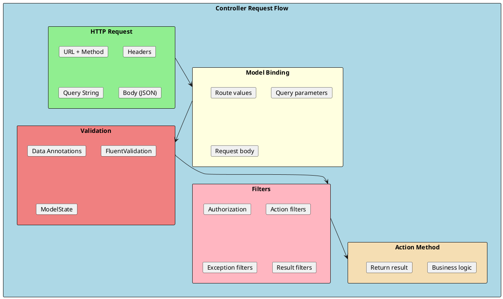
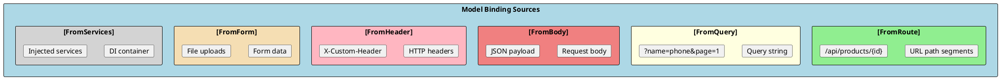
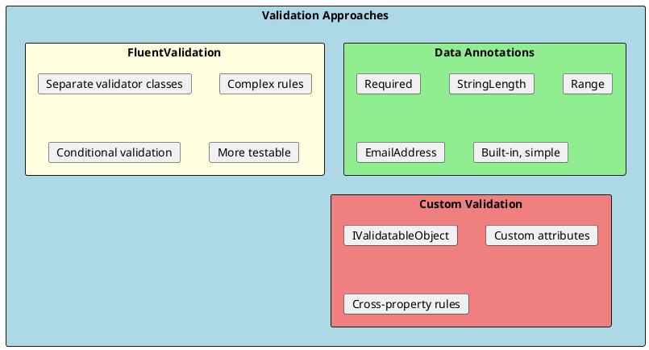
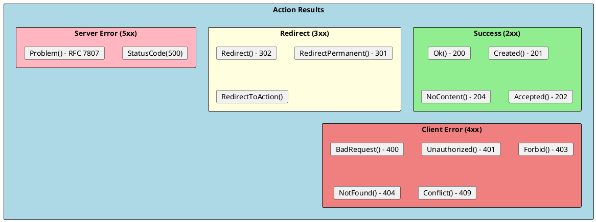
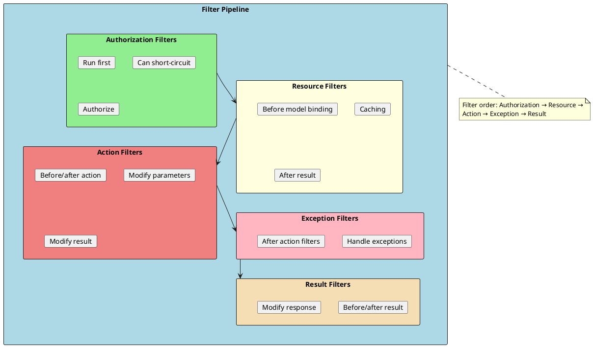

# Controllers and Actions

Controllers are the heart of ASP.NET Core Web APIs. They handle incoming HTTP requests, process them, and return appropriate responses. Understanding controllers, model binding, validation, and filters is essential for building robust APIs.



## Controller Basics

Controllers inherit from `ControllerBase` for APIs (or `Controller` for MVC with views). The `[ApiController]` attribute enables API-specific behaviors.

```csharp
using Microsoft.AspNetCore.Mvc;

[ApiController]
[Route("api/[controller]")]
public class ProductsController : ControllerBase
{
    private readonly IProductService _productService;
    private readonly ILogger<ProductsController> _logger;

    public ProductsController(
        IProductService productService,
        ILogger<ProductsController> logger)
    {
        _productService = productService;
        _logger = logger;
    }

    // GET api/products
    [HttpGet]
    [ProducesResponseType(typeof(IEnumerable<ProductDto>), StatusCodes.Status200OK)]
    public async Task<ActionResult<IEnumerable<ProductDto>>> GetAll(
        [FromQuery] int page = 1,
        [FromQuery] int pageSize = 10)
    {
        var products = await _productService.GetAllAsync(page, pageSize);
        return Ok(products);
    }

    // GET api/products/5
    [HttpGet("{id}")]
    [ProducesResponseType(typeof(ProductDto), StatusCodes.Status200OK)]
    [ProducesResponseType(StatusCodes.Status404NotFound)]
    public async Task<ActionResult<ProductDto>> GetById(int id)
    {
        var product = await _productService.GetByIdAsync(id);

        if (product == null)
        {
            return NotFound();
        }

        return Ok(product);
    }

    // POST api/products
    [HttpPost]
    [ProducesResponseType(typeof(ProductDto), StatusCodes.Status201Created)]
    [ProducesResponseType(typeof(ValidationProblemDetails), StatusCodes.Status400BadRequest)]
    public async Task<ActionResult<ProductDto>> Create([FromBody] CreateProductDto dto)
    {
        var product = await _productService.CreateAsync(dto);

        return CreatedAtAction(
            nameof(GetById),
            new { id = product.Id },
            product);
    }

    // PUT api/products/5
    [HttpPut("{id}")]
    [ProducesResponseType(StatusCodes.Status204NoContent)]
    [ProducesResponseType(StatusCodes.Status404NotFound)]
    public async Task<IActionResult> Update(int id, [FromBody] UpdateProductDto dto)
    {
        var exists = await _productService.ExistsAsync(id);
        if (!exists)
        {
            return NotFound();
        }

        await _productService.UpdateAsync(id, dto);
        return NoContent();
    }

    // DELETE api/products/5
    [HttpDelete("{id}")]
    [ProducesResponseType(StatusCodes.Status204NoContent)]
    [ProducesResponseType(StatusCodes.Status404NotFound)]
    public async Task<IActionResult> Delete(int id)
    {
        var deleted = await _productService.DeleteAsync(id);

        if (!deleted)
        {
            return NotFound();
        }

        return NoContent();
    }
}
```

### [ApiController] Attribute Benefits

```csharp
[ApiController]  // Enables these behaviors:
[Route("api/[controller]")]
public class ProductsController : ControllerBase
{
    // 1. Automatic 400 response for invalid ModelState
    // No need to check ModelState.IsValid manually

    // 2. Automatic [FromBody] inference for complex types
    [HttpPost]
    public IActionResult Create(CreateProductDto dto)  // [FromBody] inferred
    {
        return Ok();
    }

    // 3. Automatic [FromRoute] inference for route parameters
    [HttpGet("{id}")]
    public IActionResult Get(int id)  // [FromRoute] inferred
    {
        return Ok();
    }

    // 4. Problem details for error responses
    // Returns RFC 7807 compliant error responses
}
```

---

## Model Binding

Model binding automatically maps HTTP request data to action method parameters.



### Binding Source Attributes

```csharp
[ApiController]
[Route("api/[controller]")]
public class OrdersController : ControllerBase
{
    // [FromRoute] - from URL path
    [HttpGet("{id}")]
    public IActionResult GetById([FromRoute] int id)
    {
        return Ok($"Order ID: {id}");
    }

    // [FromQuery] - from query string
    // GET /api/orders?status=pending&page=1
    [HttpGet]
    public IActionResult GetAll(
        [FromQuery] string? status,
        [FromQuery] int page = 1,
        [FromQuery] int pageSize = 10)
    {
        return Ok();
    }

    // [FromBody] - from request body (JSON)
    [HttpPost]
    public IActionResult Create([FromBody] CreateOrderDto dto)
    {
        return Ok(dto);
    }

    // [FromHeader] - from HTTP headers
    [HttpGet("with-header")]
    public IActionResult GetWithHeader(
        [FromHeader(Name = "X-Correlation-Id")] string? correlationId,
        [FromHeader(Name = "Accept-Language")] string? language)
    {
        return Ok(new { correlationId, language });
    }

    // [FromForm] - from form data (multipart/form-data)
    [HttpPost("upload")]
    public async Task<IActionResult> Upload(
        [FromForm] string description,
        [FromForm] IFormFile file)
    {
        if (file.Length > 0)
        {
            var path = Path.Combine("uploads", file.FileName);
            using var stream = new FileStream(path, FileMode.Create);
            await file.CopyToAsync(stream);
        }

        return Ok(new { description, fileName = file.FileName });
    }

    // [FromServices] - from DI container
    [HttpGet("with-service")]
    public IActionResult GetWithService([FromServices] IProductService productService)
    {
        return Ok();
    }

    // Multiple sources combined
    [HttpPut("{id}")]
    public IActionResult Update(
        [FromRoute] int id,
        [FromBody] UpdateOrderDto dto,
        [FromHeader(Name = "If-Match")] string? etag)
    {
        return Ok();
    }
}
```

### Complex Model Binding

```csharp
// Query string binding to complex object
// GET /api/products?Name=phone&MinPrice=100&MaxPrice=500&Categories=1&Categories=2
public class ProductFilter
{
    public string? Name { get; set; }
    public decimal? MinPrice { get; set; }
    public decimal? MaxPrice { get; set; }
    public List<int>? Categories { get; set; }
    public SortOrder Sort { get; set; } = SortOrder.NameAsc;
}

public enum SortOrder
{
    NameAsc,
    NameDesc,
    PriceAsc,
    PriceDesc
}

[HttpGet]
public IActionResult Search([FromQuery] ProductFilter filter)
{
    // filter is automatically populated from query string
    return Ok(filter);
}

// Nested object binding
public class CreateOrderDto
{
    public string CustomerName { get; set; } = string.Empty;

    public AddressDto ShippingAddress { get; set; } = new();

    public List<OrderItemDto> Items { get; set; } = new();
}

public class AddressDto
{
    public string Street { get; set; } = string.Empty;
    public string City { get; set; } = string.Empty;
    public string ZipCode { get; set; } = string.Empty;
}

public class OrderItemDto
{
    public int ProductId { get; set; }
    public int Quantity { get; set; }
}
```

---

## Validation

ASP.NET Core supports validation through Data Annotations, FluentValidation, and custom validators.



### Data Annotations

```csharp
using System.ComponentModel.DataAnnotations;

public class CreateProductDto
{
    [Required(ErrorMessage = "Name is required")]
    [StringLength(100, MinimumLength = 3,
        ErrorMessage = "Name must be between 3 and 100 characters")]
    public string Name { get; set; } = string.Empty;

    [StringLength(500, ErrorMessage = "Description cannot exceed 500 characters")]
    public string? Description { get; set; }

    [Required]
    [Range(0.01, 999999.99, ErrorMessage = "Price must be between 0.01 and 999999.99")]
    public decimal Price { get; set; }

    [Required]
    [Range(0, int.MaxValue, ErrorMessage = "Stock cannot be negative")]
    public int Stock { get; set; }

    [Required]
    [Url(ErrorMessage = "Invalid URL format")]
    public string? ImageUrl { get; set; }

    [EmailAddress(ErrorMessage = "Invalid email format")]
    public string? ContactEmail { get; set; }

    [Phone(ErrorMessage = "Invalid phone format")]
    public string? ContactPhone { get; set; }

    [RegularExpression(@"^[A-Z]{2}\d{4}$",
        ErrorMessage = "SKU must be 2 uppercase letters followed by 4 digits")]
    public string? Sku { get; set; }
}

// Custom validation attribute
public class FutureDateAttribute : ValidationAttribute
{
    protected override ValidationResult? IsValid(object? value, ValidationContext context)
    {
        if (value is DateTime date && date <= DateTime.Today)
        {
            return new ValidationResult("Date must be in the future");
        }
        return ValidationResult.Success;
    }
}

public class CreateEventDto
{
    [Required]
    public string Name { get; set; } = string.Empty;

    [FutureDate]
    public DateTime EventDate { get; set; }
}
```

### FluentValidation

```csharp
using FluentValidation;

public class CreateProductDtoValidator : AbstractValidator<CreateProductDto>
{
    public CreateProductDtoValidator()
    {
        RuleFor(x => x.Name)
            .NotEmpty().WithMessage("Name is required")
            .Length(3, 100).WithMessage("Name must be between 3 and 100 characters");

        RuleFor(x => x.Description)
            .MaximumLength(500).WithMessage("Description cannot exceed 500 characters");

        RuleFor(x => x.Price)
            .GreaterThan(0).WithMessage("Price must be greater than zero")
            .LessThan(1000000).WithMessage("Price is too high");

        RuleFor(x => x.Stock)
            .GreaterThanOrEqualTo(0).WithMessage("Stock cannot be negative");

        RuleFor(x => x.Sku)
            .Matches(@"^[A-Z]{2}\d{4}$")
            .When(x => !string.IsNullOrEmpty(x.Sku))
            .WithMessage("SKU must be 2 uppercase letters followed by 4 digits");

        // Conditional validation
        RuleFor(x => x.ImageUrl)
            .NotEmpty()
            .When(x => x.Price > 100)
            .WithMessage("Products over $100 must have an image");
    }
}

// Validator with dependency injection
public class CreateOrderDtoValidator : AbstractValidator<CreateOrderDto>
{
    public CreateOrderDtoValidator(IProductRepository productRepository)
    {
        RuleFor(x => x.CustomerName)
            .NotEmpty()
            .MaximumLength(100);

        RuleForEach(x => x.Items).ChildRules(item =>
        {
            item.RuleFor(x => x.ProductId)
                .MustAsync(async (id, ct) => await productRepository.ExistsAsync(id))
                .WithMessage("Product does not exist");

            item.RuleFor(x => x.Quantity)
                .GreaterThan(0)
                .LessThanOrEqualTo(100);
        });
    }
}

// Register in Program.cs
builder.Services.AddValidatorsFromAssemblyContaining<CreateProductDtoValidator>();

// Automatic validation with FluentValidation.AspNetCore
builder.Services.AddFluentValidationAutoValidation();
```

### Manual Validation in Controller

```csharp
[ApiController]
[Route("api/[controller]")]
public class ProductsController : ControllerBase
{
    // With [ApiController], invalid ModelState automatically returns 400
    // But you can still check manually if needed:

    [HttpPost]
    public IActionResult Create([FromBody] CreateProductDto dto)
    {
        // Manual validation (not needed with [ApiController])
        if (!ModelState.IsValid)
        {
            return BadRequest(ModelState);
        }

        // Custom business validation
        if (dto.Name.Contains("forbidden"))
        {
            ModelState.AddModelError(nameof(dto.Name), "Name contains forbidden word");
            return BadRequest(ModelState);
        }

        return Ok();
    }
}
```

---

## Action Results

Action methods return results that produce HTTP responses.



### Common Action Results

```csharp
[ApiController]
[Route("api/[controller]")]
public class ProductsController : ControllerBase
{
    // 200 OK with data
    [HttpGet("{id}")]
    public ActionResult<ProductDto> GetById(int id)
    {
        var product = _service.GetById(id);
        return Ok(product);  // or just: return product;
    }

    // 201 Created with location header
    [HttpPost]
    public ActionResult<ProductDto> Create(CreateProductDto dto)
    {
        var product = _service.Create(dto);

        return CreatedAtAction(
            actionName: nameof(GetById),
            routeValues: new { id = product.Id },
            value: product);
    }

    // 204 No Content
    [HttpDelete("{id}")]
    public IActionResult Delete(int id)
    {
        _service.Delete(id);
        return NoContent();
    }

    // 400 Bad Request
    [HttpPost("validate")]
    public IActionResult Validate(CreateProductDto dto)
    {
        if (dto.Price < 0)
        {
            return BadRequest("Price cannot be negative");
        }

        // With problem details
        return BadRequest(new ProblemDetails
        {
            Title = "Validation Error",
            Detail = "Price cannot be negative",
            Status = 400
        });
    }

    // 401 Unauthorized
    [HttpGet("protected")]
    public IActionResult GetProtected()
    {
        if (!User.Identity?.IsAuthenticated ?? true)
        {
            return Unauthorized();
        }
        return Ok();
    }

    // 403 Forbidden
    [HttpDelete("admin/{id}")]
    public IActionResult AdminDelete(int id)
    {
        if (!User.IsInRole("Admin"))
        {
            return Forbid();
        }
        return NoContent();
    }

    // 404 Not Found
    [HttpGet("{id}")]
    public ActionResult<ProductDto> Get(int id)
    {
        var product = _service.GetById(id);
        if (product == null)
        {
            return NotFound();
        }
        return product;
    }

    // 409 Conflict
    [HttpPost]
    public IActionResult CreateWithConflict(CreateProductDto dto)
    {
        if (_service.SkuExists(dto.Sku))
        {
            return Conflict($"Product with SKU {dto.Sku} already exists");
        }
        return Ok();
    }

    // Custom status code
    [HttpPost("custom")]
    public IActionResult Custom()
    {
        return StatusCode(418, "I'm a teapot");
    }

    // File result
    [HttpGet("download/{id}")]
    public IActionResult Download(int id)
    {
        var fileBytes = _service.GetFileBytes(id);
        return File(fileBytes, "application/pdf", "document.pdf");
    }
}
```

---

## Filters

Filters allow you to run code before or after specific stages in the request pipeline.



### Action Filters

```csharp
// Attribute-based action filter
public class LogActionAttribute : ActionFilterAttribute
{
    public override void OnActionExecuting(ActionExecutingContext context)
    {
        var logger = context.HttpContext.RequestServices
            .GetRequiredService<ILogger<LogActionAttribute>>();

        logger.LogInformation(
            "Executing action {Action} on controller {Controller}",
            context.ActionDescriptor.DisplayName,
            context.Controller.GetType().Name);
    }

    public override void OnActionExecuted(ActionExecutedContext context)
    {
        var logger = context.HttpContext.RequestServices
            .GetRequiredService<ILogger<LogActionAttribute>>();

        logger.LogInformation(
            "Executed action {Action} with result {Result}",
            context.ActionDescriptor.DisplayName,
            context.Result?.GetType().Name);
    }
}

// Usage
[LogAction]
[HttpGet("{id}")]
public ActionResult<Product> GetById(int id) => Ok();

// Async action filter
public class ValidateModelAttribute : ActionFilterAttribute
{
    public override void OnActionExecuting(ActionExecutingContext context)
    {
        if (!context.ModelState.IsValid)
        {
            context.Result = new BadRequestObjectResult(context.ModelState);
        }
    }
}

// Service-based filter (with DI)
public class AuditActionFilter : IAsyncActionFilter
{
    private readonly IAuditService _auditService;
    private readonly ICurrentUser _currentUser;

    public AuditActionFilter(IAuditService auditService, ICurrentUser currentUser)
    {
        _auditService = auditService;
        _currentUser = currentUser;
    }

    public async Task OnActionExecutionAsync(
        ActionExecutingContext context,
        ActionExecutionDelegate next)
    {
        // Before action
        var startTime = DateTime.UtcNow;

        var result = await next();

        // After action
        await _auditService.LogAsync(new AuditEntry
        {
            UserId = _currentUser.Id,
            Action = context.ActionDescriptor.DisplayName,
            Duration = DateTime.UtcNow - startTime,
            Success = result.Exception == null
        });
    }
}

// Register in Program.cs
builder.Services.AddScoped<AuditActionFilter>();

// Apply globally
builder.Services.AddControllers(options =>
{
    options.Filters.Add<AuditActionFilter>();
});

// Or apply with ServiceFilter attribute
[ServiceFilter(typeof(AuditActionFilter))]
[HttpPost]
public IActionResult Create(CreateProductDto dto) => Ok();
```

### Exception Filters

```csharp
public class ApiExceptionFilterAttribute : ExceptionFilterAttribute
{
    private readonly ILogger<ApiExceptionFilterAttribute> _logger;

    public ApiExceptionFilterAttribute(ILogger<ApiExceptionFilterAttribute> logger)
    {
        _logger = logger;
    }

    public override void OnException(ExceptionContext context)
    {
        _logger.LogError(context.Exception, "Unhandled exception occurred");

        var problemDetails = new ProblemDetails
        {
            Status = StatusCodes.Status500InternalServerError,
            Title = "An error occurred",
            Detail = context.Exception.Message
        };

        context.Result = new ObjectResult(problemDetails)
        {
            StatusCode = StatusCodes.Status500InternalServerError
        };

        context.ExceptionHandled = true;
    }
}

// Handle specific exceptions
public class DomainExceptionFilter : IExceptionFilter
{
    public void OnException(ExceptionContext context)
    {
        if (context.Exception is NotFoundException notFound)
        {
            context.Result = new NotFoundObjectResult(new ProblemDetails
            {
                Title = "Resource not found",
                Detail = notFound.Message,
                Status = 404
            });
            context.ExceptionHandled = true;
        }
        else if (context.Exception is ValidationException validation)
        {
            context.Result = new BadRequestObjectResult(new ValidationProblemDetails
            {
                Title = "Validation failed",
                Detail = validation.Message,
                Status = 400
            });
            context.ExceptionHandled = true;
        }
    }
}
```

### Result Filters

```csharp
public class AddHeaderResultFilter : IResultFilter
{
    public void OnResultExecuting(ResultExecutingContext context)
    {
        context.HttpContext.Response.Headers.Append(
            "X-Custom-Header", "MyValue");

        context.HttpContext.Response.Headers.Append(
            "X-Request-Id", context.HttpContext.TraceIdentifier);
    }

    public void OnResultExecuted(ResultExecutedContext context)
    {
        // After result is written
    }
}

// Wrap response in envelope
public class ResponseEnvelopeFilter : IAsyncResultFilter
{
    public async Task OnResultExecutionAsync(
        ResultExecutingContext context,
        ResultExecutionDelegate next)
    {
        if (context.Result is ObjectResult objectResult)
        {
            objectResult.Value = new ApiResponse<object>
            {
                Success = true,
                Data = objectResult.Value,
                Timestamp = DateTime.UtcNow
            };
        }

        await next();
    }
}

public class ApiResponse<T>
{
    public bool Success { get; set; }
    public T? Data { get; set; }
    public string? Error { get; set; }
    public DateTime Timestamp { get; set; }
}
```

---

## Interview Questions & Answers

### Q1: What is the difference between [FromBody], [FromQuery], and [FromRoute]?

**Answer**:
- **[FromBody]**: Binds from request body (JSON/XML). Used for complex types in POST/PUT.
- **[FromQuery]**: Binds from query string (`?key=value`). Used for filtering, pagination.
- **[FromRoute]**: Binds from URL path segments (`/api/products/{id}`).

With `[ApiController]`, complex types default to `[FromBody]` and simple types to `[FromQuery]` or `[FromRoute]`.

### Q2: How does model validation work in ASP.NET Core?

**Answer**: Validation happens automatically during model binding:
1. Data Annotations on model properties are evaluated
2. `ModelState.IsValid` is set based on validation results
3. With `[ApiController]`, invalid models automatically return 400

Options: Data Annotations (built-in), FluentValidation (more powerful), or custom `IValidatableObject`.

### Q3: What are the different types of filters?

**Answer**: Five filter types in execution order:
1. **Authorization**: Check if user can access resource
2. **Resource**: Before/after everything else (caching)
3. **Action**: Before/after action method (logging, validation)
4. **Exception**: Handle unhandled exceptions
5. **Result**: Before/after result execution

Filters can be applied globally, per controller, or per action.

### Q4: What is the purpose of [ApiController]?

**Answer**: `[ApiController]` enables API-specific behaviors:
- Automatic 400 response for invalid `ModelState`
- Automatic `[FromBody]` inference for complex types
- Automatic `[FromRoute]` inference for route parameters
- Problem details (RFC 7807) for error responses
- Required route parameters for routing

### Q5: When should you use ActionResult<T> vs IActionResult?

**Answer**:
- **ActionResult<T>**: When returning a specific type. Enables better Swagger docs and compile-time checking. Can return both the type and action results (NotFound, etc.).
- **IActionResult**: When return type varies or you only return status codes.

```csharp
// ActionResult<T> - preferred for typed responses
public ActionResult<Product> Get(int id)
{
    var product = _service.Get(id);
    if (product == null) return NotFound();
    return product;  // Implicit conversion
}
```

### Q6: How do you handle file uploads?

**Answer**: Use `[FromForm]` with `IFormFile`:
```csharp
[HttpPost("upload")]
public async Task<IActionResult> Upload([FromForm] IFormFile file)
{
    using var stream = new FileStream(path, FileMode.Create);
    await file.CopyToAsync(stream);
    return Ok();
}
```

Set `[RequestSizeLimit]` for large files and use `[DisableRequestSizeLimit]` to remove limits.

