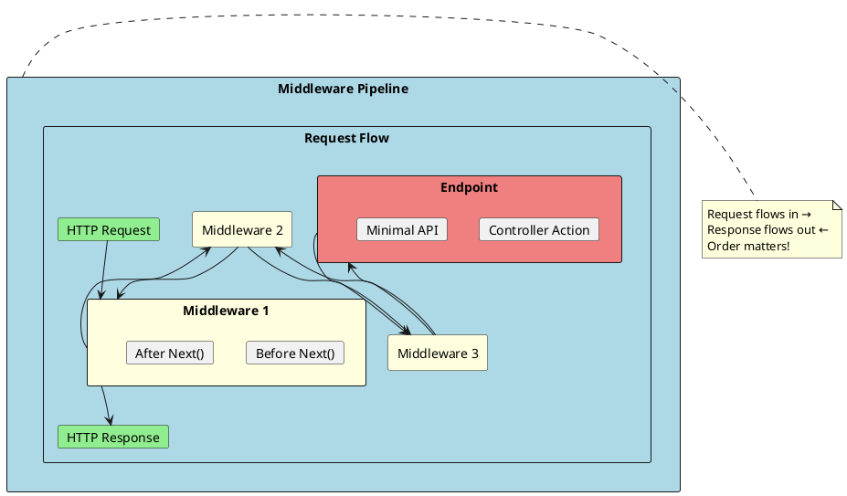
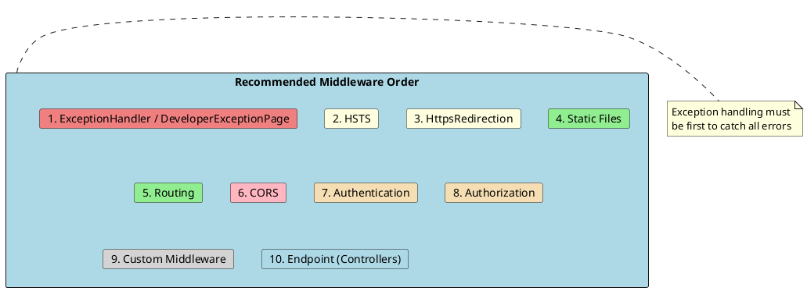
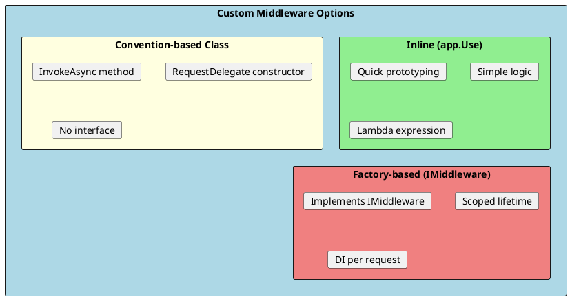
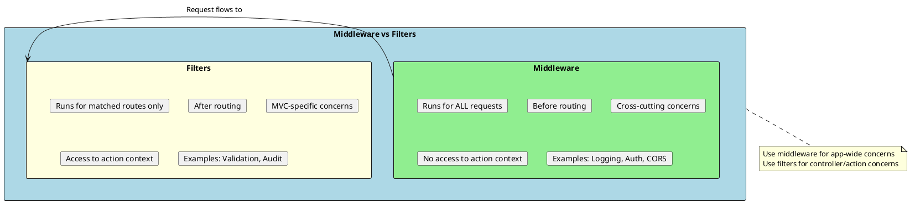

# Middleware

Middleware is software that's assembled into the application pipeline to handle requests and responses. Each middleware component can perform operations before and after the next component in the pipeline, and can short-circuit the pipeline by not calling the next component.



## How Middleware Works

Middleware components form a chain. Each component can:
1. **Pass the request** to the next component
2. **Short-circuit** the pipeline (not call next)
3. **Perform work** before and after the next component

```csharp
// Conceptual middleware flow
public class ConceptualMiddleware
{
    private readonly RequestDelegate _next;

    public ConceptualMiddleware(RequestDelegate next)
    {
        _next = next;
    }

    public async Task InvokeAsync(HttpContext context)
    {
        // 1. Code that runs BEFORE the next middleware
        Console.WriteLine("Before next middleware");

        // 2. Call the next middleware in the pipeline
        await _next(context);

        // 3. Code that runs AFTER the next middleware returns
        Console.WriteLine("After next middleware");
    }
}
```

---

## Built-in Middleware

ASP.NET Core includes many built-in middleware components. The order in which they're added is critical.



### Standard Middleware Configuration

```csharp
var builder = WebApplication.CreateBuilder(args);

builder.Services.AddControllers();
builder.Services.AddCors(options =>
{
    options.AddPolicy("AllowSpecific", policy =>
    {
        policy.WithOrigins("https://example.com")
              .AllowAnyMethod()
              .AllowAnyHeader();
    });
});

var app = builder.Build();

// 1. Exception handling - MUST be first
if (app.Environment.IsDevelopment())
{
    app.UseDeveloperExceptionPage();
}
else
{
    app.UseExceptionHandler("/error");
    app.UseHsts();  // 2. HTTP Strict Transport Security
}

// 3. HTTPS Redirection
app.UseHttpsRedirection();

// 4. Static files (if needed)
app.UseStaticFiles();

// 5. Routing
app.UseRouting();

// 6. CORS - must be after routing, before auth
app.UseCors("AllowSpecific");

// 7. Authentication
app.UseAuthentication();

// 8. Authorization
app.UseAuthorization();

// 9. Custom middleware (before endpoints)
app.UseRequestLogging();

// 10. Endpoints
app.MapControllers();

app.Run();
```

### Common Built-in Middleware

| Middleware | Purpose | Use Method |
|------------|---------|------------|
| **Exception Handler** | Global error handling | `UseExceptionHandler()` |
| **HSTS** | HTTP Strict Transport Security | `UseHsts()` |
| **HTTPS Redirection** | Redirect HTTP to HTTPS | `UseHttpsRedirection()` |
| **Static Files** | Serve static content | `UseStaticFiles()` |
| **Routing** | Route matching | `UseRouting()` |
| **CORS** | Cross-Origin Resource Sharing | `UseCors()` |
| **Authentication** | Identify user | `UseAuthentication()` |
| **Authorization** | Check permissions | `UseAuthorization()` |
| **Response Caching** | Cache responses | `UseResponseCaching()` |
| **Response Compression** | Compress responses | `UseResponseCompression()` |

---

## Creating Custom Middleware

There are several ways to create custom middleware: inline, convention-based class, or factory-based.



### Inline Middleware

```csharp
var app = builder.Build();

// Simple inline middleware
app.Use(async (context, next) =>
{
    // Before
    var startTime = DateTime.UtcNow;
    Console.WriteLine($"Request started: {context.Request.Path}");

    await next(context);

    // After
    var duration = DateTime.UtcNow - startTime;
    Console.WriteLine($"Request completed in {duration.TotalMilliseconds}ms");
});

// Short-circuiting middleware
app.Use(async (context, next) =>
{
    if (context.Request.Path.StartsWithSegments("/blocked"))
    {
        context.Response.StatusCode = 403;
        await context.Response.WriteAsync("Access denied");
        return;  // Don't call next - short circuit
    }

    await next(context);
});

// Terminal middleware (app.Run)
app.Map("/ping", pingApp =>
{
    pingApp.Run(async context =>
    {
        await context.Response.WriteAsync("pong");
    });
});
```

### Convention-based Middleware Class

```csharp
// RequestTimingMiddleware.cs
public class RequestTimingMiddleware
{
    private readonly RequestDelegate _next;
    private readonly ILogger<RequestTimingMiddleware> _logger;

    public RequestTimingMiddleware(
        RequestDelegate next,
        ILogger<RequestTimingMiddleware> logger)
    {
        _next = next;
        _logger = logger;
    }

    public async Task InvokeAsync(HttpContext context)
    {
        var stopwatch = Stopwatch.StartNew();

        // Add correlation ID to response
        var correlationId = context.Request.Headers["X-Correlation-Id"].FirstOrDefault()
            ?? Guid.NewGuid().ToString();
        context.Response.Headers.Append("X-Correlation-Id", correlationId);

        try
        {
            await _next(context);
        }
        finally
        {
            stopwatch.Stop();

            _logger.LogInformation(
                "Request {Method} {Path} completed in {Duration}ms with status {StatusCode}",
                context.Request.Method,
                context.Request.Path,
                stopwatch.ElapsedMilliseconds,
                context.Response.StatusCode);
        }
    }
}

// Extension method for clean registration
public static class RequestTimingMiddlewareExtensions
{
    public static IApplicationBuilder UseRequestTiming(this IApplicationBuilder builder)
    {
        return builder.UseMiddleware<RequestTimingMiddleware>();
    }
}

// Usage in Program.cs
app.UseRequestTiming();
```

### Factory-based Middleware (IMiddleware)

```csharp
// Better for scoped dependencies
public class TransactionMiddleware : IMiddleware
{
    private readonly IUnitOfWork _unitOfWork;
    private readonly ILogger<TransactionMiddleware> _logger;

    // Dependencies are resolved per request (scoped)
    public TransactionMiddleware(
        IUnitOfWork unitOfWork,
        ILogger<TransactionMiddleware> logger)
    {
        _unitOfWork = unitOfWork;
        _logger = logger;
    }

    public async Task InvokeAsync(HttpContext context, RequestDelegate next)
    {
        // Begin transaction
        await _unitOfWork.BeginTransactionAsync();

        try
        {
            await next(context);

            // Commit on success
            if (context.Response.StatusCode < 400)
            {
                await _unitOfWork.CommitAsync();
                _logger.LogDebug("Transaction committed");
            }
            else
            {
                await _unitOfWork.RollbackAsync();
                _logger.LogDebug("Transaction rolled back due to error response");
            }
        }
        catch
        {
            await _unitOfWork.RollbackAsync();
            _logger.LogWarning("Transaction rolled back due to exception");
            throw;
        }
    }
}

// Must register the middleware as a service
builder.Services.AddScoped<TransactionMiddleware>();

// Then use it
app.UseMiddleware<TransactionMiddleware>();
```

---

## Practical Middleware Examples

### Request Logging Middleware

```csharp
public class RequestLoggingMiddleware
{
    private readonly RequestDelegate _next;
    private readonly ILogger<RequestLoggingMiddleware> _logger;

    public RequestLoggingMiddleware(RequestDelegate next, ILogger<RequestLoggingMiddleware> logger)
    {
        _next = next;
        _logger = logger;
    }

    public async Task InvokeAsync(HttpContext context)
    {
        // Log request
        _logger.LogInformation(
            "HTTP {Method} {Path}{QueryString} from {IP}",
            context.Request.Method,
            context.Request.Path,
            context.Request.QueryString,
            context.Connection.RemoteIpAddress);

        // Capture response status
        var originalBodyStream = context.Response.Body;

        try
        {
            await _next(context);
        }
        finally
        {
            // Log response
            _logger.LogInformation(
                "HTTP {Method} {Path} responded {StatusCode}",
                context.Request.Method,
                context.Request.Path,
                context.Response.StatusCode);
        }
    }
}
```

### API Key Authentication Middleware

```csharp
public class ApiKeyMiddleware
{
    private readonly RequestDelegate _next;
    private const string ApiKeyHeaderName = "X-Api-Key";

    public ApiKeyMiddleware(RequestDelegate next)
    {
        _next = next;
    }

    public async Task InvokeAsync(HttpContext context, IConfiguration configuration)
    {
        // Skip for certain paths
        if (context.Request.Path.StartsWithSegments("/health") ||
            context.Request.Path.StartsWithSegments("/swagger"))
        {
            await _next(context);
            return;
        }

        // Check for API key header
        if (!context.Request.Headers.TryGetValue(ApiKeyHeaderName, out var extractedApiKey))
        {
            context.Response.StatusCode = 401;
            await context.Response.WriteAsJsonAsync(new
            {
                error = "API Key is missing"
            });
            return;
        }

        var validApiKey = configuration["ApiKey"];
        if (!validApiKey.Equals(extractedApiKey))
        {
            context.Response.StatusCode = 401;
            await context.Response.WriteAsJsonAsync(new
            {
                error = "Invalid API Key"
            });
            return;
        }

        await _next(context);
    }
}
```

### Rate Limiting Middleware

```csharp
public class RateLimitingMiddleware
{
    private readonly RequestDelegate _next;
    private readonly IMemoryCache _cache;
    private readonly int _maxRequests;
    private readonly TimeSpan _window;

    public RateLimitingMiddleware(
        RequestDelegate next,
        IMemoryCache cache,
        int maxRequests = 100,
        int windowSeconds = 60)
    {
        _next = next;
        _cache = cache;
        _maxRequests = maxRequests;
        _window = TimeSpan.FromSeconds(windowSeconds);
    }

    public async Task InvokeAsync(HttpContext context)
    {
        var clientId = GetClientIdentifier(context);
        var cacheKey = $"RateLimit_{clientId}";

        var requestCount = _cache.GetOrCreate(cacheKey, entry =>
        {
            entry.AbsoluteExpirationRelativeToNow = _window;
            return 0;
        });

        if (requestCount >= _maxRequests)
        {
            context.Response.StatusCode = 429;
            context.Response.Headers.Append("Retry-After", _window.TotalSeconds.ToString());
            await context.Response.WriteAsJsonAsync(new
            {
                error = "Rate limit exceeded",
                retryAfter = _window.TotalSeconds
            });
            return;
        }

        _cache.Set(cacheKey, requestCount + 1, _window);

        // Add rate limit headers
        context.Response.Headers.Append("X-RateLimit-Limit", _maxRequests.ToString());
        context.Response.Headers.Append("X-RateLimit-Remaining", (_maxRequests - requestCount - 1).ToString());

        await _next(context);
    }

    private string GetClientIdentifier(HttpContext context)
    {
        // Use API key if present, otherwise IP address
        return context.Request.Headers["X-Api-Key"].FirstOrDefault()
            ?? context.Connection.RemoteIpAddress?.ToString()
            ?? "unknown";
    }
}

// Extension method
public static class RateLimitingMiddlewareExtensions
{
    public static IApplicationBuilder UseRateLimiting(
        this IApplicationBuilder builder,
        int maxRequests = 100,
        int windowSeconds = 60)
    {
        return builder.UseMiddleware<RateLimitingMiddleware>(maxRequests, windowSeconds);
    }
}

// Usage
app.UseRateLimiting(maxRequests: 100, windowSeconds: 60);
```

### Request/Response Body Logging Middleware

```csharp
public class RequestResponseLoggingMiddleware
{
    private readonly RequestDelegate _next;
    private readonly ILogger<RequestResponseLoggingMiddleware> _logger;

    public RequestResponseLoggingMiddleware(
        RequestDelegate next,
        ILogger<RequestResponseLoggingMiddleware> logger)
    {
        _next = next;
        _logger = logger;
    }

    public async Task InvokeAsync(HttpContext context)
    {
        // Log request body
        context.Request.EnableBuffering();
        var requestBody = await ReadRequestBodyAsync(context.Request);

        if (!string.IsNullOrEmpty(requestBody))
        {
            _logger.LogDebug("Request Body: {Body}", requestBody);
        }

        // Capture response body
        var originalResponseBody = context.Response.Body;
        using var responseBody = new MemoryStream();
        context.Response.Body = responseBody;

        await _next(context);

        // Log response body
        var responseContent = await ReadResponseBodyAsync(context.Response);
        if (!string.IsNullOrEmpty(responseContent))
        {
            _logger.LogDebug("Response Body: {Body}", responseContent);
        }

        // Copy response to original stream
        await responseBody.CopyToAsync(originalResponseBody);
    }

    private async Task<string> ReadRequestBodyAsync(HttpRequest request)
    {
        request.Body.Position = 0;
        using var reader = new StreamReader(request.Body, leaveOpen: true);
        var body = await reader.ReadToEndAsync();
        request.Body.Position = 0;
        return body;
    }

    private async Task<string> ReadResponseBodyAsync(HttpResponse response)
    {
        response.Body.Position = 0;
        using var reader = new StreamReader(response.Body, leaveOpen: true);
        var body = await reader.ReadToEndAsync();
        response.Body.Position = 0;
        return body;
    }
}
```

---

## Middleware vs Filters

Understanding when to use middleware vs filters is important.



| Aspect | Middleware | Filters |
|--------|------------|---------|
| **Scope** | All requests | Matched endpoints only |
| **Timing** | Before/after routing | Before/after action |
| **Context** | HttpContext only | ActionContext, ModelState |
| **DI** | Constructor or Invoke | Constructor or ServiceFilter |
| **Use Case** | Logging, Auth, Compression | Validation, Caching, Audit |

---

## Interview Questions & Answers

### Q1: What is middleware in ASP.NET Core?

**Answer**: Middleware is software assembled into the pipeline to handle requests and responses. Each component:
- Chooses whether to pass the request to the next component
- Can perform work before and after the next component
- Can short-circuit the pipeline

Middleware order matters - exception handling must be first to catch errors from all other middleware.

### Q2: What is the difference between app.Use() and app.Run()?

**Answer**:
- **app.Use()**: Adds middleware that can call the next middleware in the pipeline. Used for most middleware.
- **app.Run()**: Adds terminal middleware that doesn't call next. Ends the pipeline.

```csharp
app.Use(async (context, next) =>
{
    // Can call next
    await next();
});

app.Run(async context =>
{
    // Terminal - no next
    await context.Response.WriteAsync("Done");
});
```

### Q3: Why does middleware order matter?

**Answer**: Middleware executes in the order it's added. Critical ordering:
1. Exception handling first (catches all errors)
2. HTTPS redirection early
3. Static files before routing (for performance)
4. CORS after routing, before authentication
5. Authentication before authorization

Wrong order causes issues: CORS before routing fails, auth after authorization is useless.

### Q4: How do you create custom middleware?

**Answer**: Three approaches:
1. **Inline**: `app.Use(async (ctx, next) => ...)` - simple cases
2. **Convention-based class**: Class with `InvokeAsync(HttpContext)` - most common
3. **IMiddleware**: Interface-based with scoped DI support

Convention-based is most common. Use `IMiddleware` when you need scoped services.

### Q5: What's the difference between middleware and filters?

**Answer**:
- **Middleware**: Runs for ALL requests, before routing, has HttpContext only
- **Filters**: Run only for matched routes, after routing, has ActionContext

Use middleware for cross-cutting concerns (logging, compression). Use filters for MVC-specific concerns (validation, action-level caching).

### Q6: How do you short-circuit the middleware pipeline?

**Answer**: Don't call `next()` and write a response:
```csharp
app.Use(async (context, next) =>
{
    if (context.Request.Path == "/blocked")
    {
        context.Response.StatusCode = 403;
        await context.Response.WriteAsync("Blocked");
        return;  // Don't call next
    }
    await next();
});
```

Common uses: authentication failures, rate limiting, maintenance mode.

