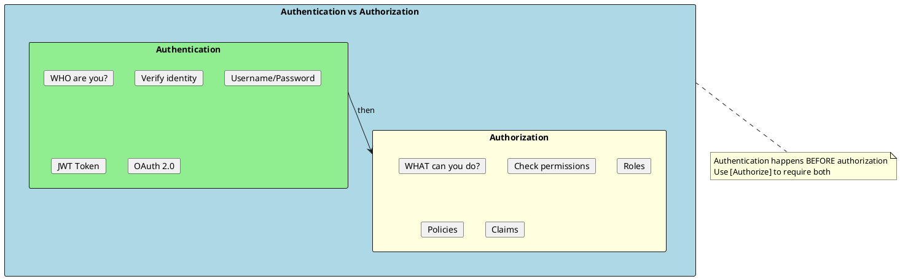
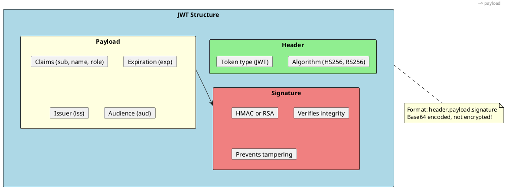
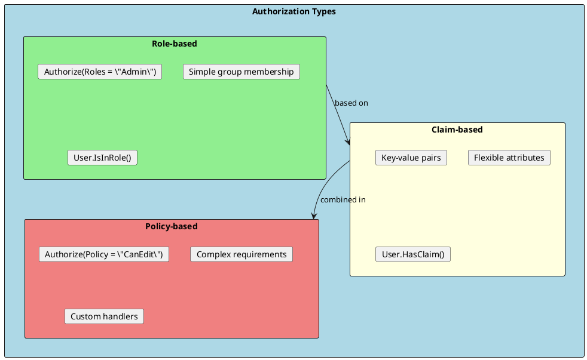
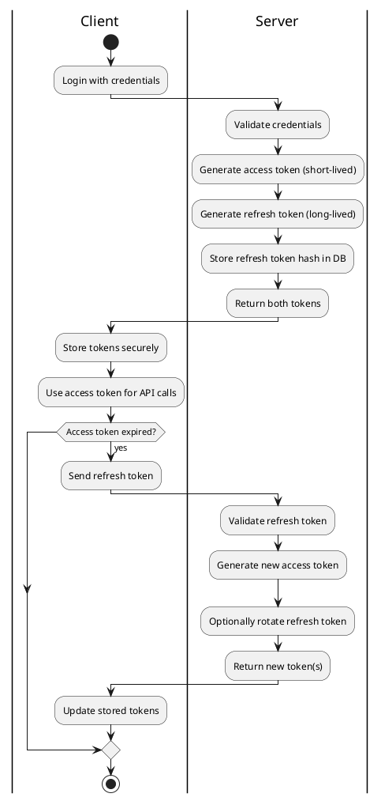

# Authentication and Authorization

Authentication verifies who you are; authorization determines what you can do. ASP.NET Core provides a flexible authentication system supporting JWT tokens, OAuth 2.0, cookies, and custom schemes.



## JWT Authentication

JSON Web Tokens (JWT) are the most common authentication method for APIs. They are self-contained tokens that carry user information and are signed to prevent tampering.



### JWT Configuration

```csharp
// appsettings.json
{
  "Jwt": {
    "Key": "your-super-secret-key-that-is-at-least-32-characters",
    "Issuer": "https://myapi.com",
    "Audience": "https://myapi.com",
    "ExpirationMinutes": 60
  }
}

// JwtSettings.cs
public class JwtSettings
{
    public string Key { get; set; } = string.Empty;
    public string Issuer { get; set; } = string.Empty;
    public string Audience { get; set; } = string.Empty;
    public int ExpirationMinutes { get; set; } = 60;
}

// Program.cs
builder.Services.Configure<JwtSettings>(builder.Configuration.GetSection("Jwt"));

var jwtSettings = builder.Configuration.GetSection("Jwt").Get<JwtSettings>()!;

builder.Services.AddAuthentication(options =>
{
    options.DefaultAuthenticateScheme = JwtBearerDefaults.AuthenticationScheme;
    options.DefaultChallengeScheme = JwtBearerDefaults.AuthenticationScheme;
})
.AddJwtBearer(options =>
{
    options.TokenValidationParameters = new TokenValidationParameters
    {
        ValidateIssuer = true,
        ValidateAudience = true,
        ValidateLifetime = true,
        ValidateIssuerSigningKey = true,
        ValidIssuer = jwtSettings.Issuer,
        ValidAudience = jwtSettings.Audience,
        IssuerSigningKey = new SymmetricSecurityKey(
            Encoding.UTF8.GetBytes(jwtSettings.Key)),
        ClockSkew = TimeSpan.Zero  // No tolerance for expired tokens
    };

    options.Events = new JwtBearerEvents
    {
        OnAuthenticationFailed = context =>
        {
            if (context.Exception is SecurityTokenExpiredException)
            {
                context.Response.Headers.Append("Token-Expired", "true");
            }
            return Task.CompletedTask;
        }
    };
});

// Add to pipeline (order matters!)
app.UseAuthentication();
app.UseAuthorization();
```

### JWT Token Service

```csharp
public interface ITokenService
{
    string GenerateToken(User user);
    ClaimsPrincipal? ValidateToken(string token);
}

public class TokenService : ITokenService
{
    private readonly JwtSettings _settings;

    public TokenService(IOptions<JwtSettings> settings)
    {
        _settings = settings.Value;
    }

    public string GenerateToken(User user)
    {
        var securityKey = new SymmetricSecurityKey(
            Encoding.UTF8.GetBytes(_settings.Key));
        var credentials = new SigningCredentials(
            securityKey, SecurityAlgorithms.HmacSha256);

        var claims = new List<Claim>
        {
            new Claim(JwtRegisteredClaimNames.Sub, user.Id.ToString()),
            new Claim(JwtRegisteredClaimNames.Email, user.Email),
            new Claim(JwtRegisteredClaimNames.Jti, Guid.NewGuid().ToString()),
            new Claim(ClaimTypes.Name, user.Username),
            new Claim("userId", user.Id.ToString())
        };

        // Add roles as claims
        foreach (var role in user.Roles)
        {
            claims.Add(new Claim(ClaimTypes.Role, role));
        }

        var token = new JwtSecurityToken(
            issuer: _settings.Issuer,
            audience: _settings.Audience,
            claims: claims,
            expires: DateTime.UtcNow.AddMinutes(_settings.ExpirationMinutes),
            signingCredentials: credentials);

        return new JwtSecurityTokenHandler().WriteToken(token);
    }

    public ClaimsPrincipal? ValidateToken(string token)
    {
        var tokenHandler = new JwtSecurityTokenHandler();
        var key = Encoding.UTF8.GetBytes(_settings.Key);

        try
        {
            var principal = tokenHandler.ValidateToken(token, new TokenValidationParameters
            {
                ValidateIssuerSigningKey = true,
                IssuerSigningKey = new SymmetricSecurityKey(key),
                ValidateIssuer = true,
                ValidIssuer = _settings.Issuer,
                ValidateAudience = true,
                ValidAudience = _settings.Audience,
                ClockSkew = TimeSpan.Zero
            }, out _);

            return principal;
        }
        catch
        {
            return null;
        }
    }
}
```

### Auth Controller

```csharp
[ApiController]
[Route("api/[controller]")]
public class AuthController : ControllerBase
{
    private readonly IUserService _userService;
    private readonly ITokenService _tokenService;

    public AuthController(IUserService userService, ITokenService tokenService)
    {
        _userService = userService;
        _tokenService = tokenService;
    }

    [HttpPost("login")]
    [AllowAnonymous]
    public async Task<ActionResult<LoginResponse>> Login([FromBody] LoginRequest request)
    {
        var user = await _userService.ValidateCredentialsAsync(
            request.Email, request.Password);

        if (user == null)
        {
            return Unauthorized(new { message = "Invalid credentials" });
        }

        var token = _tokenService.GenerateToken(user);

        return Ok(new LoginResponse
        {
            Token = token,
            ExpiresAt = DateTime.UtcNow.AddMinutes(60),
            User = new UserDto
            {
                Id = user.Id,
                Email = user.Email,
                Username = user.Username
            }
        });
    }

    [HttpPost("register")]
    [AllowAnonymous]
    public async Task<ActionResult<UserDto>> Register([FromBody] RegisterRequest request)
    {
        var existingUser = await _userService.GetByEmailAsync(request.Email);
        if (existingUser != null)
        {
            return Conflict(new { message = "Email already registered" });
        }

        var user = await _userService.CreateAsync(request);
        return CreatedAtAction(nameof(GetCurrentUser), new UserDto
        {
            Id = user.Id,
            Email = user.Email,
            Username = user.Username
        });
    }

    [HttpGet("me")]
    [Authorize]
    public async Task<ActionResult<UserDto>> GetCurrentUser()
    {
        var userId = User.FindFirstValue(ClaimTypes.NameIdentifier);
        var user = await _userService.GetByIdAsync(int.Parse(userId!));

        return Ok(new UserDto
        {
            Id = user!.Id,
            Email = user.Email,
            Username = user.Username
        });
    }
}

// DTOs
public record LoginRequest(string Email, string Password);
public record RegisterRequest(string Email, string Username, string Password);
public record LoginResponse
{
    public string Token { get; init; } = string.Empty;
    public DateTime ExpiresAt { get; init; }
    public UserDto User { get; init; } = null!;
}
```

---

## Authorization

Authorization determines what authenticated users can access. ASP.NET Core supports role-based and policy-based authorization.



### Role-based Authorization

```csharp
// Simple role check
[ApiController]
[Route("api/[controller]")]
[Authorize]  // Requires authentication
public class ProductsController : ControllerBase
{
    [HttpGet]
    [AllowAnonymous]  // Override - no auth needed
    public IActionResult GetAll() => Ok();

    [HttpGet("{id}")]
    public IActionResult GetById(int id) => Ok();  // Requires auth (inherited)

    [HttpPost]
    [Authorize(Roles = "Admin,Manager")]  // Must have Admin OR Manager role
    public IActionResult Create() => Ok();

    [HttpDelete("{id}")]
    [Authorize(Roles = "Admin")]  // Must have Admin role
    public IActionResult Delete(int id) => Ok();

    // Check role in code
    [HttpPut("{id}")]
    public IActionResult Update(int id)
    {
        if (!User.IsInRole("Admin") && !User.IsInRole("Manager"))
        {
            return Forbid();
        }
        return Ok();
    }
}
```

### Claim-based Authorization

```csharp
// Access claims in controller
[HttpGet("profile")]
[Authorize]
public IActionResult GetProfile()
{
    var userId = User.FindFirstValue(ClaimTypes.NameIdentifier);
    var email = User.FindFirstValue(ClaimTypes.Email);
    var roles = User.FindAll(ClaimTypes.Role).Select(c => c.Value);

    // Custom claim
    var department = User.FindFirstValue("department");

    return Ok(new { userId, email, roles, department });
}

// Check specific claim
[HttpGet("premium")]
public IActionResult GetPremiumContent()
{
    if (!User.HasClaim("subscription", "premium"))
    {
        return Forbid();
    }
    return Ok("Premium content");
}
```

### Policy-based Authorization

```csharp
// Program.cs - Register policies
builder.Services.AddAuthorization(options =>
{
    // Simple claim-based policy
    options.AddPolicy("RequireAdminRole", policy =>
        policy.RequireRole("Admin"));

    // Claim existence policy
    options.AddPolicy("RequireEmailVerified", policy =>
        policy.RequireClaim("email_verified", "true"));

    // Multiple requirements (AND logic)
    options.AddPolicy("SeniorEmployee", policy =>
        policy
            .RequireRole("Employee")
            .RequireClaim("years_of_service")
            .RequireAssertion(context =>
            {
                var years = context.User.FindFirstValue("years_of_service");
                return int.TryParse(years, out var y) && y >= 5;
            }));

    // Custom requirement with handler
    options.AddPolicy("MinimumAge", policy =>
        policy.Requirements.Add(new MinimumAgeRequirement(18)));

    // Resource-based policy
    options.AddPolicy("DocumentOwner", policy =>
        policy.Requirements.Add(new DocumentOwnerRequirement()));
});

// Usage in controller
[HttpGet("admin")]
[Authorize(Policy = "RequireAdminRole")]
public IActionResult AdminOnly() => Ok();

[HttpGet("senior")]
[Authorize(Policy = "SeniorEmployee")]
public IActionResult SeniorEmployeeOnly() => Ok();
```

### Custom Authorization Requirements

```csharp
// Custom requirement
public class MinimumAgeRequirement : IAuthorizationRequirement
{
    public int MinimumAge { get; }

    public MinimumAgeRequirement(int minimumAge)
    {
        MinimumAge = minimumAge;
    }
}

// Handler for the requirement
public class MinimumAgeHandler : AuthorizationHandler<MinimumAgeRequirement>
{
    protected override Task HandleRequirementAsync(
        AuthorizationHandlerContext context,
        MinimumAgeRequirement requirement)
    {
        var dateOfBirthClaim = context.User.FindFirst("date_of_birth");

        if (dateOfBirthClaim == null)
        {
            return Task.CompletedTask;  // Requirement not satisfied
        }

        var dateOfBirth = DateTime.Parse(dateOfBirthClaim.Value);
        var age = DateTime.Today.Year - dateOfBirth.Year;

        if (age >= requirement.MinimumAge)
        {
            context.Succeed(requirement);
        }

        return Task.CompletedTask;
    }
}

// Register handler
builder.Services.AddSingleton<IAuthorizationHandler, MinimumAgeHandler>();
```

### Resource-based Authorization

```csharp
// Requirement
public class DocumentOwnerRequirement : IAuthorizationRequirement { }

// Handler with resource
public class DocumentOwnerHandler : AuthorizationHandler<DocumentOwnerRequirement, Document>
{
    protected override Task HandleRequirementAsync(
        AuthorizationHandlerContext context,
        DocumentOwnerRequirement requirement,
        Document resource)
    {
        var userId = context.User.FindFirstValue(ClaimTypes.NameIdentifier);

        if (resource.OwnerId.ToString() == userId)
        {
            context.Succeed(requirement);
        }

        return Task.CompletedTask;
    }
}

// Usage in controller
[ApiController]
[Route("api/[controller]")]
public class DocumentsController : ControllerBase
{
    private readonly IAuthorizationService _authorizationService;
    private readonly IDocumentRepository _repository;

    public DocumentsController(
        IAuthorizationService authorizationService,
        IDocumentRepository repository)
    {
        _authorizationService = authorizationService;
        _repository = repository;
    }

    [HttpPut("{id}")]
    [Authorize]
    public async Task<IActionResult> Update(int id, UpdateDocumentDto dto)
    {
        var document = await _repository.GetByIdAsync(id);
        if (document == null) return NotFound();

        var authResult = await _authorizationService.AuthorizeAsync(
            User, document, "DocumentOwner");

        if (!authResult.Succeeded)
        {
            return Forbid();
        }

        // Update document...
        return NoContent();
    }
}
```

---

## Refresh Tokens

Refresh tokens allow obtaining new access tokens without re-authentication.



### Refresh Token Implementation

```csharp
public class RefreshToken
{
    public int Id { get; set; }
    public string Token { get; set; } = string.Empty;
    public int UserId { get; set; }
    public DateTime ExpiresAt { get; set; }
    public DateTime CreatedAt { get; set; }
    public DateTime? RevokedAt { get; set; }
    public string? ReplacedByToken { get; set; }

    public bool IsExpired => DateTime.UtcNow >= ExpiresAt;
    public bool IsRevoked => RevokedAt != null;
    public bool IsActive => !IsRevoked && !IsExpired;
}

public class TokenService : ITokenService
{
    public RefreshToken GenerateRefreshToken()
    {
        var randomBytes = new byte[64];
        using var rng = RandomNumberGenerator.Create();
        rng.GetBytes(randomBytes);

        return new RefreshToken
        {
            Token = Convert.ToBase64String(randomBytes),
            ExpiresAt = DateTime.UtcNow.AddDays(7),
            CreatedAt = DateTime.UtcNow
        };
    }
}

// Auth controller with refresh
[HttpPost("refresh")]
[AllowAnonymous]
public async Task<ActionResult<LoginResponse>> Refresh([FromBody] RefreshRequest request)
{
    var refreshToken = await _tokenRepository.GetByTokenAsync(request.RefreshToken);

    if (refreshToken == null || !refreshToken.IsActive)
    {
        return Unauthorized(new { message = "Invalid refresh token" });
    }

    var user = await _userService.GetByIdAsync(refreshToken.UserId);
    if (user == null)
    {
        return Unauthorized();
    }

    // Generate new tokens
    var newAccessToken = _tokenService.GenerateToken(user);
    var newRefreshToken = _tokenService.GenerateRefreshToken();
    newRefreshToken.UserId = user.Id;

    // Revoke old refresh token
    refreshToken.RevokedAt = DateTime.UtcNow;
    refreshToken.ReplacedByToken = newRefreshToken.Token;

    // Save new refresh token
    await _tokenRepository.AddAsync(newRefreshToken);
    await _tokenRepository.UpdateAsync(refreshToken);

    return Ok(new LoginResponse
    {
        Token = newAccessToken,
        RefreshToken = newRefreshToken.Token,
        ExpiresAt = DateTime.UtcNow.AddMinutes(60)
    });
}

[HttpPost("revoke")]
[Authorize]
public async Task<IActionResult> Revoke([FromBody] RevokeRequest request)
{
    var refreshToken = await _tokenRepository.GetByTokenAsync(request.RefreshToken);

    if (refreshToken == null)
    {
        return NotFound();
    }

    // Only allow users to revoke their own tokens (unless admin)
    var userId = User.FindFirstValue(ClaimTypes.NameIdentifier);
    if (refreshToken.UserId.ToString() != userId && !User.IsInRole("Admin"))
    {
        return Forbid();
    }

    refreshToken.RevokedAt = DateTime.UtcNow;
    await _tokenRepository.UpdateAsync(refreshToken);

    return NoContent();
}
```

---

## Current User Service

A service to easily access the current user's information throughout the application.

```csharp
public interface ICurrentUser
{
    int? Id { get; }
    string? Email { get; }
    string? Username { get; }
    IEnumerable<string> Roles { get; }
    bool IsAuthenticated { get; }
    bool IsInRole(string role);
}

public class CurrentUser : ICurrentUser
{
    private readonly IHttpContextAccessor _httpContextAccessor;

    public CurrentUser(IHttpContextAccessor httpContextAccessor)
    {
        _httpContextAccessor = httpContextAccessor;
    }

    private ClaimsPrincipal? User => _httpContextAccessor.HttpContext?.User;

    public int? Id
    {
        get
        {
            var id = User?.FindFirstValue(ClaimTypes.NameIdentifier);
            return int.TryParse(id, out var userId) ? userId : null;
        }
    }

    public string? Email => User?.FindFirstValue(ClaimTypes.Email);

    public string? Username => User?.FindFirstValue(ClaimTypes.Name);

    public IEnumerable<string> Roles =>
        User?.FindAll(ClaimTypes.Role).Select(c => c.Value) ?? Enumerable.Empty<string>();

    public bool IsAuthenticated => User?.Identity?.IsAuthenticated ?? false;

    public bool IsInRole(string role) => User?.IsInRole(role) ?? false;
}

// Register in Program.cs
builder.Services.AddHttpContextAccessor();
builder.Services.AddScoped<ICurrentUser, CurrentUser>();

// Usage in services
public class OrderService : IOrderService
{
    private readonly ICurrentUser _currentUser;

    public OrderService(ICurrentUser currentUser)
    {
        _currentUser = currentUser;
    }

    public async Task<Order> CreateOrderAsync(CreateOrderDto dto)
    {
        if (!_currentUser.IsAuthenticated)
        {
            throw new UnauthorizedAccessException();
        }

        var order = new Order
        {
            UserId = _currentUser.Id!.Value,
            CreatedBy = _currentUser.Username,
            // ...
        };

        return order;
    }
}
```

---

## Interview Questions & Answers

### Q1: What is the difference between authentication and authorization?

**Answer**:
- **Authentication**: Verifies WHO you are (identity). Methods: JWT, cookies, OAuth.
- **Authorization**: Determines WHAT you can do (permissions). Methods: roles, claims, policies.

Authentication must happen before authorization. The `[Authorize]` attribute requires both.

### Q2: How does JWT authentication work?

**Answer**: JWT (JSON Web Token) is a self-contained token with three parts:
1. **Header**: Algorithm and token type
2. **Payload**: Claims (user data, expiration)
3. **Signature**: Verifies integrity

Flow: User logs in → Server generates JWT → Client stores and sends JWT in `Authorization: Bearer <token>` header → Server validates signature and claims.

### Q3: What are claims in ASP.NET Core?

**Answer**: Claims are key-value pairs describing the user (name, email, roles, custom data). They're:
- Added during authentication
- Stored in the JWT payload
- Accessed via `User.FindFirstValue()` or `User.Claims`

Common claims: `sub` (subject/user ID), `email`, `role`, `name`.

### Q4: What is the difference between role-based and policy-based authorization?

**Answer**:
- **Role-based**: Simple group membership (`[Authorize(Roles = "Admin")]`)
- **Policy-based**: Complex rules combining claims, requirements, and custom logic

Policies are more flexible and can include multiple requirements with custom handlers. Use policies for complex scenarios.

### Q5: What is a refresh token and why use it?

**Answer**: Refresh tokens allow obtaining new access tokens without re-authentication:
- Access tokens are short-lived (15-60 minutes)
- Refresh tokens are long-lived (days/weeks)
- When access token expires, use refresh token to get a new one
- Refresh tokens should be stored securely and can be revoked

Benefits: Better security (short-lived access), better UX (no frequent logins).

### Q6: How do you implement resource-based authorization?

**Answer**: Use `IAuthorizationService` to check permissions against a specific resource:

```csharp
var result = await _authorizationService.AuthorizeAsync(
    User, document, "DocumentOwner");

if (!result.Succeeded) return Forbid();
```

Create a requirement and handler that receives the resource and checks ownership or permissions.

