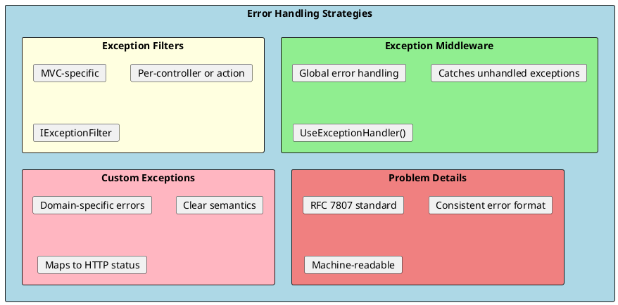
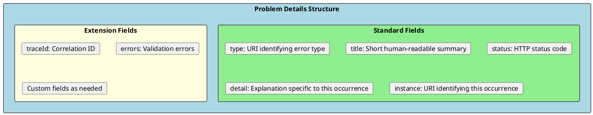

# Error Handling

Proper error handling is crucial for building robust APIs. ASP.NET Core provides several mechanisms for handling errors gracefully, including exception middleware, problem details (RFC 7807), and custom exception handling.



## Problem Details (RFC 7807)

Problem Details is a standardized format for describing errors in HTTP APIs. It provides a consistent structure that clients can reliably parse.



### Problem Details Example

```json
{
  "type": "https://tools.ietf.org/html/rfc7231#section-6.5.1",
  "title": "Bad Request",
  "status": 400,
  "detail": "The product name cannot be empty",
  "instance": "/api/products",
  "traceId": "00-84c1f...123",
  "errors": {
    "Name": ["The Name field is required."],
    "Price": ["Price must be greater than zero."]
  }
}
```

### Enabling Problem Details

```csharp
// Program.cs
builder.Services.AddProblemDetails(options =>
{
    options.CustomizeProblemDetails = context =>
    {
        context.ProblemDetails.Extensions["traceId"] =
            context.HttpContext.TraceIdentifier;

        context.ProblemDetails.Extensions["nodeId"] =
            Environment.MachineName;
    };
});

// Use with exception handler
app.UseExceptionHandler();
app.UseStatusCodePages();

// Or with custom configuration
app.UseExceptionHandler(exceptionApp =>
{
    exceptionApp.Run(async context =>
    {
        var exceptionFeature = context.Features.Get<IExceptionHandlerFeature>();
        var exception = exceptionFeature?.Error;

        var problemDetails = new ProblemDetails
        {
            Status = StatusCodes.Status500InternalServerError,
            Title = "An error occurred",
            Detail = app.Environment.IsDevelopment()
                ? exception?.Message
                : "An unexpected error occurred"
        };

        context.Response.StatusCode = problemDetails.Status.Value;
        context.Response.ContentType = "application/problem+json";

        await context.Response.WriteAsJsonAsync(problemDetails);
    });
});
```

---

## Global Exception Handling Middleware

Custom middleware for handling all unhandled exceptions consistently.

```csharp
public class GlobalExceptionHandlerMiddleware
{
    private readonly RequestDelegate _next;
    private readonly ILogger<GlobalExceptionHandlerMiddleware> _logger;
    private readonly IHostEnvironment _environment;

    public GlobalExceptionHandlerMiddleware(
        RequestDelegate next,
        ILogger<GlobalExceptionHandlerMiddleware> logger,
        IHostEnvironment environment)
    {
        _next = next;
        _logger = logger;
        _environment = environment;
    }

    public async Task InvokeAsync(HttpContext context)
    {
        try
        {
            await _next(context);
        }
        catch (Exception ex)
        {
            await HandleExceptionAsync(context, ex);
        }
    }

    private async Task HandleExceptionAsync(HttpContext context, Exception exception)
    {
        _logger.LogError(exception, "An unhandled exception occurred: {Message}", exception.Message);

        var (statusCode, problemDetails) = exception switch
        {
            NotFoundException notFound => (
                StatusCodes.Status404NotFound,
                CreateProblemDetails(context, StatusCodes.Status404NotFound,
                    "Resource Not Found", notFound.Message)),

            ValidationException validation => (
                StatusCodes.Status400BadRequest,
                CreateValidationProblemDetails(context, validation)),

            UnauthorizedAccessException => (
                StatusCodes.Status401Unauthorized,
                CreateProblemDetails(context, StatusCodes.Status401Unauthorized,
                    "Unauthorized", "Authentication is required")),

            ForbiddenException forbidden => (
                StatusCodes.Status403Forbidden,
                CreateProblemDetails(context, StatusCodes.Status403Forbidden,
                    "Forbidden", forbidden.Message)),

            ConflictException conflict => (
                StatusCodes.Status409Conflict,
                CreateProblemDetails(context, StatusCodes.Status409Conflict,
                    "Conflict", conflict.Message)),

            _ => (
                StatusCodes.Status500InternalServerError,
                CreateProblemDetails(context, StatusCodes.Status500InternalServerError,
                    "Internal Server Error",
                    _environment.IsDevelopment() ? exception.Message : "An unexpected error occurred"))
        };

        context.Response.StatusCode = statusCode;
        context.Response.ContentType = "application/problem+json";

        await context.Response.WriteAsJsonAsync(problemDetails);
    }

    private ProblemDetails CreateProblemDetails(
        HttpContext context, int statusCode, string title, string detail)
    {
        return new ProblemDetails
        {
            Status = statusCode,
            Title = title,
            Detail = detail,
            Instance = context.Request.Path,
            Extensions =
            {
                ["traceId"] = context.TraceIdentifier
            }
        };
    }

    private ValidationProblemDetails CreateValidationProblemDetails(
        HttpContext context, ValidationException exception)
    {
        return new ValidationProblemDetails(exception.Errors)
        {
            Status = StatusCodes.Status400BadRequest,
            Title = "Validation Failed",
            Detail = "One or more validation errors occurred",
            Instance = context.Request.Path,
            Extensions =
            {
                ["traceId"] = context.TraceIdentifier
            }
        };
    }
}

// Extension method
public static class GlobalExceptionHandlerMiddlewareExtensions
{
    public static IApplicationBuilder UseGlobalExceptionHandler(this IApplicationBuilder builder)
    {
        return builder.UseMiddleware<GlobalExceptionHandlerMiddleware>();
    }
}

// Usage in Program.cs
app.UseGlobalExceptionHandler();
```

---

## Custom Domain Exceptions

Define custom exceptions that map to specific HTTP status codes.

```csharp
// Base exception
public abstract class DomainException : Exception
{
    public abstract int StatusCode { get; }

    protected DomainException(string message) : base(message) { }
    protected DomainException(string message, Exception innerException)
        : base(message, innerException) { }
}

// 404 Not Found
public class NotFoundException : DomainException
{
    public override int StatusCode => StatusCodes.Status404NotFound;

    public NotFoundException(string message) : base(message) { }

    public static NotFoundException ForEntity<T>(object id)
        => new($"{typeof(T).Name} with ID '{id}' was not found.");
}

// 400 Bad Request with validation errors
public class ValidationException : DomainException
{
    public override int StatusCode => StatusCodes.Status400BadRequest;
    public IDictionary<string, string[]> Errors { get; }

    public ValidationException(string message) : base(message)
    {
        Errors = new Dictionary<string, string[]>();
    }

    public ValidationException(IDictionary<string, string[]> errors)
        : base("One or more validation errors occurred.")
    {
        Errors = errors;
    }

    public ValidationException(string propertyName, string errorMessage)
        : base(errorMessage)
    {
        Errors = new Dictionary<string, string[]>
        {
            { propertyName, new[] { errorMessage } }
        };
    }
}

// 403 Forbidden
public class ForbiddenException : DomainException
{
    public override int StatusCode => StatusCodes.Status403Forbidden;

    public ForbiddenException(string message = "You do not have permission to perform this action")
        : base(message) { }
}

// 409 Conflict
public class ConflictException : DomainException
{
    public override int StatusCode => StatusCodes.Status409Conflict;

    public ConflictException(string message) : base(message) { }

    public static ConflictException ForDuplicate<T>(string field, string value)
        => new($"{typeof(T).Name} with {field} '{value}' already exists.");
}

// 422 Unprocessable Entity (business rule violation)
public class BusinessRuleException : DomainException
{
    public override int StatusCode => StatusCodes.Status422UnprocessableEntity;

    public BusinessRuleException(string message) : base(message) { }
}
```

### Using Custom Exceptions in Services

```csharp
public class ProductService : IProductService
{
    private readonly IProductRepository _repository;

    public ProductService(IProductRepository repository)
    {
        _repository = repository;
    }

    public async Task<ProductDto> GetByIdAsync(int id)
    {
        var product = await _repository.GetByIdAsync(id);

        if (product == null)
        {
            throw NotFoundException.ForEntity<Product>(id);
        }

        return MapToDto(product);
    }

    public async Task<ProductDto> CreateAsync(CreateProductDto dto)
    {
        // Check for duplicate SKU
        var existingProduct = await _repository.GetBySkuAsync(dto.Sku);
        if (existingProduct != null)
        {
            throw ConflictException.ForDuplicate<Product>("SKU", dto.Sku);
        }

        // Business rule validation
        if (dto.Price < dto.Cost)
        {
            throw new BusinessRuleException("Product price cannot be less than cost");
        }

        var product = new Product
        {
            Name = dto.Name,
            Sku = dto.Sku,
            Price = dto.Price,
            Cost = dto.Cost
        };

        await _repository.AddAsync(product);

        return MapToDto(product);
    }

    public async Task DeleteAsync(int id)
    {
        var product = await _repository.GetByIdAsync(id);

        if (product == null)
        {
            throw NotFoundException.ForEntity<Product>(id);
        }

        if (product.HasActiveOrders)
        {
            throw new BusinessRuleException("Cannot delete product with active orders");
        }

        await _repository.DeleteAsync(product);
    }
}
```

---

## Exception Filters

Exception filters handle exceptions thrown by controller actions.

```csharp
// Global exception filter
public class ApiExceptionFilterAttribute : ExceptionFilterAttribute
{
    private readonly ILogger<ApiExceptionFilterAttribute> _logger;
    private readonly IHostEnvironment _environment;

    public ApiExceptionFilterAttribute(
        ILogger<ApiExceptionFilterAttribute> logger,
        IHostEnvironment environment)
    {
        _logger = logger;
        _environment = environment;
    }

    public override void OnException(ExceptionContext context)
    {
        _logger.LogError(context.Exception, "Unhandled exception");

        var problemDetails = context.Exception switch
        {
            DomainException domainEx => new ProblemDetails
            {
                Status = domainEx.StatusCode,
                Title = GetTitle(domainEx.StatusCode),
                Detail = domainEx.Message
            },

            _ => new ProblemDetails
            {
                Status = StatusCodes.Status500InternalServerError,
                Title = "Internal Server Error",
                Detail = _environment.IsDevelopment()
                    ? context.Exception.Message
                    : "An unexpected error occurred"
            }
        };

        problemDetails.Extensions["traceId"] = context.HttpContext.TraceIdentifier;

        context.Result = new ObjectResult(problemDetails)
        {
            StatusCode = problemDetails.Status
        };

        context.ExceptionHandled = true;
    }

    private static string GetTitle(int statusCode) => statusCode switch
    {
        400 => "Bad Request",
        401 => "Unauthorized",
        403 => "Forbidden",
        404 => "Not Found",
        409 => "Conflict",
        422 => "Unprocessable Entity",
        _ => "Error"
    };
}

// Register globally
builder.Services.AddControllers(options =>
{
    options.Filters.Add<ApiExceptionFilterAttribute>();
});
```

---

## Validation Error Handling

Handle FluentValidation errors with a pipeline behavior.

```csharp
// FluentValidation integration with MediatR
public class ValidationBehavior<TRequest, TResponse> : IPipelineBehavior<TRequest, TResponse>
    where TRequest : IRequest<TResponse>
{
    private readonly IEnumerable<IValidator<TRequest>> _validators;

    public ValidationBehavior(IEnumerable<IValidator<TRequest>> validators)
    {
        _validators = validators;
    }

    public async Task<TResponse> Handle(
        TRequest request,
        RequestHandlerDelegate<TResponse> next,
        CancellationToken cancellationToken)
    {
        if (!_validators.Any())
        {
            return await next();
        }

        var context = new ValidationContext<TRequest>(request);

        var validationResults = await Task.WhenAll(
            _validators.Select(v => v.ValidateAsync(context, cancellationToken)));

        var failures = validationResults
            .SelectMany(r => r.Errors)
            .Where(f => f != null)
            .ToList();

        if (failures.Count > 0)
        {
            var errors = failures
                .GroupBy(f => f.PropertyName)
                .ToDictionary(
                    g => g.Key,
                    g => g.Select(f => f.ErrorMessage).ToArray());

            throw new ValidationException(errors);
        }

        return await next();
    }
}
```

---

## Error Response Standardization

Create consistent error responses across your API.

```csharp
// Standard API response wrapper
public class ApiResponse<T>
{
    public bool Success { get; set; }
    public T? Data { get; set; }
    public ApiError? Error { get; set; }
    public string TraceId { get; set; } = string.Empty;
}

public class ApiError
{
    public string Code { get; set; } = string.Empty;
    public string Message { get; set; } = string.Empty;
    public IDictionary<string, string[]>? ValidationErrors { get; set; }
}

// Result filter to wrap responses
public class ApiResponseWrapperFilter : IAsyncResultFilter
{
    public async Task OnResultExecutionAsync(
        ResultExecutingContext context,
        ResultExecutionDelegate next)
    {
        if (context.Result is ObjectResult objectResult)
        {
            // Don't wrap ProblemDetails or already wrapped responses
            if (objectResult.Value is ProblemDetails ||
                objectResult.Value is ApiResponse<object>)
            {
                await next();
                return;
            }

            var statusCode = objectResult.StatusCode ?? 200;

            if (statusCode >= 200 && statusCode < 300)
            {
                objectResult.Value = new ApiResponse<object>
                {
                    Success = true,
                    Data = objectResult.Value,
                    TraceId = context.HttpContext.TraceIdentifier
                };
            }
        }

        await next();
    }
}
```

---

## Logging Errors

Proper error logging with structured logging.

```csharp
public class ErrorLoggingMiddleware
{
    private readonly RequestDelegate _next;
    private readonly ILogger<ErrorLoggingMiddleware> _logger;

    public ErrorLoggingMiddleware(RequestDelegate next, ILogger<ErrorLoggingMiddleware> logger)
    {
        _next = next;
        _logger = logger;
    }

    public async Task InvokeAsync(HttpContext context)
    {
        try
        {
            await _next(context);

            // Log non-success status codes
            if (context.Response.StatusCode >= 400)
            {
                _logger.LogWarning(
                    "Request {Method} {Path} returned {StatusCode}",
                    context.Request.Method,
                    context.Request.Path,
                    context.Response.StatusCode);
            }
        }
        catch (Exception ex)
        {
            // Structured logging with exception details
            _logger.LogError(ex,
                "Unhandled exception for {Method} {Path}. " +
                "TraceId: {TraceId}, User: {User}",
                context.Request.Method,
                context.Request.Path,
                context.TraceIdentifier,
                context.User.Identity?.Name ?? "anonymous");

            throw;  // Let exception middleware handle the response
        }
    }
}

// Configure Serilog for better exception logging
builder.Host.UseSerilog((context, config) =>
{
    config
        .ReadFrom.Configuration(context.Configuration)
        .Enrich.FromLogContext()
        .Enrich.WithMachineName()
        .Enrich.WithEnvironmentName()
        .WriteTo.Console()
        .WriteTo.File(
            "logs/errors-.txt",
            restrictedToMinimumLevel: LogEventLevel.Error,
            rollingInterval: RollingInterval.Day);
});
```

---

## Development vs Production Errors

Different error responses based on environment.

```csharp
public class EnvironmentAwareExceptionHandler
{
    private readonly RequestDelegate _next;
    private readonly IHostEnvironment _environment;

    public EnvironmentAwareExceptionHandler(
        RequestDelegate next,
        IHostEnvironment environment)
    {
        _next = next;
        _environment = environment;
    }

    public async Task InvokeAsync(HttpContext context)
    {
        try
        {
            await _next(context);
        }
        catch (Exception ex)
        {
            var problemDetails = new ProblemDetails
            {
                Status = StatusCodes.Status500InternalServerError,
                Title = "An error occurred",
                Instance = context.Request.Path
            };

            if (_environment.IsDevelopment())
            {
                // Full details in development
                problemDetails.Detail = ex.Message;
                problemDetails.Extensions["exception"] = ex.ToString();
                problemDetails.Extensions["stackTrace"] = ex.StackTrace;
            }
            else
            {
                // Generic message in production
                problemDetails.Detail = "An unexpected error occurred. Please try again later.";
                // Log the full exception for debugging
            }

            problemDetails.Extensions["traceId"] = context.TraceIdentifier;

            context.Response.StatusCode = 500;
            context.Response.ContentType = "application/problem+json";
            await context.Response.WriteAsJsonAsync(problemDetails);
        }
    }
}
```

---

## Interview Questions & Answers

### Q1: What is Problem Details (RFC 7807)?

**Answer**: Problem Details is a standardized JSON format for describing HTTP API errors. It includes:
- `type`: URI identifying the error type
- `title`: Short human-readable summary
- `status`: HTTP status code
- `detail`: Specific explanation
- `instance`: URI for this occurrence

Benefits: Consistent error format, machine-readable, extensible with custom fields.

### Q2: How do you handle exceptions globally in ASP.NET Core?

**Answer**: Two main approaches:
1. **Exception Middleware**: `app.UseExceptionHandler()` or custom middleware - catches all unhandled exceptions
2. **Exception Filters**: `IExceptionFilter` - MVC-specific, handles exceptions from controllers

Middleware is preferred for APIs as it catches exceptions from all middleware, not just controllers.

### Q3: What's the difference between exception middleware and exception filters?

**Answer**:
- **Middleware**: Runs for ALL requests, catches exceptions from entire pipeline, global scope
- **Filters**: Runs only for matched routes, catches exceptions from controllers/actions, can be per-controller

Use middleware for global error handling, filters for controller-specific behavior.

### Q4: How do you return different error details in development vs production?

**Answer**: Check `IHostEnvironment.IsDevelopment()`:
- Development: Include exception message, stack trace, inner exceptions
- Production: Generic message, log full details server-side

```csharp
var detail = environment.IsDevelopment()
    ? exception.Message
    : "An unexpected error occurred";
```

### Q5: How do you handle validation errors consistently?

**Answer**: Options:
1. `[ApiController]` automatically returns 400 with `ValidationProblemDetails`
2. FluentValidation with pipeline behavior throwing `ValidationException`
3. Custom validation filter

Return `ValidationProblemDetails` with errors dictionary mapping property names to error messages.

### Q6: What HTTP status codes should you use for different errors?

**Answer**:
- **400 Bad Request**: Invalid input, validation errors
- **401 Unauthorized**: Authentication required
- **403 Forbidden**: Authenticated but not allowed
- **404 Not Found**: Resource doesn't exist
- **409 Conflict**: Duplicate resource, state conflict
- **422 Unprocessable Entity**: Business rule violation
- **500 Internal Server Error**: Unexpected server error

