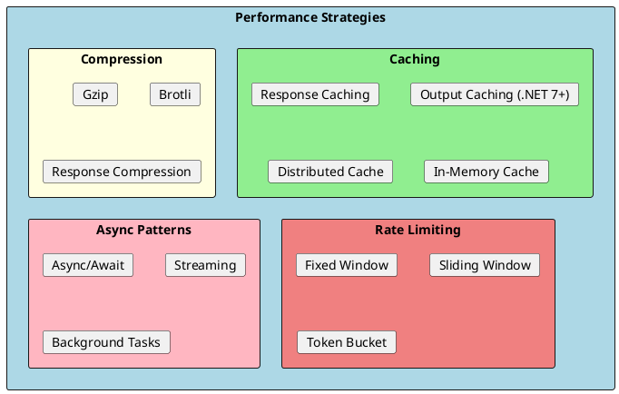
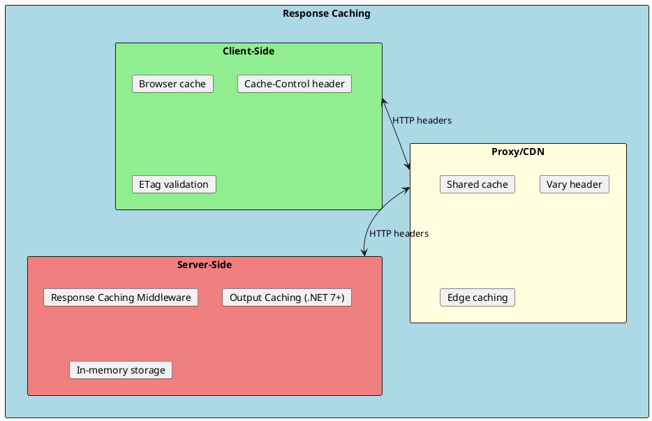
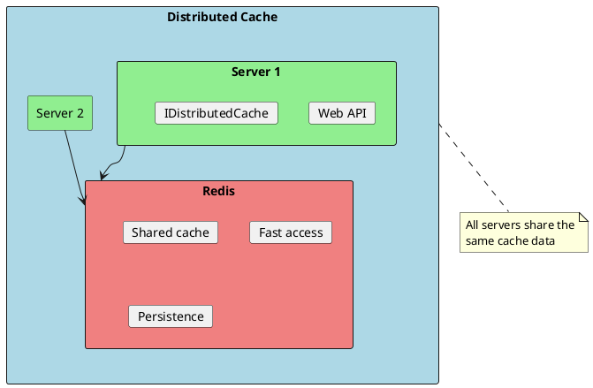
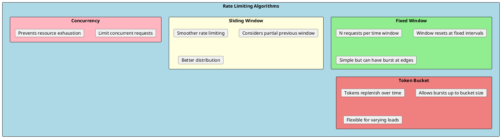

# Performance Optimization

Building high-performance APIs requires understanding caching strategies, response compression, rate limiting, and efficient data handling. ASP.NET Core provides built-in features and patterns to optimize API performance.



## Response Caching

Response caching stores HTTP responses to serve repeated requests faster. It uses HTTP cache headers to control caching behavior.



### Response Caching Middleware

```csharp
// Program.cs
builder.Services.AddResponseCaching();

var app = builder.Build();

app.UseResponseCaching();

app.MapControllers();

// Controller with caching
[ApiController]
[Route("api/[controller]")]
public class ProductsController : ControllerBase
{
    // Cache for 60 seconds, public (can be cached by proxies)
    [HttpGet]
    [ResponseCache(Duration = 60, Location = ResponseCacheLocation.Any)]
    public async Task<ActionResult<IEnumerable<ProductDto>>> GetAll()
    {
        return Ok(await _service.GetAllAsync());
    }

    // Cache for 30 seconds, private (browser only)
    [HttpGet("{id}")]
    [ResponseCache(Duration = 30, Location = ResponseCacheLocation.Client)]
    public async Task<ActionResult<ProductDto>> GetById(int id)
    {
        var product = await _service.GetByIdAsync(id);
        return product != null ? Ok(product) : NotFound();
    }

    // No caching
    [HttpGet("current-time")]
    [ResponseCache(NoStore = true)]
    public IActionResult GetCurrentTime()
    {
        return Ok(DateTime.UtcNow);
    }

    // Vary by query string
    [HttpGet("search")]
    [ResponseCache(Duration = 60, VaryByQueryKeys = new[] { "query", "page" })]
    public async Task<ActionResult<IEnumerable<ProductDto>>> Search(
        [FromQuery] string query,
        [FromQuery] int page = 1)
    {
        return Ok(await _service.SearchAsync(query, page));
    }
}

// Cache profiles for reusability
builder.Services.AddControllers(options =>
{
    options.CacheProfiles.Add("Default", new CacheProfile
    {
        Duration = 60,
        Location = ResponseCacheLocation.Any
    });

    options.CacheProfiles.Add("NoCache", new CacheProfile
    {
        NoStore = true,
        Location = ResponseCacheLocation.None
    });
});

// Usage
[ResponseCache(CacheProfileName = "Default")]
public IActionResult Get() => Ok();
```

### Output Caching (.NET 7+)

Output caching is more powerful than response caching, allowing server-side caching with programmatic invalidation.

```csharp
// Program.cs
builder.Services.AddOutputCache(options =>
{
    options.AddBasePolicy(builder => builder.Expire(TimeSpan.FromMinutes(5)));

    options.AddPolicy("ProductsPolicy", builder =>
        builder.Expire(TimeSpan.FromMinutes(10))
               .Tag("products"));

    options.AddPolicy("ByIdPolicy", builder =>
        builder.SetVaryByRouteValue("id")
               .Expire(TimeSpan.FromMinutes(5)));
});

var app = builder.Build();

app.UseOutputCache();

// Controller usage
[ApiController]
[Route("api/[controller]")]
public class ProductsController : ControllerBase
{
    private readonly IOutputCacheStore _cache;

    public ProductsController(IOutputCacheStore cache)
    {
        _cache = cache;
    }

    [HttpGet]
    [OutputCache(PolicyName = "ProductsPolicy")]
    public async Task<ActionResult<IEnumerable<ProductDto>>> GetAll()
    {
        return Ok(await _service.GetAllAsync());
    }

    [HttpGet("{id}")]
    [OutputCache(PolicyName = "ByIdPolicy")]
    public async Task<ActionResult<ProductDto>> GetById(int id)
    {
        return Ok(await _service.GetByIdAsync(id));
    }

    [HttpPost]
    public async Task<ActionResult<ProductDto>> Create(CreateProductDto dto)
    {
        var product = await _service.CreateAsync(dto);

        // Invalidate cache by tag
        await _cache.EvictByTagAsync("products", CancellationToken.None);

        return CreatedAtAction(nameof(GetById), new { id = product.Id }, product);
    }
}

// Minimal API with output caching
app.MapGet("/api/products", async (IProductService service) =>
{
    return await service.GetAllAsync();
})
.CacheOutput("ProductsPolicy");
```

---

## Distributed Caching

For multi-server deployments, use distributed caching (Redis, SQL Server, etc.).



### Redis Cache Implementation

```csharp
// Program.cs
builder.Services.AddStackExchangeRedisCache(options =>
{
    options.Configuration = builder.Configuration.GetConnectionString("Redis");
    options.InstanceName = "MyApp:";
});

// Cache service
public interface ICacheService
{
    Task<T?> GetAsync<T>(string key, CancellationToken ct = default);
    Task SetAsync<T>(string key, T value, TimeSpan? expiration = null, CancellationToken ct = default);
    Task RemoveAsync(string key, CancellationToken ct = default);
    Task<T> GetOrSetAsync<T>(string key, Func<Task<T>> factory, TimeSpan? expiration = null, CancellationToken ct = default);
}

public class RedisCacheService : ICacheService
{
    private readonly IDistributedCache _cache;
    private readonly ILogger<RedisCacheService> _logger;
    private static readonly JsonSerializerOptions _jsonOptions = new()
    {
        PropertyNamingPolicy = JsonNamingPolicy.CamelCase
    };

    public RedisCacheService(IDistributedCache cache, ILogger<RedisCacheService> logger)
    {
        _cache = cache;
        _logger = logger;
    }

    public async Task<T?> GetAsync<T>(string key, CancellationToken ct = default)
    {
        try
        {
            var data = await _cache.GetStringAsync(key, ct);
            if (data == null) return default;

            return JsonSerializer.Deserialize<T>(data, _jsonOptions);
        }
        catch (Exception ex)
        {
            _logger.LogWarning(ex, "Cache get failed for key {Key}", key);
            return default;
        }
    }

    public async Task SetAsync<T>(string key, T value, TimeSpan? expiration = null, CancellationToken ct = default)
    {
        try
        {
            var options = new DistributedCacheEntryOptions
            {
                AbsoluteExpirationRelativeToNow = expiration ?? TimeSpan.FromMinutes(30)
            };

            var data = JsonSerializer.Serialize(value, _jsonOptions);
            await _cache.SetStringAsync(key, data, options, ct);
        }
        catch (Exception ex)
        {
            _logger.LogWarning(ex, "Cache set failed for key {Key}", key);
        }
    }

    public async Task RemoveAsync(string key, CancellationToken ct = default)
    {
        try
        {
            await _cache.RemoveAsync(key, ct);
        }
        catch (Exception ex)
        {
            _logger.LogWarning(ex, "Cache remove failed for key {Key}", key);
        }
    }

    public async Task<T> GetOrSetAsync<T>(
        string key,
        Func<Task<T>> factory,
        TimeSpan? expiration = null,
        CancellationToken ct = default)
    {
        var cached = await GetAsync<T>(key, ct);
        if (cached != null) return cached;

        var value = await factory();
        await SetAsync(key, value, expiration, ct);

        return value;
    }
}

// Usage in service
public class ProductService : IProductService
{
    private readonly IProductRepository _repository;
    private readonly ICacheService _cache;

    public ProductService(IProductRepository repository, ICacheService cache)
    {
        _repository = repository;
        _cache = cache;
    }

    public async Task<ProductDto?> GetByIdAsync(int id)
    {
        var cacheKey = $"product:{id}";

        return await _cache.GetOrSetAsync(cacheKey, async () =>
        {
            var product = await _repository.GetByIdAsync(id);
            return product != null ? MapToDto(product) : null;
        }, TimeSpan.FromMinutes(10));
    }

    public async Task<ProductDto> UpdateAsync(int id, UpdateProductDto dto)
    {
        var product = await _repository.UpdateAsync(id, dto);

        // Invalidate cache
        await _cache.RemoveAsync($"product:{id}");
        await _cache.RemoveAsync("products:all");

        return MapToDto(product);
    }
}
```

---

## Response Compression

Compress responses to reduce bandwidth and improve load times.

```csharp
// Program.cs
builder.Services.AddResponseCompression(options =>
{
    options.EnableForHttps = true;  // Enable for HTTPS
    options.Providers.Add<BrotliCompressionProvider>();
    options.Providers.Add<GzipCompressionProvider>();

    // Compress these MIME types
    options.MimeTypes = ResponseCompressionDefaults.MimeTypes.Concat(new[]
    {
        "application/json",
        "application/xml",
        "text/json"
    });
});

builder.Services.Configure<BrotliCompressionProviderOptions>(options =>
{
    options.Level = CompressionLevel.Fastest;
});

builder.Services.Configure<GzipCompressionProviderOptions>(options =>
{
    options.Level = CompressionLevel.Optimal;
});

var app = builder.Build();

// Must be before other middleware that might modify response
app.UseResponseCompression();
```

---

## Rate Limiting (.NET 7+)

Protect your API from abuse with built-in rate limiting.



### Rate Limiting Configuration

```csharp
// Program.cs
builder.Services.AddRateLimiter(options =>
{
    // Global rate limit
    options.GlobalLimiter = PartitionedRateLimiter.Create<HttpContext, string>(context =>
    {
        return RateLimitPartition.GetFixedWindowLimiter(
            partitionKey: context.User.Identity?.Name ?? context.Request.Headers.Host.ToString(),
            factory: _ => new FixedWindowRateLimiterOptions
            {
                PermitLimit = 100,
                Window = TimeSpan.FromMinutes(1)
            });
    });

    // Named policies
    options.AddFixedWindowLimiter("fixed", opt =>
    {
        opt.PermitLimit = 10;
        opt.Window = TimeSpan.FromSeconds(10);
        opt.QueueProcessingOrder = QueueProcessingOrder.OldestFirst;
        opt.QueueLimit = 5;
    });

    options.AddSlidingWindowLimiter("sliding", opt =>
    {
        opt.PermitLimit = 100;
        opt.Window = TimeSpan.FromMinutes(1);
        opt.SegmentsPerWindow = 6;  // 10-second segments
    });

    options.AddTokenBucketLimiter("token", opt =>
    {
        opt.TokenLimit = 100;
        opt.ReplenishmentPeriod = TimeSpan.FromSeconds(10);
        opt.TokensPerPeriod = 20;
        opt.QueueLimit = 10;
    });

    options.AddConcurrencyLimiter("concurrent", opt =>
    {
        opt.PermitLimit = 10;
        opt.QueueLimit = 5;
    });

    // Custom rejection response
    options.OnRejected = async (context, token) =>
    {
        context.HttpContext.Response.StatusCode = StatusCodes.Status429TooManyRequests;
        context.HttpContext.Response.Headers.RetryAfter =
            ((int)TimeSpan.FromMinutes(1).TotalSeconds).ToString();

        await context.HttpContext.Response.WriteAsJsonAsync(new
        {
            error = "Rate limit exceeded",
            retryAfter = 60
        }, token);
    };
});

var app = builder.Build();

app.UseRateLimiter();

// Apply to endpoints
[ApiController]
[Route("api/[controller]")]
public class ProductsController : ControllerBase
{
    [HttpGet]
    [EnableRateLimiting("fixed")]
    public IActionResult GetAll() => Ok();

    [HttpPost]
    [EnableRateLimiting("token")]
    public IActionResult Create() => Ok();

    [HttpGet("unlimited")]
    [DisableRateLimiting]
    public IActionResult GetUnlimited() => Ok();
}

// Minimal API
app.MapGet("/api/limited", () => "Hello")
   .RequireRateLimiting("fixed");
```

---

## Async Best Practices

Efficient async code is crucial for API performance.

```csharp
public class AsyncBestPractices
{
    // ✅ Good - async all the way
    public async Task<ProductDto> GetProductAsync(int id)
    {
        var product = await _repository.GetByIdAsync(id);
        return MapToDto(product);
    }

    // ❌ Bad - blocking async code (.Result, .Wait())
    public ProductDto GetProductBlocking(int id)
    {
        // This can cause deadlocks!
        var product = _repository.GetByIdAsync(id).Result;
        return MapToDto(product);
    }

    // ✅ Good - parallel async operations
    public async Task<DashboardDto> GetDashboardAsync()
    {
        var productsTask = _productService.GetTopProductsAsync();
        var ordersTask = _orderService.GetRecentOrdersAsync();
        var statsTask = _statsService.GetStatsAsync();

        await Task.WhenAll(productsTask, ordersTask, statsTask);

        return new DashboardDto
        {
            TopProducts = await productsTask,
            RecentOrders = await ordersTask,
            Stats = await statsTask
        };
    }

    // ✅ Good - cancellation token support
    public async Task<IEnumerable<ProductDto>> SearchAsync(
        string query,
        CancellationToken cancellationToken = default)
    {
        var products = await _repository.SearchAsync(query, cancellationToken);
        return products.Select(MapToDto);
    }

    // ✅ Good - streaming for large datasets
    public async IAsyncEnumerable<ProductDto> StreamProductsAsync(
        [EnumeratorCancellation] CancellationToken cancellationToken = default)
    {
        await foreach (var product in _repository.GetAllAsyncEnumerable(cancellationToken))
        {
            yield return MapToDto(product);
        }
    }
}

// Controller with streaming
[HttpGet("stream")]
public async IAsyncEnumerable<ProductDto> StreamProducts(
    [EnumeratorCancellation] CancellationToken ct)
{
    await foreach (var product in _service.StreamProductsAsync(ct))
    {
        yield return product;
    }
}
```

---

## Pagination

Efficient pagination for large datasets.

```csharp
public class PagedResult<T>
{
    public IEnumerable<T> Items { get; set; } = Enumerable.Empty<T>();
    public int Page { get; set; }
    public int PageSize { get; set; }
    public int TotalCount { get; set; }
    public int TotalPages => (int)Math.Ceiling(TotalCount / (double)PageSize);
    public bool HasPrevious => Page > 1;
    public bool HasNext => Page < TotalPages;
}

public class PaginationParams
{
    private const int MaxPageSize = 100;
    private int _pageSize = 10;

    public int Page { get; set; } = 1;

    public int PageSize
    {
        get => _pageSize;
        set => _pageSize = Math.Min(value, MaxPageSize);
    }
}

// Repository with efficient pagination
public async Task<PagedResult<Product>> GetPagedAsync(PaginationParams pagination)
{
    var query = _context.Products.AsNoTracking();

    var totalCount = await query.CountAsync();

    var items = await query
        .OrderBy(p => p.Id)
        .Skip((pagination.Page - 1) * pagination.PageSize)
        .Take(pagination.PageSize)
        .ToListAsync();

    return new PagedResult<Product>
    {
        Items = items,
        Page = pagination.Page,
        PageSize = pagination.PageSize,
        TotalCount = totalCount
    };
}

// Controller with pagination headers
[HttpGet]
public async Task<ActionResult<IEnumerable<ProductDto>>> GetAll(
    [FromQuery] PaginationParams pagination)
{
    var result = await _service.GetPagedAsync(pagination);

    Response.Headers.Append("X-Pagination", JsonSerializer.Serialize(new
    {
        result.Page,
        result.PageSize,
        result.TotalCount,
        result.TotalPages,
        result.HasPrevious,
        result.HasNext
    }));

    return Ok(result.Items);
}
```

---

## Performance Monitoring

Monitor API performance with built-in diagnostics.

```csharp
// Health checks
builder.Services.AddHealthChecks()
    .AddDbContextCheck<AppDbContext>()
    .AddRedis(builder.Configuration.GetConnectionString("Redis")!)
    .AddUrlGroup(new Uri("https://external-api.com/health"), "external-api");

app.MapHealthChecks("/health", new HealthCheckOptions
{
    ResponseWriter = async (context, report) =>
    {
        context.Response.ContentType = "application/json";
        await context.Response.WriteAsJsonAsync(new
        {
            status = report.Status.ToString(),
            checks = report.Entries.Select(e => new
            {
                name = e.Key,
                status = e.Value.Status.ToString(),
                duration = e.Value.Duration.TotalMilliseconds
            })
        });
    }
});

// Request timing middleware
public class RequestTimingMiddleware
{
    private readonly RequestDelegate _next;
    private readonly ILogger<RequestTimingMiddleware> _logger;

    public RequestTimingMiddleware(RequestDelegate next, ILogger<RequestTimingMiddleware> logger)
    {
        _next = next;
        _logger = logger;
    }

    public async Task InvokeAsync(HttpContext context)
    {
        var sw = Stopwatch.StartNew();

        context.Response.OnStarting(() =>
        {
            sw.Stop();
            context.Response.Headers.Append("X-Response-Time", $"{sw.ElapsedMilliseconds}ms");
            return Task.CompletedTask;
        });

        await _next(context);

        _logger.LogInformation(
            "{Method} {Path} completed in {Duration}ms",
            context.Request.Method,
            context.Request.Path,
            sw.ElapsedMilliseconds);
    }
}
```

---

## Interview Questions & Answers

### Q1: What's the difference between Response Caching and Output Caching?

**Answer**:
- **Response Caching**: Uses HTTP cache headers, relies on client/proxy caching, limited control
- **Output Caching (.NET 7+)**: Server-side caching, programmatic invalidation with tags, more control

Output caching is preferred for APIs as you control cache invalidation.

### Q2: When should you use distributed caching vs in-memory caching?

**Answer**:
- **In-Memory**: Single server, fast access, lost on restart
- **Distributed (Redis)**: Multi-server, shared cache, persists across restarts, slightly slower

Use distributed cache when: multiple servers, need persistence, or sharing cache across services.

### Q3: How does rate limiting protect an API?

**Answer**: Rate limiting prevents abuse by restricting requests:
- **Fixed Window**: N requests per time window
- **Sliding Window**: Smoother distribution
- **Token Bucket**: Allows bursts, refills over time
- **Concurrency**: Limits simultaneous requests

Returns 429 Too Many Requests when exceeded.

### Q4: What are the best practices for async API controllers?

**Answer**:
- Use `async`/`await` all the way down (no `.Result` or `.Wait()`)
- Support `CancellationToken` for long operations
- Use `Task.WhenAll` for parallel operations
- Use `IAsyncEnumerable` for streaming large datasets
- Never block async code (causes deadlocks)

### Q5: How do you implement efficient pagination?

**Answer**:
- Use `Skip()` and `Take()` with database-level pagination
- Include total count for page calculation
- Set maximum page size to prevent abuse
- Return pagination metadata in response headers
- Use cursor-based pagination for real-time data

### Q6: What compression algorithms does ASP.NET Core support?

**Answer**: Built-in support for:
- **Gzip**: Wide compatibility, good compression
- **Brotli**: Better compression, modern browsers

Configure with `AddResponseCompression()`. Brotli is preferred for text content when supported.

