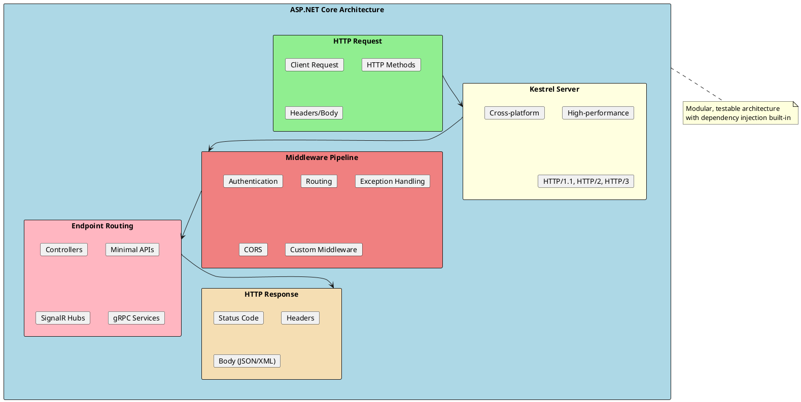
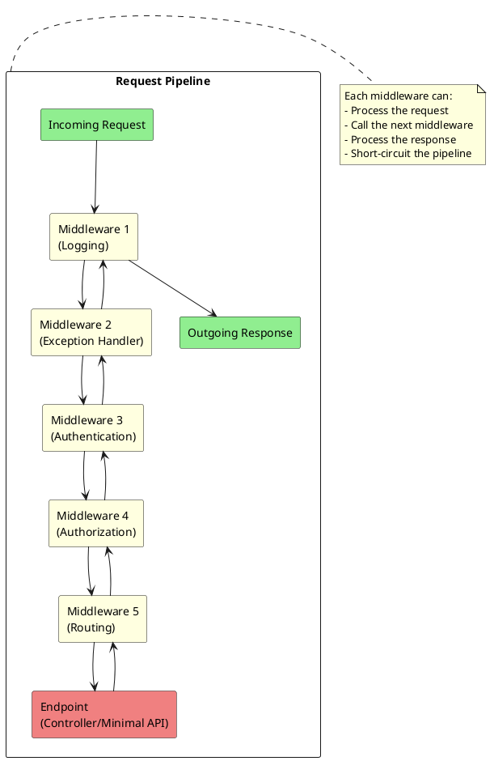
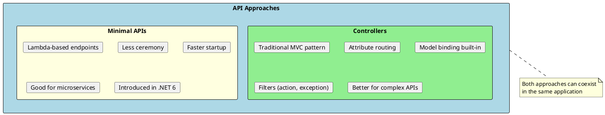

# ASP.NET Core Web API

ASP.NET Core is a cross-platform, high-performance framework for building modern, cloud-enabled web applications and APIs. Understanding its architecture and patterns is essential for building scalable, maintainable backend services.



## What is ASP.NET Core Web API?

ASP.NET Core Web API is a framework for building RESTful HTTP services that can be consumed by various clients including browsers, mobile apps, and other services. It provides:

1. **Cross-Platform** - Runs on Windows, Linux, and macOS
2. **High Performance** - One of the fastest web frameworks available
3. **Built-in DI** - Dependency injection is a first-class citizen
4. **Middleware Pipeline** - Composable request/response processing
5. **Flexible Hosting** - Kestrel, IIS, Docker, cloud platforms

## Request Pipeline



## Key Components

| Component | Purpose | Document |
|-----------|---------|----------|
| **Request Pipeline** | Process HTTP requests through middleware | [01-Fundamentals.md](./01-Fundamentals.md) |
| **Controllers** | Handle HTTP requests and return responses | [02-Controllers.md](./02-Controllers.md) |
| **Middleware** | Cross-cutting concerns (auth, logging, etc.) | [03-Middleware.md](./03-Middleware.md) |
| **Authentication** | Identity verification and authorization | [04-Authentication.md](./04-Authentication.md) |
| **Error Handling** | Exception handling and problem details | [05-ErrorHandling.md](./05-ErrorHandling.md) |
| **Performance** | Caching, compression, optimization | [06-Performance.md](./06-Performance.md) |

## Minimal API vs Controllers

ASP.NET Core offers two approaches for building APIs:



### Quick Comparison

```csharp
// Controller-based API
[ApiController]
[Route("api/[controller]")]
public class ProductsController : ControllerBase
{
    private readonly IProductService _service;

    public ProductsController(IProductService service)
    {
        _service = service;
    }

    [HttpGet("{id}")]
    public async Task<ActionResult<Product>> GetById(int id)
    {
        var product = await _service.GetByIdAsync(id);
        if (product == null) return NotFound();
        return product;
    }
}

// Minimal API (same endpoint)
app.MapGet("/api/products/{id}", async (int id, IProductService service) =>
{
    var product = await service.GetByIdAsync(id);
    return product is not null ? Results.Ok(product) : Results.NotFound();
});
```

## Files in This Section

| File | Topics Covered |
|------|----------------|
| [01-Fundamentals.md](./01-Fundamentals.md) | Request pipeline, routing, configuration, environments |
| [02-Controllers.md](./02-Controllers.md) | Controllers, actions, model binding, validation, filters |
| [03-Middleware.md](./03-Middleware.md) | Built-in middleware, custom middleware, middleware ordering |
| [04-Authentication.md](./04-Authentication.md) | JWT, OAuth 2.0, authorization policies, claims |
| [05-ErrorHandling.md](./05-ErrorHandling.md) | Global exception handling, problem details, logging |
| [06-Performance.md](./06-Performance.md) | Response caching, output caching, compression, rate limiting |

## Application Startup

```csharp
// Program.cs (.NET 6+ minimal hosting)
var builder = WebApplication.CreateBuilder(args);

// Add services to the container
builder.Services.AddControllers();
builder.Services.AddEndpointsApiExplorer();
builder.Services.AddSwaggerGen();

// Register your services
builder.Services.AddScoped<IProductService, ProductService>();
builder.Services.AddDbContext<AppDbContext>(options =>
    options.UseSqlServer(builder.Configuration.GetConnectionString("Default")));

var app = builder.Build();

// Configure the HTTP request pipeline
if (app.Environment.IsDevelopment())
{
    app.UseSwagger();
    app.UseSwaggerUI();
}

app.UseHttpsRedirection();
app.UseAuthentication();
app.UseAuthorization();
app.MapControllers();

app.Run();
```

## Quick Reference

```
┌─────────────────────────────────────────────────────────────────────┐
│                 ASP.NET Core Web API Quick Reference                │
├─────────────────────────────────────────────────────────────────────┤
│ HTTP Methods:                                                        │
│   GET     - Retrieve resources                                       │
│   POST    - Create new resources                                     │
│   PUT     - Update/replace resources                                 │
│   PATCH   - Partial update                                          │
│   DELETE  - Remove resources                                         │
├─────────────────────────────────────────────────────────────────────┤
│ Status Codes:                                                        │
│   200 OK           - Success                                         │
│   201 Created      - Resource created                                │
│   204 No Content   - Success, no body                                │
│   400 Bad Request  - Invalid input                                   │
│   401 Unauthorized - Authentication required                         │
│   403 Forbidden    - Not allowed                                     │
│   404 Not Found    - Resource doesn't exist                          │
│   500 Server Error - Internal error                                  │
├─────────────────────────────────────────────────────────────────────┤
│ Common Attributes:                                                   │
│   [ApiController]  - Enables API behaviors                           │
│   [Route]          - Define URL pattern                              │
│   [HttpGet/Post]   - HTTP method binding                             │
│   [FromBody]       - Bind from request body                          │
│   [FromQuery]      - Bind from query string                          │
│   [FromRoute]      - Bind from route values                          │
└─────────────────────────────────────────────────────────────────────┘
```

## Common Interview Topics

1. **What is the middleware pipeline?** - Request/response processing chain
2. **Difference between AddScoped, AddTransient, AddSingleton?** - Service lifetimes
3. **How does routing work?** - Attribute routing, conventional routing
4. **What is model binding?** - Automatic mapping of HTTP data to parameters
5. **How to handle errors globally?** - Exception middleware, problem details
6. **How to implement authentication?** - JWT, OAuth 2.0, Identity
7. **What are filters?** - Action filters, exception filters, result filters

