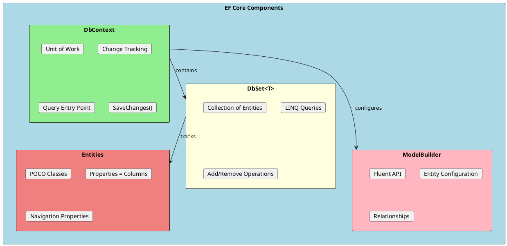
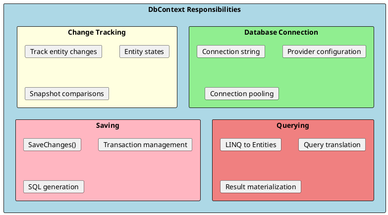
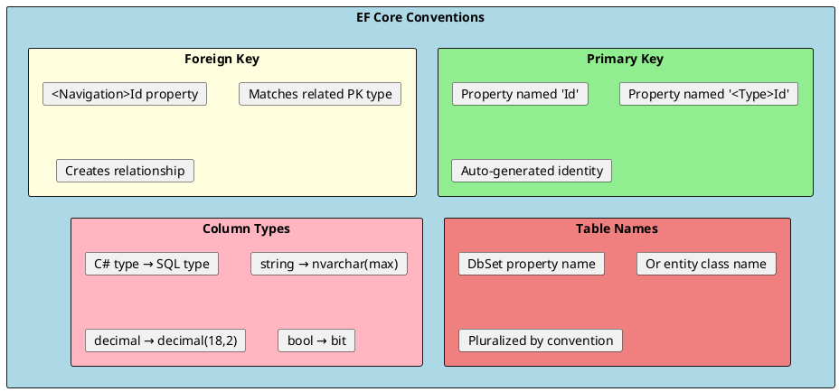

# EF Core Basics

Understanding the fundamental building blocks of Entity Framework Core is essential for effective database development. This includes DbContext, entities, configuration conventions, and the Fluent API.



## DbContext

DbContext is the primary class for interacting with the database. It represents a session with the database and provides APIs for querying, saving, and configuring entities.



### Creating a DbContext

```csharp
public class ApplicationDbContext : DbContext
{
    // Constructor for dependency injection
    public ApplicationDbContext(DbContextOptions<ApplicationDbContext> options)
        : base(options)
    {
    }

    // DbSet properties represent tables
    public DbSet<Product> Products => Set<Product>();
    public DbSet<Category> Categories => Set<Category>();
    public DbSet<Order> Orders => Set<Order>();
    public DbSet<OrderItem> OrderItems => Set<OrderItem>();
    public DbSet<Customer> Customers => Set<Customer>();

    // Configuration through OnModelCreating
    protected override void OnModelCreating(ModelBuilder modelBuilder)
    {
        base.OnModelCreating(modelBuilder);

        // Apply all configurations from assembly
        modelBuilder.ApplyConfigurationsFromAssembly(typeof(ApplicationDbContext).Assembly);

        // Or configure inline
        modelBuilder.Entity<Product>(entity =>
        {
            entity.HasKey(e => e.Id);
            entity.Property(e => e.Name).IsRequired().HasMaxLength(200);
            entity.Property(e => e.Price).HasPrecision(18, 2);
        });
    }

    // Override SaveChanges for auditing
    public override int SaveChanges()
    {
        UpdateAuditFields();
        return base.SaveChanges();
    }

    public override async Task<int> SaveChangesAsync(CancellationToken cancellationToken = default)
    {
        UpdateAuditFields();
        return await base.SaveChangesAsync(cancellationToken);
    }

    private void UpdateAuditFields()
    {
        var entries = ChangeTracker.Entries<IAuditable>();

        foreach (var entry in entries)
        {
            if (entry.State == EntityState.Added)
            {
                entry.Entity.CreatedAt = DateTime.UtcNow;
            }

            if (entry.State == EntityState.Modified)
            {
                entry.Entity.UpdatedAt = DateTime.UtcNow;
            }
        }
    }
}

// Register in Program.cs
builder.Services.AddDbContext<ApplicationDbContext>(options =>
{
    options.UseSqlServer(
        builder.Configuration.GetConnectionString("Default"),
        sqlOptions =>
        {
            sqlOptions.EnableRetryOnFailure(
                maxRetryCount: 3,
                maxRetryDelay: TimeSpan.FromSeconds(10),
                errorNumbersToAdd: null);

            sqlOptions.CommandTimeout(30);
        });

    // Development logging
    if (builder.Environment.IsDevelopment())
    {
        options.EnableSensitiveDataLogging();
        options.EnableDetailedErrors();
        options.LogTo(Console.WriteLine, LogLevel.Information);
    }
});
```

### DbContext Lifetime

```csharp
// DbContext is typically registered as Scoped (one per request)
builder.Services.AddDbContext<ApplicationDbContext>(options =>
    options.UseSqlServer(connectionString));

// For singleton services, use IDbContextFactory
builder.Services.AddDbContextFactory<ApplicationDbContext>(options =>
    options.UseSqlServer(connectionString));

// Usage with factory
public class BackgroundService : IHostedService
{
    private readonly IDbContextFactory<ApplicationDbContext> _contextFactory;

    public BackgroundService(IDbContextFactory<ApplicationDbContext> contextFactory)
    {
        _contextFactory = contextFactory;
    }

    public async Task DoWorkAsync()
    {
        // Create a new context for each unit of work
        await using var context = await _contextFactory.CreateDbContextAsync();

        var products = await context.Products.ToListAsync();
        // Context is disposed at end of using block
    }
}
```

---

## Entities

Entities are POCO (Plain Old CLR Object) classes that map to database tables. Each property typically maps to a column.

```csharp
// Basic entity with conventions
public class Product
{
    public int Id { get; set; }  // Primary key by convention (Id or <TypeName>Id)
    public string Name { get; set; } = string.Empty;
    public string? Description { get; set; }  // Nullable
    public decimal Price { get; set; }
    public int Stock { get; set; }
    public bool IsActive { get; set; } = true;
    public DateTime CreatedAt { get; set; }
    public DateTime? UpdatedAt { get; set; }

    // Foreign key
    public int CategoryId { get; set; }

    // Navigation property
    public Category Category { get; set; } = null!;

    // Collection navigation
    public List<OrderItem> OrderItems { get; set; } = new();
}

public class Category
{
    public int Id { get; set; }
    public string Name { get; set; } = string.Empty;

    // Collection navigation
    public List<Product> Products { get; set; } = new();
}

// Entity with value objects
public class Order
{
    public int Id { get; set; }
    public string OrderNumber { get; set; } = string.Empty;
    public DateTime OrderDate { get; set; }
    public OrderStatus Status { get; set; }

    // Owned entity (value object)
    public Address ShippingAddress { get; set; } = null!;
    public Address BillingAddress { get; set; } = null!;

    public int CustomerId { get; set; }
    public Customer Customer { get; set; } = null!;

    public List<OrderItem> Items { get; set; } = new();

    // Computed property (not mapped)
    public decimal Total => Items.Sum(i => i.Quantity * i.UnitPrice);
}

// Owned type (value object)
[Owned]
public class Address
{
    public string Street { get; set; } = string.Empty;
    public string City { get; set; } = string.Empty;
    public string State { get; set; } = string.Empty;
    public string ZipCode { get; set; } = string.Empty;
    public string Country { get; set; } = string.Empty;
}

public enum OrderStatus
{
    Pending,
    Processing,
    Shipped,
    Delivered,
    Cancelled
}
```

### Entity Base Classes

```csharp
// Base entity with common properties
public abstract class BaseEntity
{
    public int Id { get; set; }
}

// Auditable entity
public abstract class AuditableEntity : BaseEntity
{
    public DateTime CreatedAt { get; set; }
    public string? CreatedBy { get; set; }
    public DateTime? UpdatedAt { get; set; }
    public string? UpdatedBy { get; set; }
}

// Soft-deletable entity
public abstract class SoftDeletableEntity : AuditableEntity
{
    public bool IsDeleted { get; set; }
    public DateTime? DeletedAt { get; set; }
    public string? DeletedBy { get; set; }
}

// Usage
public class Product : AuditableEntity
{
    public string Name { get; set; } = string.Empty;
    public decimal Price { get; set; }
}

// Global query filter for soft delete
modelBuilder.Entity<Product>().HasQueryFilter(p => !p.IsDeleted);
```

---

## Configuration Conventions

EF Core uses conventions to infer the database schema from your entity classes.



### Convention Examples

```csharp
public class Product
{
    // Convention: Property named "Id" is primary key
    public int Id { get; set; }

    // Convention: Non-nullable string = Required column
    public string Name { get; set; } = string.Empty;

    // Convention: Nullable type = Optional column
    public string? Description { get; set; }

    // Convention: Property named "<Navigation>Id" = Foreign key
    public int CategoryId { get; set; }

    // Convention: Reference navigation property = Relationship
    public Category Category { get; set; } = null!;
}

// Convention results in:
// CREATE TABLE Products (
//     Id int IDENTITY PRIMARY KEY,
//     Name nvarchar(max) NOT NULL,
//     Description nvarchar(max) NULL,
//     CategoryId int NOT NULL FOREIGN KEY REFERENCES Categories(Id)
// )
```

---

## Data Annotations

Data annotations provide declarative configuration using attributes.

```csharp
using System.ComponentModel.DataAnnotations;
using System.ComponentModel.DataAnnotations.Schema;

[Table("Products", Schema = "inventory")]
public class Product
{
    [Key]
    public int Id { get; set; }

    [Required]
    [StringLength(200, MinimumLength = 3)]
    public string Name { get; set; } = string.Empty;

    [MaxLength(1000)]
    public string? Description { get; set; }

    [Column(TypeName = "decimal(18,2)")]
    [Range(0.01, 999999.99)]
    public decimal Price { get; set; }

    [Column("StockQuantity")]  // Custom column name
    public int Stock { get; set; }

    [Required]
    [StringLength(50)]
    public string SKU { get; set; } = string.Empty;

    // Computed column
    [DatabaseGenerated(DatabaseGeneratedOption.Computed)]
    public decimal TotalValue { get; private set; }

    // Not mapped to database
    [NotMapped]
    public string DisplayName => $"{Name} ({SKU})";

    // Concurrency token
    [Timestamp]
    public byte[] RowVersion { get; set; } = null!;

    // Foreign key with explicit name
    [ForeignKey(nameof(Category))]
    public int CategoryId { get; set; }

    public Category Category { get; set; } = null!;

    // Inverse navigation
    [InverseProperty(nameof(OrderItem.Product))]
    public List<OrderItem> OrderItems { get; set; } = new();
}

// Index attributes (.NET 5+)
[Index(nameof(SKU), IsUnique = true)]
[Index(nameof(Name), nameof(CategoryId))]
public class Product
{
    // ...
}
```

---

## Fluent API

The Fluent API provides the most control over entity configuration through ModelBuilder.

```csharp
protected override void OnModelCreating(ModelBuilder modelBuilder)
{
    // Entity configuration
    modelBuilder.Entity<Product>(entity =>
    {
        // Table configuration
        entity.ToTable("Products", "inventory");

        // Primary key
        entity.HasKey(e => e.Id);

        // Property configuration
        entity.Property(e => e.Name)
            .IsRequired()
            .HasMaxLength(200);

        entity.Property(e => e.Description)
            .HasMaxLength(1000);

        entity.Property(e => e.Price)
            .HasPrecision(18, 2)
            .IsRequired();

        entity.Property(e => e.SKU)
            .HasMaxLength(50)
            .IsRequired();

        // Computed column
        entity.Property(e => e.TotalValue)
            .HasComputedColumnSql("[Price] * [Stock]", stored: true);

        // Default value
        entity.Property(e => e.IsActive)
            .HasDefaultValue(true);

        entity.Property(e => e.CreatedAt)
            .HasDefaultValueSql("GETUTCDATE()");

        // Ignore property
        entity.Ignore(e => e.DisplayName);

        // Concurrency token
        entity.Property(e => e.RowVersion)
            .IsRowVersion();

        // Indexes
        entity.HasIndex(e => e.SKU)
            .IsUnique()
            .HasDatabaseName("IX_Product_SKU");

        entity.HasIndex(e => new { e.Name, e.CategoryId })
            .HasDatabaseName("IX_Product_Name_Category");

        // Relationships
        entity.HasOne(e => e.Category)
            .WithMany(c => c.Products)
            .HasForeignKey(e => e.CategoryId)
            .OnDelete(DeleteBehavior.Restrict);
    });
}
```

### Separate Configuration Classes

```csharp
// IEntityTypeConfiguration for cleaner organization
public class ProductConfiguration : IEntityTypeConfiguration<Product>
{
    public void Configure(EntityTypeBuilder<Product> builder)
    {
        builder.ToTable("Products", "inventory");

        builder.HasKey(e => e.Id);

        builder.Property(e => e.Name)
            .IsRequired()
            .HasMaxLength(200);

        builder.Property(e => e.Price)
            .HasPrecision(18, 2);

        builder.HasIndex(e => e.SKU)
            .IsUnique();

        builder.HasOne(e => e.Category)
            .WithMany(c => c.Products)
            .HasForeignKey(e => e.CategoryId);
    }
}

public class OrderConfiguration : IEntityTypeConfiguration<Order>
{
    public void Configure(EntityTypeBuilder<Order> builder)
    {
        builder.ToTable("Orders");

        builder.HasKey(e => e.Id);

        builder.Property(e => e.OrderNumber)
            .IsRequired()
            .HasMaxLength(50);

        // Owned entity configuration
        builder.OwnsOne(e => e.ShippingAddress, address =>
        {
            address.Property(a => a.Street).HasMaxLength(200);
            address.Property(a => a.City).HasMaxLength(100);
            address.Property(a => a.ZipCode).HasMaxLength(20);
        });

        builder.OwnsOne(e => e.BillingAddress, address =>
        {
            address.Property(a => a.Street).HasMaxLength(200);
            address.Property(a => a.City).HasMaxLength(100);
            address.Property(a => a.ZipCode).HasMaxLength(20);
        });

        // Enum as string
        builder.Property(e => e.Status)
            .HasConversion<string>()
            .HasMaxLength(50);
    }
}

// Apply all configurations
protected override void OnModelCreating(ModelBuilder modelBuilder)
{
    modelBuilder.ApplyConfigurationsFromAssembly(typeof(ApplicationDbContext).Assembly);
}
```

---

## Value Conversions

Value conversions transform values between .NET and database representations.

```csharp
public class Product
{
    public int Id { get; set; }
    public string Name { get; set; } = string.Empty;

    // Store as JSON
    public List<string> Tags { get; set; } = new();

    // Store enum as string
    public ProductStatus Status { get; set; }

    // Encrypted property
    public string SecretData { get; set; } = string.Empty;
}

public class ProductConfiguration : IEntityTypeConfiguration<Product>
{
    public void Configure(EntityTypeBuilder<Product> builder)
    {
        // Convert list to JSON
        builder.Property(e => e.Tags)
            .HasConversion(
                v => JsonSerializer.Serialize(v, (JsonSerializerOptions?)null),
                v => JsonSerializer.Deserialize<List<string>>(v, (JsonSerializerOptions?)null) ?? new()
            );

        // Convert enum to string
        builder.Property(e => e.Status)
            .HasConversion<string>();

        // Custom encryption converter
        builder.Property(e => e.SecretData)
            .HasConversion(
                v => Encrypt(v),
                v => Decrypt(v)
            );
    }

    private static string Encrypt(string value) => /* encryption logic */;
    private static string Decrypt(string value) => /* decryption logic */;
}

// Built-in value converters
public class Example
{
    // Bool to int
    public bool IsActive { get; set; }

    // DateTime to long (ticks)
    public DateTime CreatedAt { get; set; }
}

builder.Property(e => e.IsActive)
    .HasConversion<int>();  // true = 1, false = 0

builder.Property(e => e.CreatedAt)
    .HasConversion<long>();  // Stores as ticks
```

---

## Global Query Filters

Apply filters automatically to all queries for an entity.

```csharp
public class ApplicationDbContext : DbContext
{
    private readonly ICurrentUser _currentUser;

    public ApplicationDbContext(
        DbContextOptions<ApplicationDbContext> options,
        ICurrentUser currentUser) : base(options)
    {
        _currentUser = currentUser;
    }

    protected override void OnModelCreating(ModelBuilder modelBuilder)
    {
        // Soft delete filter
        modelBuilder.Entity<Product>()
            .HasQueryFilter(p => !p.IsDeleted);

        // Multi-tenant filter
        modelBuilder.Entity<Order>()
            .HasQueryFilter(o => o.TenantId == _currentUser.TenantId);

        // Combine filters
        modelBuilder.Entity<Customer>()
            .HasQueryFilter(c => !c.IsDeleted && c.TenantId == _currentUser.TenantId);
    }
}

// Bypass filter when needed
var allProducts = await context.Products
    .IgnoreQueryFilters()
    .ToListAsync();

// Get including deleted
var deletedProducts = await context.Products
    .IgnoreQueryFilters()
    .Where(p => p.IsDeleted)
    .ToListAsync();
```

---

## Interview Questions & Answers

### Q1: What is DbContext and what are its responsibilities?

**Answer**: DbContext is the primary class for database interaction in EF Core. Its responsibilities include:
- **Unit of Work**: Coordinates multiple repository operations
- **Change Tracking**: Tracks entity modifications
- **Query Entry Point**: Provides DbSet properties for querying
- **Connection Management**: Manages database connections
- **Transaction Support**: Handles transactions through SaveChanges()

### Q2: What is the difference between Data Annotations and Fluent API?

**Answer**:
- **Data Annotations**: Attributes on entity classes. Simple, visible on entity, limited options.
- **Fluent API**: Configuration in OnModelCreating. More powerful, keeps entities clean, full control.

Fluent API is preferred for complex scenarios and to keep domain entities free of infrastructure concerns.

### Q3: What lifetime should DbContext have?

**Answer**: DbContext should typically be **Scoped** (one per HTTP request) because:
- It's not thread-safe
- Should represent a single unit of work
- Connection pooling handles efficiency

For background services, use `IDbContextFactory` to create contexts per operation.

### Q4: What are Global Query Filters?

**Answer**: Global Query Filters automatically apply predicates to all queries for an entity. Common uses:
- Soft delete: `HasQueryFilter(e => !e.IsDeleted)`
- Multi-tenancy: `HasQueryFilter(e => e.TenantId == currentTenantId)`

Bypass with `.IgnoreQueryFilters()` when needed.

### Q5: How do you configure a computed column?

**Answer**: Using Fluent API:
```csharp
entity.Property(e => e.TotalValue)
    .HasComputedColumnSql("[Price] * [Quantity]", stored: true);
```
- `stored: true` persists the value (computed on write)
- `stored: false` computes on every read

### Q6: What are Value Conversions?

**Answer**: Value Conversions transform values between .NET and database types:
- Enum to string: `HasConversion<string>()`
- Complex types to JSON
- Custom encryption/decryption
- Bool to int

Configured with `HasConversion()` in Fluent API.

