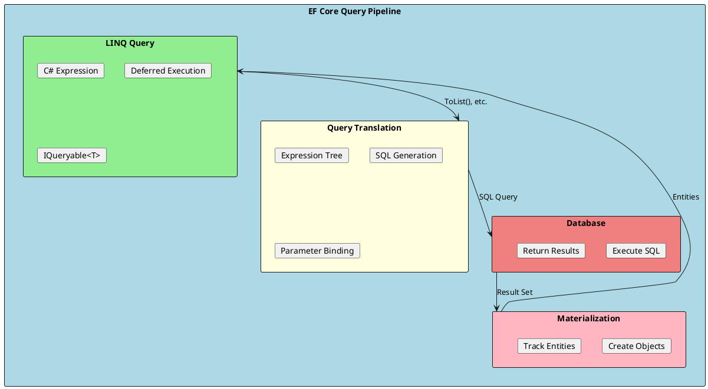
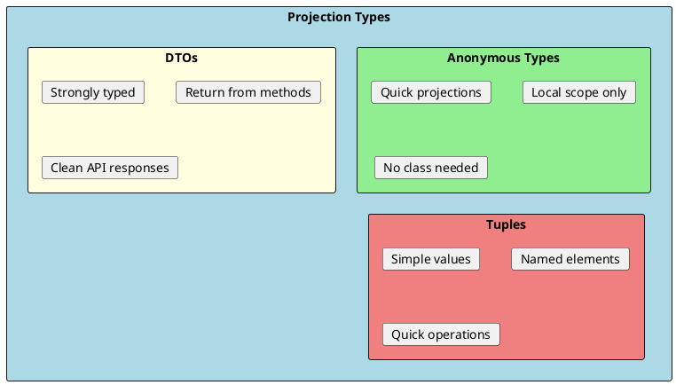
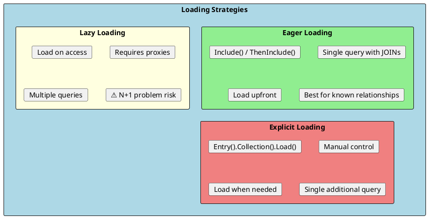

# Querying Data

EF Core translates LINQ queries into SQL, providing a type-safe way to query databases. Understanding query patterns, loading strategies, and optimization techniques is essential for efficient data access.



## Basic LINQ Queries

EF Core supports standard LINQ operations that translate to SQL.

```csharp
public class ProductRepository
{
    private readonly ApplicationDbContext _context;

    public ProductRepository(ApplicationDbContext context)
    {
        _context = context;
    }

    // Simple query - SELECT * FROM Products
    public async Task<List<Product>> GetAllAsync()
    {
        return await _context.Products.ToListAsync();
    }

    // Filter - WHERE clause
    public async Task<List<Product>> GetActiveProductsAsync()
    {
        return await _context.Products
            .Where(p => p.IsActive)
            .ToListAsync();
    }

    // Multiple conditions
    public async Task<List<Product>> GetProductsInPriceRangeAsync(decimal min, decimal max)
    {
        return await _context.Products
            .Where(p => p.Price >= min && p.Price <= max)
            .Where(p => p.IsActive)  // Can chain multiple Where
            .ToListAsync();
    }

    // Ordering
    public async Task<List<Product>> GetProductsOrderedAsync()
    {
        return await _context.Products
            .OrderBy(p => p.Name)
            .ThenByDescending(p => p.Price)
            .ToListAsync();
    }

    // Pagination
    public async Task<List<Product>> GetPagedProductsAsync(int page, int pageSize)
    {
        return await _context.Products
            .OrderBy(p => p.Id)
            .Skip((page - 1) * pageSize)
            .Take(pageSize)
            .ToListAsync();
    }

    // Single entity
    public async Task<Product?> GetByIdAsync(int id)
    {
        return await _context.Products
            .FirstOrDefaultAsync(p => p.Id == id);
    }

    // Find by primary key (uses cache first)
    public async Task<Product?> FindByIdAsync(int id)
    {
        return await _context.Products.FindAsync(id);
    }

    // Check existence
    public async Task<bool> ExistsAsync(int id)
    {
        return await _context.Products.AnyAsync(p => p.Id == id);
    }

    // Count
    public async Task<int> GetActiveCountAsync()
    {
        return await _context.Products.CountAsync(p => p.IsActive);
    }
}
```

### Query Methods Comparison

| Method | Returns | When Empty | Notes |
|--------|---------|------------|-------|
| `First()` | Single item | Throws | Returns first match |
| `FirstOrDefault()` | Single or null | Returns null | Safe for empty |
| `Single()` | Single item | Throws | Exactly one expected |
| `SingleOrDefault()` | Single or null | Returns null | Zero or one expected |
| `Find()` | Single or null | Returns null | Uses cache first |
| `Any()` | bool | false | Checks existence |
| `Count()` | int | 0 | Counts matches |

---

## Projections (Select)

Projections transform entities into different shapes, often improving performance by selecting only needed columns.



```csharp
// ✅ Project to DTO - only fetches needed columns
public async Task<List<ProductDto>> GetProductDtosAsync()
{
    return await _context.Products
        .Select(p => new ProductDto
        {
            Id = p.Id,
            Name = p.Name,
            Price = p.Price,
            CategoryName = p.Category.Name  // Includes related data
        })
        .ToListAsync();
}

// Anonymous type projection
public async Task<object> GetProductSummaryAsync(int id)
{
    return await _context.Products
        .Where(p => p.Id == id)
        .Select(p => new
        {
            p.Name,
            p.Price,
            Category = p.Category.Name,
            OrderCount = p.OrderItems.Count
        })
        .FirstOrDefaultAsync();
}

// Tuple projection
public async Task<(int Id, string Name, decimal Price)> GetProductTupleAsync(int id)
{
    return await _context.Products
        .Where(p => p.Id == id)
        .Select(p => new ValueTuple<int, string, decimal>(p.Id, p.Name, p.Price))
        .FirstOrDefaultAsync();
}

// Projection with calculation
public async Task<List<ProductWithTotalDto>> GetProductsWithTotalValueAsync()
{
    return await _context.Products
        .Select(p => new ProductWithTotalDto
        {
            Id = p.Id,
            Name = p.Name,
            Price = p.Price,
            Stock = p.Stock,
            TotalValue = p.Price * p.Stock  // Computed in SQL
        })
        .ToListAsync();
}

// Conditional projection
public async Task<List<ProductDto>> GetProductsWithDiscountAsync()
{
    return await _context.Products
        .Select(p => new ProductDto
        {
            Id = p.Id,
            Name = p.Name,
            Price = p.Price,
            DiscountedPrice = p.Stock > 100 ? p.Price * 0.9m : p.Price
        })
        .ToListAsync();
}
```

---

## Loading Related Data

EF Core offers three strategies for loading related data: Eager, Lazy, and Explicit loading.



### Eager Loading

```csharp
// Include single navigation
public async Task<List<Product>> GetProductsWithCategoryAsync()
{
    return await _context.Products
        .Include(p => p.Category)
        .ToListAsync();
}

// Include collection
public async Task<List<Category>> GetCategoriesWithProductsAsync()
{
    return await _context.Categories
        .Include(c => c.Products)
        .ToListAsync();
}

// Nested includes - ThenInclude
public async Task<List<Order>> GetOrdersWithDetailsAsync()
{
    return await _context.Orders
        .Include(o => o.Customer)
        .Include(o => o.Items)
            .ThenInclude(i => i.Product)
                .ThenInclude(p => p.Category)
        .ToListAsync();
}

// Multiple includes
public async Task<Product?> GetProductWithAllRelationsAsync(int id)
{
    return await _context.Products
        .Include(p => p.Category)
        .Include(p => p.OrderItems)
            .ThenInclude(oi => oi.Order)
                .ThenInclude(o => o.Customer)
        .FirstOrDefaultAsync(p => p.Id == id);
}

// Filtered include (.NET 5+)
public async Task<List<Category>> GetCategoriesWithActiveProductsAsync()
{
    return await _context.Categories
        .Include(c => c.Products.Where(p => p.IsActive))
        .ToListAsync();
}

// Include with ordering
public async Task<Category?> GetCategoryWithOrderedProductsAsync(int id)
{
    return await _context.Categories
        .Include(c => c.Products.OrderBy(p => p.Name))
        .FirstOrDefaultAsync(c => c.Id == id);
}
```

### Lazy Loading

```csharp
// Enable lazy loading
// 1. Install Microsoft.EntityFrameworkCore.Proxies

// 2. Configure in DbContext
builder.Services.AddDbContext<ApplicationDbContext>(options =>
    options
        .UseLazyLoadingProxies()
        .UseSqlServer(connectionString));

// 3. Make navigation properties virtual
public class Product
{
    public int Id { get; set; }
    public string Name { get; set; } = string.Empty;

    public int CategoryId { get; set; }
    public virtual Category Category { get; set; } = null!;  // virtual required

    public virtual ICollection<OrderItem> OrderItems { get; set; } = new List<OrderItem>();
}

// Usage - triggers query on access
public void ProcessProduct(Product product)
{
    // This triggers a database query if Category not loaded
    Console.WriteLine(product.Category.Name);
}

// ⚠️ Lazy loading can cause N+1 problem
public void BadExample()
{
    var products = _context.Products.ToList();  // 1 query

    foreach (var product in products)
    {
        // Each access triggers a query! (N queries)
        Console.WriteLine(product.Category.Name);
    }
    // Total: N+1 queries!
}
```

### Explicit Loading

```csharp
public async Task<Product?> GetProductAndLoadCategoryAsync(int id)
{
    var product = await _context.Products.FindAsync(id);

    if (product != null)
    {
        // Explicitly load the category
        await _context.Entry(product)
            .Reference(p => p.Category)
            .LoadAsync();
    }

    return product;
}

public async Task<Category?> GetCategoryAndLoadProductsAsync(int id)
{
    var category = await _context.Categories.FindAsync(id);

    if (category != null)
    {
        // Explicitly load the collection
        await _context.Entry(category)
            .Collection(c => c.Products)
            .LoadAsync();
    }

    return category;
}

// Check if loaded
public async Task LoadIfNeededAsync(Product product)
{
    var entry = _context.Entry(product);

    if (!entry.Reference(p => p.Category).IsLoaded)
    {
        await entry.Reference(p => p.Category).LoadAsync();
    }
}

// Explicit load with filter
public async Task LoadActiveProductsAsync(Category category)
{
    await _context.Entry(category)
        .Collection(c => c.Products)
        .Query()
        .Where(p => p.IsActive)
        .LoadAsync();
}
```

---

## Grouping and Aggregates

```csharp
// Group by with count
public async Task<List<CategoryProductCount>> GetProductCountByCategoryAsync()
{
    return await _context.Products
        .GroupBy(p => p.Category.Name)
        .Select(g => new CategoryProductCount
        {
            CategoryName = g.Key,
            ProductCount = g.Count(),
            AveragePrice = g.Average(p => p.Price),
            TotalStock = g.Sum(p => p.Stock)
        })
        .ToListAsync();
}

// Complex grouping
public async Task<List<MonthlySalesReport>> GetMonthlySalesAsync(int year)
{
    return await _context.Orders
        .Where(o => o.OrderDate.Year == year)
        .GroupBy(o => new { o.OrderDate.Year, o.OrderDate.Month })
        .Select(g => new MonthlySalesReport
        {
            Year = g.Key.Year,
            Month = g.Key.Month,
            OrderCount = g.Count(),
            TotalAmount = g.Sum(o => o.Items.Sum(i => i.Quantity * i.UnitPrice))
        })
        .OrderBy(r => r.Month)
        .ToListAsync();
}

// Aggregate functions
public async Task<ProductStatistics> GetProductStatisticsAsync()
{
    return await _context.Products
        .GroupBy(p => 1)  // Group all
        .Select(g => new ProductStatistics
        {
            TotalProducts = g.Count(),
            AveragePrice = g.Average(p => p.Price),
            MinPrice = g.Min(p => p.Price),
            MaxPrice = g.Max(p => p.Price),
            TotalValue = g.Sum(p => p.Price * p.Stock)
        })
        .FirstOrDefaultAsync() ?? new ProductStatistics();
}
```

---

## Raw SQL Queries

Sometimes raw SQL is needed for complex queries or performance.

```csharp
// Raw SQL for entities (tracked)
public async Task<List<Product>> GetProductsWithRawSqlAsync(decimal minPrice)
{
    return await _context.Products
        .FromSqlRaw("SELECT * FROM Products WHERE Price > {0}", minPrice)
        .ToListAsync();
}

// Parameterized query (safer)
public async Task<List<Product>> GetProductsByCategoryRawAsync(string categoryName)
{
    return await _context.Products
        .FromSqlInterpolated($"SELECT * FROM Products WHERE CategoryId IN (SELECT Id FROM Categories WHERE Name = {categoryName})")
        .ToListAsync();
}

// Combine with LINQ
public async Task<List<Product>> GetProductsWithRawAndLinqAsync(decimal minPrice)
{
    return await _context.Products
        .FromSqlRaw("SELECT * FROM Products WHERE Price > {0}", minPrice)
        .Where(p => p.IsActive)  // Additional LINQ filter
        .OrderBy(p => p.Name)
        .ToListAsync();
}

// Raw SQL for non-entity types (keyless entities)
[Keyless]
public class ProductSalesView
{
    public int ProductId { get; set; }
    public string ProductName { get; set; } = string.Empty;
    public int TotalQuantitySold { get; set; }
    public decimal TotalRevenue { get; set; }
}

// Register in DbContext
public DbSet<ProductSalesView> ProductSalesViews => Set<ProductSalesView>();

// OnModelCreating
modelBuilder.Entity<ProductSalesView>()
    .HasNoKey()
    .ToView("vw_ProductSales");

// Query
public async Task<List<ProductSalesView>> GetProductSalesAsync()
{
    return await _context.ProductSalesViews
        .FromSqlRaw(@"
            SELECT
                p.Id AS ProductId,
                p.Name AS ProductName,
                SUM(oi.Quantity) AS TotalQuantitySold,
                SUM(oi.Quantity * oi.UnitPrice) AS TotalRevenue
            FROM Products p
            JOIN OrderItems oi ON p.Id = oi.ProductId
            GROUP BY p.Id, p.Name")
        .ToListAsync();
}

// Execute non-query (INSERT, UPDATE, DELETE)
public async Task<int> UpdatePricesAsync(decimal percentage)
{
    return await _context.Database
        .ExecuteSqlRawAsync(
            "UPDATE Products SET Price = Price * {0}",
            1 + (percentage / 100));
}
```

---

## No-Tracking Queries

Disable change tracking for read-only scenarios to improve performance.

```csharp
// Single query no-tracking
public async Task<List<Product>> GetProductsNoTrackingAsync()
{
    return await _context.Products
        .AsNoTracking()
        .ToListAsync();
}

// Default to no-tracking for DbContext
public class ReadOnlyDbContext : DbContext
{
    public ReadOnlyDbContext(DbContextOptions<ReadOnlyDbContext> options)
        : base(options)
    {
        ChangeTracker.QueryTrackingBehavior = QueryTrackingBehavior.NoTracking;
    }
}

// Or configure per context instance
var products = await _context.Products
    .AsNoTracking()
    .Include(p => p.Category)
    .ToListAsync();

// No tracking with identity resolution (avoids duplicates)
var orders = await _context.Orders
    .AsNoTrackingWithIdentityResolution()
    .Include(o => o.Items)
    .ToListAsync();
```

---

## Split Queries

Split large Include queries into multiple queries to avoid cartesian explosion.

```csharp
// Single query (default) - can create cartesian explosion
var orders = await _context.Orders
    .Include(o => o.Items)
    .Include(o => o.Customer)
    .ToListAsync();

// Split into multiple queries
var orders = await _context.Orders
    .Include(o => o.Items)
    .Include(o => o.Customer)
    .AsSplitQuery()
    .ToListAsync();

// Configure as default
builder.Services.AddDbContext<ApplicationDbContext>(options =>
    options.UseSqlServer(connectionString, o =>
        o.UseQuerySplittingBehavior(QuerySplittingBehavior.SplitQuery)));
```

---

## Interview Questions & Answers

### Q1: What is the difference between IQueryable and IEnumerable?

**Answer**:
- **IQueryable**: Builds expression tree, translated to SQL, executed on database. Deferred execution, efficient filtering.
- **IEnumerable**: Loads all data to memory first, then filters in C#. Inefficient for large datasets.

Always use `IQueryable` for database queries and only materialize (`ToList()`) when needed.

### Q2: What is the N+1 query problem?

**Answer**: Loading related data in a loop causes N+1 queries:
- 1 query to load entities
- N queries to load related data (one per entity)

**Solution**: Use eager loading (`Include()`) to load related data in one query.

### Q3: What is the difference between Eager, Lazy, and Explicit loading?

**Answer**:
- **Eager**: `Include()` - loads related data immediately in same query
- **Lazy**: Loads on property access (requires proxies) - N+1 risk
- **Explicit**: `Entry().Collection().Load()` - manual loading when needed

Eager loading is preferred for predictable, efficient queries.

### Q4: When should you use AsNoTracking()?

**Answer**: Use `AsNoTracking()` when:
- Reading data without modifying it
- API responses that won't be updated
- Large datasets for display only

Benefits: Better performance, reduced memory usage, no change tracking overhead.

### Q5: What is a projection and why use it?

**Answer**: Projection (`Select()`) transforms entities to different shapes:
- Fetches only needed columns
- Reduces data transfer
- Improves query performance
- Creates DTOs for API responses

### Q6: What is AsSplitQuery() and when to use it?

**Answer**: `AsSplitQuery()` executes multiple queries instead of JOINs. Use when:
- Multiple collection includes cause cartesian explosion
- Data duplication in JOINs wastes bandwidth
- Individual queries are more efficient

Trade-off: Multiple roundtrips vs data duplication.

