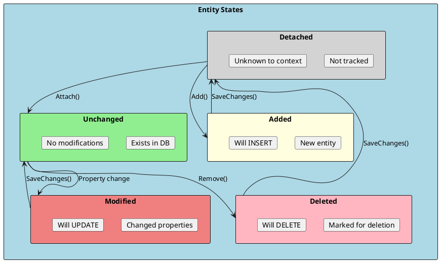
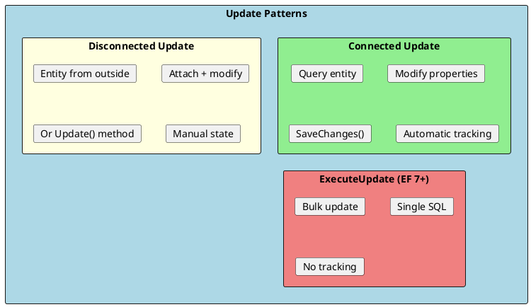
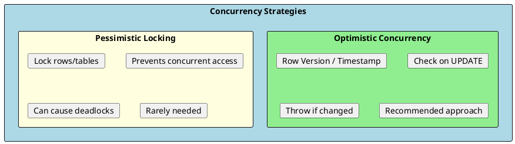

# Change Tracking

Change tracking is the mechanism EF Core uses to detect modifications to entities and generate appropriate SQL commands. Understanding change tracking is essential for efficient data manipulation and avoiding common pitfalls.



## Entity States

Every entity tracked by DbContext has a state that determines what happens on SaveChanges.

```csharp
public class EntityStateExamples
{
    private readonly ApplicationDbContext _context;

    public EntityStateExamples(ApplicationDbContext context)
    {
        _context = context;
    }

    public void DemonstrateStates()
    {
        // Detached - not tracked
        var newProduct = new Product { Name = "New Product", Price = 10m };
        var state = _context.Entry(newProduct).State;  // Detached

        // Added - will INSERT
        _context.Products.Add(newProduct);
        state = _context.Entry(newProduct).State;  // Added

        // After SaveChanges - Unchanged
        _context.SaveChanges();
        state = _context.Entry(newProduct).State;  // Unchanged

        // Modified - will UPDATE
        newProduct.Price = 20m;
        state = _context.Entry(newProduct).State;  // Modified

        // Deleted - will DELETE
        _context.Products.Remove(newProduct);
        state = _context.Entry(newProduct).State;  // Deleted
    }

    public async Task ShowEntityStatesAsync()
    {
        // Query returns tracked entities (Unchanged state)
        var product = await _context.Products.FirstAsync();
        Console.WriteLine(_context.Entry(product).State);  // Unchanged

        // Modify tracked entity
        product.Price += 5;
        Console.WriteLine(_context.Entry(product).State);  // Modified

        // Check what properties changed
        var entry = _context.Entry(product);
        foreach (var prop in entry.Properties.Where(p => p.IsModified))
        {
            Console.WriteLine($"{prop.Metadata.Name}: {prop.OriginalValue} → {prop.CurrentValue}");
        }
    }
}
```

### Entity State Summary

| State | SaveChanges Action | When |
|-------|-------------------|------|
| **Detached** | Ignored | Not tracked by context |
| **Unchanged** | Nothing | Queried, no changes |
| **Added** | INSERT | New entity added |
| **Modified** | UPDATE | Property changed |
| **Deleted** | DELETE | Removed from DbSet |

---

## Adding Entities

```csharp
public class AddingEntities
{
    private readonly ApplicationDbContext _context;

    // Add single entity
    public async Task<Product> AddProductAsync(CreateProductDto dto)
    {
        var product = new Product
        {
            Name = dto.Name,
            Price = dto.Price,
            CategoryId = dto.CategoryId
        };

        // Add to DbSet
        _context.Products.Add(product);

        // Or add via context
        _context.Add(product);

        await _context.SaveChangesAsync();

        return product;  // Id is now populated
    }

    // Add multiple entities
    public async Task AddProductsAsync(List<CreateProductDto> dtos)
    {
        var products = dtos.Select(dto => new Product
        {
            Name = dto.Name,
            Price = dto.Price
        });

        _context.Products.AddRange(products);

        await _context.SaveChangesAsync();
    }

    // Add with related entities
    public async Task<Category> AddCategoryWithProductsAsync()
    {
        var category = new Category
        {
            Name = "Electronics",
            Products = new List<Product>
            {
                new Product { Name = "Phone", Price = 999 },
                new Product { Name = "Laptop", Price = 1499 }
            }
        };

        _context.Categories.Add(category);
        await _context.SaveChangesAsync();

        // All entities are inserted in correct order
        return category;
    }

    // Attach existing entity (set state to Unchanged)
    public void AttachExistingEntity(Product product)
    {
        // Product exists in DB but is detached
        _context.Products.Attach(product);
        // State is now Unchanged
    }
}
```

---

## Updating Entities



### Connected Scenario (Same Context)

```csharp
public async Task UpdateProductConnectedAsync(int id, UpdateProductDto dto)
{
    // 1. Query the entity (tracked, Unchanged state)
    var product = await _context.Products.FindAsync(id);
    if (product == null) throw new NotFoundException();

    // 2. Modify properties (state becomes Modified)
    product.Name = dto.Name;
    product.Price = dto.Price;

    // 3. Save (generates UPDATE for changed properties only)
    await _context.SaveChangesAsync();
}
```

### Disconnected Scenario (Different Context)

```csharp
public async Task UpdateProductDisconnectedAsync(Product product)
{
    // Method 1: Attach and mark as modified
    _context.Products.Attach(product);
    _context.Entry(product).State = EntityState.Modified;

    // Method 2: Use Update (marks entire entity as modified)
    _context.Products.Update(product);

    // Method 3: Attach and modify specific properties
    _context.Products.Attach(product);
    _context.Entry(product).Property(p => p.Name).IsModified = true;
    _context.Entry(product).Property(p => p.Price).IsModified = true;

    await _context.SaveChangesAsync();
}

// Best practice: Query then update
public async Task UpdateProductBestPracticeAsync(int id, UpdateProductDto dto)
{
    var product = await _context.Products.FindAsync(id);
    if (product == null) throw new NotFoundException();

    // Map only changed properties
    product.Name = dto.Name;
    product.Price = dto.Price;
    // Properties not set remain unchanged

    await _context.SaveChangesAsync();
}
```

### ExecuteUpdate (EF Core 7+)

```csharp
// Bulk update without loading entities
public async Task<int> IncreaseAllPricesAsync(decimal percentage)
{
    return await _context.Products
        .Where(p => p.IsActive)
        .ExecuteUpdateAsync(setters => setters
            .SetProperty(p => p.Price, p => p.Price * (1 + percentage / 100))
            .SetProperty(p => p.UpdatedAt, DateTime.UtcNow));
}

// Conditional update
public async Task<int> DeactivateOldProductsAsync()
{
    var cutoffDate = DateTime.UtcNow.AddYears(-1);

    return await _context.Products
        .Where(p => p.CreatedAt < cutoffDate && p.Stock == 0)
        .ExecuteUpdateAsync(setters => setters
            .SetProperty(p => p.IsActive, false));
}
```

---

## Deleting Entities

```csharp
public class DeletingEntities
{
    private readonly ApplicationDbContext _context;

    // Delete tracked entity
    public async Task DeleteProductAsync(int id)
    {
        var product = await _context.Products.FindAsync(id);
        if (product == null) return;

        _context.Products.Remove(product);
        await _context.SaveChangesAsync();
    }

    // Delete without loading (create stub entity)
    public async Task DeleteProductByIdAsync(int id)
    {
        var product = new Product { Id = id };
        _context.Products.Attach(product);
        _context.Products.Remove(product);

        await _context.SaveChangesAsync();
    }

    // Bulk delete (EF Core 7+)
    public async Task<int> DeleteInactiveProductsAsync()
    {
        return await _context.Products
            .Where(p => !p.IsActive && p.Stock == 0)
            .ExecuteDeleteAsync();
    }

    // Soft delete
    public async Task SoftDeleteProductAsync(int id)
    {
        var product = await _context.Products.FindAsync(id);
        if (product == null) return;

        product.IsDeleted = true;
        product.DeletedAt = DateTime.UtcNow;

        await _context.SaveChangesAsync();
    }
}
```

---

## Change Tracker API

```csharp
public class ChangeTrackerExamples
{
    private readonly ApplicationDbContext _context;

    // Get all tracked entities
    public void ShowTrackedEntities()
    {
        foreach (var entry in _context.ChangeTracker.Entries())
        {
            Console.WriteLine($"Entity: {entry.Entity.GetType().Name}, State: {entry.State}");
        }
    }

    // Get entities by state
    public List<Product> GetModifiedProducts()
    {
        return _context.ChangeTracker
            .Entries<Product>()
            .Where(e => e.State == EntityState.Modified)
            .Select(e => e.Entity)
            .ToList();
    }

    // Detect changes manually
    public void DetectChanges()
    {
        // EF Core auto-detects in most cases, but can force
        _context.ChangeTracker.DetectChanges();
    }

    // Get original and current values
    public void ShowPropertyChanges(Product product)
    {
        var entry = _context.Entry(product);

        foreach (var prop in entry.Properties)
        {
            if (prop.IsModified)
            {
                Console.WriteLine(
                    $"{prop.Metadata.Name}: {prop.OriginalValue} → {prop.CurrentValue}");
            }
        }
    }

    // Reset changes
    public void DiscardChanges()
    {
        foreach (var entry in _context.ChangeTracker.Entries())
        {
            switch (entry.State)
            {
                case EntityState.Modified:
                    entry.CurrentValues.SetValues(entry.OriginalValues);
                    entry.State = EntityState.Unchanged;
                    break;
                case EntityState.Added:
                    entry.State = EntityState.Detached;
                    break;
                case EntityState.Deleted:
                    entry.State = EntityState.Unchanged;
                    break;
            }
        }
    }

    // Clear all tracked entities
    public void ClearTracker()
    {
        _context.ChangeTracker.Clear();
    }
}
```

---

## Concurrency Control

Handle concurrent updates to prevent data loss.



### Optimistic Concurrency with Row Version

```csharp
public class Product
{
    public int Id { get; set; }
    public string Name { get; set; } = string.Empty;
    public decimal Price { get; set; }

    // Concurrency token - auto-updated by database
    [Timestamp]
    public byte[] RowVersion { get; set; } = null!;
}

// Fluent API configuration
modelBuilder.Entity<Product>()
    .Property(p => p.RowVersion)
    .IsRowVersion();

// Handling concurrency conflicts
public async Task UpdateProductWithConcurrencyAsync(int id, UpdateProductDto dto)
{
    var product = await _context.Products.FindAsync(id);
    if (product == null) throw new NotFoundException();

    product.Name = dto.Name;
    product.Price = dto.Price;

    try
    {
        await _context.SaveChangesAsync();
    }
    catch (DbUpdateConcurrencyException ex)
    {
        var entry = ex.Entries.Single();

        // Option 1: Database wins - reload from database
        await entry.ReloadAsync();
        // Retry or inform user

        // Option 2: Client wins - overwrite with current values
        var dbValues = await entry.GetDatabaseValuesAsync();
        if (dbValues == null)
        {
            throw new NotFoundException("Entity was deleted");
        }
        entry.OriginalValues.SetValues(dbValues);
        await _context.SaveChangesAsync();

        // Option 3: Merge - custom logic
        var dbProduct = (Product)dbValues.ToObject();
        // Compare and merge values...
    }
}
```

### Concurrency Token on Specific Property

```csharp
public class Account
{
    public int Id { get; set; }
    public string Name { get; set; } = string.Empty;

    // Concurrency token on specific property
    [ConcurrencyCheck]
    public decimal Balance { get; set; }
}

// Fluent API
modelBuilder.Entity<Account>()
    .Property(a => a.Balance)
    .IsConcurrencyToken();
```

---

## Transactions

```csharp
public class TransactionExamples
{
    private readonly ApplicationDbContext _context;

    // Implicit transaction (SaveChanges)
    public async Task ImplicitTransactionAsync()
    {
        _context.Products.Add(new Product { Name = "Product 1" });
        _context.Products.Add(new Product { Name = "Product 2" });

        // All changes saved in a single transaction
        await _context.SaveChangesAsync();
    }

    // Explicit transaction
    public async Task ExplicitTransactionAsync()
    {
        using var transaction = await _context.Database.BeginTransactionAsync();

        try
        {
            // First operation
            var category = new Category { Name = "New Category" };
            _context.Categories.Add(category);
            await _context.SaveChangesAsync();

            // Second operation using first result
            var product = new Product
            {
                Name = "New Product",
                CategoryId = category.Id
            };
            _context.Products.Add(product);
            await _context.SaveChangesAsync();

            // Commit if all successful
            await transaction.CommitAsync();
        }
        catch
        {
            // Rollback on any error
            await transaction.RollbackAsync();
            throw;
        }
    }

    // Transaction with savepoint
    public async Task TransactionWithSavepointAsync()
    {
        using var transaction = await _context.Database.BeginTransactionAsync();

        try
        {
            _context.Products.Add(new Product { Name = "Product 1" });
            await _context.SaveChangesAsync();

            // Create savepoint
            await transaction.CreateSavepointAsync("AfterProduct1");

            try
            {
                _context.Products.Add(new Product { Name = "Product 2" });
                await _context.SaveChangesAsync();
            }
            catch
            {
                // Rollback to savepoint
                await transaction.RollbackToSavepointAsync("AfterProduct1");
            }

            await transaction.CommitAsync();
        }
        catch
        {
            await transaction.RollbackAsync();
            throw;
        }
    }
}
```

---

## Auditing with Change Tracker

```csharp
public interface IAuditable
{
    DateTime CreatedAt { get; set; }
    string? CreatedBy { get; set; }
    DateTime? UpdatedAt { get; set; }
    string? UpdatedBy { get; set; }
}

public class ApplicationDbContext : DbContext
{
    private readonly ICurrentUser _currentUser;

    public ApplicationDbContext(
        DbContextOptions<ApplicationDbContext> options,
        ICurrentUser currentUser) : base(options)
    {
        _currentUser = currentUser;
    }

    public override async Task<int> SaveChangesAsync(CancellationToken cancellationToken = default)
    {
        ApplyAuditInfo();
        return await base.SaveChangesAsync(cancellationToken);
    }

    private void ApplyAuditInfo()
    {
        var entries = ChangeTracker.Entries<IAuditable>();

        foreach (var entry in entries)
        {
            switch (entry.State)
            {
                case EntityState.Added:
                    entry.Entity.CreatedAt = DateTime.UtcNow;
                    entry.Entity.CreatedBy = _currentUser.Username;
                    break;

                case EntityState.Modified:
                    entry.Entity.UpdatedAt = DateTime.UtcNow;
                    entry.Entity.UpdatedBy = _currentUser.Username;
                    // Don't overwrite CreatedAt/CreatedBy
                    entry.Property(e => e.CreatedAt).IsModified = false;
                    entry.Property(e => e.CreatedBy).IsModified = false;
                    break;
            }
        }
    }
}
```

---

## Interview Questions & Answers

### Q1: What are the entity states in EF Core?

**Answer**: Five states:
- **Detached**: Not tracked
- **Unchanged**: Tracked, no changes (from query)
- **Added**: New entity, will INSERT
- **Modified**: Changed properties, will UPDATE
- **Deleted**: Marked for deletion, will DELETE

### Q2: What is the difference between Add() and Attach()?

**Answer**:
- **Add()**: Sets state to Added. Entity will be INSERTed.
- **Attach()**: Sets state to Unchanged. Entity exists in DB, just start tracking.

Use `Attach()` when you have an existing entity from outside the context.

### Q3: How does EF Core detect changes?

**Answer**: EF Core uses snapshot change detection:
1. Original values stored when entity is queried
2. `DetectChanges()` compares current vs original
3. Modified properties flagged for UPDATE

Called automatically before SaveChanges, queries, etc.

### Q4: How do you handle optimistic concurrency?

**Answer**: Use a concurrency token (RowVersion):
1. Add `[Timestamp]` property or configure `IsRowVersion()`
2. EF includes token in WHERE clause of UPDATE
3. If rows affected = 0, `DbUpdateConcurrencyException` thrown
4. Handle by reloading, merging, or notifying user

### Q5: What is ExecuteUpdate and when to use it?

**Answer**: `ExecuteUpdate()` (EF 7+) performs bulk updates directly in SQL:
- Doesn't load entities
- Single SQL statement
- No change tracking
- Returns affected row count

Use for bulk updates where you don't need entity tracking.

### Q6: How does SaveChanges handle transactions?

**Answer**: `SaveChanges()` wraps all operations in a transaction:
- All changes saved together
- If any fails, all roll back
- Atomic operation

For multiple SaveChanges in one transaction, use explicit `BeginTransactionAsync()`.

