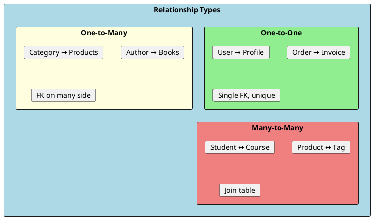
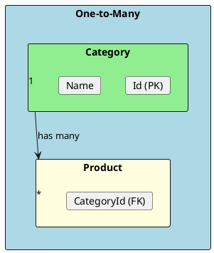
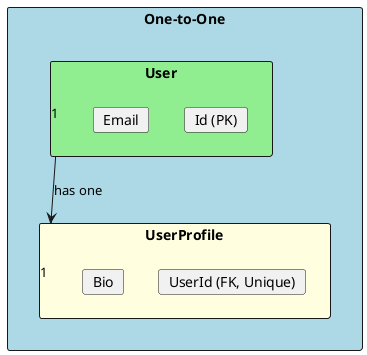
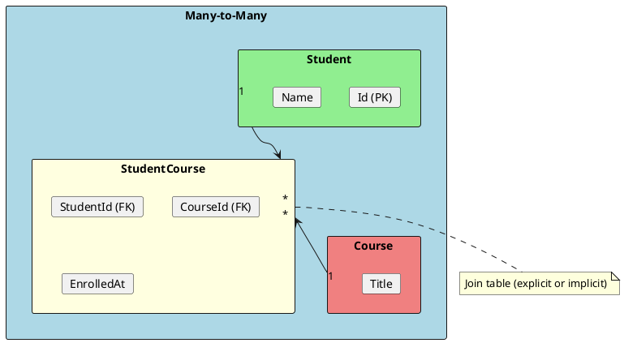
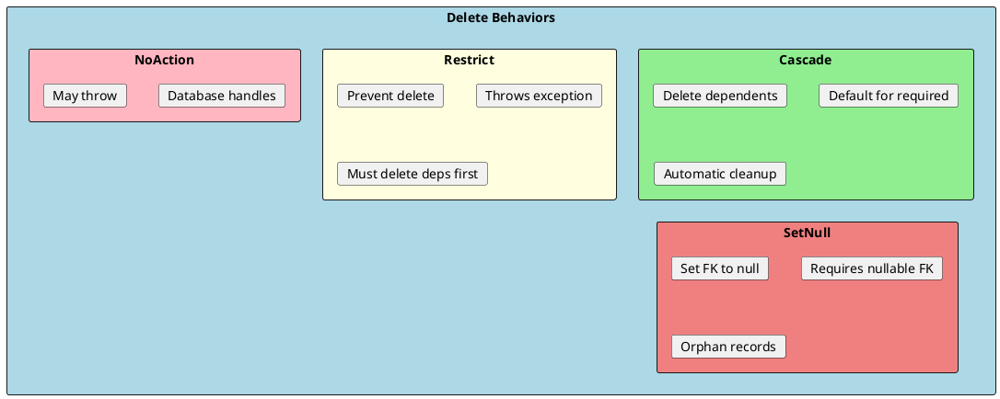

# Relationships

Entity relationships define how data entities are connected to each other. EF Core supports one-to-one, one-to-many, and many-to-many relationships, with various configuration options for navigation properties and foreign keys.



## One-to-Many Relationships

The most common relationship type. One entity has a collection of related entities.



### Convention-Based Configuration

```csharp
// One side (principal)
public class Category
{
    public int Id { get; set; }
    public string Name { get; set; } = string.Empty;

    // Collection navigation property
    public List<Product> Products { get; set; } = new();
}

// Many side (dependent)
public class Product
{
    public int Id { get; set; }
    public string Name { get; set; } = string.Empty;

    // Foreign key property (convention: <NavigationPropertyName>Id)
    public int CategoryId { get; set; }

    // Reference navigation property
    public Category Category { get; set; } = null!;
}

// EF Core infers the relationship from:
// 1. Navigation properties (Category, Products)
// 2. Foreign key property (CategoryId)
```

### Fluent API Configuration

```csharp
protected override void OnModelCreating(ModelBuilder modelBuilder)
{
    // Basic configuration
    modelBuilder.Entity<Product>()
        .HasOne(p => p.Category)
        .WithMany(c => c.Products)
        .HasForeignKey(p => p.CategoryId);

    // With delete behavior
    modelBuilder.Entity<Product>()
        .HasOne(p => p.Category)
        .WithMany(c => c.Products)
        .HasForeignKey(p => p.CategoryId)
        .OnDelete(DeleteBehavior.Restrict);  // Don't cascade delete

    // Required relationship (non-nullable FK)
    modelBuilder.Entity<Product>()
        .HasOne(p => p.Category)
        .WithMany(c => c.Products)
        .HasForeignKey(p => p.CategoryId)
        .IsRequired();

    // Optional relationship (nullable FK)
    modelBuilder.Entity<Product>()
        .HasOne(p => p.Category)
        .WithMany(c => c.Products)
        .HasForeignKey(p => p.CategoryId)
        .IsRequired(false);
}
```

### One-to-Many Without Navigation on One Side

```csharp
// Parent without collection
public class Category
{
    public int Id { get; set; }
    public string Name { get; set; } = string.Empty;
    // No Products collection
}

public class Product
{
    public int Id { get; set; }
    public string Name { get; set; } = string.Empty;
    public int CategoryId { get; set; }
    public Category Category { get; set; } = null!;
}

// Configuration
modelBuilder.Entity<Product>()
    .HasOne(p => p.Category)
    .WithMany()  // No collection on Category
    .HasForeignKey(p => p.CategoryId);
```

---

## One-to-One Relationships

One entity is associated with exactly one other entity.



### One-to-One Configuration

```csharp
// Principal entity
public class User
{
    public int Id { get; set; }
    public string Email { get; set; } = string.Empty;

    // Navigation to dependent
    public UserProfile? Profile { get; set; }
}

// Dependent entity
public class UserProfile
{
    public int Id { get; set; }
    public string? Bio { get; set; }
    public string? AvatarUrl { get; set; }

    // Foreign key
    public int UserId { get; set; }

    // Navigation to principal
    public User User { get; set; } = null!;
}

// Fluent API configuration
modelBuilder.Entity<User>()
    .HasOne(u => u.Profile)
    .WithOne(p => p.User)
    .HasForeignKey<UserProfile>(p => p.UserId);

// With unique index to enforce one-to-one
modelBuilder.Entity<UserProfile>()
    .HasIndex(p => p.UserId)
    .IsUnique();
```

### Shared Primary Key (More efficient)

```csharp
public class User
{
    public int Id { get; set; }
    public string Email { get; set; } = string.Empty;
    public UserProfile? Profile { get; set; }
}

public class UserProfile
{
    public int Id { get; set; }  // Same as User.Id
    public string? Bio { get; set; }
    public User User { get; set; } = null!;
}

// Configuration - use same PK
modelBuilder.Entity<User>()
    .HasOne(u => u.Profile)
    .WithOne(p => p.User)
    .HasForeignKey<UserProfile>(p => p.Id);  // PK is also FK
```

---

## Many-to-Many Relationships

Two entities where each can be associated with multiple instances of the other.



### Simple Many-to-Many (Skip Navigation)

```csharp
// .NET 5+ supports many-to-many without explicit join entity
public class Student
{
    public int Id { get; set; }
    public string Name { get; set; } = string.Empty;

    // Skip navigation - directly to courses
    public List<Course> Courses { get; set; } = new();
}

public class Course
{
    public int Id { get; set; }
    public string Title { get; set; } = string.Empty;

    // Skip navigation - directly to students
    public List<Student> Students { get; set; } = new();
}

// EF Core creates join table automatically
// Table: StudentCourse with StudentId and CourseId columns

// Configuration (optional)
modelBuilder.Entity<Student>()
    .HasMany(s => s.Courses)
    .WithMany(c => c.Students)
    .UsingEntity(j => j.ToTable("Enrollments"));
```

### Many-to-Many with Payload (Explicit Join Entity)

```csharp
// When you need additional data on the relationship
public class Student
{
    public int Id { get; set; }
    public string Name { get; set; } = string.Empty;
    public List<Enrollment> Enrollments { get; set; } = new();
}

public class Course
{
    public int Id { get; set; }
    public string Title { get; set; } = string.Empty;
    public List<Enrollment> Enrollments { get; set; } = new();
}

// Explicit join entity with payload
public class Enrollment
{
    public int StudentId { get; set; }
    public Student Student { get; set; } = null!;

    public int CourseId { get; set; }
    public Course Course { get; set; } = null!;

    // Additional data (payload)
    public DateTime EnrolledAt { get; set; }
    public decimal? Grade { get; set; }
    public bool IsActive { get; set; }
}

// Configuration
modelBuilder.Entity<Enrollment>()
    .HasKey(e => new { e.StudentId, e.CourseId });  // Composite key

modelBuilder.Entity<Enrollment>()
    .HasOne(e => e.Student)
    .WithMany(s => s.Enrollments)
    .HasForeignKey(e => e.StudentId);

modelBuilder.Entity<Enrollment>()
    .HasOne(e => e.Course)
    .WithMany(c => c.Enrollments)
    .HasForeignKey(e => e.CourseId);
```

### Working with Many-to-Many

```csharp
public class EnrollmentService
{
    private readonly ApplicationDbContext _context;

    // Add enrollment (simple many-to-many)
    public async Task EnrollStudentAsync(int studentId, int courseId)
    {
        var student = await _context.Students
            .Include(s => s.Courses)
            .FirstAsync(s => s.Id == studentId);

        var course = await _context.Courses.FindAsync(courseId);

        student.Courses.Add(course!);
        await _context.SaveChangesAsync();
    }

    // Add enrollment with payload
    public async Task EnrollWithPayloadAsync(int studentId, int courseId)
    {
        var enrollment = new Enrollment
        {
            StudentId = studentId,
            CourseId = courseId,
            EnrolledAt = DateTime.UtcNow,
            IsActive = true
        };

        _context.Set<Enrollment>().Add(enrollment);
        await _context.SaveChangesAsync();
    }

    // Query through many-to-many
    public async Task<List<Course>> GetStudentCoursesAsync(int studentId)
    {
        return await _context.Students
            .Where(s => s.Id == studentId)
            .SelectMany(s => s.Courses)
            .ToListAsync();
    }

    // Query with payload
    public async Task<List<EnrollmentDto>> GetEnrollmentsAsync(int studentId)
    {
        return await _context.Set<Enrollment>()
            .Where(e => e.StudentId == studentId)
            .Select(e => new EnrollmentDto
            {
                CourseTitle = e.Course.Title,
                EnrolledAt = e.EnrolledAt,
                Grade = e.Grade
            })
            .ToListAsync();
    }
}
```

---

## Self-Referencing Relationships

An entity that references itself (hierarchies, graphs).

```csharp
// Category with subcategories
public class Category
{
    public int Id { get; set; }
    public string Name { get; set; } = string.Empty;

    // Self-referencing
    public int? ParentCategoryId { get; set; }
    public Category? ParentCategory { get; set; }
    public List<Category> SubCategories { get; set; } = new();
}

// Configuration
modelBuilder.Entity<Category>()
    .HasOne(c => c.ParentCategory)
    .WithMany(c => c.SubCategories)
    .HasForeignKey(c => c.ParentCategoryId)
    .OnDelete(DeleteBehavior.Restrict);

// Employee hierarchy
public class Employee
{
    public int Id { get; set; }
    public string Name { get; set; } = string.Empty;

    public int? ManagerId { get; set; }
    public Employee? Manager { get; set; }
    public List<Employee> DirectReports { get; set; } = new();
}
```

---

## Delete Behaviors

Control what happens to dependent entities when principal is deleted.



### Delete Behavior Configuration

```csharp
// Cascade - delete children when parent deleted (default for required)
modelBuilder.Entity<Order>()
    .HasMany(o => o.Items)
    .WithOne(i => i.Order)
    .HasForeignKey(i => i.OrderId)
    .OnDelete(DeleteBehavior.Cascade);

// Restrict - prevent deletion if children exist
modelBuilder.Entity<Category>()
    .HasMany(c => c.Products)
    .WithOne(p => p.Category)
    .HasForeignKey(p => p.CategoryId)
    .OnDelete(DeleteBehavior.Restrict);

// SetNull - set FK to null (requires nullable FK)
modelBuilder.Entity<Post>()
    .HasOne(p => p.Author)
    .WithMany(a => a.Posts)
    .HasForeignKey(p => p.AuthorId)  // Must be int?
    .OnDelete(DeleteBehavior.SetNull);

// ClientSetNull - EF sets null before delete
modelBuilder.Entity<Post>()
    .HasOne(p => p.Author)
    .WithMany(a => a.Posts)
    .OnDelete(DeleteBehavior.ClientSetNull);
```

### Delete Behavior Summary

| Behavior | Required FK | Optional FK | What Happens |
|----------|------------|-------------|--------------|
| **Cascade** | Default | Available | Delete dependents |
| **Restrict** | Available | Available | Throw exception |
| **SetNull** | N/A | Available | Set FK to null |
| **NoAction** | Available | Available | Database decides |
| **ClientSetNull** | N/A | Default | EF sets null |

---

## Owned Entities

Value objects that are part of another entity.

```csharp
[Owned]
public class Address
{
    public string Street { get; set; } = string.Empty;
    public string City { get; set; } = string.Empty;
    public string State { get; set; } = string.Empty;
    public string ZipCode { get; set; } = string.Empty;
}

public class Customer
{
    public int Id { get; set; }
    public string Name { get; set; } = string.Empty;

    // Owned - stored in same table
    public Address ShippingAddress { get; set; } = null!;
    public Address BillingAddress { get; set; } = null!;
}

// Configuration
modelBuilder.Entity<Customer>()
    .OwnsOne(c => c.ShippingAddress, sa =>
    {
        sa.Property(a => a.Street).HasColumnName("ShippingStreet");
        sa.Property(a => a.City).HasColumnName("ShippingCity");
    });

modelBuilder.Entity<Customer>()
    .OwnsOne(c => c.BillingAddress, ba =>
    {
        ba.Property(a => a.Street).HasColumnName("BillingStreet");
        ba.Property(a => a.City).HasColumnName("BillingCity");
    });

// Results in single table with columns:
// Id, Name, ShippingStreet, ShippingCity, ..., BillingStreet, BillingCity, ...
```

---

## Interview Questions & Answers

### Q1: What are the three types of relationships in EF Core?

**Answer**:
- **One-to-One**: Each entity relates to one other (User ↔ Profile)
- **One-to-Many**: One entity relates to many (Category → Products)
- **Many-to-Many**: Many entities relate to many (Student ↔ Course)

All are configured with navigation properties and foreign keys.

### Q2: What is the difference between required and optional relationships?

**Answer**:
- **Required**: Non-nullable FK, dependent cannot exist without principal. Default delete: Cascade.
- **Optional**: Nullable FK (`int?`), dependent can exist without principal. Default delete: ClientSetNull.

### Q3: How do you configure many-to-many with additional data?

**Answer**: Create an explicit join entity with payload:
```csharp
public class Enrollment {
    public int StudentId { get; set; }
    public int CourseId { get; set; }
    public DateTime EnrolledAt { get; set; }  // Payload
}
```
Configure with composite key and two one-to-many relationships.

### Q4: What are the delete behaviors in EF Core?

**Answer**:
- **Cascade**: Delete dependents automatically
- **Restrict**: Prevent delete, throw exception
- **SetNull**: Set FK to null
- **NoAction**: Database handles (may throw)
- **ClientSetNull**: EF sets null before delete

### Q5: What are owned entities?

**Answer**: Owned entities are value objects stored with their owner:
- No separate identity (no standalone table by default)
- Configured with `[Owned]` or `OwnsOne()`
- Properties stored in owner's table
- Example: Address owned by Customer

### Q6: How do you create a self-referencing relationship?

**Answer**: Entity references itself with nullable FK:
```csharp
public class Employee {
    public int Id { get; set; }
    public int? ManagerId { get; set; }
    public Employee? Manager { get; set; }
    public List<Employee> DirectReports { get; set; }
}
```
Configure as one-to-many with same entity type.

