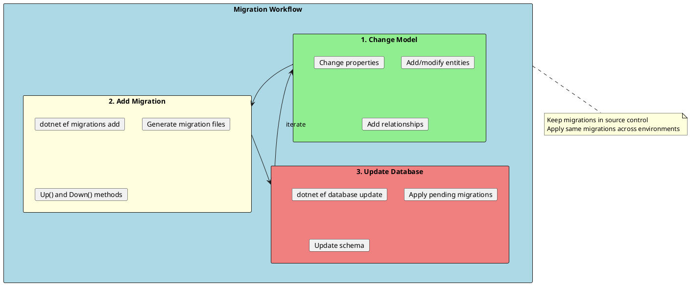
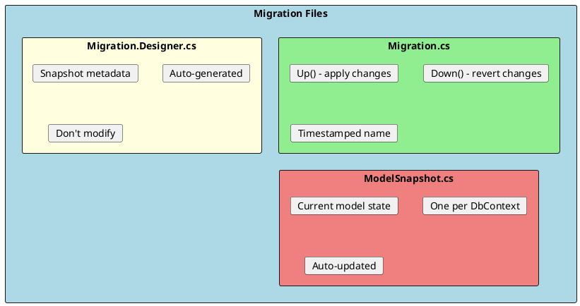
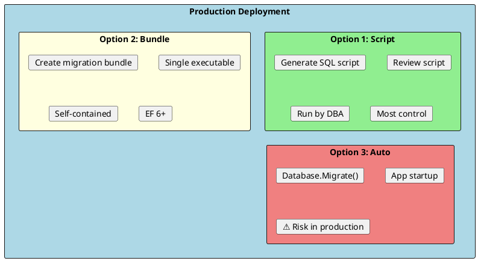

# Migrations

Migrations provide version control for your database schema. They track changes to your entity model and generate SQL scripts to update the database structure incrementally.



## Getting Started with Migrations

### Install EF Core Tools

```bash
# Install globally
dotnet tool install --global dotnet-ef

# Or add as project tool
dotnet add package Microsoft.EntityFrameworkCore.Design
```

### Basic Migration Commands

```bash
# Create a new migration
dotnet ef migrations add InitialCreate

# Create with output directory
dotnet ef migrations add InitialCreate --output-dir Data/Migrations

# Apply all pending migrations
dotnet ef database update

# Apply to specific migration
dotnet ef database update InitialCreate

# Revert to previous migration
dotnet ef database update PreviousMigrationName

# Revert all migrations (empty database)
dotnet ef database update 0

# Remove last migration (if not applied)
dotnet ef migrations remove

# List all migrations
dotnet ef migrations list

# Generate SQL script
dotnet ef migrations script

# Generate script from specific migration
dotnet ef migrations script FromMigration ToMigration

# Generate idempotent script (safe to run multiple times)
dotnet ef migrations script --idempotent
```

---

## Migration Files Structure



### Migration File Example

```csharp
// 20240115120000_AddProductCategory.cs
public partial class AddProductCategory : Migration
{
    protected override void Up(MigrationBuilder migrationBuilder)
    {
        // Create Categories table
        migrationBuilder.CreateTable(
            name: "Categories",
            columns: table => new
            {
                Id = table.Column<int>(type: "int", nullable: false)
                    .Annotation("SqlServer:Identity", "1, 1"),
                Name = table.Column<string>(type: "nvarchar(100)", maxLength: 100, nullable: false),
                Description = table.Column<string>(type: "nvarchar(500)", maxLength: 500, nullable: true)
            },
            constraints: table =>
            {
                table.PrimaryKey("PK_Categories", x => x.Id);
            });

        // Add CategoryId column to Products
        migrationBuilder.AddColumn<int>(
            name: "CategoryId",
            table: "Products",
            type: "int",
            nullable: false,
            defaultValue: 1);

        // Create foreign key
        migrationBuilder.CreateIndex(
            name: "IX_Products_CategoryId",
            table: "Products",
            column: "CategoryId");

        migrationBuilder.AddForeignKey(
            name: "FK_Products_Categories_CategoryId",
            table: "Products",
            column: "CategoryId",
            principalTable: "Categories",
            principalColumn: "Id",
            onDelete: ReferentialAction.Cascade);
    }

    protected override void Down(MigrationBuilder migrationBuilder)
    {
        // Reverse everything in opposite order
        migrationBuilder.DropForeignKey(
            name: "FK_Products_Categories_CategoryId",
            table: "Products");

        migrationBuilder.DropIndex(
            name: "IX_Products_CategoryId",
            table: "Products");

        migrationBuilder.DropColumn(
            name: "CategoryId",
            table: "Products");

        migrationBuilder.DropTable(
            name: "Categories");
    }
}
```

---

## Common Migration Operations

### Adding Columns

```csharp
// In migration
migrationBuilder.AddColumn<string>(
    name: "Email",
    table: "Users",
    type: "nvarchar(256)",
    maxLength: 256,
    nullable: false,
    defaultValue: "");

// With default value expression
migrationBuilder.AddColumn<DateTime>(
    name: "CreatedAt",
    table: "Products",
    type: "datetime2",
    nullable: false,
    defaultValueSql: "GETUTCDATE()");
```

### Modifying Columns

```csharp
// Change column type/length
migrationBuilder.AlterColumn<string>(
    name: "Name",
    table: "Products",
    type: "nvarchar(200)",  // Changed from 100
    maxLength: 200,
    nullable: false,
    oldClrType: typeof(string),
    oldType: "nvarchar(100)",
    oldMaxLength: 100);

// Rename column
migrationBuilder.RenameColumn(
    name: "ProductName",
    table: "Products",
    newName: "Name");
```

### Creating Indexes

```csharp
// Simple index
migrationBuilder.CreateIndex(
    name: "IX_Products_Name",
    table: "Products",
    column: "Name");

// Unique index
migrationBuilder.CreateIndex(
    name: "IX_Products_SKU",
    table: "Products",
    column: "SKU",
    unique: true);

// Composite index
migrationBuilder.CreateIndex(
    name: "IX_Products_CategoryId_Name",
    table: "Products",
    columns: new[] { "CategoryId", "Name" });

// Filtered index
migrationBuilder.CreateIndex(
    name: "IX_Products_Name_Active",
    table: "Products",
    column: "Name",
    filter: "[IsActive] = 1");
```

### Custom SQL in Migrations

```csharp
protected override void Up(MigrationBuilder migrationBuilder)
{
    // Execute raw SQL
    migrationBuilder.Sql(@"
        UPDATE Products
        SET Price = Price * 1.1
        WHERE CategoryId = 1
    ");

    // Create stored procedure
    migrationBuilder.Sql(@"
        CREATE PROCEDURE sp_GetProductsByCategory
            @CategoryId INT
        AS
        BEGIN
            SELECT * FROM Products WHERE CategoryId = @CategoryId
        END
    ");

    // Create view
    migrationBuilder.Sql(@"
        CREATE VIEW vw_ProductSummary AS
        SELECT
            p.Id,
            p.Name,
            c.Name AS CategoryName,
            p.Price
        FROM Products p
        JOIN Categories c ON p.CategoryId = c.Id
    ");
}

protected override void Down(MigrationBuilder migrationBuilder)
{
    migrationBuilder.Sql("DROP VIEW IF EXISTS vw_ProductSummary");
    migrationBuilder.Sql("DROP PROCEDURE IF EXISTS sp_GetProductsByCategory");
}
```

---

## Data Seeding

Initialize the database with required data.

### Static Data Seeding (OnModelCreating)

```csharp
protected override void OnModelCreating(ModelBuilder modelBuilder)
{
    // Seed categories
    modelBuilder.Entity<Category>().HasData(
        new Category { Id = 1, Name = "Electronics" },
        new Category { Id = 2, Name = "Clothing" },
        new Category { Id = 3, Name = "Books" }
    );

    // Seed with relationships
    modelBuilder.Entity<Product>().HasData(
        new Product
        {
            Id = 1,
            Name = "Laptop",
            Price = 999.99m,
            CategoryId = 1  // Reference by FK
        },
        new Product
        {
            Id = 2,
            Name = "T-Shirt",
            Price = 29.99m,
            CategoryId = 2
        }
    );

    // Seed owned types
    modelBuilder.Entity<Customer>().HasData(
        new Customer { Id = 1, Name = "John Doe" }
    );

    modelBuilder.Entity<Customer>()
        .OwnsOne(c => c.Address)
        .HasData(
            new { CustomerId = 1, Street = "123 Main St", City = "NYC" }
        );
}
```

### Migration Data Seeding

```csharp
protected override void Up(MigrationBuilder migrationBuilder)
{
    // Insert data in migration
    migrationBuilder.InsertData(
        table: "Categories",
        columns: new[] { "Id", "Name" },
        values: new object[,]
        {
            { 1, "Electronics" },
            { 2, "Clothing" },
            { 3, "Books" }
        });

    // Or use raw SQL for complex seeding
    migrationBuilder.Sql(@"
        INSERT INTO Categories (Name) VALUES ('Electronics')
        INSERT INTO Categories (Name) VALUES ('Clothing')
        INSERT INTO Categories (Name) VALUES ('Books')
    ");
}
```

### Runtime Data Seeding

```csharp
public static class DbInitializer
{
    public static async Task SeedAsync(ApplicationDbContext context)
    {
        // Only seed if empty
        if (await context.Categories.AnyAsync())
            return;

        var categories = new List<Category>
        {
            new Category { Name = "Electronics" },
            new Category { Name = "Clothing" },
            new Category { Name = "Books" }
        };

        context.Categories.AddRange(categories);
        await context.SaveChangesAsync();

        // Seed products
        var products = new List<Product>
        {
            new Product { Name = "Laptop", Price = 999, Category = categories[0] },
            new Product { Name = "T-Shirt", Price = 29, Category = categories[1] }
        };

        context.Products.AddRange(products);
        await context.SaveChangesAsync();
    }
}

// Call in Program.cs
using (var scope = app.Services.CreateScope())
{
    var context = scope.ServiceProvider.GetRequiredService<ApplicationDbContext>();
    await DbInitializer.SeedAsync(context);
}
```

---

## Migration Strategies

### Development Workflow

```bash
# 1. Make model changes

# 2. Create migration
dotnet ef migrations add AddNewFeature

# 3. Review generated migration

# 4. Apply to local database
dotnet ef database update

# 5. Test

# 6. Commit migration files to source control
```

### Production Deployment



### Generate SQL Script

```bash
# Generate full script (all migrations)
dotnet ef migrations script --idempotent -o migration.sql

# Generate from specific migration
dotnet ef migrations script FromMigration ToMigration -o update.sql

# For CI/CD, output to stdout
dotnet ef migrations script --idempotent
```

### Migration Bundles (EF Core 6+)

```bash
# Create bundle
dotnet ef migrations bundle --output efbundle.exe

# Run bundle
./efbundle.exe --connection "Server=prod;Database=MyApp;..."

# With environment-specific connection
./efbundle.exe --connection "$(ProductionConnectionString)"
```

### Apply Migrations at Startup

```csharp
// ⚠️ Use with caution in production
public static void Main(string[] args)
{
    var builder = WebApplication.CreateBuilder(args);

    // ... configuration

    var app = builder.Build();

    // Apply migrations
    using (var scope = app.Services.CreateScope())
    {
        var context = scope.ServiceProvider.GetRequiredService<ApplicationDbContext>();

        if (app.Environment.IsDevelopment())
        {
            context.Database.Migrate();  // Apply pending migrations
        }
    }

    app.Run();
}
```

---

## Handling Migration Conflicts

### When Migrations Conflict

```bash
# Team member A creates migration
dotnet ef migrations add AddCustomerEmail

# Team member B creates migration (same snapshot)
dotnet ef migrations add AddProductDescription

# After merge, snapshots conflict

# Solution: Remove later migration, regenerate
dotnet ef migrations remove
dotnet ef migrations add AddProductDescription
```

### Empty Migrations

```csharp
// Sometimes you need an empty migration for manual SQL
dotnet ef migrations add ManualUpdate

// Then add custom SQL
protected override void Up(MigrationBuilder migrationBuilder)
{
    migrationBuilder.Sql("UPDATE Products SET IsActive = 1 WHERE IsActive IS NULL");
}
```

---

## Best Practices

```csharp
// ✅ Name migrations descriptively
dotnet ef migrations add AddCategoryToProducts
dotnet ef migrations add CreateOrdersTable
dotnet ef migrations add AddIndexOnProductSKU

// ❌ Bad migration names
dotnet ef migrations add Update1
dotnet ef migrations add Changes
dotnet ef migrations add Fix

// ✅ Review generated migrations before applying
// ✅ Test migrations in non-production first
// ✅ Use idempotent scripts for production
// ✅ Keep migrations small and focused
// ✅ Include Down() logic for rollbacks

// ✅ Handle nullable columns carefully
migrationBuilder.AddColumn<string>(
    name: "NewColumn",
    table: "Products",
    nullable: true);  // Start nullable

migrationBuilder.Sql("UPDATE Products SET NewColumn = 'default'");

migrationBuilder.AlterColumn<string>(
    name: "NewColumn",
    table: "Products",
    nullable: false);  // Then make required
```

---

## Interview Questions & Answers

### Q1: What are migrations in EF Core?

**Answer**: Migrations are version-controlled changes to the database schema. They:
- Track model changes over time
- Generate SQL to update database
- Support Up (apply) and Down (revert)
- Allow consistent schema across environments

### Q2: What is the difference between Add-Migration and Update-Database?

**Answer**:
- **Add-Migration**: Creates migration files based on model changes (doesn't touch database)
- **Update-Database**: Applies pending migrations to the database

Workflow: Change model → Add-Migration → Review → Update-Database

### Q3: How do you deploy migrations to production?

**Answer**: Three options:
1. **SQL Script**: `dotnet ef migrations script --idempotent` - safest, DBA reviews
2. **Migration Bundle**: Self-contained executable
3. **Auto-migrate**: `Database.Migrate()` - risky for production

Prefer SQL scripts for production with proper review process.

### Q4: How do you seed data with migrations?

**Answer**: Three approaches:
1. **OnModelCreating**: `modelBuilder.Entity<T>().HasData()` - creates migration for seed data
2. **In Migration**: `migrationBuilder.InsertData()` - explicit in migration
3. **Runtime**: Custom initializer called at startup

Use OnModelCreating for reference data, runtime for complex scenarios.

### Q5: How do you rollback a migration?

**Answer**:
```bash
# Rollback to specific migration
dotnet ef database update PreviousMigrationName

# Rollback all migrations
dotnet ef database update 0

# Remove last unapplied migration
dotnet ef migrations remove
```

### Q6: What is an idempotent script?

**Answer**: An idempotent script can be run multiple times safely:
- Checks if migration already applied
- Skips already-applied migrations
- Safe for CI/CD pipelines
- Generated with `--idempotent` flag

