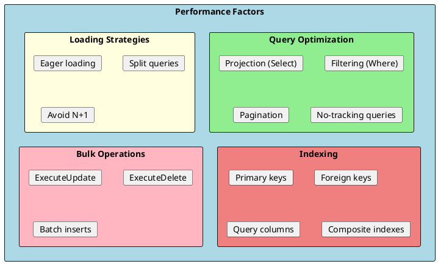
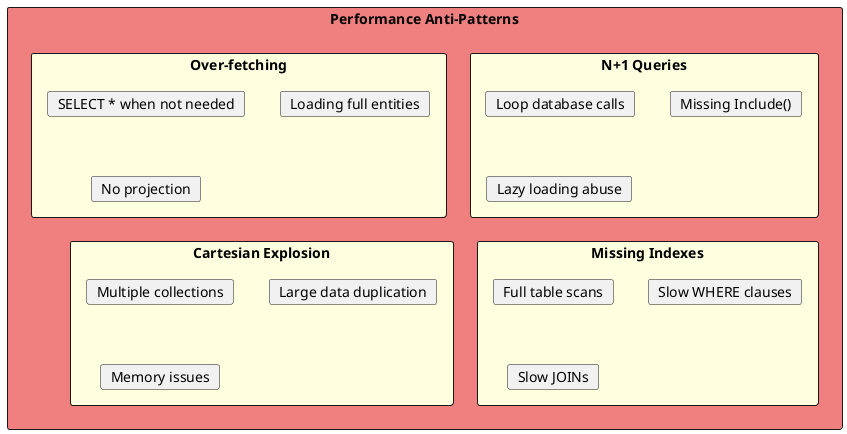

# Performance Optimization

EF Core performance directly impacts application responsiveness and scalability. Understanding query optimization, indexing strategies, and best practices is essential for building high-performance applications.



## Common Performance Issues



---

## N+1 Query Problem

The most common performance issue in ORMs.

```csharp
// ❌ N+1 Problem - executes N+1 queries
public async Task BadExampleAsync()
{
    var categories = await _context.Categories.ToListAsync();  // 1 query

    foreach (var category in categories)
    {
        // Each iteration triggers a query (N queries)
        Console.WriteLine($"{category.Name}: {category.Products.Count} products");
    }
    // Total: N+1 queries!
}

// ✅ Solution 1: Eager loading - single query with JOIN
public async Task GoodExample1Async()
{
    var categories = await _context.Categories
        .Include(c => c.Products)
        .ToListAsync();  // 1 query with JOIN

    foreach (var category in categories)
    {
        Console.WriteLine($"{category.Name}: {category.Products.Count} products");
    }
}

// ✅ Solution 2: Projection - single query, only needed data
public async Task GoodExample2Async()
{
    var categorySummaries = await _context.Categories
        .Select(c => new
        {
            c.Name,
            ProductCount = c.Products.Count
        })
        .ToListAsync();  // 1 efficient query

    foreach (var summary in categorySummaries)
    {
        Console.WriteLine($"{summary.Name}: {summary.ProductCount} products");
    }
}
```

---

## Projection Optimization

Fetch only the data you need.

```csharp
// ❌ Bad: Loads entire entities
public async Task<List<Product>> GetProductsBadAsync()
{
    return await _context.Products
        .Include(p => p.Category)
        .Include(p => p.OrderItems)
        .ToListAsync();
    // Loads ALL columns and related data
}

// ✅ Good: Project to DTO
public async Task<List<ProductListDto>> GetProductsGoodAsync()
{
    return await _context.Products
        .Select(p => new ProductListDto
        {
            Id = p.Id,
            Name = p.Name,
            Price = p.Price,
            CategoryName = p.Category.Name
        })
        .ToListAsync();
    // Only fetches needed columns
}

// ✅ Best: Project to DTO with AutoMapper
public async Task<List<ProductListDto>> GetProductsWithAutoMapperAsync()
{
    return await _context.Products
        .ProjectTo<ProductListDto>(_mapper.ConfigurationProvider)
        .ToListAsync();
}

// SQL generated (Good):
// SELECT p.Id, p.Name, p.Price, c.Name
// FROM Products p
// JOIN Categories c ON p.CategoryId = c.Id

// SQL generated (Bad):
// SELECT p.*, c.*, oi.*
// FROM Products p
// JOIN Categories c ON p.CategoryId = c.Id
// JOIN OrderItems oi ON p.Id = oi.ProductId
```

---

## No-Tracking Queries

Disable change tracking for read-only scenarios.

```csharp
// ❌ Tracked queries (default) - overhead for reads
public async Task<List<Product>> GetProductsTrackedAsync()
{
    return await _context.Products.ToListAsync();
    // EF tracks all entities for changes
}

// ✅ No-tracking - faster for read-only
public async Task<List<Product>> GetProductsNoTrackingAsync()
{
    return await _context.Products
        .AsNoTracking()
        .ToListAsync();
    // No change tracking overhead
}

// ✅ No-tracking with identity resolution
public async Task<List<Order>> GetOrdersAsync()
{
    return await _context.Orders
        .AsNoTrackingWithIdentityResolution()
        .Include(o => o.Items)
            .ThenInclude(i => i.Product)
        .ToListAsync();
    // Avoids duplicate objects while no-tracking
}

// Configure default no-tracking
public class ReadOnlyDbContext : DbContext
{
    public ReadOnlyDbContext(DbContextOptions<ReadOnlyDbContext> options)
        : base(options)
    {
        ChangeTracker.QueryTrackingBehavior = QueryTrackingBehavior.NoTracking;
    }
}
```

---

## Split Queries

Avoid cartesian explosion with multiple collections.

```csharp
// ❌ Single query with multiple collections - cartesian explosion
public async Task<List<Order>> GetOrdersBadAsync()
{
    return await _context.Orders
        .Include(o => o.Items)
        .Include(o => o.Shipments)
        .ToListAsync();
    // If order has 10 items and 3 shipments, row count = 10 * 3 = 30 rows per order!
}

// ✅ Split query - multiple queries, no duplication
public async Task<List<Order>> GetOrdersGoodAsync()
{
    return await _context.Orders
        .Include(o => o.Items)
        .Include(o => o.Shipments)
        .AsSplitQuery()
        .ToListAsync();
    // Executes 3 queries: Orders, Items, Shipments
}

// Configure as default
builder.Services.AddDbContext<AppDbContext>(options =>
    options.UseSqlServer(connectionString, o =>
        o.UseQuerySplittingBehavior(QuerySplittingBehavior.SplitQuery)));

// Override per query
var orders = await _context.Orders
    .Include(o => o.Items)
    .AsSingleQuery()  // Force single query
    .ToListAsync();
```

---

## Indexing

Proper indexes dramatically improve query performance.

### Index Configuration

```csharp
// Fluent API
protected override void OnModelCreating(ModelBuilder modelBuilder)
{
    modelBuilder.Entity<Product>(entity =>
    {
        // Simple index
        entity.HasIndex(p => p.Name);

        // Unique index
        entity.HasIndex(p => p.SKU)
            .IsUnique();

        // Composite index
        entity.HasIndex(p => new { p.CategoryId, p.Name });

        // Filtered index (SQL Server)
        entity.HasIndex(p => p.Name)
            .HasFilter("[IsActive] = 1");

        // Include columns (covering index)
        entity.HasIndex(p => p.CategoryId)
            .IncludeProperties(p => new { p.Name, p.Price });

        // Descending index
        entity.HasIndex(p => p.CreatedAt)
            .IsDescending();
    });
}

// Data Annotations
[Index(nameof(SKU), IsUnique = true)]
[Index(nameof(CategoryId), nameof(Name))]
public class Product
{
    // ...
}
```

### Index Guidelines

| Index Type | When to Use | Example |
|------------|-------------|---------|
| **Primary Key** | Auto-created | `Id` column |
| **Foreign Key** | Always index FKs | `CategoryId` |
| **Unique** | Enforce uniqueness | `Email`, `SKU` |
| **Composite** | Multi-column queries | `CategoryId, Name` |
| **Filtered** | Partial data queries | Active records only |
| **Covering** | Include all query columns | Avoid key lookups |

```csharp
// ❌ Query without index - full table scan
var products = await _context.Products
    .Where(p => p.Name.Contains("phone"))
    .ToListAsync();

// ✅ Query with index on Name - index seek
var products = await _context.Products
    .Where(p => p.Name == "iPhone")  // Exact match uses index
    .ToListAsync();

// Add index for common queries
entity.HasIndex(p => p.Name);
```

---

## Compiled Queries

Pre-compile queries for repeated execution.

```csharp
public class ProductRepository
{
    // Compiled query - parsed once, reused many times
    private static readonly Func<ApplicationDbContext, int, Task<Product?>> _getByIdQuery =
        EF.CompileAsyncQuery((ApplicationDbContext context, int id) =>
            context.Products
                .Include(p => p.Category)
                .FirstOrDefault(p => p.Id == id));

    private static readonly Func<ApplicationDbContext, decimal, IAsyncEnumerable<Product>> _getByPriceQuery =
        EF.CompileAsyncQuery((ApplicationDbContext context, decimal minPrice) =>
            context.Products
                .Where(p => p.Price >= minPrice)
                .OrderBy(p => p.Name));

    private readonly ApplicationDbContext _context;

    public ProductRepository(ApplicationDbContext context)
    {
        _context = context;
    }

    public async Task<Product?> GetByIdAsync(int id)
    {
        return await _getByIdQuery(_context, id);
    }

    public async IAsyncEnumerable<Product> GetByMinPriceAsync(decimal minPrice)
    {
        await foreach (var product in _getByPriceQuery(_context, minPrice))
        {
            yield return product;
        }
    }
}
```

---

## Bulk Operations

Efficient mass data operations without loading entities.

```csharp
// ❌ Bad: Load all entities, modify, save
public async Task DeactivateOldProductsBadAsync()
{
    var products = await _context.Products
        .Where(p => p.CreatedAt < DateTime.UtcNow.AddYears(-1))
        .ToListAsync();  // Loads all entities

    foreach (var product in products)
    {
        product.IsActive = false;  // Modify each
    }

    await _context.SaveChangesAsync();  // Generates N UPDATE statements
}

// ✅ Good: ExecuteUpdate (EF Core 7+) - single SQL
public async Task<int> DeactivateOldProductsGoodAsync()
{
    return await _context.Products
        .Where(p => p.CreatedAt < DateTime.UtcNow.AddYears(-1))
        .ExecuteUpdateAsync(setters => setters
            .SetProperty(p => p.IsActive, false)
            .SetProperty(p => p.UpdatedAt, DateTime.UtcNow));
    // Single: UPDATE Products SET IsActive = 0, UpdatedAt = GETUTCDATE() WHERE ...
}

// ✅ Bulk delete
public async Task<int> DeleteInactiveProductsAsync()
{
    return await _context.Products
        .Where(p => !p.IsActive && p.Stock == 0)
        .ExecuteDeleteAsync();
    // Single: DELETE FROM Products WHERE IsActive = 0 AND Stock = 0
}

// Batch insert (EF Core handles batching automatically)
public async Task AddProductsAsync(List<Product> products)
{
    _context.Products.AddRange(products);
    await _context.SaveChangesAsync();
    // EF batches INSERT statements (configurable batch size)
}
```

---

## Query Optimization Tips

```csharp
// ✅ Filter early
var products = await _context.Products
    .Where(p => p.IsActive)       // Filter first
    .Where(p => p.Price > 100)
    .OrderBy(p => p.Name)
    .Take(10)                      // Limit results
    .ToListAsync();

// ✅ Use Any() instead of Count() > 0
var hasProducts = await _context.Products.AnyAsync(p => p.IsActive);
// vs var hasProducts = await _context.Products.CountAsync(p => p.IsActive) > 0;

// ✅ Use pagination
var page = await _context.Products
    .OrderBy(p => p.Id)            // Always order for pagination
    .Skip((pageNumber - 1) * pageSize)
    .Take(pageSize)
    .ToListAsync();

// ✅ Efficient counting with pagination
var query = _context.Products.Where(p => p.IsActive);
var totalCount = await query.CountAsync();
var items = await query.Skip(offset).Take(limit).ToListAsync();

// ✅ Use Contains for IN queries
var categoryIds = new[] { 1, 2, 3 };
var products = await _context.Products
    .Where(p => categoryIds.Contains(p.CategoryId))
    .ToListAsync();
// Generates: WHERE CategoryId IN (1, 2, 3)

// ✅ Avoid client evaluation (keep queries server-side)
// ❌ Bad - client evaluation
var products = await _context.Products
    .Where(p => MyCustomMethod(p.Name))  // Can't translate to SQL
    .ToListAsync();

// ✅ Good - server-side
var products = await _context.Products
    .Where(p => p.Name.StartsWith("A"))  // Translates to SQL
    .ToListAsync();
```

---

## Connection and Pooling

```csharp
// Enable connection resiliency
builder.Services.AddDbContext<AppDbContext>(options =>
    options.UseSqlServer(connectionString, sqlOptions =>
    {
        sqlOptions.EnableRetryOnFailure(
            maxRetryCount: 5,
            maxRetryDelay: TimeSpan.FromSeconds(30),
            errorNumbersToAdd: null);

        sqlOptions.CommandTimeout(30);
    }));

// DbContext pooling (reduces allocation overhead)
builder.Services.AddDbContextPool<AppDbContext>(options =>
    options.UseSqlServer(connectionString),
    poolSize: 128);

// Connection string optimization
"Server=myserver;Database=mydb;Connection Timeout=30;Max Pool Size=100;Min Pool Size=5"
```

---

## Logging and Diagnostics

```csharp
// Enable logging
builder.Services.AddDbContext<AppDbContext>(options =>
{
    options.UseSqlServer(connectionString);

    if (builder.Environment.IsDevelopment())
    {
        options.EnableSensitiveDataLogging();  // Log parameter values
        options.EnableDetailedErrors();
        options.LogTo(Console.WriteLine, LogLevel.Information);
    }
});

// Log only slow queries
options.LogTo(
    message => Console.WriteLine(message),
    new[] { DbLoggerCategory.Database.Command.Name },
    LogLevel.Information,
    DbContextLoggerOptions.DefaultWithLocalTime);

// Query tags for identification
var products = await _context.Products
    .TagWith("GetActiveProducts - ProductService")
    .Where(p => p.IsActive)
    .ToListAsync();
// SQL includes: -- GetActiveProducts - ProductService
```

---

## Interview Questions & Answers

### Q1: What is the N+1 query problem?

**Answer**: N+1 occurs when loading related data in a loop:
- 1 query to load entities
- N queries to load related data (one per entity)

**Solutions**:
- Eager loading: `Include()`
- Projection: `Select()` with needed data only
- Split queries: `AsSplitQuery()`

### Q2: When should you use AsNoTracking()?

**Answer**: Use `AsNoTracking()` when:
- Reading data without modifications
- API responses that won't be updated
- Large datasets for display

Benefits: Faster queries, reduced memory, no change tracking overhead.

### Q3: What is the difference between single and split queries?

**Answer**:
- **Single query**: One query with JOINs. Can cause cartesian explosion with multiple collections.
- **Split query**: Multiple queries, one per Include. Avoids data duplication but more roundtrips.

Use split queries when including multiple collections.

### Q4: How do indexes improve performance?

**Answer**: Indexes create sorted data structures for fast lookups:
- Turn full table scans into index seeks
- Speed up WHERE, JOIN, ORDER BY
- Trade write performance for read performance

Index: Primary keys, foreign keys, frequently queried columns.

### Q5: What are compiled queries?

**Answer**: `EF.CompileAsyncQuery()` pre-compiles LINQ to SQL:
- Query parsed once at startup
- Reused for subsequent calls
- Reduces overhead for frequently executed queries

Use for hot paths and repeated queries with parameters.

### Q6: How do ExecuteUpdate and ExecuteDelete improve performance?

**Answer**: They execute bulk operations directly in SQL:
- No entity loading
- No change tracking
- Single SQL statement
- Returns affected row count

Use for mass updates/deletes instead of load-modify-save pattern.

