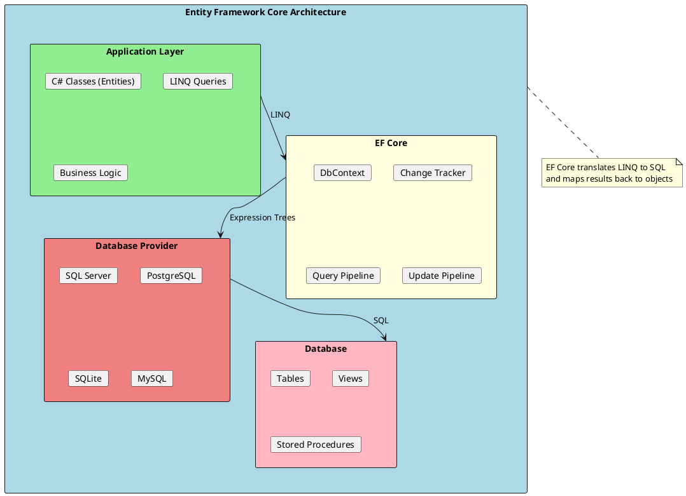
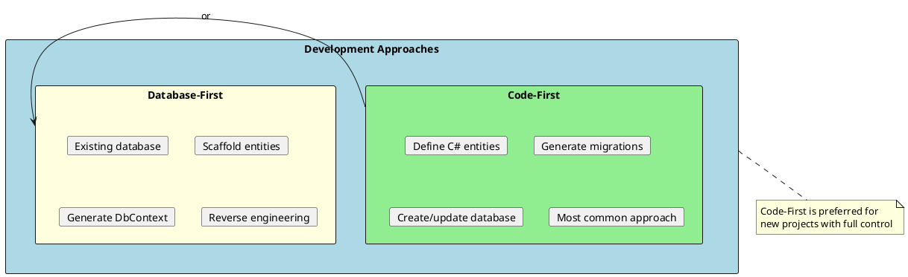
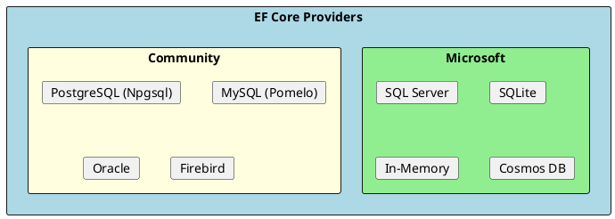

# Entity Framework Core & Databases

Entity Framework Core (EF Core) is a modern object-relational mapper (ORM) for .NET that enables developers to work with databases using .NET objects. Understanding EF Core is essential for building data-driven applications efficiently.



## What is Entity Framework Core?

EF Core is a lightweight, extensible, open-source ORM that provides:

1. **Object-Relational Mapping** - Map C# classes to database tables
2. **LINQ Support** - Query databases using familiar LINQ syntax
3. **Change Tracking** - Automatically track entity modifications
4. **Migrations** - Manage database schema changes through code
5. **Cross-Database** - Support for multiple database providers

## Code-First vs Database-First



## Key Components

| Component | Purpose | Document |
|-----------|---------|----------|
| **DbContext** | Database session and configuration | [01-EFCoreBasics.md](./01-EFCoreBasics.md) |
| **Querying** | LINQ queries and data loading | [02-Querying.md](./02-Querying.md) |
| **Change Tracking** | Entity state management | [03-ChangeTracking.md](./03-ChangeTracking.md) |
| **Relationships** | Entity associations | [04-Relationships.md](./04-Relationships.md) |
| **Migrations** | Schema version control | [05-Migrations.md](./05-Migrations.md) |
| **Performance** | Query optimization | [06-Performance.md](./06-Performance.md) |

## Quick Start Example

```csharp
// 1. Define your entities
public class Blog
{
    public int Id { get; set; }
    public string Name { get; set; } = string.Empty;
    public string Url { get; set; } = string.Empty;
    public List<Post> Posts { get; set; } = new();
}

public class Post
{
    public int Id { get; set; }
    public string Title { get; set; } = string.Empty;
    public string Content { get; set; } = string.Empty;
    public int BlogId { get; set; }
    public Blog Blog { get; set; } = null!;
}

// 2. Create DbContext
public class BloggingContext : DbContext
{
    public BloggingContext(DbContextOptions<BloggingContext> options)
        : base(options) { }

    public DbSet<Blog> Blogs => Set<Blog>();
    public DbSet<Post> Posts => Set<Post>();

    protected override void OnModelCreating(ModelBuilder modelBuilder)
    {
        modelBuilder.Entity<Blog>()
            .HasMany(b => b.Posts)
            .WithOne(p => p.Blog)
            .HasForeignKey(p => p.BlogId);
    }
}

// 3. Register in Program.cs
builder.Services.AddDbContext<BloggingContext>(options =>
    options.UseSqlServer(builder.Configuration.GetConnectionString("Default")));

// 4. Use in services/controllers
public class BlogService
{
    private readonly BloggingContext _context;

    public BlogService(BloggingContext context)
    {
        _context = context;
    }

    public async Task<List<Blog>> GetAllBlogsAsync()
    {
        return await _context.Blogs
            .Include(b => b.Posts)
            .ToListAsync();
    }

    public async Task<Blog> CreateBlogAsync(string name, string url)
    {
        var blog = new Blog { Name = name, Url = url };
        _context.Blogs.Add(blog);
        await _context.SaveChangesAsync();
        return blog;
    }
}
```

## Files in This Section

| File | Topics Covered |
|------|----------------|
| [01-EFCoreBasics.md](./01-EFCoreBasics.md) | DbContext, DbSet, entity configuration, conventions, Fluent API |
| [02-Querying.md](./02-Querying.md) | LINQ queries, eager/lazy/explicit loading, projections, raw SQL |
| [03-ChangeTracking.md](./03-ChangeTracking.md) | Entity states, SaveChanges, concurrency, disconnected entities |
| [04-Relationships.md](./04-Relationships.md) | One-to-one, one-to-many, many-to-many, cascade delete |
| [05-Migrations.md](./05-Migrations.md) | Creating migrations, applying updates, seeding data |
| [06-Performance.md](./06-Performance.md) | Query optimization, indexing, compiled queries, bulk operations |

## Database Providers

EF Core supports multiple database providers:



### Provider Configuration

```csharp
// SQL Server
builder.Services.AddDbContext<AppDbContext>(options =>
    options.UseSqlServer(connectionString));

// PostgreSQL
builder.Services.AddDbContext<AppDbContext>(options =>
    options.UseNpgsql(connectionString));

// SQLite
builder.Services.AddDbContext<AppDbContext>(options =>
    options.UseSqlite("Data Source=app.db"));

// In-Memory (for testing)
builder.Services.AddDbContext<AppDbContext>(options =>
    options.UseInMemoryDatabase("TestDb"));
```

## Quick Reference

```
┌─────────────────────────────────────────────────────────────────────┐
│                    EF Core Quick Reference                          │
├─────────────────────────────────────────────────────────────────────┤
│ Entity States:                                                       │
│   Detached    - Not tracked by context                              │
│   Unchanged   - Exists in DB, no changes                            │
│   Added       - New, will be inserted                               │
│   Modified    - Changed, will be updated                            │
│   Deleted     - Marked for deletion                                 │
├─────────────────────────────────────────────────────────────────────┤
│ Loading Strategies:                                                  │
│   Eager   - Include() - loads related data immediately              │
│   Lazy    - Loads related data on access (proxy required)          │
│   Explicit - Entry().Collection().Load() - manual loading          │
├─────────────────────────────────────────────────────────────────────┤
│ Common Commands:                                                     │
│   dotnet ef migrations add <Name>    - Create migration            │
│   dotnet ef database update          - Apply migrations             │
│   dotnet ef database drop            - Drop database                │
│   dotnet ef dbcontext scaffold       - Reverse engineer DB         │
└─────────────────────────────────────────────────────────────────────┘
```

## Common Interview Topics

1. **What is DbContext?** - Unit of work and repository for database operations
2. **Eager vs Lazy vs Explicit loading?** - Data loading strategies
3. **What are migrations?** - Version control for database schema
4. **How does change tracking work?** - Entity state management
5. **N+1 query problem?** - Common performance issue and solutions
6. **Code-First vs Database-First?** - Development approaches
7. **How to handle concurrency?** - Optimistic concurrency with row versions

