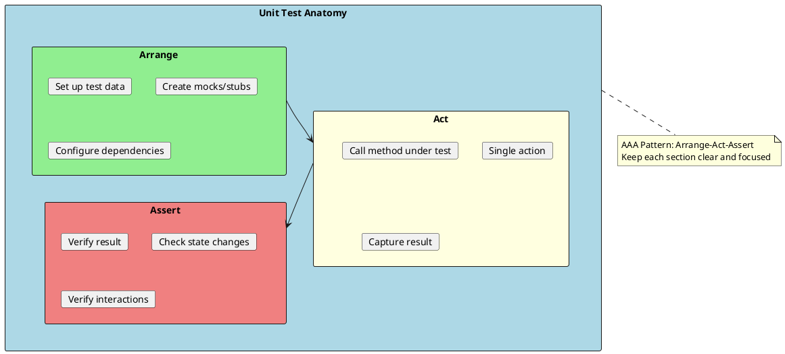
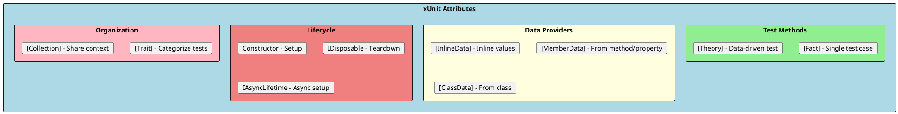
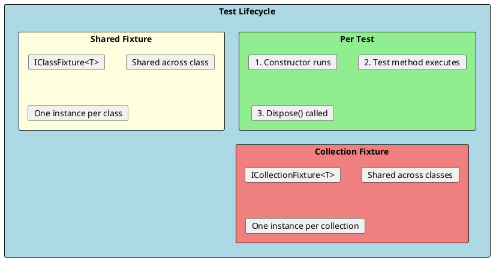
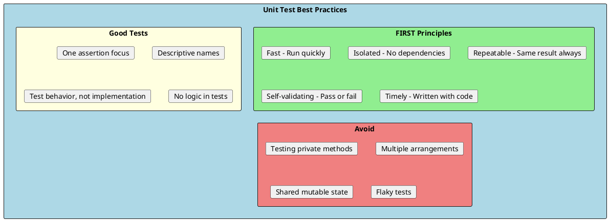

# Unit Testing

Unit testing is the practice of testing individual units of code (methods, classes) in isolation from their dependencies. Unit tests are fast, focused, and form the foundation of a robust test suite.



## xUnit Framework

xUnit is the most popular testing framework in .NET, created by the original author of NUnit. It follows modern testing conventions and best practices.

### Basic Test Structure

```csharp
using Xunit;

public class StringCalculatorTests
{
    [Fact]
    public void Add_EmptyString_ReturnsZero()
    {
        // Arrange
        var calculator = new StringCalculator();

        // Act
        var result = calculator.Add("");

        // Assert
        Assert.Equal(0, result);
    }

    [Fact]
    public void Add_SingleNumber_ReturnsThatNumber()
    {
        // Arrange
        var calculator = new StringCalculator();

        // Act
        var result = calculator.Add("5");

        // Assert
        Assert.Equal(5, result);
    }

    [Fact]
    public void Add_TwoNumbers_ReturnsSum()
    {
        // Arrange
        var calculator = new StringCalculator();

        // Act
        var result = calculator.Add("1,2");

        // Assert
        Assert.Equal(3, result);
    }
}
```

---

## Test Attributes



### [Fact] vs [Theory]

```csharp
// [Fact] - Single test case
[Fact]
public void IsEven_WithEvenNumber_ReturnsTrue()
{
    var result = NumberHelper.IsEven(4);
    Assert.True(result);
}

// [Theory] - Multiple test cases with different data
[Theory]
[InlineData(2, true)]
[InlineData(4, true)]
[InlineData(3, false)]
[InlineData(7, false)]
[InlineData(0, true)]
public void IsEven_WithVariousNumbers_ReturnsExpectedResult(int number, bool expected)
{
    var result = NumberHelper.IsEven(number);
    Assert.Equal(expected, result);
}
```

### Data Providers

```csharp
// InlineData - Simple inline values
[Theory]
[InlineData("hello", "HELLO")]
[InlineData("World", "WORLD")]
[InlineData("", "")]
public void ToUpper_ValidString_ReturnsUppercase(string input, string expected)
{
    Assert.Equal(expected, input.ToUpper());
}

// MemberData - From static method or property
public class CalculatorTests
{
    public static IEnumerable<object[]> AddTestData =>
        new List<object[]>
        {
            new object[] { 1, 2, 3 },
            new object[] { -1, 1, 0 },
            new object[] { 100, 200, 300 }
        };

    [Theory]
    [MemberData(nameof(AddTestData))]
    public void Add_WithTestData_ReturnsExpectedSum(int a, int b, int expected)
    {
        var calculator = new Calculator();
        Assert.Equal(expected, calculator.Add(a, b));
    }

    // MemberData with parameters
    public static IEnumerable<object[]> GetDivisionData(int divisor)
    {
        yield return new object[] { 10, divisor, 10 / divisor };
        yield return new object[] { 20, divisor, 20 / divisor };
    }

    [Theory]
    [MemberData(nameof(GetDivisionData), 2)]
    public void Divide_ByTwo_ReturnsHalf(int a, int b, int expected)
    {
        var calculator = new Calculator();
        Assert.Equal(expected, calculator.Divide(a, b));
    }
}

// ClassData - From separate class
public class CalculatorTestData : IEnumerable<object[]>
{
    public IEnumerator<object[]> GetEnumerator()
    {
        yield return new object[] { 1, 2, 3 };
        yield return new object[] { 5, 5, 10 };
        yield return new object[] { -1, -1, -2 };
    }

    IEnumerator IEnumerable.GetEnumerator() => GetEnumerator();
}

[Theory]
[ClassData(typeof(CalculatorTestData))]
public void Add_WithClassData_ReturnsExpectedSum(int a, int b, int expected)
{
    var calculator = new Calculator();
    Assert.Equal(expected, calculator.Add(a, b));
}
```

---

## Test Lifecycle



### Constructor and Dispose

```csharp
public class DatabaseTests : IDisposable
{
    private readonly TestDatabase _database;

    // Constructor runs before EACH test
    public DatabaseTests()
    {
        _database = new TestDatabase();
        _database.Initialize();
    }

    [Fact]
    public void Insert_ValidRecord_Succeeds()
    {
        _database.Insert(new Record { Id = 1, Name = "Test" });
        Assert.Equal(1, _database.Count);
    }

    [Fact]
    public void Delete_ExistingRecord_RemovesIt()
    {
        _database.Insert(new Record { Id = 1, Name = "Test" });
        _database.Delete(1);
        Assert.Equal(0, _database.Count);
    }

    // Dispose runs after EACH test
    public void Dispose()
    {
        _database.Cleanup();
    }
}
```

### Async Lifecycle

```csharp
public class AsyncDatabaseTests : IAsyncLifetime
{
    private TestDatabase _database = null!;

    // Async setup
    public async Task InitializeAsync()
    {
        _database = new TestDatabase();
        await _database.InitializeAsync();
    }

    [Fact]
    public async Task GetAllAsync_ReturnsRecords()
    {
        var records = await _database.GetAllAsync();
        Assert.NotEmpty(records);
    }

    // Async teardown
    public async Task DisposeAsync()
    {
        await _database.CleanupAsync();
    }
}
```

### Class Fixture (Shared Setup)

```csharp
// Fixture class - created once per test class
public class DatabaseFixture : IDisposable
{
    public TestDatabase Database { get; }

    public DatabaseFixture()
    {
        Database = new TestDatabase();
        Database.Initialize();
        Database.SeedTestData();
    }

    public void Dispose()
    {
        Database.Cleanup();
    }
}

// Test class using the fixture
public class ProductTests : IClassFixture<DatabaseFixture>
{
    private readonly DatabaseFixture _fixture;

    public ProductTests(DatabaseFixture fixture)
    {
        _fixture = fixture;
    }

    [Fact]
    public void GetProduct_ExistingId_ReturnsProduct()
    {
        var product = _fixture.Database.GetProduct(1);
        Assert.NotNull(product);
    }
}
```

---

## Assertions

### Built-in xUnit Assertions

```csharp
public class AssertionExamples
{
    [Fact]
    public void Equality_Assertions()
    {
        // Value equality
        Assert.Equal(5, 2 + 3);
        Assert.NotEqual(5, 2 + 2);

        // Reference equality
        var obj1 = new object();
        var obj2 = obj1;
        Assert.Same(obj1, obj2);
        Assert.NotSame(obj1, new object());

        // String equality
        Assert.Equal("hello", "HELLO", ignoreCase: true);
    }

    [Fact]
    public void Boolean_Assertions()
    {
        Assert.True(1 + 1 == 2);
        Assert.False(1 + 1 == 3);
    }

    [Fact]
    public void Null_Assertions()
    {
        string? nullString = null;
        string nonNullString = "hello";

        Assert.Null(nullString);
        Assert.NotNull(nonNullString);
    }

    [Fact]
    public void Collection_Assertions()
    {
        var list = new List<int> { 1, 2, 3, 4, 5 };

        Assert.Contains(3, list);
        Assert.DoesNotContain(6, list);
        Assert.Empty(new List<int>());
        Assert.NotEmpty(list);
        Assert.Single(new List<int> { 1 });

        // All items match predicate
        Assert.All(list, item => Assert.True(item > 0));

        // Collection equality
        Assert.Equal(new[] { 1, 2, 3, 4, 5 }, list);
    }

    [Fact]
    public void Type_Assertions()
    {
        object obj = "hello";

        Assert.IsType<string>(obj);
        Assert.IsNotType<int>(obj);
        Assert.IsAssignableFrom<IEnumerable<char>>(obj);
    }

    [Fact]
    public void Exception_Assertions()
    {
        // Assert exception is thrown
        var exception = Assert.Throws<ArgumentNullException>(() =>
            throw new ArgumentNullException("param"));

        Assert.Equal("param", exception.ParamName);

        // Async exception
        // await Assert.ThrowsAsync<InvalidOperationException>(
        //     async () => await SomeAsyncMethod());
    }

    [Fact]
    public void Range_Assertions()
    {
        Assert.InRange(5, 1, 10);       // 5 is between 1 and 10
        Assert.NotInRange(15, 1, 10);   // 15 is not between 1 and 10
    }
}
```

### FluentAssertions (Recommended)

FluentAssertions provides a more readable and expressive syntax:

```csharp
using FluentAssertions;

public class FluentAssertionExamples
{
    [Fact]
    public void Basic_Assertions()
    {
        // Numbers
        int result = 5;
        result.Should().Be(5);
        result.Should().BeGreaterThan(3);
        result.Should().BeInRange(1, 10);

        // Strings
        string name = "Hello World";
        name.Should().StartWith("Hello");
        name.Should().EndWith("World");
        name.Should().Contain("lo Wo");
        name.Should().HaveLength(11);
        name.Should().NotBeNullOrEmpty();

        // Booleans
        true.Should().BeTrue();
        false.Should().BeFalse();
    }

    [Fact]
    public void Collection_Assertions()
    {
        var list = new List<int> { 1, 2, 3, 4, 5 };

        list.Should().HaveCount(5);
        list.Should().Contain(3);
        list.Should().NotContain(6);
        list.Should().BeInAscendingOrder();
        list.Should().OnlyContain(x => x > 0);
        list.Should().ContainInOrder(1, 2, 3);

        // Object collections
        var users = new List<User>
        {
            new User { Name = "Alice", Age = 30 },
            new User { Name = "Bob", Age = 25 }
        };

        users.Should().Contain(u => u.Name == "Alice");
        users.Should().OnlyContain(u => u.Age >= 18);
    }

    [Fact]
    public void Object_Assertions()
    {
        var user = new User { Name = "Alice", Age = 30 };

        user.Should().NotBeNull();
        user.Name.Should().Be("Alice");
        user.Age.Should().Be(30);

        // Object comparison
        var expectedUser = new User { Name = "Alice", Age = 30 };
        user.Should().BeEquivalentTo(expectedUser);
    }

    [Fact]
    public void Exception_Assertions()
    {
        Action act = () => throw new ArgumentException("Invalid argument", "param");

        act.Should().Throw<ArgumentException>()
            .WithMessage("*Invalid*")
            .WithParameterName("param");

        // Should not throw
        Action validAct = () => { var x = 1 + 1; };
        validAct.Should().NotThrow();
    }

    [Fact]
    public async Task Async_Assertions()
    {
        Func<Task> act = async () =>
        {
            await Task.Delay(10);
            throw new InvalidOperationException("Async error");
        };

        await act.Should().ThrowAsync<InvalidOperationException>()
            .WithMessage("*Async*");
    }

    [Fact]
    public void DateTime_Assertions()
    {
        var date = new DateTime(2024, 6, 15, 14, 30, 0);

        date.Should().BeAfter(new DateTime(2024, 1, 1));
        date.Should().BeBefore(new DateTime(2025, 1, 1));
        date.Should().HaveYear(2024);
        date.Should().HaveMonth(6);
        date.Should().BeCloseTo(DateTime.Now, TimeSpan.FromDays(365));
    }
}
```

---

## Organizing Tests

### Traits for Categorization

```csharp
public class OrderServiceTests
{
    [Fact]
    [Trait("Category", "Unit")]
    [Trait("Feature", "Orders")]
    public void CreateOrder_ValidData_CreatesOrder()
    {
        // Test implementation
    }

    [Fact]
    [Trait("Category", "Integration")]
    [Trait("Feature", "Orders")]
    public void CreateOrder_WithDatabase_PersistsOrder()
    {
        // Test implementation
    }
}

// Run specific traits:
// dotnet test --filter "Category=Unit"
// dotnet test --filter "Feature=Orders"
```

### Test Collections

```csharp
// Collection definition
[CollectionDefinition("Database collection")]
public class DatabaseCollection : ICollectionFixture<DatabaseFixture>
{
    // This class has no code, it's just a marker
}

// Test classes sharing the collection
[Collection("Database collection")]
public class ProductTests
{
    private readonly DatabaseFixture _fixture;

    public ProductTests(DatabaseFixture fixture)
    {
        _fixture = fixture;
    }

    [Fact]
    public void Test1() { }
}

[Collection("Database collection")]
public class OrderTests
{
    private readonly DatabaseFixture _fixture;

    public OrderTests(DatabaseFixture fixture)
    {
        _fixture = fixture;
    }

    [Fact]
    public void Test1() { }
}
```

---

## NUnit Comparison

```csharp
// NUnit equivalent syntax
using NUnit.Framework;

[TestFixture]  // Optional in NUnit 3+
public class CalculatorTestsNUnit
{
    private Calculator _calculator = null!;

    [SetUp]  // Runs before each test
    public void Setup()
    {
        _calculator = new Calculator();
    }

    [TearDown]  // Runs after each test
    public void Teardown()
    {
        // Cleanup
    }

    [Test]  // Same as [Fact]
    public void Add_TwoNumbers_ReturnsSum()
    {
        var result = _calculator.Add(2, 3);
        Assert.That(result, Is.EqualTo(5));
    }

    [TestCase(2, 3, 5)]       // Same as [Theory] + [InlineData]
    [TestCase(-1, 1, 0)]
    [TestCase(0, 0, 0)]
    public void Add_WithTestCases_ReturnsExpectedSum(int a, int b, int expected)
    {
        var result = _calculator.Add(a, b);
        Assert.That(result, Is.EqualTo(expected));
    }

    [Test]
    [Category("Slow")]  // Same as [Trait]
    public void SlowTest()
    {
        // Test implementation
    }
}
```

---

## Best Practices



### Examples of Good vs Bad Tests

```csharp
// ❌ Bad: Testing implementation details
[Fact]
public void Bad_TestsPrivateMethod()
{
    var service = new OrderService();
    // Using reflection to test private method - don't do this!
    var method = typeof(OrderService).GetMethod("ValidateOrder",
        BindingFlags.NonPublic | BindingFlags.Instance);
    // ...
}

// ✅ Good: Test public behavior
[Fact]
public void Good_TestsPublicBehavior()
{
    var service = new OrderService();
    var result = service.CreateOrder(new OrderRequest { /* ... */ });
    Assert.True(result.IsValid);
}

// ❌ Bad: Multiple assertions testing different things
[Fact]
public void Bad_MultipleUnrelatedAssertions()
{
    var user = _userService.GetUser(1);
    Assert.NotNull(user);
    Assert.Equal("Alice", user.Name);
    Assert.True(_userService.IsActive);  // Unrelated assertion
    Assert.Equal(5, _userService.TotalUsers);  // Unrelated assertion
}

// ✅ Good: Focused assertions on single behavior
[Fact]
public void Good_FocusedAssertion()
{
    var user = _userService.GetUser(1);

    Assert.NotNull(user);
    Assert.Equal("Alice", user.Name);
}

// ❌ Bad: Logic in tests
[Fact]
public void Bad_LogicInTest()
{
    var numbers = new[] { 1, 2, 3, 4, 5 };
    var expected = 0;
    foreach (var n in numbers)
        expected += n;  // Logic to calculate expected

    var result = _calculator.Sum(numbers);
    Assert.Equal(expected, result);
}

// ✅ Good: Explicit expected values
[Fact]
public void Good_ExplicitExpectedValue()
{
    var numbers = new[] { 1, 2, 3, 4, 5 };

    var result = _calculator.Sum(numbers);

    Assert.Equal(15, result);  // Clear expected value
}
```

---

## Interview Questions & Answers

### Q1: What is unit testing?

**Answer**: Unit testing is testing individual units of code (methods, classes) in isolation from dependencies. Key characteristics:
- **Fast** - Milliseconds to run
- **Isolated** - No database, network, file system
- **Focused** - Tests single behavior
- **Automated** - Run without manual intervention

### Q2: What is the AAA pattern?

**Answer**: AAA stands for Arrange-Act-Assert:
- **Arrange**: Set up test data, create objects, configure mocks
- **Act**: Call the method under test
- **Assert**: Verify the expected outcome

This structure makes tests readable and maintainable.

### Q3: What is the difference between [Fact] and [Theory]?

**Answer**:
- **[Fact]**: Single test case with fixed inputs
- **[Theory]**: Parameterized test that runs multiple times with different data

Use [Theory] with [InlineData], [MemberData], or [ClassData] to provide test data.

### Q4: How do you handle test dependencies?

**Answer**: Use dependency injection and test doubles:
- **Constructor injection** - Pass dependencies via constructor
- **Mocking** - Use Moq or NSubstitute for interfaces
- **Stubs** - Return predefined values
- **Fakes** - Simplified implementations (e.g., in-memory database)

### Q5: What makes a good unit test name?

**Answer**: Good test names describe:
1. **What** is being tested (method/behavior)
2. **Under what conditions** (scenario/input)
3. **Expected outcome** (result/behavior)

Example: `CreateOrder_WithEmptyCart_ThrowsInvalidOperationException`

### Q6: What is code coverage and is 100% coverage a goal?

**Answer**: Code coverage measures the percentage of code executed by tests. 100% coverage is **not** necessarily a goal because:
- Coverage doesn't guarantee quality
- Some code is trivial (getters/setters)
- Focus on critical paths and edge cases
- Aim for meaningful coverage (70-80%) over quantity

