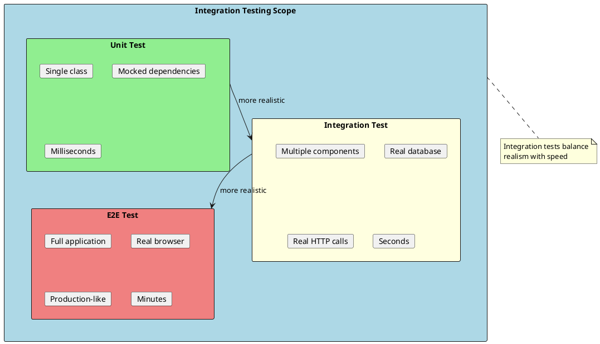
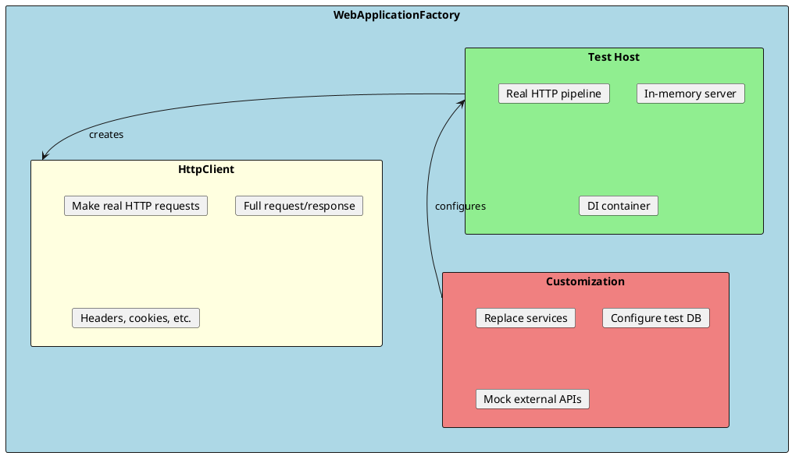
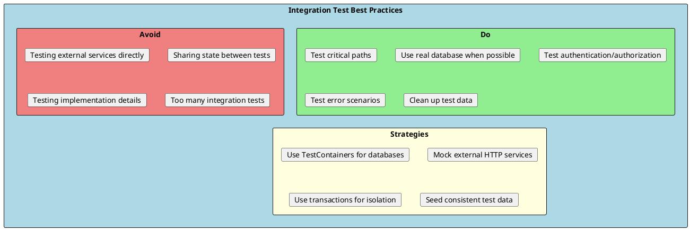

# Integration Testing

Integration tests verify that multiple components work together correctly. Unlike unit tests that isolate dependencies, integration tests exercise real interactions between components, databases, and external services.



## ASP.NET Core Integration Testing

ASP.NET Core provides `WebApplicationFactory<T>` for testing APIs without deploying to a real server.



### Basic Setup

```csharp
// Install packages
// dotnet add package Microsoft.AspNetCore.Mvc.Testing
// dotnet add package Microsoft.EntityFrameworkCore.InMemory

using Microsoft.AspNetCore.Mvc.Testing;
using System.Net.Http.Json;

public class ProductsControllerTests : IClassFixture<WebApplicationFactory<Program>>
{
    private readonly HttpClient _client;

    public ProductsControllerTests(WebApplicationFactory<Program> factory)
    {
        _client = factory.CreateClient();
    }

    [Fact]
    public async Task GetProducts_ReturnsSuccessStatusCode()
    {
        // Act
        var response = await _client.GetAsync("/api/products");

        // Assert
        response.EnsureSuccessStatusCode();
    }

    [Fact]
    public async Task GetProducts_ReturnsJsonContent()
    {
        // Act
        var response = await _client.GetAsync("/api/products");
        var products = await response.Content.ReadFromJsonAsync<List<Product>>();

        // Assert
        Assert.NotNull(products);
        Assert.IsType<List<Product>>(products);
    }

    [Fact]
    public async Task GetProduct_NonExistentId_ReturnsNotFound()
    {
        // Act
        var response = await _client.GetAsync("/api/products/99999");

        // Assert
        Assert.Equal(HttpStatusCode.NotFound, response.StatusCode);
    }

    [Fact]
    public async Task CreateProduct_ValidProduct_ReturnsCreated()
    {
        // Arrange
        var newProduct = new CreateProductRequest
        {
            Name = "Test Product",
            Price = 29.99m
        };

        // Act
        var response = await _client.PostAsJsonAsync("/api/products", newProduct);

        // Assert
        Assert.Equal(HttpStatusCode.Created, response.StatusCode);
        Assert.NotNull(response.Headers.Location);
    }
}
```

---

## Custom WebApplicationFactory

Create a custom factory to configure test-specific services:

```csharp
public class CustomWebApplicationFactory<TProgram> : WebApplicationFactory<TProgram>
    where TProgram : class
{
    protected override void ConfigureWebHost(IWebHostBuilder builder)
    {
        builder.ConfigureServices(services =>
        {
            // Remove the real database context
            var descriptor = services.SingleOrDefault(
                d => d.ServiceType == typeof(DbContextOptions<ApplicationDbContext>));

            if (descriptor != null)
            {
                services.Remove(descriptor);
            }

            // Add in-memory database
            services.AddDbContext<ApplicationDbContext>(options =>
            {
                options.UseInMemoryDatabase("TestDatabase");
            });

            // Replace external services with fakes
            services.AddScoped<IEmailService, FakeEmailService>();
            services.AddScoped<IPaymentGateway, FakePaymentGateway>();

            // Build service provider
            var sp = services.BuildServiceProvider();

            // Create and seed the database
            using var scope = sp.CreateScope();
            var db = scope.ServiceProvider.GetRequiredService<ApplicationDbContext>();
            db.Database.EnsureCreated();
            SeedTestData(db);
        });

        builder.UseEnvironment("Testing");
    }

    private static void SeedTestData(ApplicationDbContext db)
    {
        db.Products.AddRange(
            new Product { Id = 1, Name = "Product 1", Price = 10.00m },
            new Product { Id = 2, Name = "Product 2", Price = 20.00m },
            new Product { Id = 3, Name = "Product 3", Price = 30.00m }
        );
        db.SaveChanges();
    }
}
```

### Using Custom Factory

```csharp
public class ProductsControllerTests : IClassFixture<CustomWebApplicationFactory<Program>>
{
    private readonly HttpClient _client;
    private readonly CustomWebApplicationFactory<Program> _factory;

    public ProductsControllerTests(CustomWebApplicationFactory<Program> factory)
    {
        _factory = factory;
        _client = factory.CreateClient(new WebApplicationFactoryClientOptions
        {
            AllowAutoRedirect = false
        });
    }

    [Fact]
    public async Task GetProducts_ReturnsSeededProducts()
    {
        // Act
        var products = await _client.GetFromJsonAsync<List<Product>>("/api/products");

        // Assert
        Assert.Equal(3, products?.Count);
    }

    [Fact]
    public async Task GetProduct_ExistingId_ReturnsProduct()
    {
        // Act
        var product = await _client.GetFromJsonAsync<Product>("/api/products/1");

        // Assert
        Assert.NotNull(product);
        Assert.Equal("Product 1", product.Name);
    }
}
```

---

## Database Integration Testing

### Using Real Database with TestContainers

```csharp
// dotnet add package Testcontainers.MsSql

public class DatabaseIntegrationTests : IAsyncLifetime
{
    private readonly MsSqlContainer _sqlContainer;
    private ApplicationDbContext _context = null!;

    public DatabaseIntegrationTests()
    {
        _sqlContainer = new MsSqlBuilder()
            .WithImage("mcr.microsoft.com/mssql/server:2022-latest")
            .Build();
    }

    public async Task InitializeAsync()
    {
        await _sqlContainer.StartAsync();

        var options = new DbContextOptionsBuilder<ApplicationDbContext>()
            .UseSqlServer(_sqlContainer.GetConnectionString())
            .Options;

        _context = new ApplicationDbContext(options);
        await _context.Database.MigrateAsync();
    }

    public async Task DisposeAsync()
    {
        await _context.DisposeAsync();
        await _sqlContainer.DisposeAsync();
    }

    [Fact]
    public async Task CreateProduct_SavesProductToDatabase()
    {
        // Arrange
        var product = new Product { Name = "Test", Price = 10.00m };

        // Act
        _context.Products.Add(product);
        await _context.SaveChangesAsync();

        // Assert
        var savedProduct = await _context.Products.FindAsync(product.Id);
        Assert.NotNull(savedProduct);
        Assert.Equal("Test", savedProduct.Name);
    }

    [Fact]
    public async Task GetProducts_WithFilter_ReturnsFilteredProducts()
    {
        // Arrange
        _context.Products.AddRange(
            new Product { Name = "Laptop", Price = 999.00m, Category = "Electronics" },
            new Product { Name = "Phone", Price = 599.00m, Category = "Electronics" },
            new Product { Name = "Shirt", Price = 29.00m, Category = "Clothing" }
        );
        await _context.SaveChangesAsync();

        // Act
        var electronics = await _context.Products
            .Where(p => p.Category == "Electronics")
            .ToListAsync();

        // Assert
        Assert.Equal(2, electronics.Count);
    }
}
```

### Using In-Memory Database

```csharp
public class InMemoryDatabaseTests
{
    private ApplicationDbContext CreateContext()
    {
        var options = new DbContextOptionsBuilder<ApplicationDbContext>()
            .UseInMemoryDatabase(databaseName: Guid.NewGuid().ToString())
            .Options;

        var context = new ApplicationDbContext(options);
        return context;
    }

    [Fact]
    public async Task OrderService_CreateOrder_PersistsOrder()
    {
        // Arrange
        using var context = CreateContext();
        var service = new OrderService(context);
        var request = new CreateOrderRequest
        {
            CustomerId = 1,
            Items = new List<OrderItem>
            {
                new OrderItem { ProductId = 1, Quantity = 2 }
            }
        };

        // Act
        var order = await service.CreateOrderAsync(request);

        // Assert
        var savedOrder = await context.Orders
            .Include(o => o.Items)
            .FirstOrDefaultAsync(o => o.Id == order.Id);

        Assert.NotNull(savedOrder);
        Assert.Single(savedOrder.Items);
    }
}
```

---

## Testing Authentication

```csharp
public class AuthenticatedTests : IClassFixture<CustomWebApplicationFactory<Program>>
{
    private readonly CustomWebApplicationFactory<Program> _factory;

    public AuthenticatedTests(CustomWebApplicationFactory<Program> factory)
    {
        _factory = factory;
    }

    [Fact]
    public async Task ProtectedEndpoint_WithoutAuth_ReturnsUnauthorized()
    {
        // Arrange
        var client = _factory.CreateClient();

        // Act
        var response = await client.GetAsync("/api/admin/users");

        // Assert
        Assert.Equal(HttpStatusCode.Unauthorized, response.StatusCode);
    }

    [Fact]
    public async Task ProtectedEndpoint_WithAuth_ReturnsSuccess()
    {
        // Arrange
        var client = _factory.CreateClient();
        client.DefaultRequestHeaders.Authorization =
            new AuthenticationHeaderValue("Bearer", GenerateTestToken());

        // Act
        var response = await client.GetAsync("/api/admin/users");

        // Assert
        Assert.Equal(HttpStatusCode.OK, response.StatusCode);
    }

    private string GenerateTestToken()
    {
        var key = new SymmetricSecurityKey(
            Encoding.UTF8.GetBytes("YourTestSecretKeyThatIsLongEnough"));
        var credentials = new SigningCredentials(key, SecurityAlgorithms.HmacSha256);

        var claims = new[]
        {
            new Claim(ClaimTypes.NameIdentifier, "test-user"),
            new Claim(ClaimTypes.Role, "Admin")
        };

        var token = new JwtSecurityToken(
            issuer: "TestIssuer",
            audience: "TestAudience",
            claims: claims,
            expires: DateTime.UtcNow.AddHours(1),
            signingCredentials: credentials
        );

        return new JwtSecurityTokenHandler().WriteToken(token);
    }
}
```

### Custom Authentication Handler

```csharp
// Test authentication handler
public class TestAuthHandler : AuthenticationHandler<AuthenticationSchemeOptions>
{
    public TestAuthHandler(
        IOptionsMonitor<AuthenticationSchemeOptions> options,
        ILoggerFactory logger,
        UrlEncoder encoder)
        : base(options, logger, encoder) { }

    protected override Task<AuthenticateResult> HandleAuthenticateAsync()
    {
        var claims = new[]
        {
            new Claim(ClaimTypes.NameIdentifier, "test-user"),
            new Claim(ClaimTypes.Name, "Test User"),
            new Claim(ClaimTypes.Role, "Admin")
        };

        var identity = new ClaimsIdentity(claims, "Test");
        var principal = new ClaimsPrincipal(identity);
        var ticket = new AuthenticationTicket(principal, "Test");

        return Task.FromResult(AuthenticateResult.Success(ticket));
    }
}

// Configure in custom factory
protected override void ConfigureWebHost(IWebHostBuilder builder)
{
    builder.ConfigureTestServices(services =>
    {
        services.AddAuthentication("Test")
            .AddScheme<AuthenticationSchemeOptions, TestAuthHandler>("Test", options => { });
    });
}
```

---

## Testing External Services

### Mocking HTTP Clients

```csharp
public class ExternalApiTests : IClassFixture<CustomWebApplicationFactory<Program>>
{
    private readonly CustomWebApplicationFactory<Program> _factory;

    public ExternalApiTests(CustomWebApplicationFactory<Program> factory)
    {
        _factory = factory.WithWebHostBuilder(builder =>
        {
            builder.ConfigureTestServices(services =>
            {
                // Replace HttpClient with mock
                services.AddHttpClient<IWeatherService, WeatherService>()
                    .AddHttpMessageHandler<MockWeatherApiHandler>();

                services.AddTransient<MockWeatherApiHandler>();
            });
        });
    }

    [Fact]
    public async Task GetWeather_ReturnsWeatherData()
    {
        var client = _factory.CreateClient();

        var response = await client.GetFromJsonAsync<WeatherResponse>("/api/weather/london");

        Assert.NotNull(response);
        Assert.Equal("London", response.City);
    }
}

// Mock HTTP handler
public class MockWeatherApiHandler : DelegatingHandler
{
    protected override Task<HttpResponseMessage> SendAsync(
        HttpRequestMessage request,
        CancellationToken cancellationToken)
    {
        var response = new HttpResponseMessage(HttpStatusCode.OK)
        {
            Content = JsonContent.Create(new
            {
                city = "London",
                temperature = 20,
                condition = "Sunny"
            })
        };

        return Task.FromResult(response);
    }
}
```

### Using WireMock

```csharp
// dotnet add package WireMock.Net

public class WireMockTests : IAsyncLifetime
{
    private WireMockServer _mockServer = null!;
    private HttpClient _client = null!;

    public Task InitializeAsync()
    {
        _mockServer = WireMockServer.Start();

        // Configure mock responses
        _mockServer
            .Given(Request.Create()
                .WithPath("/api/users/1")
                .UsingGet())
            .RespondWith(Response.Create()
                .WithStatusCode(200)
                .WithHeader("Content-Type", "application/json")
                .WithBody("""{"id": 1, "name": "John Doe"}"""));

        _mockServer
            .Given(Request.Create()
                .WithPath("/api/users/999")
                .UsingGet())
            .RespondWith(Response.Create()
                .WithStatusCode(404));

        _client = new HttpClient
        {
            BaseAddress = new Uri(_mockServer.Url!)
        };

        return Task.CompletedTask;
    }

    public Task DisposeAsync()
    {
        _mockServer.Stop();
        _client.Dispose();
        return Task.CompletedTask;
    }

    [Fact]
    public async Task GetUser_ExistingUser_ReturnsUser()
    {
        var response = await _client.GetAsync("/api/users/1");
        var user = await response.Content.ReadFromJsonAsync<User>();

        Assert.Equal(HttpStatusCode.OK, response.StatusCode);
        Assert.Equal("John Doe", user?.Name);
    }

    [Fact]
    public async Task GetUser_NonExistent_ReturnsNotFound()
    {
        var response = await _client.GetAsync("/api/users/999");

        Assert.Equal(HttpStatusCode.NotFound, response.StatusCode);
    }
}
```

---

## Best Practices



### Test Isolation

```csharp
public class IsolatedDatabaseTests : IAsyncLifetime
{
    private ApplicationDbContext _context = null!;
    private IDbContextTransaction _transaction = null!;

    public async Task InitializeAsync()
    {
        var options = new DbContextOptionsBuilder<ApplicationDbContext>()
            .UseSqlServer("Server=localhost;Database=TestDb;...")
            .Options;

        _context = new ApplicationDbContext(options);

        // Start transaction - will be rolled back after test
        _transaction = await _context.Database.BeginTransactionAsync();
    }

    public async Task DisposeAsync()
    {
        // Rollback transaction - no data persists
        await _transaction.RollbackAsync();
        await _context.DisposeAsync();
    }

    [Fact]
    public async Task Test_WithTransaction_DataIsIsolated()
    {
        // Any data created here will be rolled back
        _context.Products.Add(new Product { Name = "Test" });
        await _context.SaveChangesAsync();

        var count = await _context.Products.CountAsync();
        Assert.Equal(1, count);
    }
}
```

---

## Interview Questions & Answers

### Q1: What is the difference between unit and integration tests?

**Answer**:
- **Unit tests**: Test single units in isolation with mocked dependencies. Fast (ms), many tests.
- **Integration tests**: Test multiple components together with real dependencies. Slower (seconds), fewer tests.

Integration tests catch issues unit tests miss, like configuration problems and component interaction bugs.

### Q2: What is WebApplicationFactory?

**Answer**: `WebApplicationFactory<T>` is an ASP.NET Core class that creates an in-memory test server. It:
- Creates a test host without network calls
- Provides an HttpClient for requests
- Allows service replacement for testing
- Runs the full HTTP pipeline

### Q3: How do you test database interactions?

**Answer**: Several strategies:
1. **In-memory database** - Fast but limited fidelity
2. **TestContainers** - Real database in Docker, more realistic
3. **Transaction rollback** - Use real database, rollback after test
4. **Separate test database** - Dedicated database for tests

### Q4: How do you handle external API dependencies?

**Answer**:
- **Mock HTTP handlers** - Replace HttpMessageHandler
- **WireMock** - Standalone mock HTTP server
- **Fake services** - Implement interface with test behavior
- **Record/replay** - Capture real responses for playback

### Q5: How do you test authenticated endpoints?

**Answer**:
1. Create a test authentication handler
2. Generate valid test tokens
3. Configure test services to use test auth
4. Add tokens to HttpClient headers

### Q6: What makes a good integration test?

**Answer**:
- Tests **critical user paths**
- Uses **realistic data and dependencies**
- Is **isolated** from other tests
- Has **consistent, repeatable results**
- Runs in **reasonable time** (seconds, not minutes)
- Tests **error scenarios**, not just happy path

