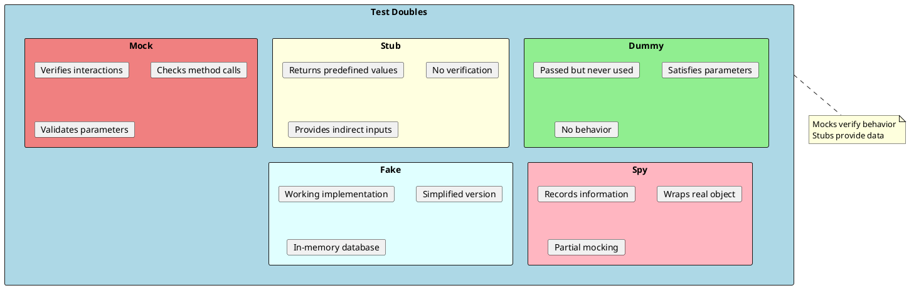
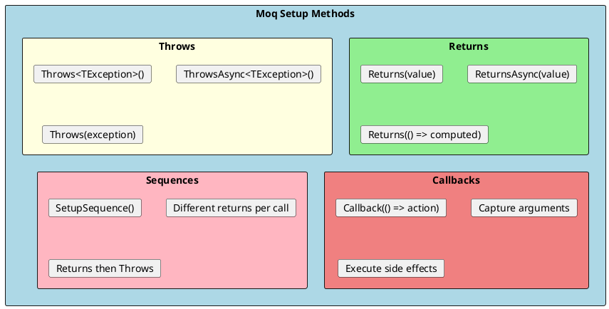
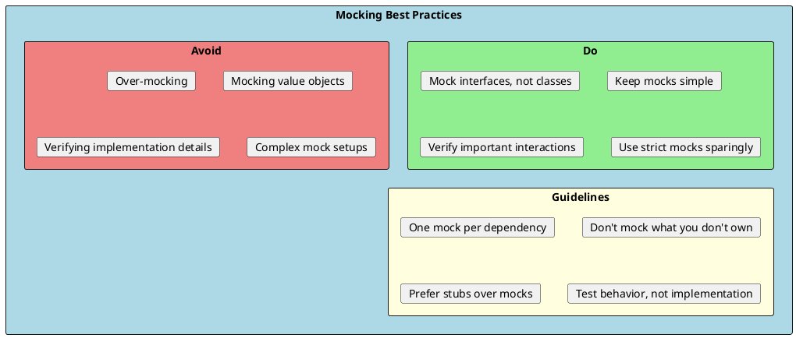

# Mocking

Mocking is the practice of creating fake objects that simulate the behavior of real dependencies. This allows unit tests to run in isolation, focusing on the code under test without relying on databases, APIs, or other external systems.



## Why Mocking?

Mocking enables:

1. **Isolation** - Test one class without its dependencies
2. **Speed** - No database or network calls
3. **Determinism** - Control exactly what dependencies return
4. **Edge Cases** - Simulate errors, timeouts, and unusual conditions
5. **Focus** - Test your code, not third-party libraries

---

## Moq Framework

Moq is the most popular mocking framework for .NET. It uses a fluent API to create mocks and set up their behavior.

```bash
dotnet add package Moq
```

### Basic Mocking

```csharp
using Moq;

public interface IUserRepository
{
    User? GetById(int id);
    Task<User?> GetByIdAsync(int id);
    IEnumerable<User> GetAll();
    void Add(User user);
    Task<bool> SaveAsync();
}

public class UserServiceTests
{
    private readonly Mock<IUserRepository> _mockRepository;
    private readonly UserService _userService;

    public UserServiceTests()
    {
        _mockRepository = new Mock<IUserRepository>();
        _userService = new UserService(_mockRepository.Object);
    }

    [Fact]
    public void GetUser_ExistingId_ReturnsUser()
    {
        // Arrange - Setup mock behavior
        var expectedUser = new User { Id = 1, Name = "John" };
        _mockRepository
            .Setup(r => r.GetById(1))
            .Returns(expectedUser);

        // Act
        var result = _userService.GetUser(1);

        // Assert
        Assert.NotNull(result);
        Assert.Equal("John", result.Name);
    }

    [Fact]
    public void GetUser_NonExistentId_ReturnsNull()
    {
        // Arrange
        _mockRepository
            .Setup(r => r.GetById(It.IsAny<int>()))
            .Returns((User?)null);

        // Act
        var result = _userService.GetUser(999);

        // Assert
        Assert.Null(result);
    }
}
```

---

## Setup Methods



### Return Values

```csharp
public class SetupExamples
{
    private readonly Mock<IProductRepository> _mock = new();

    [Fact]
    public void Setup_SimpleReturn()
    {
        // Return a specific value
        _mock.Setup(r => r.GetById(1))
            .Returns(new Product { Id = 1, Name = "Product 1" });

        // Return based on input
        _mock.Setup(r => r.GetById(It.IsAny<int>()))
            .Returns((int id) => new Product { Id = id, Name = $"Product {id}" });
    }

    [Fact]
    public async Task Setup_AsyncReturn()
    {
        // Async return
        _mock.Setup(r => r.GetByIdAsync(1))
            .ReturnsAsync(new Product { Id = 1, Name = "Product 1" });

        // Using Task.FromResult
        _mock.Setup(r => r.GetByIdAsync(It.IsAny<int>()))
            .Returns((int id) => Task.FromResult(new Product { Id = id }));
    }

    [Fact]
    public void Setup_Collection()
    {
        var products = new List<Product>
        {
            new Product { Id = 1, Name = "Product 1" },
            new Product { Id = 2, Name = "Product 2" }
        };

        _mock.Setup(r => r.GetAll()).Returns(products);
    }

    [Fact]
    public void Setup_ComputedValue()
    {
        var callCount = 0;

        // Returns different value each time
        _mock.Setup(r => r.GetById(It.IsAny<int>()))
            .Returns(() =>
            {
                callCount++;
                return new Product { Id = callCount };
            });
    }
}
```

### Argument Matching

```csharp
public class ArgumentMatchingExamples
{
    private readonly Mock<IOrderService> _mock = new();

    [Fact]
    public void ArgumentMatching_Examples()
    {
        // Any value of type
        _mock.Setup(s => s.GetOrder(It.IsAny<int>()))
            .Returns(new Order());

        // Specific value
        _mock.Setup(s => s.GetOrder(42))
            .Returns(new Order { Id = 42 });

        // Value in range
        _mock.Setup(s => s.GetOrder(It.IsInRange(1, 100, Moq.Range.Inclusive)))
            .Returns(new Order());

        // Value matching predicate
        _mock.Setup(s => s.GetOrder(It.Is<int>(id => id > 0)))
            .Returns(new Order());

        // Regex matching for strings
        _mock.Setup(s => s.Search(It.IsRegex("^test.*")))
            .Returns(new List<Order>());

        // Null or non-null
        _mock.Setup(s => s.Create(It.IsNotNull<Order>()))
            .Returns(true);

        // Any reference type
        _mock.Setup(s => s.Create(It.IsAny<Order>()))
            .Returns(true);
    }
}
```

### Throwing Exceptions

```csharp
public class ExceptionSetupExamples
{
    private readonly Mock<IPaymentService> _mock = new();

    [Fact]
    public void Setup_ThrowException()
    {
        // Throw specific exception
        _mock.Setup(s => s.ProcessPayment(It.IsAny<decimal>()))
            .Throws<InvalidOperationException>();

        // Throw with message
        _mock.Setup(s => s.ProcessPayment(-1))
            .Throws(new ArgumentException("Amount must be positive", "amount"));

        // Async throw
        _mock.Setup(s => s.ProcessPaymentAsync(It.IsAny<decimal>()))
            .ThrowsAsync(new PaymentException("Payment failed"));
    }

    [Fact]
    public void Test_ExceptionHandling()
    {
        _mock.Setup(s => s.ProcessPayment(It.IsAny<decimal>()))
            .Throws<PaymentException>();

        var service = new OrderService(_mock.Object);

        Assert.Throws<PaymentException>(() => service.CompleteOrder(1));
    }
}
```

### Sequences

```csharp
public class SequenceExamples
{
    private readonly Mock<IRetryService> _mock = new();

    [Fact]
    public void Setup_Sequence()
    {
        // Different returns on consecutive calls
        _mock.SetupSequence(s => s.TryConnect())
            .Returns(false)     // First call
            .Returns(false)     // Second call
            .Returns(true);     // Third call

        Assert.False(_mock.Object.TryConnect());
        Assert.False(_mock.Object.TryConnect());
        Assert.True(_mock.Object.TryConnect());
    }

    [Fact]
    public void Setup_ThrowsThenReturns()
    {
        // Throw then succeed
        _mock.SetupSequence(s => s.GetData())
            .Throws<TimeoutException>()
            .Returns("Success");

        Assert.Throws<TimeoutException>(() => _mock.Object.GetData());
        Assert.Equal("Success", _mock.Object.GetData());
    }
}
```

---

## Verifying Calls

Mocks can verify that methods were called with expected arguments:

```csharp
public class VerificationExamples
{
    private readonly Mock<INotificationService> _mock = new();

    [Fact]
    public void Verify_MethodWasCalled()
    {
        var service = new OrderService(_mock.Object);

        service.CompleteOrder(1);

        // Verify method was called
        _mock.Verify(s => s.SendNotification(It.IsAny<string>()), Times.Once);
    }

    [Fact]
    public void Verify_MethodCalledWithSpecificArgs()
    {
        var service = new OrderService(_mock.Object);

        service.CompleteOrder(42);

        // Verify specific argument
        _mock.Verify(s => s.SendNotification(
            It.Is<string>(msg => msg.Contains("42"))),
            Times.Once);
    }

    [Fact]
    public void Verify_CallCount()
    {
        var service = new OrderService(_mock.Object);

        service.NotifyAll();

        // Various Times options
        _mock.Verify(s => s.SendNotification(It.IsAny<string>()), Times.Exactly(3));
        _mock.Verify(s => s.SendNotification(It.IsAny<string>()), Times.AtLeast(2));
        _mock.Verify(s => s.SendNotification(It.IsAny<string>()), Times.AtMost(5));
        _mock.Verify(s => s.SendNotification(It.IsAny<string>()), Times.Between(1, 5, Moq.Range.Inclusive));
    }

    [Fact]
    public void Verify_MethodNeverCalled()
    {
        var service = new OrderService(_mock.Object);

        service.CreateDraftOrder();  // Shouldn't notify

        _mock.Verify(s => s.SendNotification(It.IsAny<string>()), Times.Never);
    }

    [Fact]
    public void Verify_NoOtherCalls()
    {
        var service = new OrderService(_mock.Object);
        _mock.Setup(s => s.SendNotification(It.IsAny<string>()));

        service.CompleteOrder(1);

        _mock.Verify(s => s.SendNotification(It.IsAny<string>()), Times.Once);
        _mock.VerifyNoOtherCalls();  // Fails if other methods called
    }
}
```

---

## Callbacks

Callbacks execute code when a mock method is called:

```csharp
public class CallbackExamples
{
    private readonly Mock<ILogger> _mockLogger = new();

    [Fact]
    public void Callback_CaptureArguments()
    {
        var capturedMessages = new List<string>();

        _mockLogger.Setup(l => l.Log(It.IsAny<string>()))
            .Callback<string>(msg => capturedMessages.Add(msg));

        var service = new MyService(_mockLogger.Object);
        service.DoWork();

        Assert.Contains("Starting work", capturedMessages);
        Assert.Contains("Work completed", capturedMessages);
    }

    [Fact]
    public void Callback_WithReturn()
    {
        var callCount = 0;

        var mock = new Mock<ICalculator>();
        mock.Setup(c => c.Add(It.IsAny<int>(), It.IsAny<int>()))
            .Callback(() => callCount++)
            .Returns((int a, int b) => a + b);

        var result = mock.Object.Add(2, 3);

        Assert.Equal(5, result);
        Assert.Equal(1, callCount);
    }

    [Fact]
    public void Callback_MultipleArguments()
    {
        var captures = new List<(int Id, string Name)>();

        var mock = new Mock<IUserService>();
        mock.Setup(s => s.UpdateUser(It.IsAny<int>(), It.IsAny<string>()))
            .Callback<int, string>((id, name) => captures.Add((id, name)));

        mock.Object.UpdateUser(1, "Alice");
        mock.Object.UpdateUser(2, "Bob");

        Assert.Equal(2, captures.Count);
        Assert.Equal((1, "Alice"), captures[0]);
        Assert.Equal((2, "Bob"), captures[1]);
    }
}
```

---

## Mocking Properties

```csharp
public interface IConfiguration
{
    string ConnectionString { get; }
    int MaxRetries { get; set; }
    ILogger Logger { get; }
}

public class PropertyMockingExamples
{
    [Fact]
    public void Mock_ReadOnlyProperty()
    {
        var mock = new Mock<IConfiguration>();

        mock.Setup(c => c.ConnectionString)
            .Returns("Server=test;Database=testdb");

        Assert.Equal("Server=test;Database=testdb", mock.Object.ConnectionString);
    }

    [Fact]
    public void Mock_ReadWriteProperty()
    {
        var mock = new Mock<IConfiguration>();

        // Track property changes
        mock.SetupProperty(c => c.MaxRetries, 3);  // Initial value

        mock.Object.MaxRetries = 5;

        Assert.Equal(5, mock.Object.MaxRetries);
    }

    [Fact]
    public void Mock_AllProperties()
    {
        var mock = new Mock<IConfiguration>();

        // Track all properties automatically
        mock.SetupAllProperties();

        mock.Object.MaxRetries = 10;

        Assert.Equal(10, mock.Object.MaxRetries);
    }

    [Fact]
    public void Mock_NestedProperty()
    {
        var mock = new Mock<IConfiguration>();
        var mockLogger = new Mock<ILogger>();

        mock.Setup(c => c.Logger).Returns(mockLogger.Object);

        Assert.NotNull(mock.Object.Logger);
    }
}
```

---

## NSubstitute Alternative

NSubstitute offers a simpler, more readable syntax:

```csharp
// dotnet add package NSubstitute

using NSubstitute;

public class NSubstituteExamples
{
    [Fact]
    public void NSubstitute_BasicUsage()
    {
        // Create substitute
        var repository = Substitute.For<IUserRepository>();

        // Setup return value
        repository.GetById(1).Returns(new User { Id = 1, Name = "John" });

        // Use
        var user = repository.GetById(1);

        // Verify
        repository.Received().GetById(1);
        repository.DidNotReceive().GetById(2);

        Assert.Equal("John", user.Name);
    }

    [Fact]
    public void NSubstitute_AnyArgument()
    {
        var repository = Substitute.For<IUserRepository>();

        // Any argument
        repository.GetById(Arg.Any<int>()).Returns(new User { Name = "Any User" });

        // Argument matching
        repository.GetById(Arg.Is<int>(id => id > 0)).Returns(new User { Name = "Valid" });
    }

    [Fact]
    public async Task NSubstitute_Async()
    {
        var repository = Substitute.For<IUserRepository>();

        repository.GetByIdAsync(1).Returns(new User { Name = "Async User" });

        var user = await repository.GetByIdAsync(1);

        Assert.Equal("Async User", user.Name);
    }

    [Fact]
    public void NSubstitute_ThrowException()
    {
        var repository = Substitute.For<IUserRepository>();

        repository.GetById(-1).Returns(x => throw new ArgumentException());

        Assert.Throws<ArgumentException>(() => repository.GetById(-1));
    }

    [Fact]
    public void NSubstitute_Callbacks()
    {
        var repository = Substitute.For<IUserRepository>();
        var savedUsers = new List<User>();

        repository.When(r => r.Add(Arg.Any<User>()))
            .Do(call => savedUsers.Add(call.Arg<User>()));

        repository.Add(new User { Name = "Test" });

        Assert.Single(savedUsers);
    }
}
```

---

## Comparison: Moq vs NSubstitute

| Feature | Moq | NSubstitute |
|---------|-----|-------------|
| **Syntax** | `.Setup().Returns()` | `.Returns()` directly |
| **Verification** | `.Verify()` | `.Received()` |
| **Any argument** | `It.IsAny<T>()` | `Arg.Any<T>()` |
| **Strictness** | Configurable | Lenient by default |
| **Learning curve** | Moderate | Easier |
| **Popularity** | Most popular | Growing |

---

## Best Practices



### Good vs Bad Mocking

```csharp
// ❌ Bad: Over-mocking
[Fact]
public void Bad_TooManyMocks()
{
    var mockRepo = new Mock<IUserRepository>();
    var mockLogger = new Mock<ILogger>();
    var mockCache = new Mock<ICache>();
    var mockValidator = new Mock<IValidator>();
    var mockMapper = new Mock<IMapper>();
    // 10 more mocks...

    // If you need this many mocks, consider redesigning
}

// ✅ Good: Focused mocking
[Fact]
public void Good_FocusedMock()
{
    var mockRepo = new Mock<IUserRepository>();
    mockRepo.Setup(r => r.GetById(1)).Returns(new User { Id = 1 });

    var service = new UserService(mockRepo.Object);
    var result = service.GetUser(1);

    Assert.NotNull(result);
}

// ❌ Bad: Verifying implementation details
[Fact]
public void Bad_VerifyingImplementation()
{
    var mock = new Mock<IRepository>();

    var service = new Service(mock.Object);
    service.DoWork();

    // Testing HOW, not WHAT
    mock.Verify(r => r.BeginTransaction(), Times.Once);
    mock.Verify(r => r.Commit(), Times.Once);
}

// ✅ Good: Verify behavior
[Fact]
public void Good_VerifyBehavior()
{
    var mock = new Mock<INotificationService>();

    var service = new OrderService(mock.Object);
    service.CompleteOrder(1);

    // Testing that notification was sent (behavior)
    mock.Verify(n => n.Send(It.IsAny<OrderNotification>()), Times.Once);
}

// ❌ Bad: Mocking concrete classes
[Fact]
public void Bad_MockingConcreteClass()
{
    var mock = new Mock<UserRepository>();  // Concrete class
    // This requires virtual methods and is fragile
}

// ✅ Good: Mock interfaces
[Fact]
public void Good_MockInterface()
{
    var mock = new Mock<IUserRepository>();  // Interface
    // Clean and flexible
}
```

---

## Interview Questions & Answers

### Q1: What is the difference between a mock and a stub?

**Answer**:
- **Stub**: Provides predefined responses to method calls. Used for providing indirect inputs.
- **Mock**: Verifies that certain methods were called with expected arguments. Used for verifying behavior.

Stubs answer "what should I return?" while mocks answer "was this called correctly?"

### Q2: When should you use mocking?

**Answer**: Use mocking when:
- Testing code with external dependencies (databases, APIs)
- You need deterministic test behavior
- You want to simulate error conditions
- Dependencies are slow or unreliable
- You want to verify interactions

### Q3: What is the difference between Moq and NSubstitute?

**Answer**:
- **Moq**: More verbose syntax with `.Setup().Returns()`, more explicit
- **NSubstitute**: Cleaner syntax with direct `.Returns()`, easier to learn

Both are capable; NSubstitute is simpler, Moq is more popular.

### Q4: How do you verify a method was called?

**Answer** (Moq):
```csharp
mock.Verify(s => s.SendEmail(It.IsAny<string>()), Times.Once);
mock.Verify(s => s.SendEmail("specific@email.com"), Times.Exactly(2));
mock.Verify(s => s.SendEmail(It.IsAny<string>()), Times.Never);
```

### Q5: What is "over-mocking"?

**Answer**: Over-mocking is using too many mocks, making tests:
- Tightly coupled to implementation
- Hard to maintain
- Less meaningful

Signs: Many mocks, complex setups, tests that break when refactoring.

### Q6: Should you mock everything?

**Answer**: No. Don't mock:
- Value objects and DTOs
- Third-party libraries you don't own (wrap them)
- Simple internal classes
- The class under test

Only mock external dependencies and interfaces at architectural boundaries.

