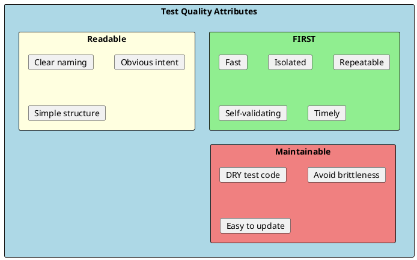
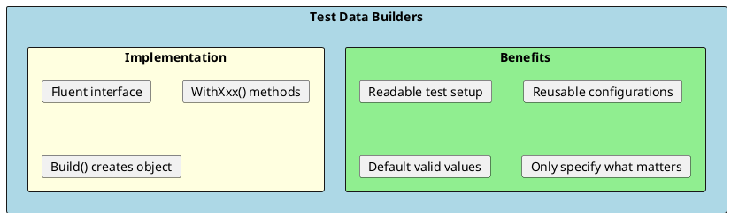
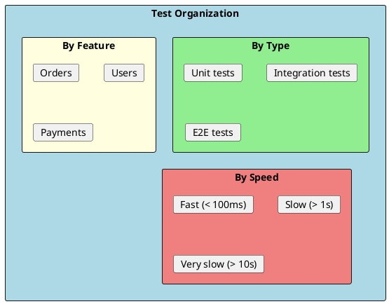
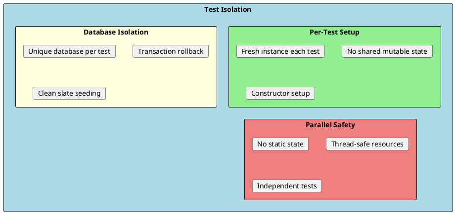

# Test Patterns & Best Practices

Effective testing requires more than knowing a framework. Understanding test patterns and best practices helps you write maintainable, reliable, and meaningful tests that provide real value.



## AAA Pattern (Arrange-Act-Assert)

The most fundamental test pattern. Every test should have three clear sections:

```csharp
[Fact]
public void Calculate_TwoPositiveNumbers_ReturnsSum()
{
    // Arrange - Set up test data and dependencies
    var calculator = new Calculator();
    int a = 5;
    int b = 3;

    // Act - Execute the code under test
    var result = calculator.Add(a, b);

    // Assert - Verify the expected outcome
    Assert.Equal(8, result);
}
```

### Guidelines

```csharp
// ✅ Good: Clear AAA sections
[Fact]
public void CreateOrder_ValidRequest_ReturnsOrder()
{
    // Arrange
    var request = new CreateOrderRequest
    {
        CustomerId = 1,
        Items = new[] { new OrderItem { ProductId = 1, Quantity = 2 } }
    };
    var service = new OrderService(_mockRepository.Object);

    // Act
    var result = service.CreateOrder(request);

    // Assert
    Assert.NotNull(result);
    Assert.Equal(1, result.CustomerId);
    Assert.Single(result.Items);
}

// ❌ Bad: Mixed concerns, unclear structure
[Fact]
public void BadTest()
{
    var service = new OrderService(_mockRepository.Object);
    var result = service.CreateOrder(new CreateOrderRequest { CustomerId = 1 });
    Assert.NotNull(result);
    var result2 = service.GetOrder(result.Id);  // More acting after asserting
    Assert.Equal(result.Id, result2.Id);
}
```

---

## Builder Pattern for Test Data

Create complex test objects cleanly using the builder pattern:



### Builder Implementation

```csharp
public class OrderBuilder
{
    private int _id = 1;
    private int _customerId = 1;
    private OrderStatus _status = OrderStatus.Pending;
    private DateTime _createdAt = DateTime.UtcNow;
    private List<OrderItem> _items = new();
    private decimal _discount = 0;

    public OrderBuilder WithId(int id)
    {
        _id = id;
        return this;
    }

    public OrderBuilder WithCustomerId(int customerId)
    {
        _customerId = customerId;
        return this;
    }

    public OrderBuilder WithStatus(OrderStatus status)
    {
        _status = status;
        return this;
    }

    public OrderBuilder WithItem(int productId, int quantity, decimal price)
    {
        _items.Add(new OrderItem
        {
            ProductId = productId,
            Quantity = quantity,
            UnitPrice = price
        });
        return this;
    }

    public OrderBuilder WithDiscount(decimal discount)
    {
        _discount = discount;
        return this;
    }

    public Order Build()
    {
        return new Order
        {
            Id = _id,
            CustomerId = _customerId,
            Status = _status,
            CreatedAt = _createdAt,
            Items = _items,
            Discount = _discount
        };
    }

    // Preset configurations
    public static OrderBuilder Default() => new OrderBuilder();

    public static OrderBuilder CompletedOrder() => new OrderBuilder()
        .WithStatus(OrderStatus.Completed)
        .WithItem(1, 2, 10.00m);

    public static OrderBuilder CancelledOrder() => new OrderBuilder()
        .WithStatus(OrderStatus.Cancelled);
}
```

### Using Builders in Tests

```csharp
public class OrderServiceTests
{
    [Fact]
    public void CalculateTotal_WithDiscount_AppliesDiscount()
    {
        // Arrange - Clear, focused test data
        var order = OrderBuilder.Default()
            .WithItem(productId: 1, quantity: 2, price: 50.00m)
            .WithItem(productId: 2, quantity: 1, price: 30.00m)
            .WithDiscount(10.00m)
            .Build();

        var service = new OrderService();

        // Act
        var total = service.CalculateTotal(order);

        // Assert
        Assert.Equal(120.00m, total);  // (2*50 + 1*30) - 10
    }

    [Fact]
    public void CanCancel_CompletedOrder_ReturnsFalse()
    {
        // Arrange - Use preset
        var order = OrderBuilder.CompletedOrder().Build();
        var service = new OrderService();

        // Act
        var canCancel = service.CanCancel(order);

        // Assert
        Assert.False(canCancel);
    }
}
```

---

## Object Mother Pattern

Centralize test data creation in a single class:

```csharp
public static class TestData
{
    public static class Users
    {
        public static User ValidUser() => new User
        {
            Id = 1,
            Name = "John Doe",
            Email = "john@example.com",
            IsActive = true
        };

        public static User InactiveUser() => new User
        {
            Id = 2,
            Name = "Jane Doe",
            Email = "jane@example.com",
            IsActive = false
        };

        public static User AdminUser() => new User
        {
            Id = 3,
            Name = "Admin",
            Email = "admin@example.com",
            Role = "Admin",
            IsActive = true
        };
    }

    public static class Orders
    {
        public static Order PendingOrder() => new Order
        {
            Id = 1,
            Status = OrderStatus.Pending,
            Items = new List<OrderItem>
            {
                new OrderItem { ProductId = 1, Quantity = 1, UnitPrice = 10.00m }
            }
        };

        public static Order OrderWithItems(params (int productId, int qty, decimal price)[] items)
        {
            return new Order
            {
                Id = 1,
                Status = OrderStatus.Pending,
                Items = items.Select(i => new OrderItem
                {
                    ProductId = i.productId,
                    Quantity = i.qty,
                    UnitPrice = i.price
                }).ToList()
            };
        }
    }
}

// Usage
[Fact]
public void DeactivateUser_ActiveUser_SetsInactive()
{
    var user = TestData.Users.ValidUser();
    var service = new UserService();

    service.Deactivate(user);

    Assert.False(user.IsActive);
}
```

---

## Test Fixture Pattern

Share setup across multiple tests:

```csharp
// Fixture class with shared resources
public class DatabaseFixture : IAsyncLifetime
{
    public ApplicationDbContext Context { get; private set; } = null!;

    public async Task InitializeAsync()
    {
        var options = new DbContextOptionsBuilder<ApplicationDbContext>()
            .UseInMemoryDatabase(Guid.NewGuid().ToString())
            .Options;

        Context = new ApplicationDbContext(options);
        await SeedDataAsync();
    }

    private async Task SeedDataAsync()
    {
        Context.Users.AddRange(
            new User { Id = 1, Name = "User 1" },
            new User { Id = 2, Name = "User 2" }
        );
        await Context.SaveChangesAsync();
    }

    public async Task DisposeAsync()
    {
        await Context.DisposeAsync();
    }
}

// Test class using fixture
public class UserRepositoryTests : IClassFixture<DatabaseFixture>
{
    private readonly DatabaseFixture _fixture;

    public UserRepositoryTests(DatabaseFixture fixture)
    {
        _fixture = fixture;
    }

    [Fact]
    public async Task GetAll_ReturnsAllUsers()
    {
        var repository = new UserRepository(_fixture.Context);

        var users = await repository.GetAllAsync();

        Assert.Equal(2, users.Count);
    }
}
```

---

## Test Categories and Organization



### Using Traits

```csharp
public class OrderServiceTests
{
    [Fact]
    [Trait("Category", "Unit")]
    [Trait("Feature", "Orders")]
    public void CreateOrder_ValidInput_CreatesOrder() { }

    [Fact]
    [Trait("Category", "Integration")]
    [Trait("Feature", "Orders")]
    [Trait("Speed", "Slow")]
    public void CreateOrder_WithDatabase_PersistsOrder() { }
}

// Run specific categories:
// dotnet test --filter "Category=Unit"
// dotnet test --filter "Feature=Orders"
// dotnet test --filter "Category=Unit&Feature=Orders"
```

### Custom Trait Attributes

```csharp
// Custom attributes for cleaner code
public class UnitTestAttribute : FactAttribute
{
    public UnitTestAttribute()
    {
        // Can add common trait
    }
}

public class IntegrationTestAttribute : FactAttribute
{
    public IntegrationTestAttribute()
    {
        // Mark as integration test
    }
}

public class SlowTestAttribute : FactAttribute
{
    public SlowTestAttribute()
    {
        Skip = Environment.GetEnvironmentVariable("RUN_SLOW_TESTS") != "true"
            ? "Slow tests skipped"
            : null;
    }
}

// Usage
[UnitTest]
public void FastTest() { }

[IntegrationTest]
[SlowTest]
public void SlowDatabaseTest() { }
```

---

## Testing Edge Cases

```csharp
public class EdgeCaseTests
{
    [Theory]
    [InlineData(null)]
    [InlineData("")]
    [InlineData("   ")]
    public void Validate_EmptyOrNullName_ReturnsFalse(string? name)
    {
        var validator = new UserValidator();
        var user = new User { Name = name };

        var result = validator.Validate(user);

        Assert.False(result.IsValid);
    }

    [Theory]
    [InlineData(0)]
    [InlineData(-1)]
    [InlineData(int.MinValue)]
    public void GetById_InvalidId_ThrowsArgumentException(int id)
    {
        var service = new UserService();

        Assert.Throws<ArgumentException>(() => service.GetById(id));
    }

    [Fact]
    public void ProcessItems_EmptyCollection_ReturnsEmptyResult()
    {
        var processor = new ItemProcessor();

        var result = processor.Process(new List<Item>());

        Assert.Empty(result);
    }

    [Fact]
    public void ProcessItems_NullCollection_ThrowsArgumentNullException()
    {
        var processor = new ItemProcessor();

        Assert.Throws<ArgumentNullException>(() => processor.Process(null!));
    }

    [Fact]
    public void Calculate_MaxValues_DoesNotOverflow()
    {
        var calculator = new Calculator();

        // Test boundary conditions
        var result = calculator.Add(int.MaxValue - 1, 1);

        Assert.Equal(int.MaxValue, result);
    }
}
```

---

## Handling Async Tests

```csharp
public class AsyncTestPatterns
{
    [Fact]
    public async Task Async_SimpleTest()
    {
        var service = new AsyncService();

        var result = await service.GetDataAsync();

        Assert.NotNull(result);
    }

    [Fact]
    public async Task Async_WithTimeout()
    {
        var service = new AsyncService();

        var task = service.LongRunningOperationAsync();
        var completedTask = await Task.WhenAny(task, Task.Delay(5000));

        Assert.Equal(task, completedTask);  // Completed before timeout
    }

    [Fact]
    public async Task Async_Exception()
    {
        var service = new AsyncService();

        await Assert.ThrowsAsync<InvalidOperationException>(
            () => service.FailingOperationAsync());
    }

    [Fact]
    public async Task Async_MultipleOperations()
    {
        var service = new AsyncService();

        var tasks = Enumerable.Range(1, 10)
            .Select(i => service.ProcessAsync(i))
            .ToList();

        var results = await Task.WhenAll(tasks);

        Assert.Equal(10, results.Length);
        Assert.All(results, r => Assert.True(r.Success));
    }

    // With FluentAssertions
    [Fact]
    public async Task Async_FluentAssertions()
    {
        var service = new AsyncService();

        Func<Task> act = () => service.FailingOperationAsync();

        await act.Should().ThrowAsync<InvalidOperationException>()
            .WithMessage("*failed*");
    }
}
```

---

## Test Isolation Patterns



### Ensuring Isolation

```csharp
// ✅ Good: Each test gets fresh instance
public class IsolatedTests
{
    private readonly Mock<IRepository> _mockRepo;
    private readonly MyService _service;

    public IsolatedTests()
    {
        // Fresh mocks for each test
        _mockRepo = new Mock<IRepository>();
        _service = new MyService(_mockRepo.Object);
    }

    [Fact]
    public void Test1()
    {
        _mockRepo.Setup(r => r.Get(1)).Returns(new Item());
        // Test uses its own mock setup
    }

    [Fact]
    public void Test2()
    {
        // Different setup, no interference from Test1
        _mockRepo.Setup(r => r.Get(1)).Returns((Item)null!);
    }
}

// ❌ Bad: Shared mutable state
public class BadIsolationTests
{
    private static int _counter = 0;  // Shared across tests!

    [Fact]
    public void Test1()
    {
        _counter++;
        Assert.Equal(1, _counter);  // Might fail depending on run order
    }

    [Fact]
    public void Test2()
    {
        _counter++;
        Assert.Equal(1, _counter);  // Will likely fail
    }
}
```

---

## Avoiding Test Smells

### Smell: Testing Multiple Concerns

```csharp
// ❌ Bad: Multiple concerns in one test
[Fact]
public void Bad_MultipleThings()
{
    var service = new OrderService();

    var order = service.CreateOrder(request);
    Assert.NotNull(order);  // Testing creation

    service.AddItem(order.Id, item);
    Assert.Single(order.Items);  // Testing adding items

    service.Complete(order.Id);
    Assert.Equal(OrderStatus.Completed, order.Status);  // Testing completion

    // This test does too much!
}

// ✅ Good: Separate focused tests
[Fact]
public void CreateOrder_ValidRequest_ReturnsOrder()
{
    var service = new OrderService();
    var order = service.CreateOrder(request);
    Assert.NotNull(order);
}

[Fact]
public void AddItem_ExistingOrder_AddsItem()
{
    var service = new OrderService();
    var order = service.CreateOrder(request);

    service.AddItem(order.Id, item);

    Assert.Single(order.Items);
}
```

### Smell: Conditional Logic in Tests

```csharp
// ❌ Bad: Logic in test
[Fact]
public void Bad_LogicInTest()
{
    var items = service.GetItems();

    foreach (var item in items)
    {
        if (item.Type == "Special")
        {
            Assert.True(item.Price > 100);
        }
        else
        {
            Assert.True(item.Price <= 100);
        }
    }
}

// ✅ Good: Separate clear tests
[Fact]
public void SpecialItems_HavePriceAbove100()
{
    var specialItems = service.GetItems().Where(i => i.Type == "Special");

    Assert.All(specialItems, item => Assert.True(item.Price > 100));
}

[Fact]
public void RegularItems_HavePriceAtOrBelow100()
{
    var regularItems = service.GetItems().Where(i => i.Type != "Special");

    Assert.All(regularItems, item => Assert.True(item.Price <= 100));
}
```

### Smell: Magic Values

```csharp
// ❌ Bad: Magic values without explanation
[Fact]
public void Bad_MagicValues()
{
    var result = calculator.Calculate(5, 3, 2);
    Assert.Equal(13, result);  // Why 13?
}

// ✅ Good: Self-documenting or explained
[Fact]
public void Calculate_WithBaseRateAndMultiplier_ReturnsCorrectValue()
{
    // Arrange
    const int baseValue = 5;
    const int rate = 3;
    const int multiplier = 2;
    const int expectedResult = baseValue + (rate * multiplier);  // 5 + 6 = 11

    // Act
    var result = calculator.Calculate(baseValue, rate, multiplier);

    // Assert
    Assert.Equal(expectedResult, result);
}
```

---

## Code Coverage Guidelines

```csharp
// Focus on meaningful coverage, not percentage

// ✅ Test critical business logic
public void ProcessPayment_ValidPayment_DeductsFromBalance() { }
public void ProcessPayment_InsufficientFunds_ReturnsError() { }
public void ProcessPayment_NegativeAmount_ThrowsException() { }

// ❌ Don't bother testing these
public class User
{
    public int Id { get; set; }     // No need to test getters/setters
    public string Name { get; set; }
}

// ❌ Don't test framework code
public void Test_DependencyInjection_Works() { }  // Trust the framework
```

---

## Interview Questions & Answers

### Q1: What is the AAA pattern?

**Answer**: Arrange-Act-Assert divides tests into three sections:
- **Arrange**: Set up test data and dependencies
- **Act**: Execute the code under test
- **Assert**: Verify the expected outcome

This pattern makes tests readable and maintainable.

### Q2: What is the Test Builder pattern?

**Answer**: A pattern for creating test objects using fluent interface:
```csharp
var order = OrderBuilder.Default()
    .WithCustomer(1)
    .WithItem(productId: 1, quantity: 2)
    .Build();
```

Benefits: Readable, reusable, only specifies relevant data.

### Q3: What are FIRST principles?

**Answer**:
- **Fast**: Tests run quickly
- **Isolated**: No dependencies between tests
- **Repeatable**: Same result every time
- **Self-validating**: Pass or fail, no manual inspection
- **Timely**: Written with the code

### Q4: How do you ensure test isolation?

**Answer**:
- Create new instances for each test
- Avoid static/shared mutable state
- Use unique databases or transactions
- Each test should be independent

### Q5: What is a test smell?

**Answer**: Signs of poorly written tests:
- Multiple assertions on different behaviors
- Conditional logic in tests
- Magic values without explanation
- Tests that fail intermittently
- Tests coupled to implementation

### Q6: How much code coverage is enough?

**Answer**: There's no universal number, but:
- Focus on **critical paths** (payments, auth)
- Cover **edge cases** and error handling
- 70-80% is a common target
- 100% coverage doesn't mean no bugs
- Quality over quantity

