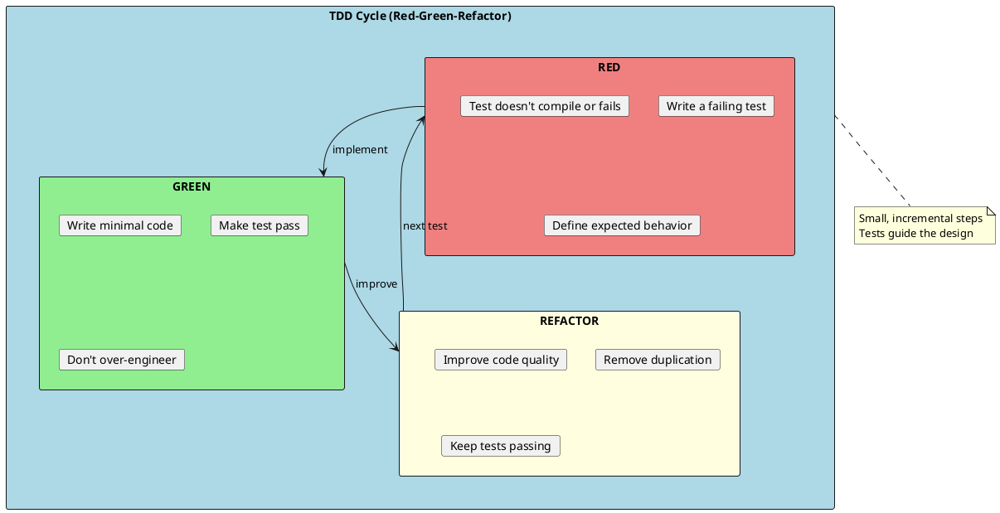
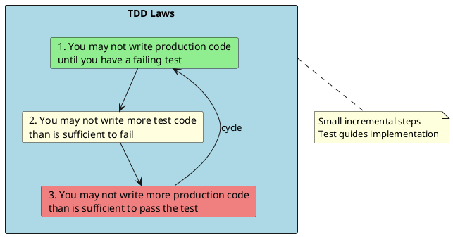
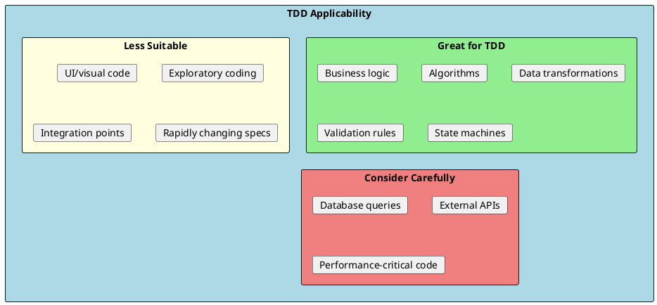

# Test-Driven Development (TDD)

Test-Driven Development is a software development methodology where you write tests before writing the implementation code. TDD leads to better-designed, more testable, and more maintainable code.



## Why TDD?

TDD provides several benefits:

1. **Better Design** - Writing tests first forces you to think about interfaces and dependencies
2. **Documentation** - Tests describe what the code should do
3. **Confidence** - Always have a safety net when making changes
4. **Less Debugging** - Bugs are caught immediately
5. **Focus** - Work on one thing at a time

## The Three Laws of TDD



---

## TDD Example: String Calculator

Let's build a string calculator using TDD, step by step.

### Step 1: First Failing Test (RED)

```csharp
// Test: Empty string returns 0
public class StringCalculatorTests
{
    [Fact]
    public void Add_EmptyString_ReturnsZero()
    {
        // Arrange
        var calculator = new StringCalculator();

        // Act
        var result = calculator.Add("");

        // Assert
        Assert.Equal(0, result);
    }
}

// This won't compile - StringCalculator doesn't exist yet!
```

### Step 2: Make it Pass (GREEN)

```csharp
// Minimal implementation to pass the test
public class StringCalculator
{
    public int Add(string numbers)
    {
        return 0;  // Simplest code that passes
    }
}

// Test passes!
```

### Step 3: Next Test (RED)

```csharp
[Fact]
public void Add_SingleNumber_ReturnsThatNumber()
{
    var calculator = new StringCalculator();

    var result = calculator.Add("5");

    Assert.Equal(5, result);
}

// Test fails - returns 0, expected 5
```

### Step 4: Make it Pass (GREEN)

```csharp
public int Add(string numbers)
{
    if (string.IsNullOrEmpty(numbers))
        return 0;

    return int.Parse(numbers);
}

// Test passes!
```

### Step 5: Next Test (RED)

```csharp
[Fact]
public void Add_TwoNumbers_ReturnsSum()
{
    var calculator = new StringCalculator();

    var result = calculator.Add("1,2");

    Assert.Equal(3, result);
}

// Test fails - Parse fails on "1,2"
```

### Step 6: Make it Pass (GREEN)

```csharp
public int Add(string numbers)
{
    if (string.IsNullOrEmpty(numbers))
        return 0;

    var parts = numbers.Split(',');
    return parts.Sum(int.Parse);
}

// All tests pass!
```

### Step 7: Refactor (REFACTOR)

```csharp
public class StringCalculator
{
    public int Add(string numbers)
    {
        if (string.IsNullOrEmpty(numbers))
            return 0;

        return ParseNumbers(numbers).Sum();
    }

    private IEnumerable<int> ParseNumbers(string numbers)
    {
        return numbers.Split(',').Select(int.Parse);
    }
}

// Run tests - still passing!
```

### Continue the Cycle

```csharp
// Add support for newlines as delimiters
[Fact]
public void Add_NewlineDelimiter_ReturnsSum()
{
    var calculator = new StringCalculator();

    var result = calculator.Add("1\n2,3");

    Assert.Equal(6, result);
}

// Implement
private IEnumerable<int> ParseNumbers(string numbers)
{
    return numbers
        .Split(new[] { ',', '\n' })
        .Select(int.Parse);
}

// Add support for custom delimiters
[Fact]
public void Add_CustomDelimiter_ReturnsSum()
{
    var calculator = new StringCalculator();

    var result = calculator.Add("//;\n1;2");

    Assert.Equal(3, result);
}

// Implement support for custom delimiter
public int Add(string numbers)
{
    if (string.IsNullOrEmpty(numbers))
        return 0;

    var (delimiter, numberString) = ExtractDelimiter(numbers);
    return ParseNumbers(numberString, delimiter).Sum();
}

private (char delimiter, string numbers) ExtractDelimiter(string input)
{
    if (input.StartsWith("//"))
    {
        return (input[2], input[4..]);
    }
    return (',', input);
}
```

---

## TDD for a Real Service

Let's build an order service using TDD:

### Requirements
- Create orders with items
- Calculate totals with tax
- Apply discounts
- Validate minimum order amount

### Step 1: Start with Simplest Behavior

```csharp
public class OrderServiceTests
{
    [Fact]
    public void CreateOrder_EmptyItems_ThrowsException()
    {
        // Arrange
        var service = new OrderService();
        var request = new CreateOrderRequest { Items = new List<OrderItem>() };

        // Act & Assert
        Assert.Throws<InvalidOperationException>(() => service.CreateOrder(request));
    }
}

// Implementation
public class OrderService
{
    public Order CreateOrder(CreateOrderRequest request)
    {
        if (!request.Items.Any())
            throw new InvalidOperationException("Order must have at least one item");

        throw new NotImplementedException();  // RED for next test
    }
}
```

### Step 2: Add Happy Path

```csharp
[Fact]
public void CreateOrder_WithItems_ReturnsOrder()
{
    var service = new OrderService();
    var request = new CreateOrderRequest
    {
        CustomerId = 1,
        Items = new List<OrderItem>
        {
            new OrderItem { ProductId = 1, Quantity = 1, UnitPrice = 10.00m }
        }
    };

    var order = service.CreateOrder(request);

    Assert.NotNull(order);
    Assert.Equal(1, order.CustomerId);
    Assert.Single(order.Items);
}

// Implementation
public Order CreateOrder(CreateOrderRequest request)
{
    if (!request.Items.Any())
        throw new InvalidOperationException("Order must have at least one item");

    return new Order
    {
        CustomerId = request.CustomerId,
        Items = request.Items.ToList()
    };
}
```

### Step 3: Add Total Calculation

```csharp
[Fact]
public void CreateOrder_WithItems_CalculatesSubtotal()
{
    var service = new OrderService();
    var request = new CreateOrderRequest
    {
        CustomerId = 1,
        Items = new List<OrderItem>
        {
            new OrderItem { ProductId = 1, Quantity = 2, UnitPrice = 10.00m },
            new OrderItem { ProductId = 2, Quantity = 1, UnitPrice = 25.00m }
        }
    };

    var order = service.CreateOrder(request);

    Assert.Equal(45.00m, order.Subtotal);  // (2 * 10) + (1 * 25)
}

// Add to implementation
return new Order
{
    CustomerId = request.CustomerId,
    Items = request.Items.ToList(),
    Subtotal = request.Items.Sum(i => i.Quantity * i.UnitPrice)
};
```

### Step 4: Add Tax Calculation

```csharp
[Fact]
public void CreateOrder_WithItems_CalculatesTax()
{
    var service = new OrderService(taxRate: 0.10m);  // 10% tax
    var request = new CreateOrderRequest
    {
        CustomerId = 1,
        Items = new List<OrderItem>
        {
            new OrderItem { ProductId = 1, Quantity = 1, UnitPrice = 100.00m }
        }
    };

    var order = service.CreateOrder(request);

    Assert.Equal(100.00m, order.Subtotal);
    Assert.Equal(10.00m, order.Tax);
    Assert.Equal(110.00m, order.Total);
}

// Implementation evolves
public class OrderService
{
    private readonly decimal _taxRate;

    public OrderService(decimal taxRate = 0.10m)
    {
        _taxRate = taxRate;
    }

    public Order CreateOrder(CreateOrderRequest request)
    {
        if (!request.Items.Any())
            throw new InvalidOperationException("Order must have at least one item");

        var subtotal = request.Items.Sum(i => i.Quantity * i.UnitPrice);
        var tax = subtotal * _taxRate;

        return new Order
        {
            CustomerId = request.CustomerId,
            Items = request.Items.ToList(),
            Subtotal = subtotal,
            Tax = tax,
            Total = subtotal + tax
        };
    }
}
```

### Step 5: Add Discount Logic

```csharp
[Fact]
public void CreateOrder_WithDiscount_AppliesDiscount()
{
    var service = new OrderService(taxRate: 0.10m);
    var request = new CreateOrderRequest
    {
        CustomerId = 1,
        Items = new List<OrderItem>
        {
            new OrderItem { ProductId = 1, Quantity = 1, UnitPrice = 100.00m }
        },
        DiscountCode = "SAVE10"
    };

    var order = service.CreateOrder(request);

    Assert.Equal(100.00m, order.Subtotal);
    Assert.Equal(10.00m, order.Discount);  // 10% discount
    Assert.Equal(9.00m, order.Tax);        // Tax on 90
    Assert.Equal(99.00m, order.Total);     // 90 + 9
}
```

---

## TDD with Dependencies

When the code under test has dependencies, mock them:

```csharp
public class PaymentServiceTests
{
    private readonly Mock<IPaymentGateway> _mockGateway;
    private readonly Mock<IOrderRepository> _mockOrderRepo;
    private readonly PaymentService _service;

    public PaymentServiceTests()
    {
        _mockGateway = new Mock<IPaymentGateway>();
        _mockOrderRepo = new Mock<IOrderRepository>();
        _service = new PaymentService(_mockGateway.Object, _mockOrderRepo.Object);
    }

    [Fact]
    public void ProcessPayment_SuccessfulPayment_UpdatesOrderStatus()
    {
        // Arrange
        var order = new Order { Id = 1, Total = 100.00m, Status = OrderStatus.Pending };
        _mockOrderRepo.Setup(r => r.GetById(1)).Returns(order);
        _mockGateway.Setup(g => g.Charge(100.00m, It.IsAny<string>()))
            .Returns(new PaymentResult { Success = true });

        // Act
        var result = _service.ProcessPayment(1, "card-token");

        // Assert
        Assert.True(result.Success);
        Assert.Equal(OrderStatus.Paid, order.Status);
        _mockOrderRepo.Verify(r => r.Save(order), Times.Once);
    }

    [Fact]
    public void ProcessPayment_FailedPayment_DoesNotUpdateStatus()
    {
        // Arrange
        var order = new Order { Id = 1, Total = 100.00m, Status = OrderStatus.Pending };
        _mockOrderRepo.Setup(r => r.GetById(1)).Returns(order);
        _mockGateway.Setup(g => g.Charge(It.IsAny<decimal>(), It.IsAny<string>()))
            .Returns(new PaymentResult { Success = false, Error = "Card declined" });

        // Act
        var result = _service.ProcessPayment(1, "card-token");

        // Assert
        Assert.False(result.Success);
        Assert.Equal(OrderStatus.Pending, order.Status);  // Unchanged
        _mockOrderRepo.Verify(r => r.Save(It.IsAny<Order>()), Times.Never);
    }
}
```

---

## When to Use TDD



---

## TDD Anti-Patterns

### 1. Test After (Not TDD)

```csharp
// ❌ Writing tests after implementation defeats the purpose
public class Calculator
{
    public int Add(int a, int b) => a + b;
    public int Subtract(int a, int b) => a - b;
    // ... full implementation first
}

// Then writing tests to cover it - this is not TDD!
```

### 2. Too Big Steps

```csharp
// ❌ Bad: Trying to implement everything at once
[Fact]
public void OrderService_HandleFullOrderLifecycle()
{
    // Tests creation, payment, shipping, completion all at once
    // Too much for one step!
}

// ✅ Good: Small incremental tests
[Fact]
public void CreateOrder_ValidRequest_ReturnsOrder() { }

[Fact]
public void ProcessPayment_ValidCard_MarksAsPaid() { }

[Fact]
public void Ship_PaidOrder_CreatesShipment() { }
```

### 3. Testing Implementation Details

```csharp
// ❌ Bad: Testing private methods or internal state
[Fact]
public void Bad_TestInternalState()
{
    var service = new OrderService();
    service.CreateOrder(request);

    // Checking internal implementation detail
    var field = typeof(OrderService)
        .GetField("_orderCount", BindingFlags.NonPublic | BindingFlags.Instance);
    Assert.Equal(1, field.GetValue(service));
}

// ✅ Good: Test observable behavior
[Fact]
public void Good_TestBehavior()
{
    var service = new OrderService();
    var order = service.CreateOrder(request);

    Assert.NotNull(order);
    Assert.True(order.Id > 0);
}
```

---

## TDD Tips

### Start with the Simplest Case

```csharp
// Start with edge cases or simplest scenarios
[Fact]
public void Parse_EmptyString_ReturnsEmptyList() { }  // Start here

[Fact]
public void Parse_SingleItem_ReturnsSingleElement() { }  // Then this

[Fact]
public void Parse_MultipleItems_ReturnsAllElements() { }  // Then this
```

### Use Triangulation

When you're not sure what the general solution should be, use multiple specific examples:

```csharp
// Instead of guessing the algorithm, let tests reveal it
[Theory]
[InlineData(1, 1)]
[InlineData(2, 4)]
[InlineData(3, 9)]
[InlineData(4, 16)]
public void Square_VariousNumbers_ReturnsSquare(int input, int expected)
{
    Assert.Equal(expected, calculator.Square(input));
}
// Pattern emerges: input * input
```

### Fake It Till You Make It

```csharp
// Start with hardcoded returns
public int Add(int a, int b)
{
    return 3;  // First test: Add(1, 2) expects 3
}

// Add another test case that forces generalization
[Theory]
[InlineData(1, 2, 3)]
[InlineData(2, 3, 5)]  // Forces you to implement properly
public void Add_TwoNumbers_ReturnsSum(int a, int b, int expected) { }
```

---

## Interview Questions & Answers

### Q1: What is TDD?

**Answer**: Test-Driven Development is writing tests before implementation. The cycle is:
1. **Red**: Write a failing test
2. **Green**: Write minimal code to pass
3. **Refactor**: Improve code quality

Tests drive the design of the code.

### Q2: What are the benefits of TDD?

**Answer**:
- **Better design**: Forces thinking about interfaces first
- **Documentation**: Tests describe expected behavior
- **Confidence**: Safe refactoring with test safety net
- **Less debugging**: Bugs caught immediately
- **Focus**: Work on one small piece at a time

### Q3: What is Red-Green-Refactor?

**Answer**:
- **Red**: Write a test that fails (or doesn't compile)
- **Green**: Write the simplest code to make it pass
- **Refactor**: Improve code while keeping tests green

Never skip the refactor step!

### Q4: When should you NOT use TDD?

**Answer**: TDD is less suitable for:
- UI/visual code
- Exploratory/prototyping work
- Spike solutions
- Code with rapidly changing requirements
- Simple CRUD with no business logic

### Q5: What is the difference between TDD and writing tests?

**Answer**:
- **TDD**: Tests written BEFORE implementation, driving design
- **Testing**: Tests written AFTER implementation, verifying correctness

TDD leads to better-designed, more testable code because you must think about the interface before implementation.

### Q6: How do you do TDD with legacy code?

**Answer**:
1. **Characterization tests**: Write tests that document current behavior
2. **Seams**: Find points to inject dependencies
3. **Extract and test**: Pull testable logic into new classes
4. **Refactor with safety**: Use tests as safety net

Book recommendation: "Working Effectively with Legacy Code" by Michael Feathers.

