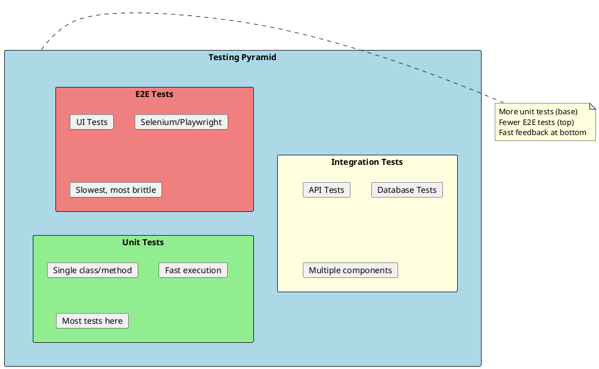
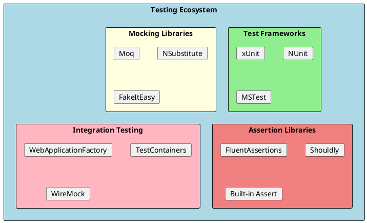

# Testing in .NET

Testing is a fundamental practice in software development that ensures code quality, prevents regressions, and enables confident refactoring. .NET provides a rich ecosystem of testing frameworks and tools.



## Why Testing Matters

Testing provides several critical benefits:

1. **Confidence** - Know your code works as expected
2. **Documentation** - Tests describe intended behavior
3. **Refactoring Safety** - Change code without fear
4. **Bug Prevention** - Catch issues before production
5. **Design Feedback** - Hard to test = poor design

## Testing Frameworks in .NET



### Framework Comparison

| Feature | xUnit | NUnit | MSTest |
|---------|-------|-------|--------|
| **Style** | Modern, opinionated | Flexible, mature | Microsoft official |
| **Setup** | Constructor | `[SetUp]` | `[TestInitialize]` |
| **Teardown** | `IDisposable` | `[TearDown]` | `[TestCleanup]` |
| **Parallel** | Default on | Configurable | Configurable |
| **Data-driven** | `[Theory]` | `[TestCase]` | `[DataRow]` |
| **Popularity** | Most popular | Very popular | Enterprise |

## Quick Start with xUnit

```bash
# Create test project
dotnet new xunit -n MyApp.Tests

# Add reference to project being tested
dotnet add reference ../MyApp/MyApp.csproj

# Add useful packages
dotnet add package Moq
dotnet add package FluentAssertions

# Run tests
dotnet test
```

## Test Project Structure

```
MyApp.sln
├── src/
│   └── MyApp/
│       ├── Services/
│       │   └── OrderService.cs
│       └── Models/
│           └── Order.cs
└── tests/
    ├── MyApp.UnitTests/
    │   ├── Services/
    │   │   └── OrderServiceTests.cs
    │   └── MyApp.UnitTests.csproj
    └── MyApp.IntegrationTests/
        ├── Api/
        │   └── OrdersControllerTests.cs
        └── MyApp.IntegrationTests.csproj
```

## Key Components

| Component | Purpose | Document |
|-----------|---------|----------|
| **Unit Testing** | Test individual units in isolation | [01-UnitTesting.md](./01-UnitTesting.md) |
| **Integration Testing** | Test multiple components together | [02-IntegrationTesting.md](./02-IntegrationTesting.md) |
| **Mocking** | Create test doubles for dependencies | [03-Mocking.md](./03-Mocking.md) |
| **Test Patterns** | Best practices and patterns | [04-TestPatterns.md](./04-TestPatterns.md) |
| **TDD** | Test-Driven Development | [05-TDD.md](./05-TDD.md) |

## Basic Test Example

```csharp
// Calculator.cs
public class Calculator
{
    public int Add(int a, int b) => a + b;
    public int Divide(int a, int b)
    {
        if (b == 0) throw new DivideByZeroException();
        return a / b;
    }
}

// CalculatorTests.cs
public class CalculatorTests
{
    private readonly Calculator _calculator = new();

    [Fact]
    public void Add_TwoPositiveNumbers_ReturnsSum()
    {
        // Arrange
        int a = 5, b = 3;

        // Act
        var result = _calculator.Add(a, b);

        // Assert
        Assert.Equal(8, result);
    }

    [Theory]
    [InlineData(10, 2, 5)]
    [InlineData(9, 3, 3)]
    [InlineData(100, 10, 10)]
    public void Divide_ValidNumbers_ReturnsQuotient(int a, int b, int expected)
    {
        var result = _calculator.Divide(a, b);
        Assert.Equal(expected, result);
    }

    [Fact]
    public void Divide_ByZero_ThrowsException()
    {
        Assert.Throws<DivideByZeroException>(() => _calculator.Divide(10, 0));
    }
}
```

## Test Naming Conventions

Good test names describe **what** is being tested, **under what conditions**, and **expected outcome**:

```csharp
// Pattern: MethodName_Scenario_ExpectedBehavior
public void Add_TwoPositiveNumbers_ReturnsSum() { }
public void Withdraw_InsufficientFunds_ThrowsException() { }
public void GetUser_ValidId_ReturnsUser() { }
public void CreateOrder_EmptyCart_ReturnsError() { }

// Alternative: Should pattern
public void Should_ReturnSum_When_AddingTwoPositiveNumbers() { }
public void Should_ThrowException_When_WithdrawingInsufficientFunds() { }
```

## Running Tests

```bash
# Run all tests
dotnet test

# Run with verbosity
dotnet test --verbosity normal

# Run specific test project
dotnet test tests/MyApp.UnitTests

# Run tests matching filter
dotnet test --filter "FullyQualifiedName~OrderService"
dotnet test --filter "Category=Integration"

# Run with code coverage
dotnet test --collect:"XPlat Code Coverage"

# Run and generate report
dotnet test --logger "trx;LogFileName=results.trx"
```

## Quick Reference

```
┌─────────────────────────────────────────────────────────────────────┐
│                    Testing Quick Reference                          │
├─────────────────────────────────────────────────────────────────────┤
│ xUnit Attributes:                                                   │
│   [Fact]         - Single test case                                │
│   [Theory]       - Parameterized test                              │
│   [InlineData]   - Inline test data                                │
│   [ClassData]    - Class providing test data                       │
│   [MemberData]   - Method/property providing data                  │
├─────────────────────────────────────────────────────────────────────┤
│ Common Assertions:                                                  │
│   Assert.Equal(expected, actual)                                   │
│   Assert.True(condition)                                           │
│   Assert.NotNull(object)                                           │
│   Assert.Throws<T>(() => action)                                   │
│   Assert.Contains(item, collection)                                │
├─────────────────────────────────────────────────────────────────────┤
│ Test Doubles:                                                       │
│   Dummy   - Passed but never used                                  │
│   Stub    - Returns predefined values                              │
│   Mock    - Verifies interactions                                  │
│   Spy     - Records information                                    │
│   Fake    - Working implementation (simplified)                    │
└─────────────────────────────────────────────────────────────────────┘
```

## Common Interview Topics

1. **What is the testing pyramid?** - Unit tests at base, integration in middle, E2E at top
2. **Unit vs Integration tests?** - Isolation vs multiple components
3. **What is mocking?** - Creating test doubles for dependencies
4. **What is TDD?** - Write tests before implementation
5. **What is code coverage?** - Percentage of code executed by tests
6. **AAA pattern?** - Arrange, Act, Assert structure
7. **What makes a good unit test?** - Fast, isolated, repeatable, self-validating

