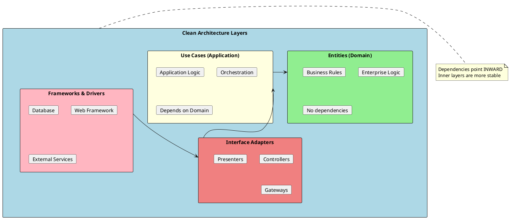
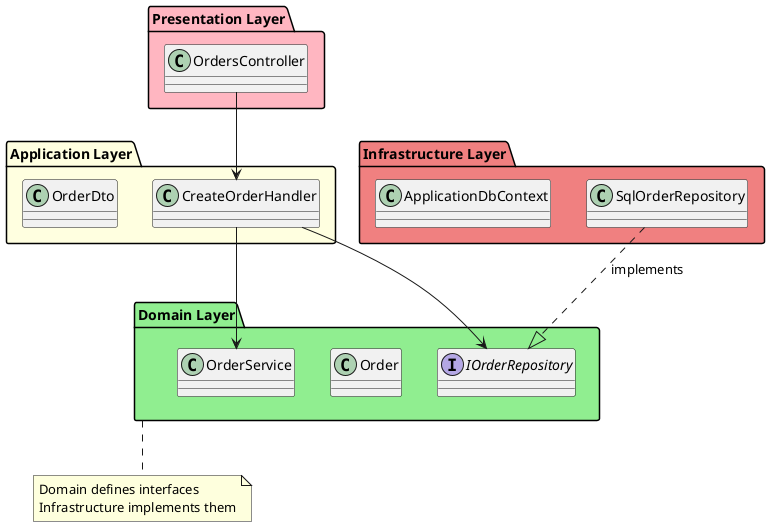
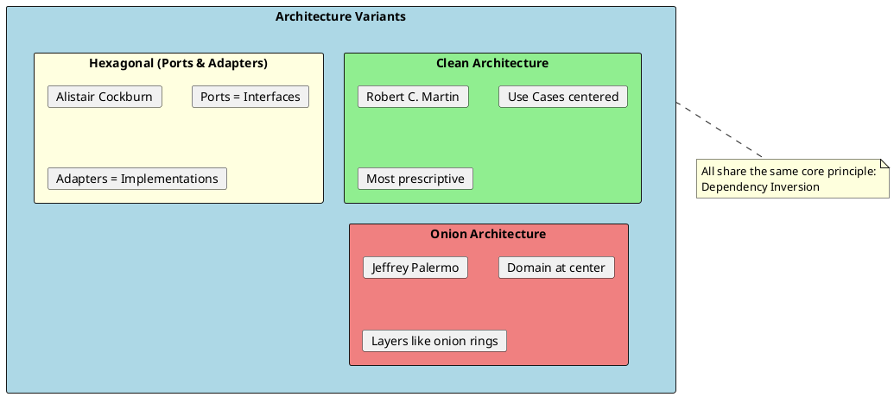
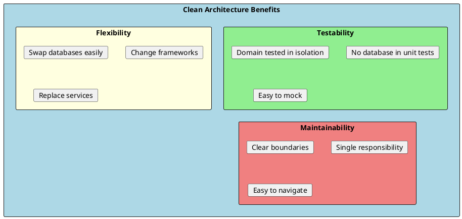

# Clean Architecture

Clean Architecture, introduced by Robert C. Martin (Uncle Bob), is an architectural pattern that organizes code into layers with a strict dependency rule: dependencies must point inward toward higher-level policies. This makes the core business logic independent of frameworks, databases, and external concerns.



## Core Principles

### 1. Dependency Rule

The most important rule: **source code dependencies must point inward**. Nothing in an inner circle can know anything about something in an outer circle.



### 2. Dependency Inversion

Inner layers define interfaces; outer layers implement them. This inverts the traditional dependency direction.

```csharp
// Domain Layer - defines the interface
namespace MyApp.Domain.Interfaces
{
    public interface IOrderRepository
    {
        Task<Order?> GetByIdAsync(int id);
        Task AddAsync(Order order);
        Task SaveChangesAsync();
    }
}

// Infrastructure Layer - implements the interface
namespace MyApp.Infrastructure.Persistence
{
    public class SqlOrderRepository : IOrderRepository
    {
        private readonly ApplicationDbContext _context;

        public SqlOrderRepository(ApplicationDbContext context)
        {
            _context = context;
        }

        public async Task<Order?> GetByIdAsync(int id)
        {
            return await _context.Orders
                .Include(o => o.Items)
                .FirstOrDefaultAsync(o => o.Id == id);
        }

        public async Task AddAsync(Order order)
        {
            await _context.Orders.AddAsync(order);
        }

        public async Task SaveChangesAsync()
        {
            await _context.SaveChangesAsync();
        }
    }
}
```

---

## Layer Details

### Domain Layer (Entities)

The innermost layer containing business rules and enterprise logic. Has **no dependencies** on other layers or frameworks.

```csharp
namespace MyApp.Domain.Entities
{
    public class Order
    {
        public int Id { get; private set; }
        public int CustomerId { get; private set; }
        public OrderStatus Status { get; private set; }
        public DateTime CreatedAt { get; private set; }

        private readonly List<OrderItem> _items = new();
        public IReadOnlyCollection<OrderItem> Items => _items.AsReadOnly();

        public decimal Total => _items.Sum(i => i.Subtotal);

        // Private constructor for EF
        private Order() { }

        public Order(int customerId)
        {
            CustomerId = customerId;
            Status = OrderStatus.Pending;
            CreatedAt = DateTime.UtcNow;
        }

        public void AddItem(int productId, int quantity, decimal unitPrice)
        {
            if (Status != OrderStatus.Pending)
                throw new InvalidOperationException("Cannot modify a non-pending order");

            if (quantity <= 0)
                throw new ArgumentException("Quantity must be positive", nameof(quantity));

            var existingItem = _items.FirstOrDefault(i => i.ProductId == productId);
            if (existingItem != null)
            {
                existingItem.IncreaseQuantity(quantity);
            }
            else
            {
                _items.Add(new OrderItem(productId, quantity, unitPrice));
            }
        }

        public void Submit()
        {
            if (!_items.Any())
                throw new InvalidOperationException("Cannot submit an empty order");

            Status = OrderStatus.Submitted;
        }

        public void Cancel()
        {
            if (Status == OrderStatus.Shipped)
                throw new InvalidOperationException("Cannot cancel a shipped order");

            Status = OrderStatus.Cancelled;
        }
    }

    public class OrderItem
    {
        public int Id { get; private set; }
        public int ProductId { get; private set; }
        public int Quantity { get; private set; }
        public decimal UnitPrice { get; private set; }
        public decimal Subtotal => Quantity * UnitPrice;

        private OrderItem() { }

        public OrderItem(int productId, int quantity, decimal unitPrice)
        {
            ProductId = productId;
            Quantity = quantity;
            UnitPrice = unitPrice;
        }

        public void IncreaseQuantity(int amount)
        {
            Quantity += amount;
        }
    }

    public enum OrderStatus
    {
        Pending,
        Submitted,
        Shipped,
        Delivered,
        Cancelled
    }
}
```

### Application Layer (Use Cases)

Contains application-specific business rules. Orchestrates the flow of data between the domain and external layers.

```csharp
namespace MyApp.Application.Orders.Commands
{
    // Command
    public record CreateOrderCommand(
        int CustomerId,
        List<OrderItemDto> Items
    );

    public record OrderItemDto(
        int ProductId,
        int Quantity
    );

    // Handler
    public class CreateOrderHandler
    {
        private readonly IOrderRepository _orderRepository;
        private readonly IProductRepository _productRepository;
        private readonly IUnitOfWork _unitOfWork;

        public CreateOrderHandler(
            IOrderRepository orderRepository,
            IProductRepository productRepository,
            IUnitOfWork unitOfWork)
        {
            _orderRepository = orderRepository;
            _productRepository = productRepository;
            _unitOfWork = unitOfWork;
        }

        public async Task<OrderResult> HandleAsync(CreateOrderCommand command)
        {
            // Validate customer exists
            // Create order using domain entity
            var order = new Order(command.CustomerId);

            foreach (var item in command.Items)
            {
                var product = await _productRepository.GetByIdAsync(item.ProductId);
                if (product == null)
                    return OrderResult.Failure($"Product {item.ProductId} not found");

                order.AddItem(item.ProductId, item.Quantity, product.Price);
            }

            await _orderRepository.AddAsync(order);
            await _unitOfWork.SaveChangesAsync();

            return OrderResult.Success(order.Id);
        }
    }

    // Result
    public record OrderResult(bool IsSuccess, int? OrderId, string? Error)
    {
        public static OrderResult Success(int orderId) => new(true, orderId, null);
        public static OrderResult Failure(string error) => new(false, null, error);
    }
}
```

### Infrastructure Layer

Implements interfaces defined in inner layers. Contains all external concerns.

```csharp
namespace MyApp.Infrastructure.Persistence
{
    public class ApplicationDbContext : DbContext
    {
        public DbSet<Order> Orders => Set<Order>();
        public DbSet<Product> Products => Set<Product>();

        public ApplicationDbContext(DbContextOptions<ApplicationDbContext> options)
            : base(options) { }

        protected override void OnModelCreating(ModelBuilder modelBuilder)
        {
            modelBuilder.ApplyConfigurationsFromAssembly(typeof(ApplicationDbContext).Assembly);
        }
    }

    public class OrderConfiguration : IEntityTypeConfiguration<Order>
    {
        public void Configure(EntityTypeBuilder<Order> builder)
        {
            builder.HasKey(o => o.Id);

            builder.Property(o => o.Status)
                .HasConversion<string>();

            builder.HasMany(o => o.Items)
                .WithOne()
                .HasForeignKey("OrderId");

            builder.Navigation(o => o.Items)
                .UsePropertyAccessMode(PropertyAccessMode.Field);
        }
    }
}

namespace MyApp.Infrastructure.Services
{
    public class EmailService : IEmailService
    {
        private readonly IConfiguration _configuration;

        public EmailService(IConfiguration configuration)
        {
            _configuration = configuration;
        }

        public async Task SendOrderConfirmationAsync(int orderId, string email)
        {
            // Implementation using external email service
        }
    }
}
```

### Presentation Layer

The outermost layer handling HTTP requests, UI, etc.

```csharp
namespace MyApp.Api.Controllers
{
    [ApiController]
    [Route("api/[controller]")]
    public class OrdersController : ControllerBase
    {
        private readonly CreateOrderHandler _createOrderHandler;
        private readonly IOrderRepository _orderRepository;

        public OrdersController(
            CreateOrderHandler createOrderHandler,
            IOrderRepository orderRepository)
        {
            _createOrderHandler = createOrderHandler;
            _orderRepository = orderRepository;
        }

        [HttpPost]
        public async Task<IActionResult> Create([FromBody] CreateOrderRequest request)
        {
            var command = new CreateOrderCommand(
                request.CustomerId,
                request.Items.Select(i => new OrderItemDto(i.ProductId, i.Quantity)).ToList()
            );

            var result = await _createOrderHandler.HandleAsync(command);

            if (!result.IsSuccess)
                return BadRequest(new { error = result.Error });

            return CreatedAtAction(
                nameof(GetById),
                new { id = result.OrderId },
                new { orderId = result.OrderId }
            );
        }

        [HttpGet("{id}")]
        public async Task<IActionResult> GetById(int id)
        {
            var order = await _orderRepository.GetByIdAsync(id);

            if (order == null)
                return NotFound();

            return Ok(new OrderResponse
            {
                Id = order.Id,
                CustomerId = order.CustomerId,
                Status = order.Status.ToString(),
                Total = order.Total,
                Items = order.Items.Select(i => new OrderItemResponse
                {
                    ProductId = i.ProductId,
                    Quantity = i.Quantity,
                    UnitPrice = i.UnitPrice
                }).ToList()
            });
        }
    }
}
```

---

## Dependency Injection Setup

```csharp
// Infrastructure/DependencyInjection.cs
namespace MyApp.Infrastructure
{
    public static class DependencyInjection
    {
        public static IServiceCollection AddInfrastructure(
            this IServiceCollection services,
            IConfiguration configuration)
        {
            // Database
            services.AddDbContext<ApplicationDbContext>(options =>
                options.UseSqlServer(configuration.GetConnectionString("Default")));

            // Repositories
            services.AddScoped<IOrderRepository, SqlOrderRepository>();
            services.AddScoped<IProductRepository, SqlProductRepository>();
            services.AddScoped<IUnitOfWork, UnitOfWork>();

            // External services
            services.AddScoped<IEmailService, EmailService>();

            return services;
        }
    }
}

// Application/DependencyInjection.cs
namespace MyApp.Application
{
    public static class DependencyInjection
    {
        public static IServiceCollection AddApplication(this IServiceCollection services)
        {
            // Handlers
            services.AddScoped<CreateOrderHandler>();
            services.AddScoped<GetOrderHandler>();

            // Validators
            services.AddScoped<IValidator<CreateOrderCommand>, CreateOrderValidator>();

            return services;
        }
    }
}

// Program.cs
var builder = WebApplication.CreateBuilder(args);

builder.Services.AddApplication();
builder.Services.AddInfrastructure(builder.Configuration);
builder.Services.AddControllers();

var app = builder.Build();

app.MapControllers();
app.Run();
```

---

## Related Architectures



### Comparison

| Aspect | Clean | Hexagonal | Onion |
|--------|-------|-----------|-------|
| **Core Concept** | Use Cases | Ports & Adapters | Domain Model |
| **Focus** | Business rules | External integration | Domain logic |
| **Terminology** | Entities, Use Cases | Ports, Adapters | Domain, Services |
| **Best For** | Complex applications | Integration-heavy | Rich domain |

---

## Benefits and Trade-offs

### Benefits



### Trade-offs

- **More boilerplate** - More files, interfaces, and mappings
- **Learning curve** - Team needs to understand the patterns
- **Overhead for simple apps** - Not worth it for basic CRUD
- **Mapping between layers** - DTOs require mapping logic

---

## Testing by Layer

```csharp
// Domain Layer Tests - Pure unit tests, no mocking needed
public class OrderTests
{
    [Fact]
    public void AddItem_ToNewOrder_AddsItem()
    {
        var order = new Order(customerId: 1);

        order.AddItem(productId: 1, quantity: 2, unitPrice: 10.00m);

        Assert.Single(order.Items);
        Assert.Equal(20.00m, order.Total);
    }

    [Fact]
    public void Submit_EmptyOrder_ThrowsException()
    {
        var order = new Order(customerId: 1);

        Assert.Throws<InvalidOperationException>(() => order.Submit());
    }
}

// Application Layer Tests - Mock repositories
public class CreateOrderHandlerTests
{
    private readonly Mock<IOrderRepository> _mockOrderRepo;
    private readonly Mock<IProductRepository> _mockProductRepo;
    private readonly Mock<IUnitOfWork> _mockUnitOfWork;
    private readonly CreateOrderHandler _handler;

    public CreateOrderHandlerTests()
    {
        _mockOrderRepo = new Mock<IOrderRepository>();
        _mockProductRepo = new Mock<IProductRepository>();
        _mockUnitOfWork = new Mock<IUnitOfWork>();

        _handler = new CreateOrderHandler(
            _mockOrderRepo.Object,
            _mockProductRepo.Object,
            _mockUnitOfWork.Object
        );
    }

    [Fact]
    public async Task Handle_ValidCommand_CreatesOrder()
    {
        // Arrange
        var product = new Product { Id = 1, Price = 10.00m };
        _mockProductRepo.Setup(r => r.GetByIdAsync(1)).ReturnsAsync(product);

        var command = new CreateOrderCommand(1, new List<OrderItemDto>
        {
            new(ProductId: 1, Quantity: 2)
        });

        // Act
        var result = await _handler.HandleAsync(command);

        // Assert
        Assert.True(result.IsSuccess);
        _mockOrderRepo.Verify(r => r.AddAsync(It.IsAny<Order>()), Times.Once);
        _mockUnitOfWork.Verify(u => u.SaveChangesAsync(), Times.Once);
    }
}

// Integration Tests - Test with real database
public class OrdersControllerTests : IClassFixture<WebApplicationFactory<Program>>
{
    private readonly HttpClient _client;

    public OrdersControllerTests(WebApplicationFactory<Program> factory)
    {
        _client = factory.CreateClient();
    }

    [Fact]
    public async Task Create_ValidRequest_ReturnsCreated()
    {
        var request = new { CustomerId = 1, Items = new[] { new { ProductId = 1, Quantity = 2 } } };

        var response = await _client.PostAsJsonAsync("/api/orders", request);

        Assert.Equal(HttpStatusCode.Created, response.StatusCode);
    }
}
```

---

## Interview Questions & Answers

### Q1: What is Clean Architecture?

**Answer**: Clean Architecture is an architectural pattern that organizes code into concentric layers with dependencies pointing inward. The core (domain) has no dependencies, while outer layers (infrastructure, UI) depend on inner layers through abstractions. This makes the business logic independent of frameworks and databases.

### Q2: What is the Dependency Rule?

**Answer**: The Dependency Rule states that source code dependencies must only point inward. Inner layers cannot know anything about outer layers. This is achieved through Dependency Inversion - inner layers define interfaces, outer layers implement them.

### Q3: Why use Clean Architecture?

**Answer**:
- **Testability**: Business logic tested without databases
- **Flexibility**: Easy to change frameworks or databases
- **Maintainability**: Clear separation of concerns
- **Independence**: Core business rules don't change when externals change

### Q4: What goes in each layer?

**Answer**:
- **Domain**: Entities, Value Objects, Domain Services, Interfaces
- **Application**: Use Cases, Commands/Queries, Handlers, DTOs
- **Infrastructure**: Repositories, Database, External Services
- **Presentation**: Controllers, Views, API Endpoints

### Q5: When should you NOT use Clean Architecture?

**Answer**:
- Simple CRUD applications
- Prototypes or MVPs
- Small applications with minimal business logic
- When the team is unfamiliar and timeline is tight

### Q6: How is Clean Architecture different from N-Tier?

**Answer**:
- **N-Tier**: Layers depend downward (UI → Business → Data)
- **Clean Architecture**: Dependencies point inward, infrastructure depends on domain

Clean Architecture inverts the traditional dependency direction for the data layer.

