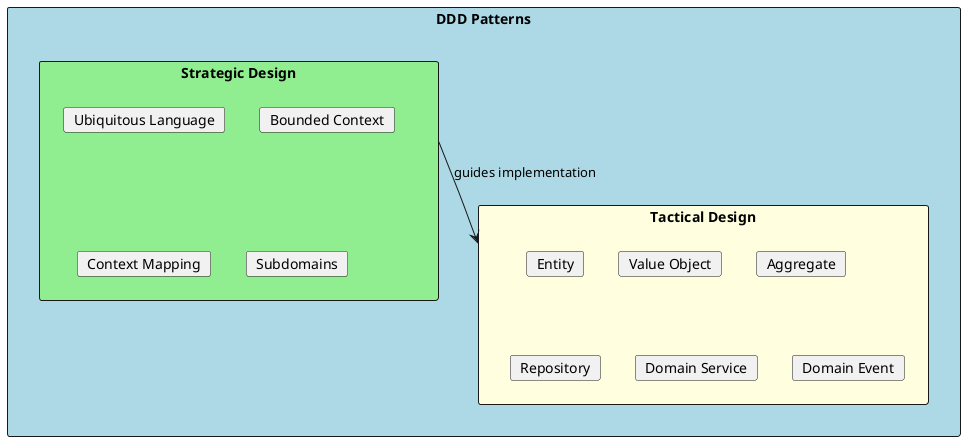
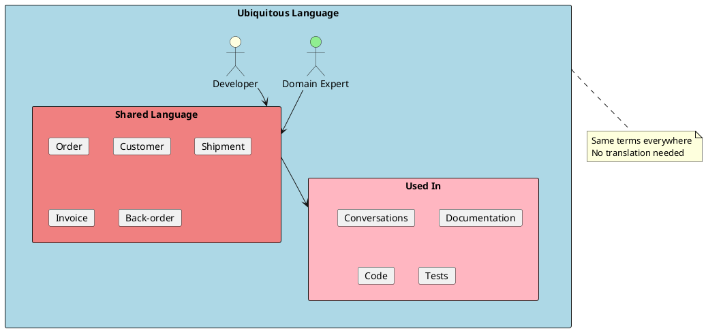
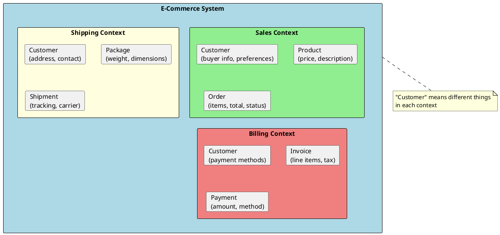
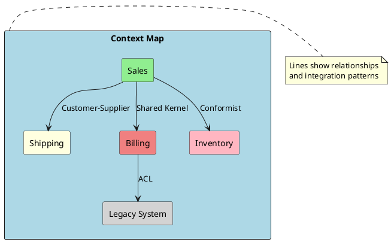
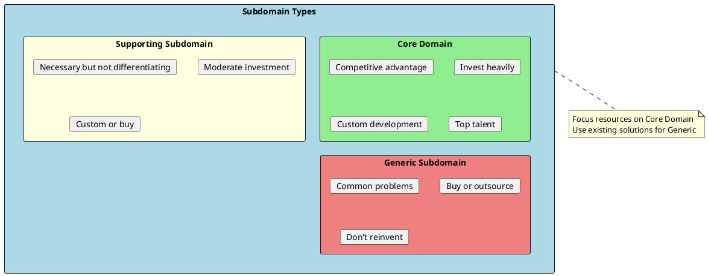
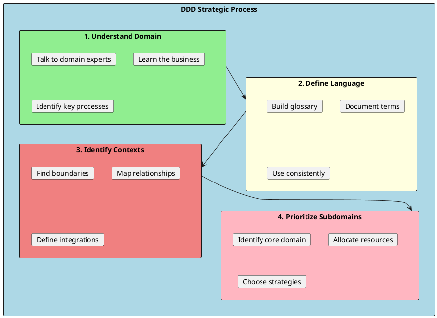
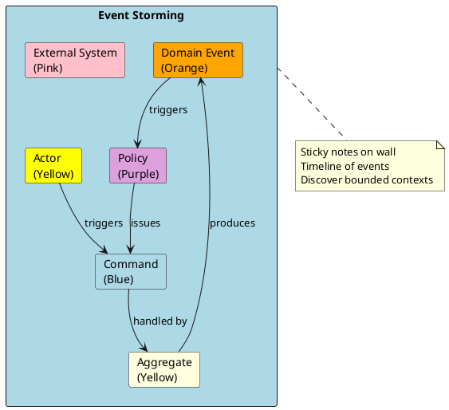

# DDD Fundamentals (Strategic Design)

Domain-Driven Design (DDD) is an approach to software development that focuses on the core domain and domain logic. It emphasizes collaboration between technical and domain experts to create a shared understanding of the problem space through a common language.



## When to Use DDD

DDD is most valuable when:

1. **Complex domain** - Business rules are intricate and numerous
2. **Domain experts available** - You can collaborate with business experts
3. **Long-term project** - Investment in understanding pays off
4. **Core business differentiator** - The domain IS the competitive advantage

**Don't use DDD for:** Simple CRUD apps, short-lived projects, or when domain experts aren't available.

---

## Ubiquitous Language

The most important DDD concept: a shared language between developers and domain experts that is used in code, documentation, and conversations.



### Examples

```csharp
// ❌ Bad: Technical/generic naming
public class DataRecord
{
    public int Id { get; set; }
    public string Type { get; set; }      // What type?
    public decimal Amount { get; set; }    // Amount of what?
    public int Status { get; set; }        // What do statuses mean?
}

public void ProcessData(DataRecord record) { }

// ✅ Good: Domain language
public class Order
{
    public OrderId Id { get; private set; }
    public CustomerId CustomerId { get; private set; }
    public Money TotalAmount { get; private set; }
    public OrderStatus Status { get; private set; }
}

public void PlaceOrder(Order order) { }       // Domain experts say "place an order"
public void ShipOrder(Order order) { }        // Domain experts say "ship an order"
public void CancelOrder(Order order) { }      // Domain experts say "cancel an order"

// The code reads like business requirements!
```

### Building the Ubiquitous Language

1. **Talk to domain experts** - Listen to how they describe processes
2. **Document terms** - Create a glossary of domain terms
3. **Use terms consistently** - In code, tests, and conversations
4. **Refine continuously** - Language evolves as understanding grows

---

## Bounded Context

A bounded context is a boundary within which a particular domain model applies. The same term can have different meanings in different contexts.



### Same Term, Different Contexts

```csharp
// Sales Context - Customer is about purchasing behavior
namespace Sales
{
    public class Customer
    {
        public CustomerId Id { get; }
        public string Name { get; }
        public CustomerTier Tier { get; }           // Gold, Silver, Bronze
        public decimal LifetimeValue { get; }       // Sales-specific
        public List<Order> OrderHistory { get; }    // Purchase history
    }
}

// Shipping Context - Customer is about delivery
namespace Shipping
{
    public class Customer
    {
        public CustomerId Id { get; }
        public string Name { get; }
        public Address ShippingAddress { get; }     // Shipping-specific
        public string PhoneNumber { get; }          // For delivery contact
        public DeliveryPreferences Preferences { get; }
    }
}

// Billing Context - Customer is about payment
namespace Billing
{
    public class Customer
    {
        public CustomerId Id { get; }
        public string Name { get; }
        public Address BillingAddress { get; }      // Billing-specific
        public List<PaymentMethod> PaymentMethods { get; }
        public CreditLimit CreditLimit { get; }
    }
}
```

### Defining Bounded Contexts

Look for:
- **Different vocabularies** - Same terms with different meanings
- **Different models** - Same concept modeled differently
- **Different teams** - Organizational boundaries
- **Different business processes** - Distinct workflows

---

## Context Mapping

Context mapping documents the relationships between bounded contexts and how they communicate.



### Relationship Patterns

| Pattern | Description | Example |
|---------|-------------|---------|
| **Shared Kernel** | Two contexts share a small common model | Sales and Billing share Customer ID |
| **Customer-Supplier** | Upstream (supplier) provides what downstream (customer) needs | Sales requests shipping capabilities |
| **Conformist** | Downstream conforms to upstream's model | Inventory uses vendor's data format |
| **Anti-Corruption Layer (ACL)** | Translation layer to protect from external models | Wrapper around legacy system |
| **Open Host Service** | Well-defined protocol for others to consume | Public API for partners |
| **Published Language** | Standardized format for exchange | Industry-standard XML schema |

### Anti-Corruption Layer Example

```csharp
// External legacy system model (we don't control this)
public class LegacyCustomerRecord
{
    public string CUST_ID { get; set; }
    public string CUST_NM { get; set; }
    public string ADDR_LN1 { get; set; }
    public string ADDR_LN2 { get; set; }
    public int CUST_TYP { get; set; }  // 1=Regular, 2=Premium, 3=VIP
}

// Our domain model
public class Customer
{
    public CustomerId Id { get; }
    public CustomerName Name { get; }
    public Address Address { get; }
    public CustomerTier Tier { get; }
}

// Anti-Corruption Layer - translates between models
public class CustomerTranslator
{
    public Customer Translate(LegacyCustomerRecord legacy)
    {
        return new Customer(
            id: new CustomerId(legacy.CUST_ID),
            name: new CustomerName(legacy.CUST_NM),
            address: new Address(legacy.ADDR_LN1, legacy.ADDR_LN2),
            tier: MapTier(legacy.CUST_TYP)
        );
    }

    private CustomerTier MapTier(int legacyType) => legacyType switch
    {
        1 => CustomerTier.Regular,
        2 => CustomerTier.Premium,
        3 => CustomerTier.VIP,
        _ => CustomerTier.Regular
    };
}

// Service using ACL
public class CustomerService
{
    private readonly ILegacyCustomerApi _legacyApi;
    private readonly CustomerTranslator _translator;

    public async Task<Customer> GetCustomerAsync(CustomerId id)
    {
        var legacyRecord = await _legacyApi.GetCustomerAsync(id.Value);
        return _translator.Translate(legacyRecord);
    }
}
```

---

## Subdomains

Subdomains categorize different areas of the business based on their strategic importance.



### Examples

| Business | Core Domain | Supporting | Generic |
|----------|-------------|------------|---------|
| **Amazon** | Recommendation engine, Fulfillment | Inventory management | Email, Authentication |
| **Uber** | Matching drivers/riders, Pricing | Driver management | Payments, Maps |
| **Netflix** | Content recommendation, Streaming | Content acquisition | Billing, Identity |

### Investment Strategy

```csharp
// Core Domain - invest heavily, build custom
// Example: E-commerce recommendation engine
namespace Recommendations.Domain
{
    public class RecommendationEngine
    {
        // Custom algorithm - competitive advantage
        public IEnumerable<Product> GetPersonalizedRecommendations(
            CustomerId customerId,
            BrowsingHistory history,
            PurchaseHistory purchases)
        {
            // Proprietary logic that differentiates the business
        }
    }
}

// Supporting Subdomain - necessary but not differentiating
// Example: Inventory management
namespace Inventory.Domain
{
    public class InventoryService
    {
        // Important but could be bought or built simply
        public bool IsInStock(ProductId productId, int quantity)
        {
            // Standard inventory logic
        }
    }
}

// Generic Subdomain - use existing solutions
// Don't build custom authentication - use Identity Server, Auth0, etc.
// Don't build custom email - use SendGrid, SES, etc.
```

---

## Domain Model Patterns

### Rich Domain Model vs Anemic Domain Model

```csharp
// ❌ Anemic Domain Model - logic in services, entities are data bags
public class Order
{
    public int Id { get; set; }
    public List<OrderItem> Items { get; set; } = new();
    public decimal Total { get; set; }
    public string Status { get; set; }
}

public class OrderService
{
    public void AddItem(Order order, Product product, int quantity)
    {
        order.Items.Add(new OrderItem { ProductId = product.Id, Quantity = quantity });
        order.Total = order.Items.Sum(i => i.Quantity * i.UnitPrice);
    }

    public void Submit(Order order)
    {
        if (!order.Items.Any())
            throw new InvalidOperationException("Cannot submit empty order");
        order.Status = "Submitted";
    }
}

// ✅ Rich Domain Model - logic in entities
public class Order
{
    public OrderId Id { get; private set; }
    private readonly List<OrderItem> _items = new();
    public IReadOnlyCollection<OrderItem> Items => _items.AsReadOnly();
    public Money Total { get; private set; }
    public OrderStatus Status { get; private set; }

    public void AddItem(Product product, Quantity quantity)
    {
        if (Status != OrderStatus.Draft)
            throw new InvalidOperationException("Cannot modify submitted order");

        var item = new OrderItem(product.Id, quantity, product.Price);
        _items.Add(item);
        RecalculateTotal();
    }

    public void Submit()
    {
        if (!_items.Any())
            throw new InvalidOperationException("Cannot submit empty order");

        Status = OrderStatus.Submitted;
        AddDomainEvent(new OrderSubmittedEvent(Id));
    }

    private void RecalculateTotal()
    {
        Total = Money.Sum(_items.Select(i => i.Subtotal));
    }
}
```

---

## Strategic Design Process



---

## Event Storming

A collaborative workshop technique for exploring domains:



### Event Storming Steps

1. **Collect Domain Events** - What happens in the system? (past tense)
2. **Add Commands** - What triggers events?
3. **Add Actors** - Who/what issues commands?
4. **Add Aggregates** - What handles commands?
5. **Identify Bounded Contexts** - Group related concepts

---

## Interview Questions & Answers

### Q1: What is DDD?

**Answer**: Domain-Driven Design is an approach to software development that:
- Focuses on the core domain and domain logic
- Uses ubiquitous language shared by developers and domain experts
- Divides complex domains into bounded contexts
- Uses tactical patterns (Entities, Value Objects, etc.) to model the domain

### Q2: What is Ubiquitous Language?

**Answer**: A shared language between developers and domain experts that is used consistently in:
- Conversations and meetings
- Documentation
- Code (class names, methods)
- Tests

The goal is to eliminate translation and ensure everyone speaks the same language.

### Q3: What is a Bounded Context?

**Answer**: A boundary within which a particular domain model applies. It defines:
- The scope where terms have specific meanings
- Where a model is valid
- Integration points with other contexts

Example: "Customer" in Sales (buyer info) vs "Customer" in Shipping (delivery address).

### Q4: What is Context Mapping?

**Answer**: Documentation of relationships between bounded contexts, including:
- **Shared Kernel** - Shared code/model
- **Customer-Supplier** - One serves another
- **Anti-Corruption Layer** - Translation layer
- **Conformist** - Adopts upstream model

### Q5: What are the types of subdomains?

**Answer**:
- **Core Domain**: Competitive advantage, invest heavily
- **Supporting Subdomain**: Necessary but not differentiating
- **Generic Subdomain**: Common problems, buy or outsource

### Q6: When should you use DDD?

**Answer**: Use DDD when:
- Domain is complex with many business rules
- Domain experts are available
- Project is long-term
- Domain is core business differentiator

Don't use for simple CRUD or when domain expertise isn't available.

