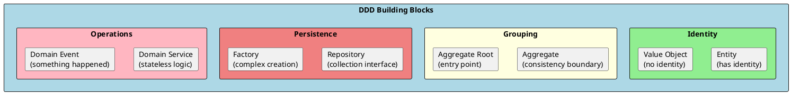
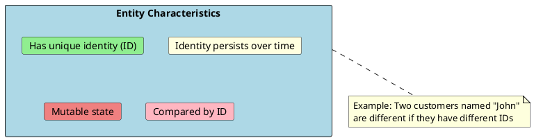
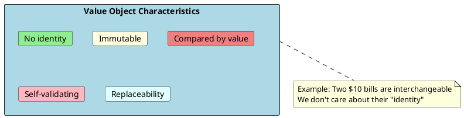
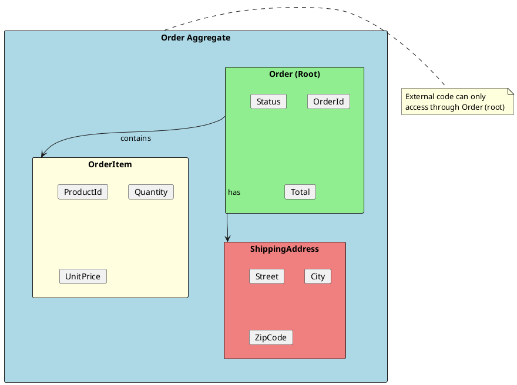
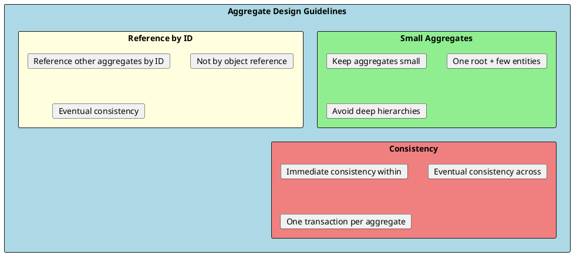

# DDD Tactical Patterns

Tactical patterns are the building blocks for implementing domain models. They provide a vocabulary and structure for expressing business concepts in code. These patterns include Entities, Value Objects, Aggregates, Repositories, Domain Services, and Domain Events.



## Entity

An entity is an object defined by its identity rather than its attributes. Two entities with the same attributes but different IDs are different entities.



### Entity Implementation

```csharp
// Base entity class
public abstract class Entity<TId> where TId : notnull
{
    public TId Id { get; protected set; } = default!;

    protected Entity() { }

    protected Entity(TId id)
    {
        Id = id;
    }

    public override bool Equals(object? obj)
    {
        if (obj is not Entity<TId> other)
            return false;

        if (ReferenceEquals(this, other))
            return true;

        if (GetType() != other.GetType())
            return false;

        return Id.Equals(other.Id);
    }

    public override int GetHashCode()
    {
        return Id.GetHashCode();
    }

    public static bool operator ==(Entity<TId>? left, Entity<TId>? right)
    {
        return Equals(left, right);
    }

    public static bool operator !=(Entity<TId>? left, Entity<TId>? right)
    {
        return !Equals(left, right);
    }
}

// Concrete entity
public class Customer : Entity<CustomerId>
{
    public CustomerName Name { get; private set; }
    public Email Email { get; private set; }
    public CustomerStatus Status { get; private set; }
    public DateTime CreatedAt { get; private set; }

    private Customer() { }  // EF Core

    public Customer(CustomerId id, CustomerName name, Email email)
        : base(id)
    {
        Name = name;
        Email = email;
        Status = CustomerStatus.Active;
        CreatedAt = DateTime.UtcNow;
    }

    public void UpdateEmail(Email newEmail)
    {
        if (Status == CustomerStatus.Deactivated)
            throw new InvalidOperationException("Cannot update deactivated customer");

        Email = newEmail;
    }

    public void Deactivate()
    {
        Status = CustomerStatus.Deactivated;
    }
}
```

---

## Value Object

A value object is defined by its attributes, not identity. Two value objects with the same attributes are considered equal. Value objects are immutable.



### Value Object Implementation

```csharp
// Base value object
public abstract class ValueObject
{
    protected abstract IEnumerable<object?> GetEqualityComponents();

    public override bool Equals(object? obj)
    {
        if (obj == null || obj.GetType() != GetType())
            return false;

        var other = (ValueObject)obj;
        return GetEqualityComponents().SequenceEqual(other.GetEqualityComponents());
    }

    public override int GetHashCode()
    {
        return GetEqualityComponents()
            .Select(x => x?.GetHashCode() ?? 0)
            .Aggregate((x, y) => x ^ y);
    }

    public static bool operator ==(ValueObject? left, ValueObject? right)
    {
        return Equals(left, right);
    }

    public static bool operator !=(ValueObject? left, ValueObject? right)
    {
        return !Equals(left, right);
    }
}

// Money value object
public class Money : ValueObject
{
    public decimal Amount { get; }
    public Currency Currency { get; }

    public Money(decimal amount, Currency currency)
    {
        if (amount < 0)
            throw new ArgumentException("Amount cannot be negative", nameof(amount));

        Amount = amount;
        Currency = currency;
    }

    public Money Add(Money other)
    {
        if (Currency != other.Currency)
            throw new InvalidOperationException("Cannot add different currencies");

        return new Money(Amount + other.Amount, Currency);
    }

    public Money Subtract(Money other)
    {
        if (Currency != other.Currency)
            throw new InvalidOperationException("Cannot subtract different currencies");

        return new Money(Amount - other.Amount, Currency);
    }

    public Money Multiply(decimal factor)
    {
        return new Money(Amount * factor, Currency);
    }

    protected override IEnumerable<object?> GetEqualityComponents()
    {
        yield return Amount;
        yield return Currency;
    }

    public override string ToString() => $"{Currency} {Amount:N2}";

    public static Money Zero(Currency currency) => new(0, currency);
    public static Money USD(decimal amount) => new(amount, Currency.USD);
    public static Money EUR(decimal amount) => new(amount, Currency.EUR);
}

// Address value object
public class Address : ValueObject
{
    public string Street { get; }
    public string City { get; }
    public string State { get; }
    public string ZipCode { get; }
    public string Country { get; }

    public Address(string street, string city, string state, string zipCode, string country)
    {
        if (string.IsNullOrWhiteSpace(street))
            throw new ArgumentException("Street is required", nameof(street));
        if (string.IsNullOrWhiteSpace(city))
            throw new ArgumentException("City is required", nameof(city));

        Street = street;
        City = city;
        State = state;
        ZipCode = zipCode;
        Country = country;
    }

    protected override IEnumerable<object?> GetEqualityComponents()
    {
        yield return Street;
        yield return City;
        yield return State;
        yield return ZipCode;
        yield return Country;
    }

    public override string ToString() => $"{Street}, {City}, {State} {ZipCode}, {Country}";
}

// Email value object with validation
public class Email : ValueObject
{
    public string Value { get; }

    public Email(string value)
    {
        if (string.IsNullOrWhiteSpace(value))
            throw new ArgumentException("Email is required", nameof(value));

        if (!IsValidEmail(value))
            throw new ArgumentException("Invalid email format", nameof(value));

        Value = value.ToLowerInvariant();
    }

    private static bool IsValidEmail(string email)
    {
        return email.Contains('@') && email.Contains('.');
    }

    protected override IEnumerable<object?> GetEqualityComponents()
    {
        yield return Value;
    }

    public override string ToString() => Value;

    public static implicit operator string(Email email) => email.Value;
}
```

### Entity vs Value Object

| Aspect | Entity | Value Object |
|--------|--------|--------------|
| **Identity** | Has unique ID | No identity |
| **Equality** | Compared by ID | Compared by attributes |
| **Mutability** | Can change over time | Immutable |
| **Lifecycle** | Created, modified, deleted | Created, replaced |
| **Examples** | Customer, Order, Product | Money, Address, DateRange |

---

## Aggregate

An aggregate is a cluster of entities and value objects with defined boundaries and a single entry point (aggregate root). Aggregates ensure consistency and encapsulate complex domain logic.



### Aggregate Rules

1. **Single Root** - One entity is the aggregate root
2. **External References** - Outside objects only reference the root
3. **Internal Objects** - Non-root entities are only accessed through the root
4. **Consistency** - The root ensures invariants are satisfied
5. **Transactional Boundary** - Load and save the entire aggregate

### Aggregate Implementation

```csharp
// Aggregate Root
public class Order : Entity<OrderId>, IAggregateRoot
{
    public CustomerId CustomerId { get; private set; }
    public OrderStatus Status { get; private set; }
    public Address ShippingAddress { get; private set; }
    public DateTime CreatedAt { get; private set; }
    public DateTime? SubmittedAt { get; private set; }

    private readonly List<OrderItem> _items = new();
    public IReadOnlyCollection<OrderItem> Items => _items.AsReadOnly();

    private readonly List<IDomainEvent> _domainEvents = new();
    public IReadOnlyCollection<IDomainEvent> DomainEvents => _domainEvents.AsReadOnly();

    public Money Subtotal => Money.Sum(_items.Select(i => i.Subtotal));
    public Money Tax => Subtotal.Multiply(0.10m);  // 10% tax
    public Money Total => Subtotal.Add(Tax);

    private Order() { }  // EF Core

    public Order(OrderId id, CustomerId customerId, Address shippingAddress)
        : base(id)
    {
        CustomerId = customerId;
        ShippingAddress = shippingAddress;
        Status = OrderStatus.Draft;
        CreatedAt = DateTime.UtcNow;
    }

    // All modifications go through the aggregate root
    public void AddItem(ProductId productId, Quantity quantity, Money unitPrice)
    {
        EnsureOrderIsModifiable();

        var existingItem = _items.FirstOrDefault(i => i.ProductId == productId);
        if (existingItem != null)
        {
            existingItem.IncreaseQuantity(quantity);
        }
        else
        {
            _items.Add(new OrderItem(productId, quantity, unitPrice));
        }
    }

    public void RemoveItem(ProductId productId)
    {
        EnsureOrderIsModifiable();

        var item = _items.FirstOrDefault(i => i.ProductId == productId);
        if (item != null)
        {
            _items.Remove(item);
        }
    }

    public void UpdateShippingAddress(Address newAddress)
    {
        EnsureOrderIsModifiable();
        ShippingAddress = newAddress;
    }

    public void Submit()
    {
        EnsureOrderIsModifiable();

        if (!_items.Any())
            throw new DomainException("Cannot submit an empty order");

        Status = OrderStatus.Submitted;
        SubmittedAt = DateTime.UtcNow;

        // Raise domain event
        AddDomainEvent(new OrderSubmittedEvent(Id, CustomerId, Total));
    }

    public void Cancel(string reason)
    {
        if (Status == OrderStatus.Shipped)
            throw new DomainException("Cannot cancel a shipped order");

        Status = OrderStatus.Cancelled;
        AddDomainEvent(new OrderCancelledEvent(Id, reason));
    }

    private void EnsureOrderIsModifiable()
    {
        if (Status != OrderStatus.Draft)
            throw new DomainException($"Cannot modify order in {Status} status");
    }

    protected void AddDomainEvent(IDomainEvent domainEvent)
    {
        _domainEvents.Add(domainEvent);
    }

    public void ClearDomainEvents()
    {
        _domainEvents.Clear();
    }
}

// Entity within aggregate (not root)
public class OrderItem : Entity<int>
{
    public ProductId ProductId { get; private set; }
    public Quantity Quantity { get; private set; }
    public Money UnitPrice { get; private set; }
    public Money Subtotal => UnitPrice.Multiply(Quantity.Value);

    private OrderItem() { }  // EF Core

    internal OrderItem(ProductId productId, Quantity quantity, Money unitPrice)
    {
        ProductId = productId;
        Quantity = quantity;
        UnitPrice = unitPrice;
    }

    internal void IncreaseQuantity(Quantity amount)
    {
        Quantity = Quantity.Add(amount);
    }
}

// Marker interface
public interface IAggregateRoot { }
```

### Aggregate Design Guidelines



```csharp
// ✅ Good: Reference by ID
public class Order
{
    public CustomerId CustomerId { get; }  // Reference by ID
    // NOT: public Customer Customer { get; }
}

// ❌ Bad: Large aggregate with everything
public class Customer
{
    public List<Order> Orders { get; }
    public List<Address> Addresses { get; }
    public List<PaymentMethod> PaymentMethods { get; }
    public List<Review> Reviews { get; }
    // Too much! Hard to load, hard to lock
}

// ✅ Good: Separate aggregates
public class Customer { public CustomerId Id { get; } }
public class Order { public CustomerId CustomerId { get; } }
public class CustomerAddress { public CustomerId CustomerId { get; } }
```

---

## Repository

A repository provides a collection-like interface for accessing aggregates. It abstracts the persistence mechanism.

```csharp
// Generic repository interface
public interface IRepository<T, TId>
    where T : IAggregateRoot
{
    Task<T?> GetByIdAsync(TId id, CancellationToken cancellationToken = default);
    Task AddAsync(T entity, CancellationToken cancellationToken = default);
    void Remove(T entity);
}

// Specific repository interface in Domain layer
public interface IOrderRepository : IRepository<Order, OrderId>
{
    Task<IEnumerable<Order>> GetByCustomerIdAsync(
        CustomerId customerId,
        CancellationToken cancellationToken = default);

    Task<IEnumerable<Order>> GetPendingOrdersAsync(
        CancellationToken cancellationToken = default);
}

// Implementation in Infrastructure layer
public class OrderRepository : IOrderRepository
{
    private readonly ApplicationDbContext _context;

    public OrderRepository(ApplicationDbContext context)
    {
        _context = context;
    }

    public async Task<Order?> GetByIdAsync(OrderId id, CancellationToken cancellationToken = default)
    {
        return await _context.Orders
            .Include(o => o.Items)
            .FirstOrDefaultAsync(o => o.Id == id, cancellationToken);
    }

    public async Task<IEnumerable<Order>> GetByCustomerIdAsync(
        CustomerId customerId,
        CancellationToken cancellationToken = default)
    {
        return await _context.Orders
            .Where(o => o.CustomerId == customerId)
            .Include(o => o.Items)
            .ToListAsync(cancellationToken);
    }

    public async Task<IEnumerable<Order>> GetPendingOrdersAsync(
        CancellationToken cancellationToken = default)
    {
        return await _context.Orders
            .Where(o => o.Status == OrderStatus.Draft)
            .Include(o => o.Items)
            .ToListAsync(cancellationToken);
    }

    public async Task AddAsync(Order entity, CancellationToken cancellationToken = default)
    {
        await _context.Orders.AddAsync(entity, cancellationToken);
    }

    public void Remove(Order entity)
    {
        _context.Orders.Remove(entity);
    }
}
```

---

## Domain Service

A domain service contains business logic that doesn't naturally belong to any entity or value object. It's stateless and operates on domain objects.

```csharp
// Domain Service - when logic doesn't fit in entities
public class PricingService
{
    private readonly IDiscountRepository _discountRepository;

    public PricingService(IDiscountRepository discountRepository)
    {
        _discountRepository = discountRepository;
    }

    public Money CalculateFinalPrice(Order order, Customer customer)
    {
        var basePrice = order.Total;

        // Apply customer tier discount
        var tierDiscount = GetTierDiscount(customer.Tier);
        var afterTierDiscount = basePrice.Multiply(1 - tierDiscount);

        // Apply promotional discounts
        var promoDiscount = GetPromotionalDiscount(order);
        var finalPrice = afterTierDiscount.Subtract(promoDiscount);

        return finalPrice;
    }

    private decimal GetTierDiscount(CustomerTier tier) => tier switch
    {
        CustomerTier.Gold => 0.15m,
        CustomerTier.Silver => 0.10m,
        CustomerTier.Bronze => 0.05m,
        _ => 0m
    };

    private Money GetPromotionalDiscount(Order order)
    {
        // Complex discount logic that spans multiple entities
        return Money.Zero(order.Total.Currency);
    }
}

// Domain Service for transfer between aggregates
public class FundsTransferService
{
    public void Transfer(Account source, Account destination, Money amount)
    {
        // Logic that operates on multiple aggregates
        source.Debit(amount);
        destination.Credit(amount);
    }
}
```

---

## Domain Events

Domain events represent something significant that happened in the domain. They enable loose coupling between aggregates and bounded contexts.

```csharp
// Domain event interface
public interface IDomainEvent
{
    DateTime OccurredOn { get; }
}

// Domain event base class
public abstract record DomainEvent : IDomainEvent
{
    public DateTime OccurredOn { get; } = DateTime.UtcNow;
}

// Specific domain events
public record OrderSubmittedEvent(
    OrderId OrderId,
    CustomerId CustomerId,
    Money Total
) : DomainEvent;

public record OrderCancelledEvent(
    OrderId OrderId,
    string Reason
) : DomainEvent;

public record PaymentReceivedEvent(
    OrderId OrderId,
    Money Amount,
    PaymentMethod Method
) : DomainEvent;

// Event handler
public class OrderSubmittedEventHandler : INotificationHandler<OrderSubmittedEvent>
{
    private readonly IEmailService _emailService;
    private readonly ICustomerRepository _customerRepository;

    public OrderSubmittedEventHandler(
        IEmailService emailService,
        ICustomerRepository customerRepository)
    {
        _emailService = emailService;
        _customerRepository = customerRepository;
    }

    public async Task Handle(OrderSubmittedEvent notification, CancellationToken cancellationToken)
    {
        var customer = await _customerRepository.GetByIdAsync(notification.CustomerId);

        await _emailService.SendOrderConfirmationAsync(
            customer!.Email,
            notification.OrderId,
            notification.Total
        );
    }
}

// Publishing events (in DbContext or UnitOfWork)
public class ApplicationDbContext : DbContext
{
    private readonly IMediator _mediator;

    public override async Task<int> SaveChangesAsync(CancellationToken cancellationToken = default)
    {
        // Get all domain events from aggregates
        var aggregates = ChangeTracker.Entries<IAggregateRoot>()
            .Select(e => e.Entity)
            .ToList();

        var domainEvents = aggregates
            .SelectMany(a => ((dynamic)a).DomainEvents)
            .Cast<IDomainEvent>()
            .ToList();

        // Save changes
        var result = await base.SaveChangesAsync(cancellationToken);

        // Publish events after successful save
        foreach (var domainEvent in domainEvents)
        {
            await _mediator.Publish(domainEvent, cancellationToken);
        }

        // Clear events
        foreach (var aggregate in aggregates)
        {
            ((dynamic)aggregate).ClearDomainEvents();
        }

        return result;
    }
}
```

---

## Summary Table

| Pattern | Purpose | Key Characteristics |
|---------|---------|---------------------|
| **Entity** | Object with identity | Mutable, compared by ID |
| **Value Object** | Object defined by attributes | Immutable, compared by value |
| **Aggregate** | Consistency boundary | Single root, transactional |
| **Repository** | Persistence abstraction | Collection-like interface |
| **Domain Service** | Stateless domain logic | Operations on multiple entities |
| **Domain Event** | Something that happened | Immutable, past tense |

---

## Interview Questions & Answers

### Q1: What is the difference between Entity and Value Object?

**Answer**:
- **Entity**: Has identity (ID), mutable, compared by ID. Example: Customer
- **Value Object**: No identity, immutable, compared by attributes. Example: Money, Address

### Q2: What is an Aggregate?

**Answer**: An aggregate is a cluster of entities and value objects with:
- A single root (aggregate root)
- Consistency boundaries
- Encapsulated access (external code only touches root)
- Transactional boundary

### Q3: What is the purpose of a Repository?

**Answer**: A repository provides a collection-like interface for accessing aggregates. It:
- Abstracts persistence details
- Returns complete aggregates
- Is defined in domain, implemented in infrastructure

### Q4: When should you use a Domain Service?

**Answer**: Use a domain service when:
- Logic doesn't belong to any single entity
- Operation involves multiple aggregates
- Logic is stateless
- It's a domain concept that needs a name

### Q5: What are Domain Events used for?

**Answer**: Domain events represent significant occurrences and enable:
- Loose coupling between aggregates
- Communication between bounded contexts
- Audit trails
- Triggering side effects (emails, notifications)

### Q6: How do you design aggregate boundaries?

**Answer**:
- Keep aggregates small
- Reference other aggregates by ID
- One transaction per aggregate
- Consider consistency requirements
- Group entities that change together

