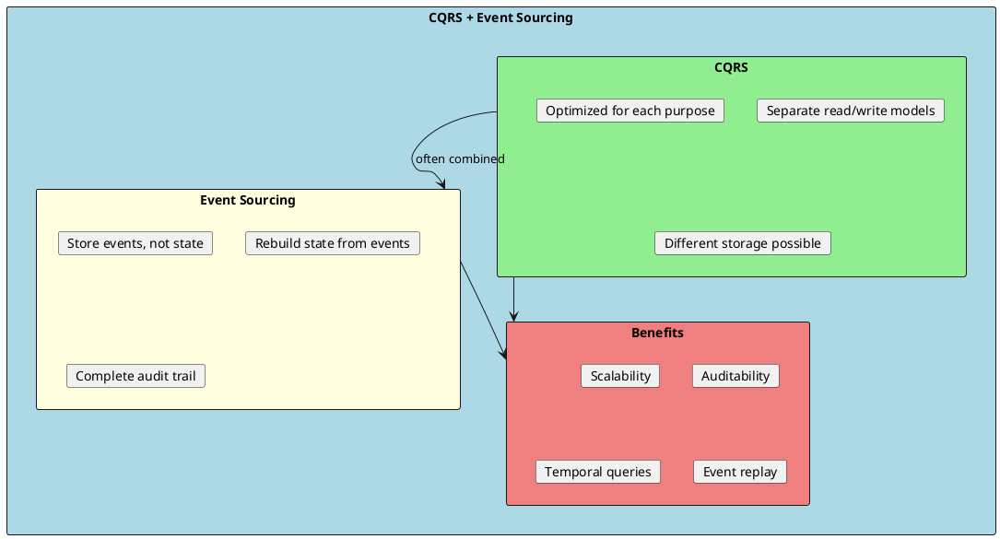
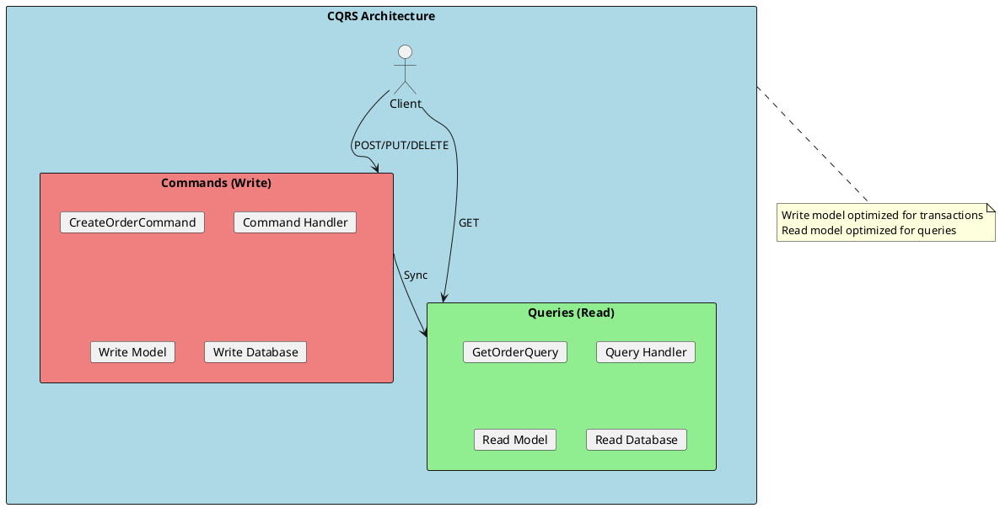
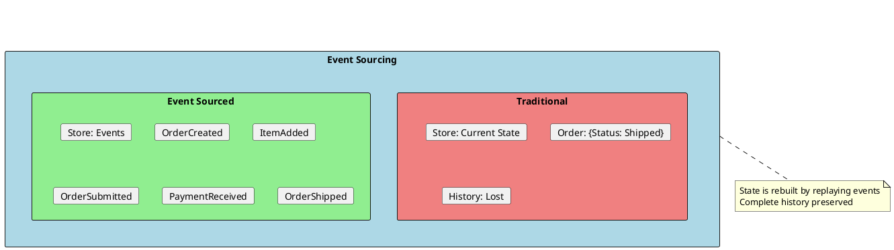
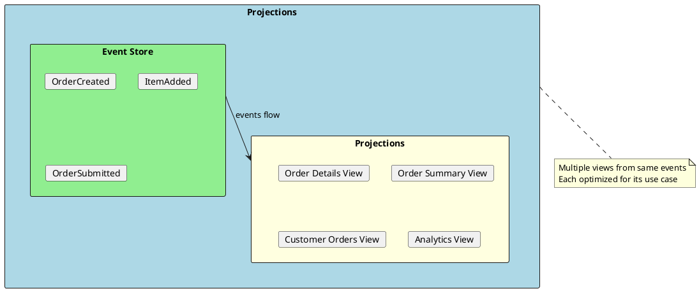
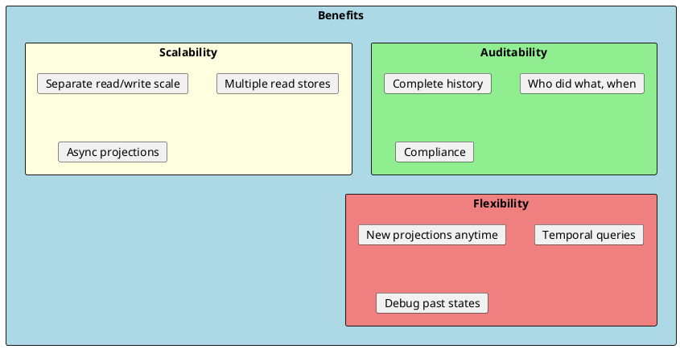
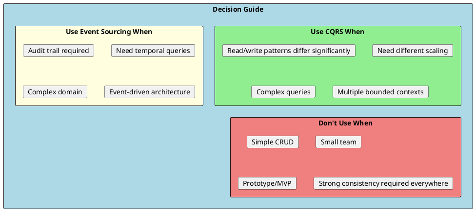

# CQRS & Event Sourcing

CQRS (Command Query Responsibility Segregation) and Event Sourcing are advanced patterns for building complex, scalable systems. They're often used together but are independent concepts.



## CQRS (Command Query Responsibility Segregation)

CQRS separates read and write operations into different models. Commands change state; queries read state.



### Why CQRS?

| Traditional CRUD | CQRS |
|-----------------|------|
| Same model for read/write | Separate models |
| Compromised for both | Optimized for each |
| Complex queries on normalized data | Denormalized read models |
| One database | Can use different databases |

### Basic CQRS Implementation

```csharp
// Commands - express intent to change state
public record CreateOrderCommand(
    Guid CustomerId,
    List<OrderItemDto> Items,
    AddressDto ShippingAddress
);

public record AddOrderItemCommand(
    Guid OrderId,
    Guid ProductId,
    int Quantity
);

public record CancelOrderCommand(
    Guid OrderId,
    string Reason
);

// Command Handler
public class CreateOrderCommandHandler : IRequestHandler<CreateOrderCommand, Guid>
{
    private readonly IOrderRepository _orderRepository;
    private readonly IUnitOfWork _unitOfWork;

    public CreateOrderCommandHandler(
        IOrderRepository orderRepository,
        IUnitOfWork unitOfWork)
    {
        _orderRepository = orderRepository;
        _unitOfWork = unitOfWork;
    }

    public async Task<Guid> Handle(CreateOrderCommand request, CancellationToken cancellationToken)
    {
        var order = new Order(
            OrderId.New(),
            new CustomerId(request.CustomerId),
            request.ShippingAddress.ToAddress()
        );

        foreach (var item in request.Items)
        {
            order.AddItem(
                new ProductId(item.ProductId),
                new Quantity(item.Quantity),
                Money.USD(item.UnitPrice)
            );
        }

        await _orderRepository.AddAsync(order, cancellationToken);
        await _unitOfWork.SaveChangesAsync(cancellationToken);

        return order.Id.Value;
    }
}

// Queries - request data without side effects
public record GetOrderQuery(Guid OrderId) : IRequest<OrderDto?>;

public record GetCustomerOrdersQuery(
    Guid CustomerId,
    int Page = 1,
    int PageSize = 10
) : IRequest<PagedResult<OrderSummaryDto>>;

// Query Handler - uses optimized read model
public class GetOrderQueryHandler : IRequestHandler<GetOrderQuery, OrderDto?>
{
    private readonly IOrderReadRepository _readRepository;

    public GetOrderQueryHandler(IOrderReadRepository readRepository)
    {
        _readRepository = readRepository;
    }

    public async Task<OrderDto?> Handle(GetOrderQuery request, CancellationToken cancellationToken)
    {
        return await _readRepository.GetOrderByIdAsync(request.OrderId, cancellationToken);
    }
}

// DTOs for read model
public record OrderDto(
    Guid Id,
    Guid CustomerId,
    string CustomerName,
    string Status,
    decimal Total,
    List<OrderItemDto> Items,
    AddressDto ShippingAddress,
    DateTime CreatedAt
);

public record OrderSummaryDto(
    Guid Id,
    string Status,
    decimal Total,
    int ItemCount,
    DateTime CreatedAt
);
```

### Separate Read/Write Databases

```csharp
// Write side - uses EF Core with normalized model
public class WriteDbContext : DbContext
{
    public DbSet<Order> Orders => Set<Order>();
    public DbSet<Customer> Customers => Set<Customer>();
    public DbSet<Product> Products => Set<Product>();
}

// Read side - uses Dapper with denormalized views
public interface IOrderReadRepository
{
    Task<OrderDto?> GetOrderByIdAsync(Guid orderId, CancellationToken cancellationToken);
    Task<PagedResult<OrderSummaryDto>> GetCustomerOrdersAsync(
        Guid customerId, int page, int pageSize, CancellationToken cancellationToken);
}

public class DapperOrderReadRepository : IOrderReadRepository
{
    private readonly IDbConnection _connection;

    public DapperOrderReadRepository(IDbConnection connection)
    {
        _connection = connection;
    }

    public async Task<OrderDto?> GetOrderByIdAsync(Guid orderId, CancellationToken cancellationToken)
    {
        const string sql = @"
            SELECT o.Id, o.CustomerId, c.Name as CustomerName, o.Status,
                   o.Total, o.CreatedAt
            FROM OrdersView o
            JOIN Customers c ON o.CustomerId = c.Id
            WHERE o.Id = @OrderId";

        return await _connection.QuerySingleOrDefaultAsync<OrderDto>(
            sql, new { OrderId = orderId });
    }
}

// Sync read model (could use events, change data capture, etc.)
public class OrderProjectionService : INotificationHandler<OrderSubmittedEvent>
{
    private readonly IReadModelUpdater _updater;

    public async Task Handle(OrderSubmittedEvent notification, CancellationToken cancellationToken)
    {
        await _updater.UpdateOrderViewAsync(notification.OrderId);
    }
}
```

---

## Event Sourcing

Event Sourcing stores the state of an entity as a sequence of events. Instead of storing current state, you store all changes that led to the current state.



### Event Sourced Aggregate

```csharp
// Base class for event-sourced aggregates
public abstract class EventSourcedAggregate
{
    private readonly List<IDomainEvent> _uncommittedEvents = new();
    public IReadOnlyCollection<IDomainEvent> UncommittedEvents => _uncommittedEvents.AsReadOnly();

    public Guid Id { get; protected set; }
    public int Version { get; protected set; } = -1;

    protected void AddEvent(IDomainEvent @event)
    {
        _uncommittedEvents.Add(@event);
        Apply(@event);
        Version++;
    }

    public void Load(IEnumerable<IDomainEvent> history)
    {
        foreach (var @event in history)
        {
            Apply(@event);
            Version++;
        }
    }

    protected abstract void Apply(IDomainEvent @event);

    public void ClearUncommittedEvents()
    {
        _uncommittedEvents.Clear();
    }
}

// Event-sourced Order aggregate
public class Order : EventSourcedAggregate
{
    public CustomerId CustomerId { get; private set; }
    public OrderStatus Status { get; private set; }
    public Money Total { get; private set; }

    private readonly List<OrderItem> _items = new();
    public IReadOnlyCollection<OrderItem> Items => _items.AsReadOnly();

    // For rehydration
    private Order() { }

    // Create new order
    public Order(OrderId id, CustomerId customerId)
    {
        var @event = new OrderCreatedEvent(id.Value, customerId.Value, DateTime.UtcNow);
        AddEvent(@event);
    }

    public void AddItem(ProductId productId, Quantity quantity, Money unitPrice)
    {
        if (Status != OrderStatus.Draft)
            throw new DomainException("Cannot modify non-draft order");

        var @event = new OrderItemAddedEvent(
            Id, productId.Value, quantity.Value, unitPrice.Amount);
        AddEvent(@event);
    }

    public void Submit()
    {
        if (!_items.Any())
            throw new DomainException("Cannot submit empty order");

        var @event = new OrderSubmittedEvent(Id, Total.Amount, DateTime.UtcNow);
        AddEvent(@event);
    }

    public void Cancel(string reason)
    {
        if (Status == OrderStatus.Shipped)
            throw new DomainException("Cannot cancel shipped order");

        var @event = new OrderCancelledEvent(Id, reason, DateTime.UtcNow);
        AddEvent(@event);
    }

    // Apply events to rebuild state
    protected override void Apply(IDomainEvent @event)
    {
        switch (@event)
        {
            case OrderCreatedEvent e:
                Id = e.OrderId;
                CustomerId = new CustomerId(e.CustomerId);
                Status = OrderStatus.Draft;
                Total = Money.Zero(Currency.USD);
                break;

            case OrderItemAddedEvent e:
                _items.Add(new OrderItem(
                    new ProductId(e.ProductId),
                    new Quantity(e.Quantity),
                    Money.USD(e.UnitPrice)
                ));
                RecalculateTotal();
                break;

            case OrderSubmittedEvent e:
                Status = OrderStatus.Submitted;
                break;

            case OrderCancelledEvent e:
                Status = OrderStatus.Cancelled;
                break;
        }
    }

    private void RecalculateTotal()
    {
        Total = Money.Sum(_items.Select(i => i.Subtotal));
    }
}

// Events
public record OrderCreatedEvent(
    Guid OrderId,
    Guid CustomerId,
    DateTime CreatedAt
) : IDomainEvent;

public record OrderItemAddedEvent(
    Guid OrderId,
    Guid ProductId,
    int Quantity,
    decimal UnitPrice
) : IDomainEvent;

public record OrderSubmittedEvent(
    Guid OrderId,
    decimal Total,
    DateTime SubmittedAt
) : IDomainEvent;

public record OrderCancelledEvent(
    Guid OrderId,
    string Reason,
    DateTime CancelledAt
) : IDomainEvent;
```

### Event Store

```csharp
// Event store interface
public interface IEventStore
{
    Task<IEnumerable<StoredEvent>> GetEventsAsync(Guid aggregateId, CancellationToken cancellationToken);
    Task AppendEventsAsync(Guid aggregateId, int expectedVersion,
        IEnumerable<IDomainEvent> events, CancellationToken cancellationToken);
}

// Stored event
public class StoredEvent
{
    public long Id { get; set; }
    public Guid AggregateId { get; set; }
    public string EventType { get; set; } = string.Empty;
    public string EventData { get; set; } = string.Empty;
    public int Version { get; set; }
    public DateTime Timestamp { get; set; }
}

// SQL Server implementation
public class SqlEventStore : IEventStore
{
    private readonly IDbConnection _connection;
    private readonly JsonSerializerOptions _jsonOptions;

    public async Task<IEnumerable<StoredEvent>> GetEventsAsync(
        Guid aggregateId, CancellationToken cancellationToken)
    {
        const string sql = @"
            SELECT Id, AggregateId, EventType, EventData, Version, Timestamp
            FROM Events
            WHERE AggregateId = @AggregateId
            ORDER BY Version";

        return await _connection.QueryAsync<StoredEvent>(sql, new { AggregateId = aggregateId });
    }

    public async Task AppendEventsAsync(
        Guid aggregateId,
        int expectedVersion,
        IEnumerable<IDomainEvent> events,
        CancellationToken cancellationToken)
    {
        // Optimistic concurrency check
        var currentVersion = await GetCurrentVersionAsync(aggregateId);
        if (currentVersion != expectedVersion)
            throw new ConcurrencyException($"Expected version {expectedVersion}, but found {currentVersion}");

        var version = expectedVersion;
        foreach (var @event in events)
        {
            version++;
            var storedEvent = new StoredEvent
            {
                AggregateId = aggregateId,
                EventType = @event.GetType().AssemblyQualifiedName!,
                EventData = JsonSerializer.Serialize(@event, @event.GetType(), _jsonOptions),
                Version = version,
                Timestamp = DateTime.UtcNow
            };

            await _connection.ExecuteAsync(@"
                INSERT INTO Events (AggregateId, EventType, EventData, Version, Timestamp)
                VALUES (@AggregateId, @EventType, @EventData, @Version, @Timestamp)",
                storedEvent);
        }
    }
}

// Event-sourced repository
public class EventSourcedOrderRepository : IOrderRepository
{
    private readonly IEventStore _eventStore;
    private readonly JsonSerializerOptions _jsonOptions;

    public async Task<Order?> GetByIdAsync(OrderId id, CancellationToken cancellationToken)
    {
        var events = await _eventStore.GetEventsAsync(id.Value, cancellationToken);
        if (!events.Any())
            return null;

        var domainEvents = events.Select(DeserializeEvent).ToList();

        var order = new Order();  // Private constructor
        order.Load(domainEvents);

        return order;
    }

    public async Task SaveAsync(Order order, CancellationToken cancellationToken)
    {
        var uncommittedEvents = order.UncommittedEvents;
        if (!uncommittedEvents.Any())
            return;

        await _eventStore.AppendEventsAsync(
            order.Id,
            order.Version - uncommittedEvents.Count,
            uncommittedEvents,
            cancellationToken
        );

        order.ClearUncommittedEvents();
    }

    private IDomainEvent DeserializeEvent(StoredEvent stored)
    {
        var type = Type.GetType(stored.EventType)!;
        return (IDomainEvent)JsonSerializer.Deserialize(stored.EventData, type, _jsonOptions)!;
    }
}
```

---

## Projections

Projections build read models from events. They can be rebuilt at any time by replaying events.



```csharp
// Projection handler
public class OrderProjection :
    INotificationHandler<OrderCreatedEvent>,
    INotificationHandler<OrderItemAddedEvent>,
    INotificationHandler<OrderSubmittedEvent>
{
    private readonly IProjectionStore _store;

    public OrderProjection(IProjectionStore store)
    {
        _store = store;
    }

    public async Task Handle(OrderCreatedEvent notification, CancellationToken cancellationToken)
    {
        var view = new OrderView
        {
            Id = notification.OrderId,
            CustomerId = notification.CustomerId,
            Status = "Draft",
            Total = 0,
            ItemCount = 0,
            CreatedAt = notification.CreatedAt
        };

        await _store.InsertAsync(view, cancellationToken);
    }

    public async Task Handle(OrderItemAddedEvent notification, CancellationToken cancellationToken)
    {
        var view = await _store.GetAsync<OrderView>(notification.OrderId, cancellationToken);

        view.ItemCount++;
        view.Total += notification.Quantity * notification.UnitPrice;

        await _store.UpdateAsync(view, cancellationToken);
    }

    public async Task Handle(OrderSubmittedEvent notification, CancellationToken cancellationToken)
    {
        var view = await _store.GetAsync<OrderView>(notification.OrderId, cancellationToken);

        view.Status = "Submitted";
        view.SubmittedAt = notification.SubmittedAt;

        await _store.UpdateAsync(view, cancellationToken);
    }
}

// Rebuild projection from scratch
public class ProjectionRebuilder
{
    private readonly IEventStore _eventStore;
    private readonly IServiceProvider _services;

    public async Task RebuildProjectionAsync<TProjection>(CancellationToken cancellationToken)
    {
        // Clear existing projection data
        var store = _services.GetRequiredService<IProjectionStore>();
        await store.ClearAsync<TProjection>(cancellationToken);

        // Replay all events
        var allEvents = await _eventStore.GetAllEventsAsync(cancellationToken);
        var mediator = _services.GetRequiredService<IMediator>();

        foreach (var @event in allEvents)
        {
            await mediator.Publish(@event, cancellationToken);
        }
    }
}
```

---

## Benefits and Trade-offs

### Benefits



### Trade-offs

| Concern | Challenge |
|---------|-----------|
| **Complexity** | More moving parts, eventual consistency |
| **Event versioning** | Handling schema changes in events |
| **Projection latency** | Read model may be stale |
| **Storage** | Events grow forever |
| **Querying** | Can't query events directly |

---

## When to Use



---

## Interview Questions & Answers

### Q1: What is CQRS?

**Answer**: CQRS (Command Query Responsibility Segregation) separates read and write operations:
- **Commands**: Change state (create, update, delete)
- **Queries**: Read state (no side effects)

Each can have its own model optimized for its purpose.

### Q2: What is Event Sourcing?

**Answer**: Event Sourcing stores state as a sequence of events rather than current state. The current state is derived by replaying all events. Benefits:
- Complete audit trail
- Temporal queries
- Can rebuild state/projections
- Natural fit for event-driven systems

### Q3: Can you use CQRS without Event Sourcing?

**Answer**: Yes! They're independent patterns:
- CQRS alone: Separate read/write models, same persistence
- Event Sourcing alone: Store events, single model
- Combined: Most powerful but most complex

### Q4: What are projections?

**Answer**: Projections are read models built from events. They:
- Subscribe to events and update views
- Can be rebuilt by replaying events
- Each optimized for specific queries
- Multiple projections from same events

### Q5: What is eventual consistency?

**Answer**: In CQRS/ES, the read model may lag behind the write model:
- Write happens → events published → projections updated
- Brief window where read model is stale
- Must design UI to handle this gracefully

### Q6: How do you handle event versioning?

**Answer**: Strategies for evolving events:
- **Upcasting**: Transform old events to new format when reading
- **Versioned handlers**: Different handlers for different versions
- **Weak schema**: Make events flexible (e.g., JSON)
- **Copy-transform**: Create new stream with transformed events

