# Microservices Architecture

Microservices is an architectural style that structures an application as a collection of loosely coupled, independently deployable services. Each service is owned by a small team, focuses on a specific business capability, and communicates through well-defined APIs.

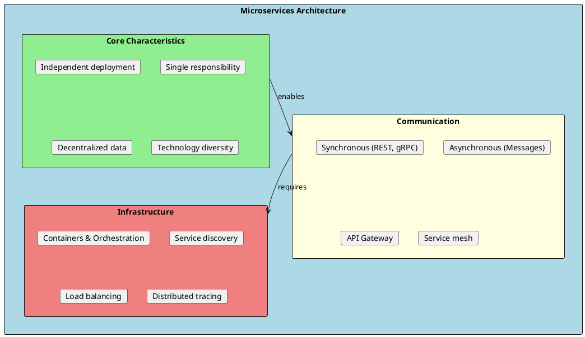

## Monolith vs Microservices

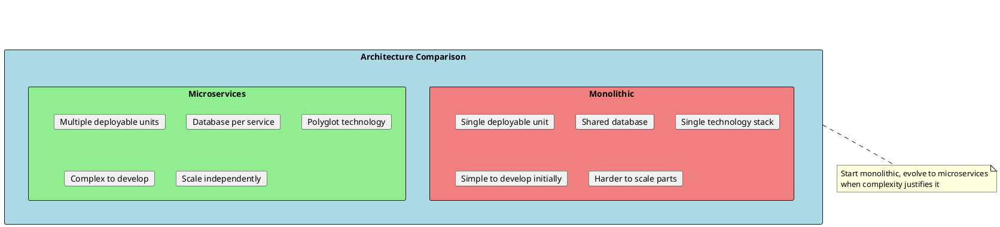

| Aspect | Monolith | Microservices |
|--------|----------|---------------|
| **Deployment** | All or nothing | Independent services |
| **Scaling** | Scale entire app | Scale specific services |
| **Technology** | Single stack | Best tool for each job |
| **Data** | Shared database | Database per service |
| **Team Structure** | Feature teams | Service teams |
| **Complexity** | In the code | In the infrastructure |
| **Failure** | App-wide impact | Isolated failures |

---

## Core Principles

### 1. Single Responsibility

Each microservice should do one thing well and own its domain completely.

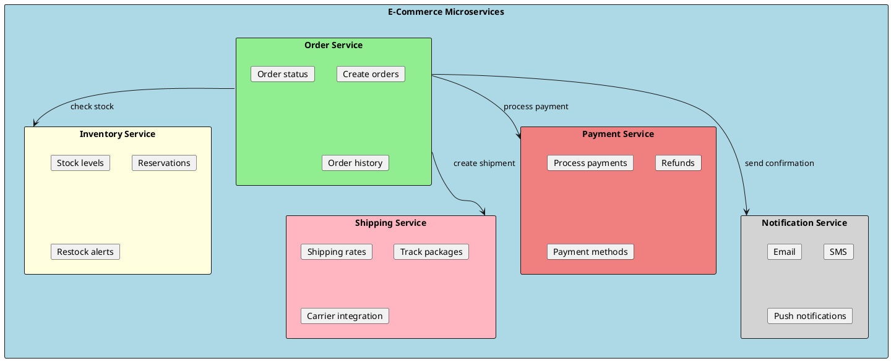

### 2. Autonomous Services

Services should be independently deployable and not require coordination with other services.

```csharp
// Each service has its own API, models, and database
namespace OrderService.Api
{
    [ApiController]
    [Route("api/orders")]
    public class OrdersController : ControllerBase
    {
        private readonly IOrderService _orderService;

        public OrdersController(IOrderService orderService)
        {
            _orderService = orderService;
        }

        [HttpPost]
        public async Task<ActionResult<OrderResponse>> CreateOrder(
            [FromBody] CreateOrderRequest request)
        {
            var order = await _orderService.CreateOrderAsync(request);
            return CreatedAtAction(nameof(GetOrder), new { id = order.Id }, order);
        }

        [HttpGet("{id}")]
        public async Task<ActionResult<OrderResponse>> GetOrder(Guid id)
        {
            var order = await _orderService.GetOrderAsync(id);
            return order is null ? NotFound() : Ok(order);
        }
    }
}
```

### 3. Database per Service

Each service owns its data and exposes it only through APIs. No shared databases.

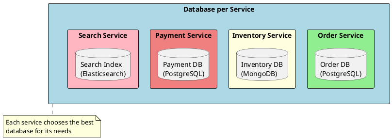

```csharp
// Order Service - owns order data
namespace OrderService.Infrastructure
{
    public class OrderDbContext : DbContext
    {
        public DbSet<Order> Orders => Set<Order>();
        public DbSet<OrderItem> OrderItems => Set<OrderItem>();

        // Only order-related tables - no customer or product details
        // Uses CustomerI and ProductId as foreign references
    }
}

// Inventory Service - owns inventory data
namespace InventoryService.Infrastructure
{
    public class InventoryDbContext : DbContext
    {
        public DbSet<StockItem> StockItems => Set<StockItem>();
        public DbSet<Reservation> Reservations => Set<Reservation>();
        public DbSet<Warehouse> Warehouses => Set<Warehouse>();
    }
}
```

---

## Communication Patterns

### Synchronous Communication

Direct request-response communication using REST or gRPC.

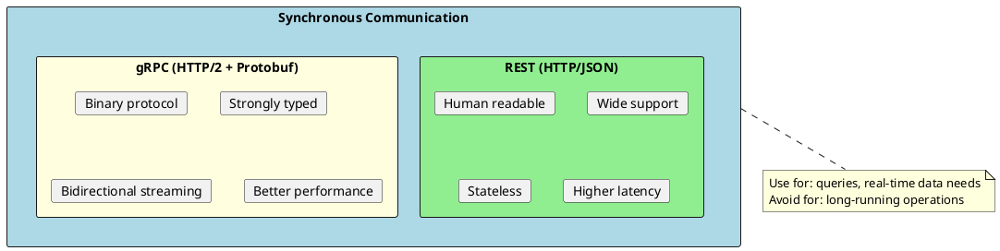

#### REST Communication

```csharp
// HTTP Client for service-to-service communication
public class InventoryServiceClient : IInventoryServiceClient
{
    private readonly HttpClient _httpClient;
    private readonly JsonSerializerOptions _jsonOptions;

    public InventoryServiceClient(HttpClient httpClient)
    {
        _httpClient = httpClient;
        _jsonOptions = new JsonSerializerOptions
        {
            PropertyNamingPolicy = JsonNamingPolicy.CamelCase
        };
    }

    public async Task<StockAvailability?> CheckStockAsync(
        Guid productId,
        int quantity,
        CancellationToken cancellationToken = default)
    {
        var response = await _httpClient.GetAsync(
            $"/api/inventory/{productId}/availability?quantity={quantity}",
            cancellationToken);

        if (!response.IsSuccessStatusCode)
            return null;

        return await response.Content.ReadFromJsonAsync<StockAvailability>(
            _jsonOptions, cancellationToken);
    }

    public async Task<ReservationResult> ReserveStockAsync(
        Guid productId,
        int quantity,
        Guid orderId,
        CancellationToken cancellationToken = default)
    {
        var request = new ReserveStockRequest(productId, quantity, orderId);

        var response = await _httpClient.PostAsJsonAsync(
            "/api/inventory/reservations",
            request,
            _jsonOptions,
            cancellationToken);

        response.EnsureSuccessStatusCode();

        return await response.Content.ReadFromJsonAsync<ReservationResult>(
            _jsonOptions, cancellationToken)
            ?? throw new InvalidOperationException("Invalid response");
    }
}

// Registration with retry policy
builder.Services.AddHttpClient<IInventoryServiceClient, InventoryServiceClient>(client =>
{
    client.BaseAddress = new Uri(builder.Configuration["Services:Inventory:BaseUrl"]!);
    client.Timeout = TimeSpan.FromSeconds(30);
})
.AddPolicyHandler(GetRetryPolicy())
.AddPolicyHandler(GetCircuitBreakerPolicy());
```

#### gRPC Communication

```protobuf
// inventory.proto
syntax = "proto3";

package inventory;

service InventoryService {
  rpc CheckStock(CheckStockRequest) returns (StockAvailability);
  rpc ReserveStock(ReserveStockRequest) returns (ReservationResult);
  rpc ReleaseReservation(ReleaseRequest) returns (ReleaseResult);
}

message CheckStockRequest {
  string product_id = 1;
  int32 quantity = 2;
}

message StockAvailability {
  string product_id = 1;
  int32 available_quantity = 2;
  bool is_available = 3;
}

message ReserveStockRequest {
  string product_id = 1;
  int32 quantity = 2;
  string order_id = 3;
}

message ReservationResult {
  string reservation_id = 1;
  bool success = 2;
  string message = 3;
}
```

```csharp
// gRPC Client
public class GrpcInventoryServiceClient : IInventoryServiceClient
{
    private readonly InventoryService.InventoryServiceClient _client;

    public GrpcInventoryServiceClient(InventoryService.InventoryServiceClient client)
    {
        _client = client;
    }

    public async Task<StockAvailability?> CheckStockAsync(
        Guid productId,
        int quantity,
        CancellationToken cancellationToken = default)
    {
        var request = new CheckStockRequest
        {
            ProductId = productId.ToString(),
            Quantity = quantity
        };

        var response = await _client.CheckStockAsync(
            request,
            cancellationToken: cancellationToken);

        return new StockAvailability(
            Guid.Parse(response.ProductId),
            response.AvailableQuantity,
            response.IsAvailable);
    }
}

// gRPC Service implementation
public class InventoryGrpcService : InventoryService.InventoryServiceBase
{
    private readonly IInventoryService _inventoryService;

    public InventoryGrpcService(IInventoryService inventoryService)
    {
        _inventoryService = inventoryService;
    }

    public override async Task<StockAvailability> CheckStock(
        CheckStockRequest request,
        ServerCallContext context)
    {
        var result = await _inventoryService.CheckStockAsync(
            Guid.Parse(request.ProductId),
            request.Quantity,
            context.CancellationToken);

        return new StockAvailability
        {
            ProductId = result.ProductId.ToString(),
            AvailableQuantity = result.AvailableQuantity,
            IsAvailable = result.IsAvailable
        };
    }
}
```

### Asynchronous Communication

Message-based communication using message brokers.

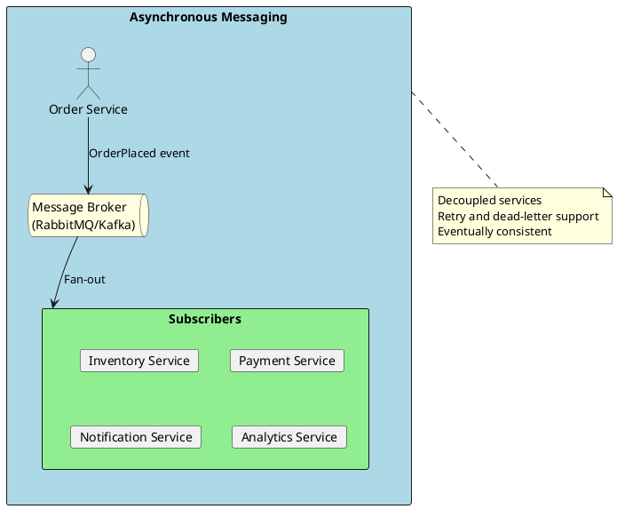

```csharp
// Domain Events
public record OrderPlacedEvent(
    Guid OrderId,
    Guid CustomerId,
    List<OrderItemDto> Items,
    decimal Total,
    DateTime PlacedAt
) : IIntegrationEvent;

public record PaymentCompletedEvent(
    Guid OrderId,
    Guid PaymentId,
    decimal Amount,
    DateTime CompletedAt
) : IIntegrationEvent;

public record InventoryReservedEvent(
    Guid OrderId,
    Guid ReservationId,
    List<ReservedItemDto> Items
) : IIntegrationEvent;

// Event Publisher (using MassTransit with RabbitMQ)
public class OrderService : IOrderService
{
    private readonly IOrderRepository _repository;
    private readonly IPublishEndpoint _publishEndpoint;

    public OrderService(
        IOrderRepository repository,
        IPublishEndpoint publishEndpoint)
    {
        _repository = repository;
        _publishEndpoint = publishEndpoint;
    }

    public async Task<Order> CreateOrderAsync(CreateOrderRequest request)
    {
        var order = new Order(
            Guid.NewGuid(),
            request.CustomerId,
            request.Items);

        await _repository.AddAsync(order);
        await _repository.SaveChangesAsync();

        // Publish event for other services
        await _publishEndpoint.Publish(new OrderPlacedEvent(
            order.Id,
            order.CustomerId,
            order.Items.Select(i => new OrderItemDto(i.ProductId, i.Quantity, i.Price)).ToList(),
            order.Total,
            DateTime.UtcNow
        ));

        return order;
    }
}

// Event Consumer (Inventory Service)
public class OrderPlacedConsumer : IConsumer<OrderPlacedEvent>
{
    private readonly IInventoryService _inventoryService;
    private readonly IPublishEndpoint _publishEndpoint;
    private readonly ILogger<OrderPlacedConsumer> _logger;

    public OrderPlacedConsumer(
        IInventoryService inventoryService,
        IPublishEndpoint publishEndpoint,
        ILogger<OrderPlacedConsumer> logger)
    {
        _inventoryService = inventoryService;
        _publishEndpoint = publishEndpoint;
        _logger = logger;
    }

    public async Task Consume(ConsumeContext<OrderPlacedEvent> context)
    {
        var message = context.Message;
        _logger.LogInformation("Processing order {OrderId}", message.OrderId);

        try
        {
            var reservation = await _inventoryService.ReserveItemsAsync(
                message.OrderId,
                message.Items);

            await _publishEndpoint.Publish(new InventoryReservedEvent(
                message.OrderId,
                reservation.Id,
                reservation.Items
            ));
        }
        catch (InsufficientStockException ex)
        {
            await _publishEndpoint.Publish(new InventoryReservationFailedEvent(
                message.OrderId,
                ex.Message
            ));
        }
    }
}

// MassTransit configuration
builder.Services.AddMassTransit(x =>
{
    x.AddConsumer<OrderPlacedConsumer>();
    x.AddConsumer<PaymentCompletedConsumer>();

    x.UsingRabbitMq((context, cfg) =>
    {
        cfg.Host(builder.Configuration["RabbitMQ:Host"], "/", h =>
        {
            h.Username(builder.Configuration["RabbitMQ:Username"]!);
            h.Password(builder.Configuration["RabbitMQ:Password"]!);
        });

        cfg.ConfigureEndpoints(context);
    });
});
```

---

## API Gateway Pattern

A single entry point for all clients that routes requests to appropriate services.

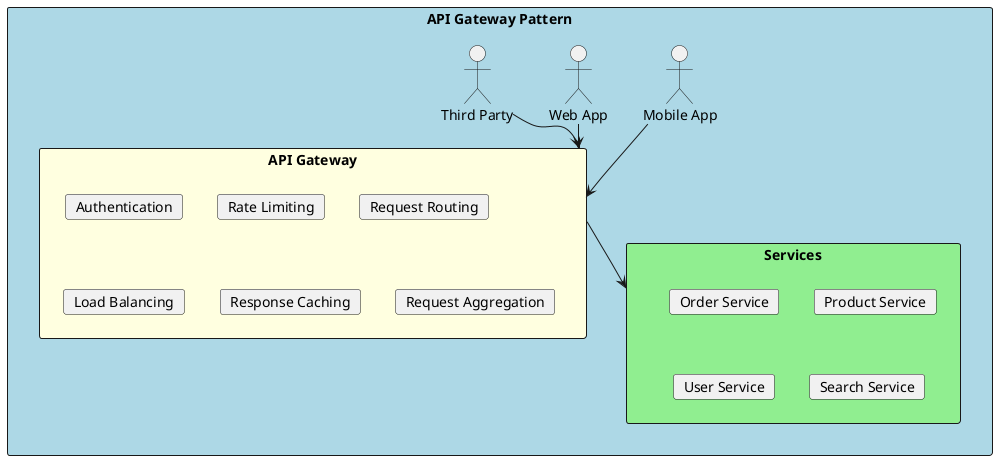

### YARP (Yet Another Reverse Proxy)

```csharp
// API Gateway using YARP
var builder = WebApplication.CreateBuilder(args);

builder.Services.AddReverseProxy()
    .LoadFromConfig(builder.Configuration.GetSection("ReverseProxy"));

// Add authentication
builder.Services.AddAuthentication(JwtBearerDefaults.AuthenticationScheme)
    .AddJwtBearer(options =>
    {
        options.Authority = builder.Configuration["Auth:Authority"];
        options.Audience = builder.Configuration["Auth:Audience"];
    });

// Add rate limiting
builder.Services.AddRateLimiter(options =>
{
    options.GlobalLimiter = PartitionedRateLimiter.Create<HttpContext, string>(context =>
        RateLimitPartition.GetFixedWindowLimiter(
            partitionKey: context.User.Identity?.Name ?? context.Request.Headers.Host.ToString(),
            factory: partition => new FixedWindowRateLimiterOptions
            {
                AutoReplenishment = true,
                PermitLimit = 100,
                Window = TimeSpan.FromMinutes(1)
            }));
});

var app = builder.Build();

app.UseAuthentication();
app.UseAuthorization();
app.UseRateLimiter();
app.MapReverseProxy();

app.Run();
```

```json
// appsettings.json - YARP configuration
{
  "ReverseProxy": {
    "Routes": {
      "orders-route": {
        "ClusterId": "orders-cluster",
        "Match": {
          "Path": "/api/orders/{**catch-all}"
        },
        "Transforms": [
          { "PathRemovePrefix": "/api" }
        ]
      },
      "products-route": {
        "ClusterId": "products-cluster",
        "Match": {
          "Path": "/api/products/{**catch-all}"
        }
      },
      "users-route": {
        "ClusterId": "users-cluster",
        "Match": {
          "Path": "/api/users/{**catch-all}"
        }
      }
    },
    "Clusters": {
      "orders-cluster": {
        "LoadBalancingPolicy": "RoundRobin",
        "Destinations": {
          "orders-1": { "Address": "http://orders-service-1:8080" },
          "orders-2": { "Address": "http://orders-service-2:8080" }
        }
      },
      "products-cluster": {
        "Destinations": {
          "products-1": { "Address": "http://products-service:8080" }
        }
      },
      "users-cluster": {
        "Destinations": {
          "users-1": { "Address": "http://users-service:8080" }
        }
      }
    }
  }
}
```

### BFF (Backend for Frontend)

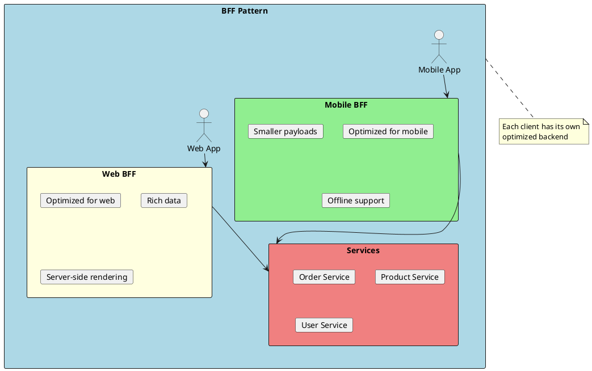

```csharp
// Mobile BFF - optimized responses
[ApiController]
[Route("api/orders")]
public class MobileOrdersController : ControllerBase
{
    private readonly IOrderService _orderService;
    private readonly IProductService _productService;

    [HttpGet("{id}")]
    public async Task<ActionResult<MobileOrderResponse>> GetOrder(Guid id)
    {
        var order = await _orderService.GetOrderAsync(id);
        if (order is null) return NotFound();

        // Minimal response for mobile bandwidth
        return new MobileOrderResponse
        {
            Id = order.Id,
            Status = order.Status,
            Total = order.Total,
            ItemCount = order.Items.Count,
            // Only include thumbnail URLs, not full product details
            ItemThumbnails = order.Items
                .Take(3)
                .Select(i => i.ProductThumbnailUrl)
                .ToList()
        };
    }
}

// Web BFF - rich responses
[ApiController]
[Route("api/orders")]
public class WebOrdersController : ControllerBase
{
    [HttpGet("{id}")]
    public async Task<ActionResult<WebOrderResponse>> GetOrder(Guid id)
    {
        var order = await _orderService.GetOrderAsync(id);
        if (order is null) return NotFound();

        // Rich response with all details
        var products = await _productService.GetProductsAsync(
            order.Items.Select(i => i.ProductId));

        return new WebOrderResponse
        {
            Id = order.Id,
            Status = order.Status,
            Total = order.Total,
            CreatedAt = order.CreatedAt,
            ShippingAddress = order.ShippingAddress,
            Items = order.Items.Select(i => new WebOrderItemResponse
            {
                ProductId = i.ProductId,
                ProductName = products[i.ProductId].Name,
                ProductDescription = products[i.ProductId].Description,
                ProductImages = products[i.ProductId].Images,
                Quantity = i.Quantity,
                UnitPrice = i.UnitPrice,
                Subtotal = i.Subtotal
            }).ToList(),
            Timeline = await GetOrderTimelineAsync(id)
        };
    }
}
```

---

## Service Discovery

Dynamic location of service instances in a distributed system.

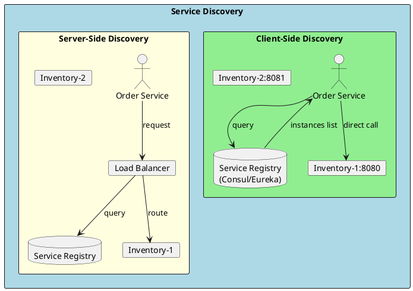

### Consul Integration

```csharp
// Service registration with Consul
public class ConsulServiceRegistration : IHostedService
{
    private readonly IConsulClient _consulClient;
    private readonly IConfiguration _configuration;
    private readonly ILogger<ConsulServiceRegistration> _logger;
    private string? _registrationId;

    public ConsulServiceRegistration(
        IConsulClient consulClient,
        IConfiguration configuration,
        ILogger<ConsulServiceRegistration> logger)
    {
        _consulClient = consulClient;
        _configuration = configuration;
        _logger = logger;
    }

    public async Task StartAsync(CancellationToken cancellationToken)
    {
        var serviceConfig = _configuration.GetSection("ServiceDiscovery");
        _registrationId = $"{serviceConfig["ServiceName"]}-{Guid.NewGuid()}";

        var registration = new AgentServiceRegistration
        {
            ID = _registrationId,
            Name = serviceConfig["ServiceName"],
            Address = serviceConfig["ServiceAddress"],
            Port = int.Parse(serviceConfig["ServicePort"]!),
            Tags = serviceConfig.GetSection("Tags").Get<string[]>(),
            Check = new AgentServiceCheck
            {
                HTTP = $"http://{serviceConfig["ServiceAddress"]}:{serviceConfig["ServicePort"]}/health",
                Interval = TimeSpan.FromSeconds(10),
                Timeout = TimeSpan.FromSeconds(5),
                DeregisterCriticalServiceAfter = TimeSpan.FromMinutes(1)
            }
        };

        await _consulClient.Agent.ServiceRegister(registration, cancellationToken);
        _logger.LogInformation("Service registered with Consul: {ServiceId}", _registrationId);
    }

    public async Task StopAsync(CancellationToken cancellationToken)
    {
        if (_registrationId is not null)
        {
            await _consulClient.Agent.ServiceDeregister(_registrationId, cancellationToken);
            _logger.LogInformation("Service deregistered from Consul: {ServiceId}", _registrationId);
        }
    }
}

// Service discovery client
public class ConsulServiceDiscovery : IServiceDiscovery
{
    private readonly IConsulClient _consulClient;

    public ConsulServiceDiscovery(IConsulClient consulClient)
    {
        _consulClient = consulClient;
    }

    public async Task<Uri?> GetServiceUriAsync(string serviceName)
    {
        var services = await _consulClient.Health.Service(serviceName, tag: null, passingOnly: true);

        if (!services.Response.Any())
            return null;

        // Simple round-robin (could use more sophisticated algorithms)
        var service = services.Response[Random.Shared.Next(services.Response.Length)];
        return new Uri($"http://{service.Service.Address}:{service.Service.Port}");
    }
}

// Usage in HTTP client
builder.Services.AddHttpClient<IInventoryServiceClient, InventoryServiceClient>()
    .ConfigureHttpClient(async (sp, client) =>
    {
        var discovery = sp.GetRequiredService<IServiceDiscovery>();
        var uri = await discovery.GetServiceUriAsync("inventory-service");
        client.BaseAddress = uri;
    });
```

### Kubernetes Service Discovery

```yaml
# Kubernetes Service (built-in discovery)
apiVersion: v1
kind: Service
metadata:
  name: inventory-service
spec:
  selector:
    app: inventory
  ports:
    - port: 80
      targetPort: 8080
---
# Services can discover each other via DNS
# http://inventory-service.default.svc.cluster.local
```

```csharp
// In Kubernetes, use simple DNS-based discovery
builder.Services.AddHttpClient<IInventoryServiceClient, InventoryServiceClient>(client =>
{
    // Kubernetes DNS resolution handles service discovery
    client.BaseAddress = new Uri("http://inventory-service");
});
```

---

## Resilience Patterns

### Circuit Breaker

Prevents cascading failures by stopping calls to a failing service.

```plantuml
@startuml
skinparam monochrome false
skinparam shadowing false

rectangle "Circuit Breaker States" as cb #LightBlue {

  state "Closed" as closed #LightGreen {
    card "Normal operation"
    card "Requests pass through"
    card "Failures counted"
  }

  state "Open" as open #LightCoral {
    card "Requests fail fast"
    card "No calls to service"
    card "Timer running"
  }

  state "Half-Open" as half #LightYellow {
    card "Limited test requests"
    card "Evaluating health"
    card "Ready to transition"
  }

  closed --> open : Threshold exceeded
  open --> half : Timeout elapsed
  half --> closed : Success
  half --> open : Failure

}
@enduml
```

```csharp
// Using Polly for resilience
public static class ResiliencePolicies
{
    public static IAsyncPolicy<HttpResponseMessage> GetRetryPolicy()
    {
        return HttpPolicyExtensions
            .HandleTransientHttpError()
            .OrResult(msg => msg.StatusCode == HttpStatusCode.TooManyRequests)
            .WaitAndRetryAsync(
                retryCount: 3,
                sleepDurationProvider: retryAttempt =>
                    TimeSpan.FromSeconds(Math.Pow(2, retryAttempt)) // Exponential backoff
                    + TimeSpan.FromMilliseconds(Random.Shared.Next(0, 100)), // Jitter
                onRetry: (outcome, timespan, retryAttempt, context) =>
                {
                    Log.Warning(
                        "Retry {RetryAttempt} after {Delay}ms due to {Reason}",
                        retryAttempt,
                        timespan.TotalMilliseconds,
                        outcome.Exception?.Message ?? outcome.Result.StatusCode.ToString());
                });
    }

    public static IAsyncPolicy<HttpResponseMessage> GetCircuitBreakerPolicy()
    {
        return HttpPolicyExtensions
            .HandleTransientHttpError()
            .CircuitBreakerAsync(
                handledEventsAllowedBeforeBreaking: 5,
                durationOfBreak: TimeSpan.FromSeconds(30),
                onBreak: (outcome, breakDelay) =>
                {
                    Log.Warning(
                        "Circuit breaker opened for {BreakDelay}s due to {Reason}",
                        breakDelay.TotalSeconds,
                        outcome.Exception?.Message ?? outcome.Result.StatusCode.ToString());
                },
                onReset: () => Log.Information("Circuit breaker reset"),
                onHalfOpen: () => Log.Information("Circuit breaker half-open"));
    }

    public static IAsyncPolicy<HttpResponseMessage> GetBulkheadPolicy()
    {
        return Policy.BulkheadAsync<HttpResponseMessage>(
            maxParallelization: 10,
            maxQueuingActions: 25,
            onBulkheadRejectedAsync: context =>
            {
                Log.Warning("Bulkhead rejected request");
                return Task.CompletedTask;
            });
    }

    public static IAsyncPolicy<HttpResponseMessage> GetTimeoutPolicy()
    {
        return Policy.TimeoutAsync<HttpResponseMessage>(
            TimeSpan.FromSeconds(10),
            TimeoutStrategy.Optimistic);
    }
}

// Combining policies
builder.Services.AddHttpClient<IInventoryServiceClient, InventoryServiceClient>()
    .AddPolicyHandler(ResiliencePolicies.GetRetryPolicy())
    .AddPolicyHandler(ResiliencePolicies.GetCircuitBreakerPolicy())
    .AddPolicyHandler(ResiliencePolicies.GetBulkheadPolicy())
    .AddPolicyHandler(ResiliencePolicies.GetTimeoutPolicy());
```

### Fallback Pattern

```csharp
public class ResilientInventoryClient : IInventoryServiceClient
{
    private readonly IInventoryServiceClient _client;
    private readonly ICache _cache;
    private readonly ILogger<ResilientInventoryClient> _logger;

    public async Task<StockAvailability?> CheckStockAsync(
        Guid productId,
        int quantity,
        CancellationToken cancellationToken = default)
    {
        try
        {
            var result = await _client.CheckStockAsync(productId, quantity, cancellationToken);

            // Cache successful responses
            if (result is not null)
            {
                await _cache.SetAsync(
                    $"stock:{productId}",
                    result,
                    TimeSpan.FromMinutes(5));
            }

            return result;
        }
        catch (Exception ex) when (ex is HttpRequestException or TaskCanceledException)
        {
            _logger.LogWarning(ex, "Failed to check stock, using cached value");

            // Fallback to cached value
            var cached = await _cache.GetAsync<StockAvailability>($"stock:{productId}");
            if (cached is not null)
            {
                return cached with { IsCached = true };
            }

            // Fallback to default (conservative estimate)
            return new StockAvailability(productId, 0, false, IsCached: true);
        }
    }
}
```

---

## Distributed Data Management

### Saga Pattern

Manages distributed transactions across multiple services using a sequence of local transactions.

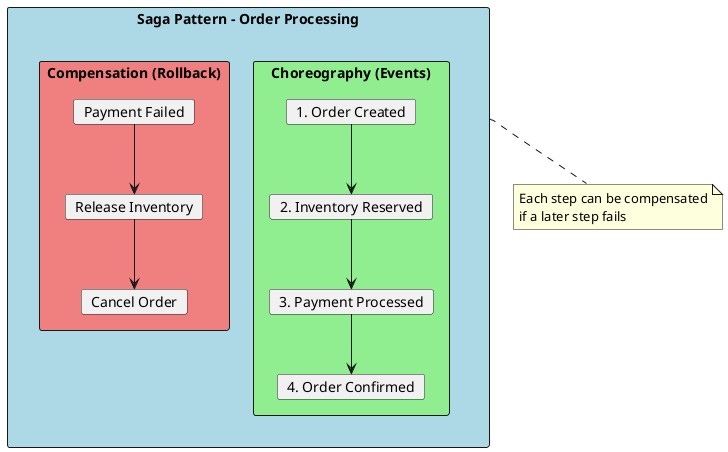

#### Choreography-based Saga

```csharp
// Order Service - starts the saga
public class OrderService : IOrderService
{
    private readonly IOrderRepository _repository;
    private readonly IPublishEndpoint _publishEndpoint;

    public async Task<Order> CreateOrderAsync(CreateOrderRequest request)
    {
        var order = new Order(request.CustomerId, request.Items);
        order.SetStatus(OrderStatus.Pending);

        await _repository.AddAsync(order);
        await _repository.SaveChangesAsync();

        // Start saga
        await _publishEndpoint.Publish(new OrderCreatedEvent(order.Id, order.Items));

        return order;
    }
}

// Inventory Service - Step 2
public class OrderCreatedConsumer : IConsumer<OrderCreatedEvent>
{
    private readonly IInventoryService _inventoryService;
    private readonly IPublishEndpoint _publishEndpoint;

    public async Task Consume(ConsumeContext<OrderCreatedEvent> context)
    {
        try
        {
            var reservation = await _inventoryService.ReserveItemsAsync(
                context.Message.OrderId,
                context.Message.Items);

            await _publishEndpoint.Publish(new InventoryReservedEvent(
                context.Message.OrderId,
                reservation.Id));
        }
        catch (InsufficientStockException)
        {
            // Compensation: notify order service to cancel
            await _publishEndpoint.Publish(new InventoryReservationFailedEvent(
                context.Message.OrderId,
                "Insufficient stock"));
        }
    }
}

// Payment Service - Step 3
public class InventoryReservedConsumer : IConsumer<InventoryReservedEvent>
{
    private readonly IPaymentService _paymentService;
    private readonly IPublishEndpoint _publishEndpoint;

    public async Task Consume(ConsumeContext<InventoryReservedEvent> context)
    {
        try
        {
            var payment = await _paymentService.ProcessPaymentAsync(
                context.Message.OrderId);

            await _publishEndpoint.Publish(new PaymentCompletedEvent(
                context.Message.OrderId,
                payment.Id));
        }
        catch (PaymentFailedException)
        {
            // Compensation: release inventory
            await _publishEndpoint.Publish(new PaymentFailedEvent(
                context.Message.OrderId,
                context.Message.ReservationId));
        }
    }
}

// Inventory Service - Compensation handler
public class PaymentFailedConsumer : IConsumer<PaymentFailedEvent>
{
    private readonly IInventoryService _inventoryService;
    private readonly IPublishEndpoint _publishEndpoint;

    public async Task Consume(ConsumeContext<PaymentFailedEvent> context)
    {
        // Compensating action: release the reservation
        await _inventoryService.ReleaseReservationAsync(context.Message.ReservationId);

        await _publishEndpoint.Publish(new InventoryReleasedEvent(
            context.Message.OrderId));
    }
}

// Order Service - Final success handler
public class PaymentCompletedConsumer : IConsumer<PaymentCompletedEvent>
{
    private readonly IOrderRepository _repository;
    private readonly IPublishEndpoint _publishEndpoint;

    public async Task Consume(ConsumeContext<PaymentCompletedEvent> context)
    {
        var order = await _repository.GetByIdAsync(context.Message.OrderId);
        order!.SetStatus(OrderStatus.Confirmed);
        await _repository.SaveChangesAsync();

        await _publishEndpoint.Publish(new OrderConfirmedEvent(order.Id));
    }
}
```

#### Orchestration-based Saga

```csharp
// Saga State Machine using MassTransit
public class OrderSagaState : SagaStateMachineInstance
{
    public Guid CorrelationId { get; set; }
    public string CurrentState { get; set; } = string.Empty;
    public Guid OrderId { get; set; }
    public Guid? ReservationId { get; set; }
    public Guid? PaymentId { get; set; }
    public DateTime CreatedAt { get; set; }
}

public class OrderSaga : MassTransitStateMachine<OrderSagaState>
{
    public State Pending { get; private set; } = null!;
    public State InventoryReserved { get; private set; } = null!;
    public State PaymentProcessed { get; private set; } = null!;
    public State Completed { get; private set; } = null!;
    public State Failed { get; private set; } = null!;

    public Event<OrderCreatedEvent> OrderCreated { get; private set; } = null!;
    public Event<InventoryReservedEvent> InventoryReserved { get; private set; } = null!;
    public Event<InventoryReservationFailedEvent> InventoryFailed { get; private set; } = null!;
    public Event<PaymentCompletedEvent> PaymentCompleted { get; private set; } = null!;
    public Event<PaymentFailedEvent> PaymentFailed { get; private set; } = null!;

    public OrderSaga()
    {
        InstanceState(x => x.CurrentState);

        Event(() => OrderCreated, x => x.CorrelateById(m => m.Message.OrderId));
        Event(() => InventoryReserved, x => x.CorrelateById(m => m.Message.OrderId));
        Event(() => InventoryFailed, x => x.CorrelateById(m => m.Message.OrderId));
        Event(() => PaymentCompleted, x => x.CorrelateById(m => m.Message.OrderId));
        Event(() => PaymentFailed, x => x.CorrelateById(m => m.Message.OrderId));

        Initially(
            When(OrderCreated)
                .Then(context =>
                {
                    context.Saga.OrderId = context.Message.OrderId;
                    context.Saga.CreatedAt = DateTime.UtcNow;
                })
                .Publish(context => new ReserveInventoryCommand(
                    context.Saga.OrderId,
                    context.Message.Items))
                .TransitionTo(Pending));

        During(Pending,
            When(InventoryReserved)
                .Then(context => context.Saga.ReservationId = context.Message.ReservationId)
                .Publish(context => new ProcessPaymentCommand(
                    context.Saga.OrderId,
                    context.Message.Total))
                .TransitionTo(InventoryReserved),
            When(InventoryFailed)
                .Publish(context => new CancelOrderCommand(context.Saga.OrderId, "Inventory unavailable"))
                .TransitionTo(Failed)
                .Finalize());

        During(InventoryReserved,
            When(PaymentCompleted)
                .Then(context => context.Saga.PaymentId = context.Message.PaymentId)
                .Publish(context => new ConfirmOrderCommand(context.Saga.OrderId))
                .TransitionTo(Completed)
                .Finalize(),
            When(PaymentFailed)
                .Publish(context => new ReleaseInventoryCommand(context.Saga.ReservationId!.Value))
                .Publish(context => new CancelOrderCommand(context.Saga.OrderId, "Payment failed"))
                .TransitionTo(Failed)
                .Finalize());

        SetCompletedWhenFinalized();
    }
}
```

### Outbox Pattern

Ensures reliable event publishing with database transactions.

```csharp
// Outbox message entity
public class OutboxMessage
{
    public Guid Id { get; set; }
    public string Type { get; set; } = string.Empty;
    public string Data { get; set; } = string.Empty;
    public DateTime CreatedAt { get; set; }
    public DateTime? ProcessedAt { get; set; }
}

// Save order and outbox message in same transaction
public class OrderService : IOrderService
{
    private readonly OrderDbContext _context;

    public async Task<Order> CreateOrderAsync(CreateOrderRequest request)
    {
        await using var transaction = await _context.Database.BeginTransactionAsync();

        try
        {
            var order = new Order(request.CustomerId, request.Items);
            _context.Orders.Add(order);

            // Add outbox message in same transaction
            var @event = new OrderCreatedEvent(order.Id, order.CustomerId, order.Items);
            _context.OutboxMessages.Add(new OutboxMessage
            {
                Id = Guid.NewGuid(),
                Type = typeof(OrderCreatedEvent).AssemblyQualifiedName!,
                Data = JsonSerializer.Serialize(@event),
                CreatedAt = DateTime.UtcNow
            });

            await _context.SaveChangesAsync();
            await transaction.CommitAsync();

            return order;
        }
        catch
        {
            await transaction.RollbackAsync();
            throw;
        }
    }
}

// Background service to process outbox
public class OutboxProcessor : BackgroundService
{
    private readonly IServiceScopeFactory _scopeFactory;
    private readonly IPublishEndpoint _publishEndpoint;

    protected override async Task ExecuteAsync(CancellationToken stoppingToken)
    {
        while (!stoppingToken.IsCancellationRequested)
        {
            using var scope = _scopeFactory.CreateScope();
            var context = scope.ServiceProvider.GetRequiredService<OrderDbContext>();

            var messages = await context.OutboxMessages
                .Where(m => m.ProcessedAt == null)
                .OrderBy(m => m.CreatedAt)
                .Take(100)
                .ToListAsync(stoppingToken);

            foreach (var message in messages)
            {
                var eventType = Type.GetType(message.Type)!;
                var @event = JsonSerializer.Deserialize(message.Data, eventType)!;

                await _publishEndpoint.Publish(@event, eventType, stoppingToken);

                message.ProcessedAt = DateTime.UtcNow;
            }

            await context.SaveChangesAsync(stoppingToken);
            await Task.Delay(TimeSpan.FromSeconds(5), stoppingToken);
        }
    }
}
```

---

## Observability

### Distributed Tracing

Track requests across service boundaries.

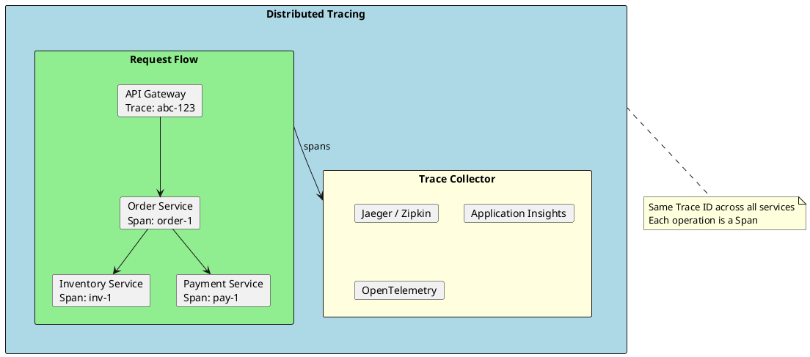

```csharp
// OpenTelemetry configuration
builder.Services.AddOpenTelemetry()
    .ConfigureResource(resource => resource
        .AddService(serviceName: "order-service", serviceVersion: "1.0.0"))
    .WithTracing(tracing => tracing
        .AddAspNetCoreInstrumentation()
        .AddHttpClientInstrumentation()
        .AddEntityFrameworkCoreInstrumentation()
        .AddSource("OrderService.Activities")
        .AddOtlpExporter(options =>
        {
            options.Endpoint = new Uri(builder.Configuration["Otlp:Endpoint"]!);
        }))
    .WithMetrics(metrics => metrics
        .AddAspNetCoreInstrumentation()
        .AddHttpClientInstrumentation()
        .AddRuntimeInstrumentation()
        .AddOtlpExporter());

// Custom tracing in code
public class OrderService : IOrderService
{
    private static readonly ActivitySource ActivitySource = new("OrderService.Activities");

    public async Task<Order> CreateOrderAsync(CreateOrderRequest request)
    {
        using var activity = ActivitySource.StartActivity("CreateOrder");
        activity?.SetTag("customer.id", request.CustomerId);
        activity?.SetTag("items.count", request.Items.Count);

        try
        {
            var order = new Order(request.CustomerId, request.Items);
            await _repository.AddAsync(order);

            activity?.SetTag("order.id", order.Id);
            activity?.SetStatus(ActivityStatusCode.Ok);

            return order;
        }
        catch (Exception ex)
        {
            activity?.SetStatus(ActivityStatusCode.Error, ex.Message);
            throw;
        }
    }
}
```

### Structured Logging

```csharp
// Serilog configuration
builder.Host.UseSerilog((context, configuration) =>
{
    configuration
        .ReadFrom.Configuration(context.Configuration)
        .Enrich.FromLogContext()
        .Enrich.WithMachineName()
        .Enrich.WithEnvironmentName()
        .Enrich.WithProperty("ServiceName", "order-service")
        .WriteTo.Console(new JsonFormatter())
        .WriteTo.Seq(context.Configuration["Seq:ServerUrl"]!);
});

// Correlation ID middleware
public class CorrelationIdMiddleware
{
    private readonly RequestDelegate _next;
    private const string CorrelationIdHeader = "X-Correlation-ID";

    public CorrelationIdMiddleware(RequestDelegate next)
    {
        _next = next;
    }

    public async Task InvokeAsync(HttpContext context)
    {
        var correlationId = context.Request.Headers[CorrelationIdHeader].FirstOrDefault()
            ?? Guid.NewGuid().ToString();

        context.Items["CorrelationId"] = correlationId;
        context.Response.Headers[CorrelationIdHeader] = correlationId;

        using (LogContext.PushProperty("CorrelationId", correlationId))
        {
            await _next(context);
        }
    }
}

// Structured logging in services
public class OrderService : IOrderService
{
    private readonly ILogger<OrderService> _logger;

    public async Task<Order> CreateOrderAsync(CreateOrderRequest request)
    {
        _logger.LogInformation(
            "Creating order for customer {CustomerId} with {ItemCount} items",
            request.CustomerId,
            request.Items.Count);

        var order = new Order(request.CustomerId, request.Items);

        _logger.LogInformation(
            "Order {OrderId} created with total {Total:C}",
            order.Id,
            order.Total);

        return order;
    }
}
```

### Health Checks

```csharp
// Health check configuration
builder.Services.AddHealthChecks()
    .AddDbContextCheck<OrderDbContext>("database")
    .AddRabbitMQ(builder.Configuration["RabbitMQ:ConnectionString"]!, name: "rabbitmq")
    .AddRedis(builder.Configuration["Redis:ConnectionString"]!, name: "redis")
    .AddUrlGroup(new Uri(builder.Configuration["Services:Inventory:HealthUrl"]!),
        name: "inventory-service",
        failureStatus: HealthStatus.Degraded);

// Map health endpoints
app.MapHealthChecks("/health/live", new HealthCheckOptions
{
    Predicate = _ => false // No checks, just confirms app is running
});

app.MapHealthChecks("/health/ready", new HealthCheckOptions
{
    Predicate = check => check.Tags.Contains("ready"),
    ResponseWriter = UIResponseWriter.WriteHealthCheckUIResponse
});

app.MapHealthChecks("/health/startup", new HealthCheckOptions
{
    Predicate = check => check.Tags.Contains("startup")
});
```

---

## Deployment Patterns

### Containerization with Docker

```dockerfile
# Multi-stage Dockerfile
FROM mcr.microsoft.com/dotnet/sdk:8.0 AS build
WORKDIR /src

# Copy csproj and restore
COPY ["src/OrderService.Api/OrderService.Api.csproj", "OrderService.Api/"]
COPY ["src/OrderService.Domain/OrderService.Domain.csproj", "OrderService.Domain/"]
COPY ["src/OrderService.Infrastructure/OrderService.Infrastructure.csproj", "OrderService.Infrastructure/"]
RUN dotnet restore "OrderService.Api/OrderService.Api.csproj"

# Copy everything and build
COPY src/ .
RUN dotnet build "OrderService.Api/OrderService.Api.csproj" -c Release -o /app/build

# Publish
FROM build AS publish
RUN dotnet publish "OrderService.Api/OrderService.Api.csproj" -c Release -o /app/publish /p:UseAppHost=false

# Final image
FROM mcr.microsoft.com/dotnet/aspnet:8.0 AS final
WORKDIR /app
EXPOSE 8080

# Create non-root user
RUN adduser --disabled-password --gecos '' appuser
USER appuser

COPY --from=publish /app/publish .
ENTRYPOINT ["dotnet", "OrderService.Api.dll"]
```

### Kubernetes Deployment

```yaml
# deployment.yaml
apiVersion: apps/v1
kind: Deployment
metadata:
  name: order-service
  labels:
    app: order-service
spec:
  replicas: 3
  selector:
    matchLabels:
      app: order-service
  template:
    metadata:
      labels:
        app: order-service
    spec:
      containers:
        - name: order-service
          image: myregistry/order-service:1.0.0
          ports:
            - containerPort: 8080
          env:
            - name: ASPNETCORE_ENVIRONMENT
              value: "Production"
            - name: ConnectionStrings__Default
              valueFrom:
                secretKeyRef:
                  name: order-service-secrets
                  key: connection-string
          resources:
            requests:
              memory: "256Mi"
              cpu: "100m"
            limits:
              memory: "512Mi"
              cpu: "500m"
          livenessProbe:
            httpGet:
              path: /health/live
              port: 8080
            initialDelaySeconds: 10
            periodSeconds: 10
          readinessProbe:
            httpGet:
              path: /health/ready
              port: 8080
            initialDelaySeconds: 5
            periodSeconds: 5
          startupProbe:
            httpGet:
              path: /health/startup
              port: 8080
            failureThreshold: 30
            periodSeconds: 10
---
apiVersion: v1
kind: Service
metadata:
  name: order-service
spec:
  selector:
    app: order-service
  ports:
    - port: 80
      targetPort: 8080
  type: ClusterIP
---
apiVersion: autoscaling/v2
kind: HorizontalPodAutoscaler
metadata:
  name: order-service-hpa
spec:
  scaleTargetRef:
    apiVersion: apps/v1
    kind: Deployment
    name: order-service
  minReplicas: 2
  maxReplicas: 10
  metrics:
    - type: Resource
      resource:
        name: cpu
        target:
          type: Utilization
          averageUtilization: 70
```

---

## When to Use Microservices

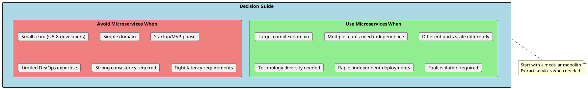

### Migration Strategy: Strangler Fig Pattern

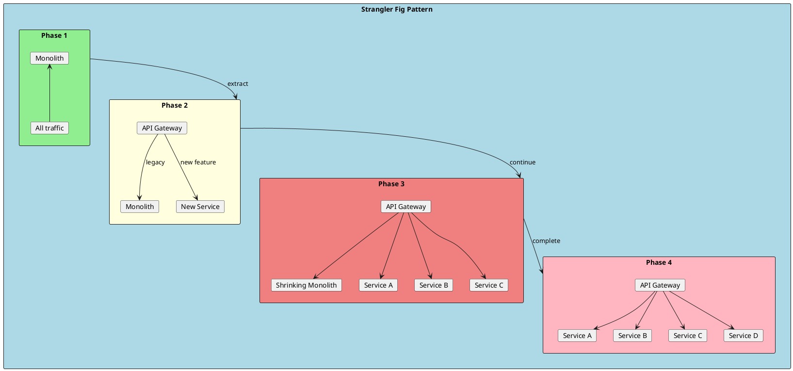

---

## Common Anti-Patterns

| Anti-Pattern | Description | Solution |
|--------------|-------------|----------|
| **Distributed Monolith** | Services tightly coupled, must deploy together | Define clear boundaries, async communication |
| **Shared Database** | Multiple services accessing same tables | Database per service, API-based data access |
| **Chatty Services** | Too many synchronous calls between services | Aggregate data, use events, BFF pattern |
| **No API Gateway** | Clients call services directly | Implement API Gateway for routing/auth |
| **Ignoring Data Consistency** | Assuming ACID transactions work across services | Saga pattern, eventual consistency |
| **Over-Engineering** | Too many tiny services | Right-size services around business capabilities |
| **No Observability** | Can't trace or debug distributed requests | Implement logging, tracing, metrics |

---

## Interview Questions & Answers

### Q1: What are Microservices?

**Answer**: Microservices is an architectural style where an application is composed of small, independent services that:
- Focus on a single business capability
- Are independently deployable
- Communicate through well-defined APIs
- Own their data
- Can use different technologies

### Q2: Monolith vs Microservices - When to choose each?

**Answer**:

**Monolith**:
- Small team, simple domain
- Startup/MVP stage
- Strong consistency needs
- Limited DevOps maturity

**Microservices**:
- Large team, complex domain
- Need independent deployments
- Different scaling requirements
- Technology diversity needed

### Q3: How do microservices communicate?

**Answer**:
- **Synchronous**: REST, gRPC - for real-time queries
- **Asynchronous**: Message queues (RabbitMQ, Kafka) - for events, decoupling
- **API Gateway**: Single entry point, routing, auth

Choose based on consistency vs availability trade-offs.

### Q4: What is the Saga Pattern?

**Answer**: A pattern for managing distributed transactions across services:
- **Choreography**: Services react to events, no central coordinator
- **Orchestration**: Central saga orchestrator controls the flow
- **Compensation**: Each step has a compensating action for rollback

### Q5: How do you handle data consistency?

**Answer**:
- Accept eventual consistency
- Use Saga pattern for distributed transactions
- Outbox pattern for reliable event publishing
- Design for idempotency
- Use domain events for synchronization

### Q6: What is an API Gateway?

**Answer**: A single entry point for all clients that provides:
- Request routing
- Authentication/Authorization
- Rate limiting
- Load balancing
- Response caching
- Request aggregation
- Protocol translation

### Q7: How do you ensure resilience?

**Answer**:
- **Circuit Breaker**: Stop calling failing services
- **Retry with backoff**: Handle transient failures
- **Bulkhead**: Isolate failures
- **Timeout**: Don't wait forever
- **Fallback**: Provide degraded functionality

### Q8: What is Service Discovery?

**Answer**: Mechanism for services to find each other dynamically:
- **Client-side**: Client queries registry, chooses instance (Consul, Eureka)
- **Server-side**: Load balancer queries registry, routes request
- **Kubernetes**: Built-in DNS-based discovery

### Q9: How do you observe microservices?

**Answer**: Three pillars of observability:
- **Logging**: Structured logs with correlation IDs
- **Metrics**: Request rates, latencies, error rates
- **Tracing**: Distributed tracing across services (OpenTelemetry, Jaeger)

### Q10: What is the Strangler Fig Pattern?

**Answer**: Migration strategy from monolith to microservices:
1. Put API Gateway in front of monolith
2. Implement new features as services
3. Gradually extract existing features
4. Route traffic to new services
5. Eventually retire the monolith

Benefits: Incremental migration, reduced risk, continuous delivery.
