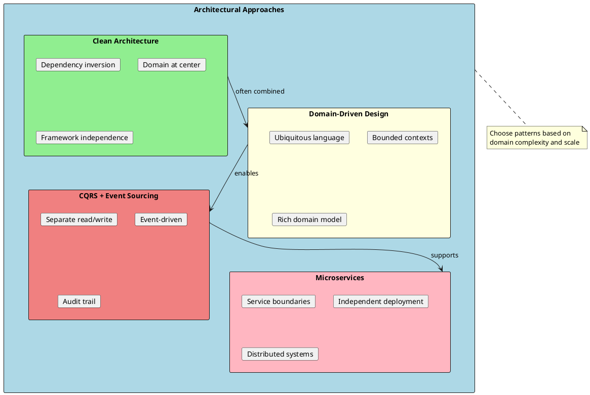
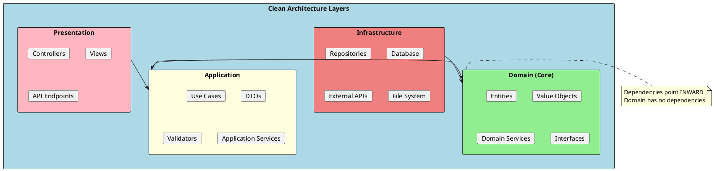
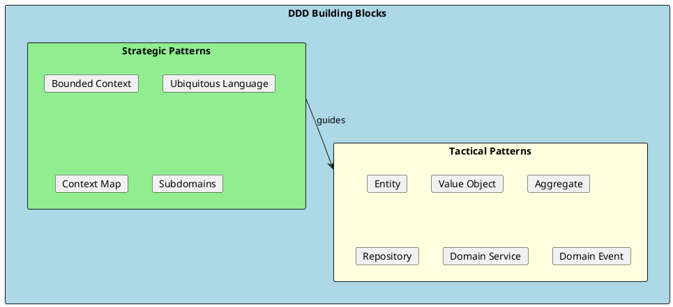
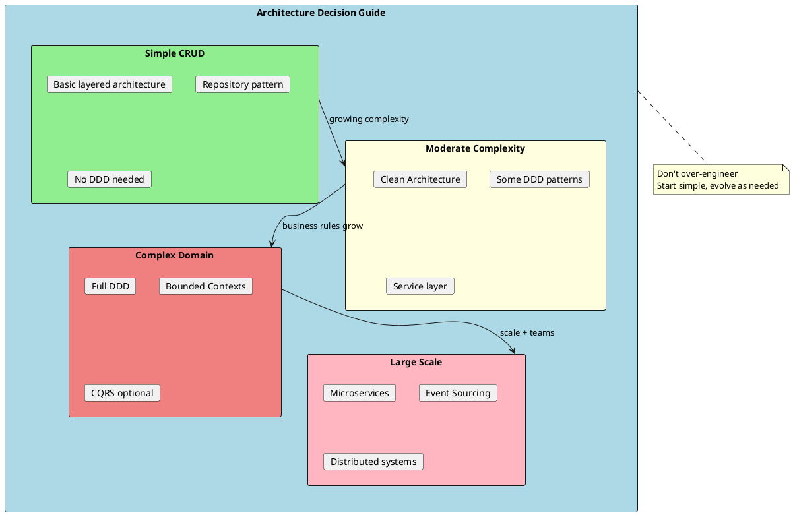

# Architecture & Domain-Driven Design

Software architecture defines the high-level structure and organization of a system. Domain-Driven Design (DDD) provides patterns for building complex business applications by focusing on the core domain and domain logic.



## Why Architecture Matters

Good architecture provides:

1. **Maintainability** - Easy to understand and modify
2. **Testability** - Business logic can be tested in isolation
3. **Flexibility** - Change frameworks without rewriting business logic
4. **Scalability** - Grow the system as requirements evolve
5. **Team Independence** - Teams can work on different parts

## Clean Architecture Overview



### Dependency Rule

The fundamental rule: **dependencies only point inward**. Inner layers know nothing about outer layers.

```
Presentation → Application → Domain ← Infrastructure
```

## Domain-Driven Design Overview

DDD is an approach to developing complex software by:
- Focusing on the core domain
- Using a ubiquitous language shared by developers and domain experts
- Structuring code around business concepts



## Key Components

| Component | Purpose | Document |
|-----------|---------|----------|
| **Clean Architecture** | Layered structure with dependency inversion | [01-CleanArchitecture.md](./01-CleanArchitecture.md) |
| **DDD Fundamentals** | Strategic patterns and concepts | [02-DDD-Fundamentals.md](./02-DDD-Fundamentals.md) |
| **DDD Tactical Patterns** | Entities, Value Objects, Aggregates | [03-DDD-TacticalPatterns.md](./03-DDD-TacticalPatterns.md) |
| **CQRS & Event Sourcing** | Advanced patterns for complex domains | [04-CQRS-EventSourcing.md](./04-CQRS-EventSourcing.md) |
| **Microservices** | Distributed system patterns | [05-Microservices.md](./05-Microservices.md) |

## Project Structure Example

```
src/
├── MyApp.Domain/                 # Core business logic
│   ├── Entities/
│   │   ├── Order.cs
│   │   └── Customer.cs
│   ├── ValueObjects/
│   │   ├── Money.cs
│   │   └── Address.cs
│   ├── Interfaces/
│   │   └── IOrderRepository.cs
│   ├── Services/
│   │   └── PricingService.cs
│   └── Events/
│       └── OrderPlacedEvent.cs
│
├── MyApp.Application/            # Use cases and orchestration
│   ├── Orders/
│   │   ├── Commands/
│   │   │   └── CreateOrderCommand.cs
│   │   ├── Queries/
│   │   │   └── GetOrderQuery.cs
│   │   └── Handlers/
│   │       └── CreateOrderHandler.cs
│   ├── DTOs/
│   │   └── OrderDto.cs
│   └── Interfaces/
│       └── IEmailService.cs
│
├── MyApp.Infrastructure/         # External concerns
│   ├── Persistence/
│   │   ├── ApplicationDbContext.cs
│   │   └── Repositories/
│   │       └── OrderRepository.cs
│   ├── Services/
│   │   └── EmailService.cs
│   └── DependencyInjection.cs
│
└── MyApp.Api/                    # Presentation layer
    ├── Controllers/
    │   └── OrdersController.cs
    ├── Program.cs
    └── appsettings.json
```

## When to Use What



| Scenario | Recommended Approach |
|----------|---------------------|
| Simple CRUD app | Basic MVC, no DDD |
| Moderate business logic | Clean Architecture |
| Complex domain rules | Full DDD with Aggregates |
| High scalability needs | CQRS + Event Sourcing |
| Multiple teams/services | Microservices |

## Quick Reference

```
┌─────────────────────────────────────────────────────────────────────┐
│                Architecture Quick Reference                          │
├─────────────────────────────────────────────────────────────────────┤
│ Clean Architecture Layers:                                          │
│   Domain         - Entities, Value Objects, Domain Services         │
│   Application    - Use Cases, Commands, Queries, DTOs              │
│   Infrastructure - Database, External Services, Repositories        │
│   Presentation   - Controllers, API, UI                             │
├─────────────────────────────────────────────────────────────────────┤
│ DDD Building Blocks:                                                 │
│   Entity         - Has identity, mutable state                      │
│   Value Object   - No identity, immutable, compared by value        │
│   Aggregate      - Cluster of entities with consistency boundary    │
│   Repository     - Collection-like interface for aggregates         │
│   Domain Service - Logic that doesn't belong to an entity          │
│   Domain Event   - Something significant that happened              │
├─────────────────────────────────────────────────────────────────────┤
│ CQRS:                                                                │
│   Command        - Intent to change state                           │
│   Query          - Request for data (no side effects)              │
│   Separation     - Different models for read and write             │
└─────────────────────────────────────────────────────────────────────┘
```

## Common Interview Topics

1. **What is Clean Architecture?** - Layered architecture with dependency inversion
2. **What is DDD?** - Approach focusing on core domain and ubiquitous language
3. **Entity vs Value Object?** - Identity vs value equality
4. **What is an Aggregate?** - Consistency boundary around related entities
5. **What is CQRS?** - Separating read and write models
6. **When to use microservices?** - Scale, team independence, deployment flexibility

