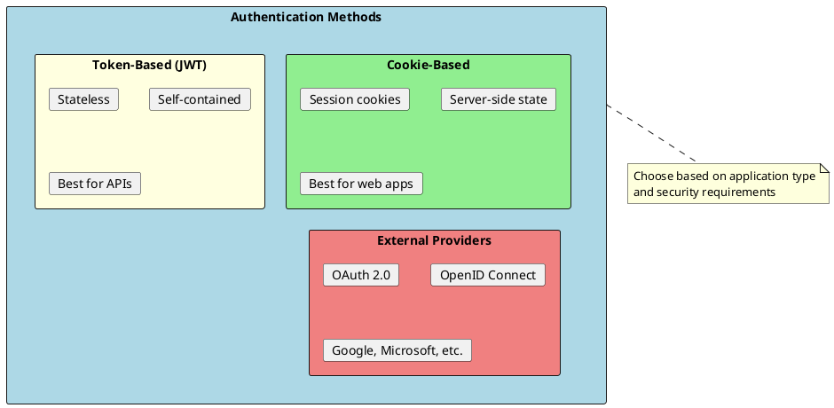
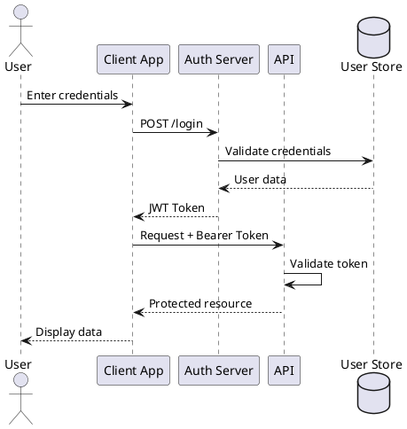
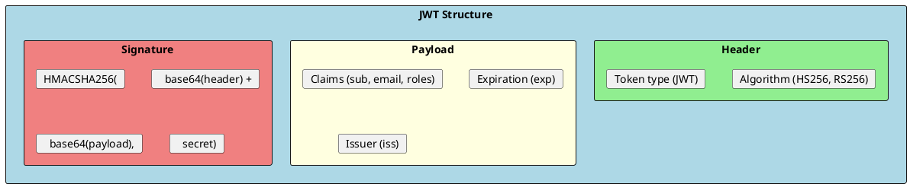
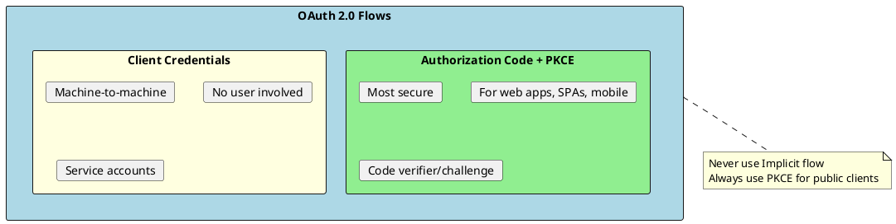
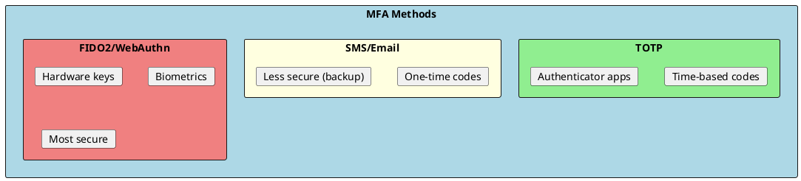

# Authentication in .NET

Authentication is the process of verifying the identity of a user or system. It answers the question: "Who are you?" .NET provides robust authentication mechanisms through ASP.NET Core Identity, JWT tokens, OAuth 2.0, and OpenID Connect.



## Authentication Flow Overview



---

## ASP.NET Core Identity

ASP.NET Core Identity is a complete membership system for managing users, passwords, roles, and claims.

### Setup and Configuration

```csharp
// Program.cs - Identity Configuration
var builder = WebApplication.CreateBuilder(args);

builder.Services.AddDbContext<ApplicationDbContext>(options =>
    options.UseSqlServer(builder.Configuration.GetConnectionString("Default")));

builder.Services.AddIdentity<ApplicationUser, IdentityRole>(options =>
{
    // Password settings
    options.Password.RequireDigit = true;
    options.Password.RequireLowercase = true;
    options.Password.RequireUppercase = true;
    options.Password.RequireNonAlphanumeric = true;
    options.Password.RequiredLength = 12;
    options.Password.RequiredUniqueChars = 4;

    // Lockout settings
    options.Lockout.DefaultLockoutTimeSpan = TimeSpan.FromMinutes(15);
    options.Lockout.MaxFailedAccessAttempts = 5;
    options.Lockout.AllowedForNewUsers = true;

    // User settings
    options.User.RequireUniqueEmail = true;
    options.SignIn.RequireConfirmedEmail = true;
})
.AddEntityFrameworkStores<ApplicationDbContext>()
.AddDefaultTokenProviders();

var app = builder.Build();
```

### Custom User Entity

```csharp
public class ApplicationUser : IdentityUser
{
    public string FirstName { get; set; } = string.Empty;
    public string LastName { get; set; } = string.Empty;
    public DateTime CreatedAt { get; set; } = DateTime.UtcNow;
    public DateTime? LastLoginAt { get; set; }
    public bool IsActive { get; set; } = true;
    public string? RefreshToken { get; set; }
    public DateTime? RefreshTokenExpiryTime { get; set; }
}

public class ApplicationDbContext : IdentityDbContext<ApplicationUser>
{
    public ApplicationDbContext(DbContextOptions<ApplicationDbContext> options)
        : base(options) { }

    protected override void OnModelCreating(ModelBuilder builder)
    {
        base.OnModelCreating(builder);

        builder.Entity<ApplicationUser>(entity =>
        {
            entity.ToTable("Users");
            entity.Property(u => u.FirstName).HasMaxLength(50);
            entity.Property(u => u.LastName).HasMaxLength(50);
        });

        builder.Entity<IdentityRole>().ToTable("Roles");
        builder.Entity<IdentityUserRole<string>>().ToTable("UserRoles");
    }
}
```

### Registration and Login

```csharp
[ApiController]
[Route("api/[controller]")]
public class AuthController : ControllerBase
{
    private readonly UserManager<ApplicationUser> _userManager;
    private readonly SignInManager<ApplicationUser> _signInManager;
    private readonly ITokenService _tokenService;

    public AuthController(
        UserManager<ApplicationUser> userManager,
        SignInManager<ApplicationUser> signInManager,
        ITokenService tokenService)
    {
        _userManager = userManager;
        _signInManager = signInManager;
        _tokenService = tokenService;
    }

    [HttpPost("register")]
    public async Task<IActionResult> Register([FromBody] RegisterRequest request)
    {
        var user = new ApplicationUser
        {
            UserName = request.Email,
            Email = request.Email,
            FirstName = request.FirstName,
            LastName = request.LastName
        };

        var result = await _userManager.CreateAsync(user, request.Password);

        if (!result.Succeeded)
        {
            return BadRequest(new
            {
                Errors = result.Errors.Select(e => e.Description)
            });
        }

        await _userManager.AddToRoleAsync(user, "User");

        return Ok(new { Message = "Registration successful" });
    }

    [HttpPost("login")]
    public async Task<IActionResult> Login([FromBody] LoginRequest request)
    {
        var user = await _userManager.FindByEmailAsync(request.Email);

        if (user == null || !user.IsActive)
            return Unauthorized(new { Error = "Invalid credentials" });

        var result = await _signInManager.CheckPasswordSignInAsync(
            user, request.Password, lockoutOnFailure: true);

        if (result.IsLockedOut)
            return Unauthorized(new { Error = "Account locked. Try again later." });

        if (!result.Succeeded)
            return Unauthorized(new { Error = "Invalid credentials" });

        var roles = await _userManager.GetRolesAsync(user);
        var accessToken = _tokenService.GenerateAccessToken(user, roles);
        var refreshToken = _tokenService.GenerateRefreshToken();

        user.RefreshToken = refreshToken;
        user.RefreshTokenExpiryTime = DateTime.UtcNow.AddDays(7);
        user.LastLoginAt = DateTime.UtcNow;
        await _userManager.UpdateAsync(user);

        return Ok(new
        {
            AccessToken = accessToken,
            RefreshToken = refreshToken,
            ExpiresAt = DateTime.UtcNow.AddMinutes(15)
        });
    }

    [HttpPost("refresh-token")]
    public async Task<IActionResult> RefreshToken([FromBody] RefreshTokenRequest request)
    {
        var principal = _tokenService.GetPrincipalFromExpiredToken(request.AccessToken);
        var email = principal?.FindFirst(ClaimTypes.Email)?.Value;

        if (email == null)
            return BadRequest("Invalid token");

        var user = await _userManager.FindByEmailAsync(email);

        if (user == null ||
            user.RefreshToken != request.RefreshToken ||
            user.RefreshTokenExpiryTime <= DateTime.UtcNow)
        {
            return Unauthorized("Invalid refresh token");
        }

        var roles = await _userManager.GetRolesAsync(user);
        var newAccessToken = _tokenService.GenerateAccessToken(user, roles);
        var newRefreshToken = _tokenService.GenerateRefreshToken();

        user.RefreshToken = newRefreshToken;
        await _userManager.UpdateAsync(user);

        return Ok(new
        {
            AccessToken = newAccessToken,
            RefreshToken = newRefreshToken
        });
    }
}
```

---

## JWT (JSON Web Tokens)



### Token Service Implementation

```csharp
public interface ITokenService
{
    string GenerateAccessToken(ApplicationUser user, IList<string> roles);
    string GenerateRefreshToken();
    ClaimsPrincipal? GetPrincipalFromExpiredToken(string token);
}

public class TokenService : ITokenService
{
    private readonly JwtSettings _jwtSettings;

    public TokenService(IOptions<JwtSettings> jwtSettings)
    {
        _jwtSettings = jwtSettings.Value;
    }

    public string GenerateAccessToken(ApplicationUser user, IList<string> roles)
    {
        var claims = new List<Claim>
        {
            new(JwtRegisteredClaimNames.Sub, user.Id),
            new(JwtRegisteredClaimNames.Email, user.Email!),
            new(JwtRegisteredClaimNames.Jti, Guid.NewGuid().ToString()),
            new("firstName", user.FirstName),
            new("lastName", user.LastName)
        };

        claims.AddRange(roles.Select(role => new Claim(ClaimTypes.Role, role)));

        var key = new SymmetricSecurityKey(Encoding.UTF8.GetBytes(_jwtSettings.SecretKey));
        var credentials = new SigningCredentials(key, SecurityAlgorithms.HmacSha256);

        var token = new JwtSecurityToken(
            issuer: _jwtSettings.Issuer,
            audience: _jwtSettings.Audience,
            claims: claims,
            expires: DateTime.UtcNow.AddMinutes(_jwtSettings.ExpirationMinutes),
            signingCredentials: credentials
        );

        return new JwtSecurityTokenHandler().WriteToken(token);
    }

    public string GenerateRefreshToken()
    {
        var randomNumber = new byte[64];
        using var rng = RandomNumberGenerator.Create();
        rng.GetBytes(randomNumber);
        return Convert.ToBase64String(randomNumber);
    }

    public ClaimsPrincipal? GetPrincipalFromExpiredToken(string token)
    {
        var tokenValidationParameters = new TokenValidationParameters
        {
            ValidateIssuer = true,
            ValidateAudience = true,
            ValidateLifetime = false,
            ValidateIssuerSigningKey = true,
            ValidIssuer = _jwtSettings.Issuer,
            ValidAudience = _jwtSettings.Audience,
            IssuerSigningKey = new SymmetricSecurityKey(
                Encoding.UTF8.GetBytes(_jwtSettings.SecretKey))
        };

        var tokenHandler = new JwtSecurityTokenHandler();
        var principal = tokenHandler.ValidateToken(
            token, tokenValidationParameters, out var securityToken);

        if (securityToken is not JwtSecurityToken jwtSecurityToken ||
            !jwtSecurityToken.Header.Alg.Equals(SecurityAlgorithms.HmacSha256))
        {
            return null;
        }

        return principal;
    }
}
```

### JWT Configuration

```csharp
// Program.cs
var jwtSettings = builder.Configuration.GetSection("JwtSettings").Get<JwtSettings>()!;

builder.Services.AddAuthentication(options =>
{
    options.DefaultAuthenticateScheme = JwtBearerDefaults.AuthenticationScheme;
    options.DefaultChallengeScheme = JwtBearerDefaults.AuthenticationScheme;
})
.AddJwtBearer(options =>
{
    options.TokenValidationParameters = new TokenValidationParameters
    {
        ValidateIssuer = true,
        ValidateAudience = true,
        ValidateLifetime = true,
        ValidateIssuerSigningKey = true,
        ValidIssuer = jwtSettings.Issuer,
        ValidAudience = jwtSettings.Audience,
        IssuerSigningKey = new SymmetricSecurityKey(
            Encoding.UTF8.GetBytes(jwtSettings.SecretKey)),
        ClockSkew = TimeSpan.Zero
    };
});
```

---

## OAuth 2.0 and OpenID Connect



### External Provider Configuration

```csharp
builder.Services.AddAuthentication()
    .AddGoogle(options =>
    {
        options.ClientId = builder.Configuration["Auth:Google:ClientId"]!;
        options.ClientSecret = builder.Configuration["Auth:Google:ClientSecret"]!;
    })
    .AddMicrosoftAccount(options =>
    {
        options.ClientId = builder.Configuration["Auth:Microsoft:ClientId"]!;
        options.ClientSecret = builder.Configuration["Auth:Microsoft:ClientSecret"]!;
    })
    .AddOpenIdConnect("oidc", options =>
    {
        options.Authority = builder.Configuration["Auth:OIDC:Authority"];
        options.ClientId = builder.Configuration["Auth:OIDC:ClientId"]!;
        options.ClientSecret = builder.Configuration["Auth:OIDC:ClientSecret"];
        options.ResponseType = "code";
        options.SaveTokens = true;
        options.Scope.Add("openid");
        options.Scope.Add("profile");
        options.Scope.Add("email");
    });
```

---

## Multi-Factor Authentication (MFA)



### TOTP Setup

```csharp
[Authorize]
[ApiController]
[Route("api/[controller]")]
public class MfaController : ControllerBase
{
    private readonly UserManager<ApplicationUser> _userManager;

    [HttpGet("setup")]
    public async Task<IActionResult> SetupAuthenticator()
    {
        var user = await _userManager.GetUserAsync(User);
        await _userManager.ResetAuthenticatorKeyAsync(user!);
        var key = await _userManager.GetAuthenticatorKeyAsync(user!);

        var uri = $"otpauth://totp/MyApp:{user!.Email}?secret={key}&issuer=MyApp";

        return Ok(new { SharedKey = key, AuthenticatorUri = uri });
    }

    [HttpPost("enable")]
    public async Task<IActionResult> EnableMfa([FromBody] EnableMfaRequest request)
    {
        var user = await _userManager.GetUserAsync(User);
        var code = request.Code.Replace(" ", "").Replace("-", "");

        var isValid = await _userManager.VerifyTwoFactorTokenAsync(
            user!,
            _userManager.Options.Tokens.AuthenticatorTokenProvider,
            code);

        if (!isValid)
            return BadRequest(new { Error = "Invalid code" });

        await _userManager.SetTwoFactorEnabledAsync(user!, true);
        var recoveryCodes = await _userManager.GenerateNewTwoFactorRecoveryCodesAsync(user!, 10);

        return Ok(new { RecoveryCodes = recoveryCodes });
    }
}
```

---

## Interview Questions & Answers

### Q1: What is the difference between Authentication and Authorization?

**Answer**:
- **Authentication**: Verifies identity - "Who are you?"
- **Authorization**: Verifies permissions - "What can you do?"

Authentication happens first, then authorization determines access rights.

### Q2: What is JWT and its components?

**Answer**: JWT (JSON Web Token) has three parts:
- **Header**: Algorithm and token type
- **Payload**: Claims (user data, expiration)
- **Signature**: Verification hash

Benefits: Stateless, self-contained, validates without database.

### Q3: Why use refresh tokens?

**Answer**:
- Access tokens: Short-lived (15 min) for security
- Refresh tokens: Long-lived (days) for convenience
- Reduces re-authentication
- Can be revoked server-side

### Q4: What is PKCE?

**Answer**: Proof Key for Code Exchange - protects OAuth for public clients:
- Client generates code_verifier and code_challenge
- Prevents authorization code interception
- Required for SPAs, mobile apps

### Q5: How does ASP.NET Core Identity hash passwords?

**Answer**: Uses PBKDF2 with:
- HMAC-SHA256
- 100,000 iterations
- 128-bit salt
- 256-bit subkey

### Q6: Cookie vs Token authentication?

**Answer**:
| Aspect | Cookies | Tokens |
|--------|---------|--------|
| Storage | Browser | App |
| State | Server-side | Stateless |
| CSRF | Vulnerable | Not vulnerable |
| Mobile | Limited | Works well |
