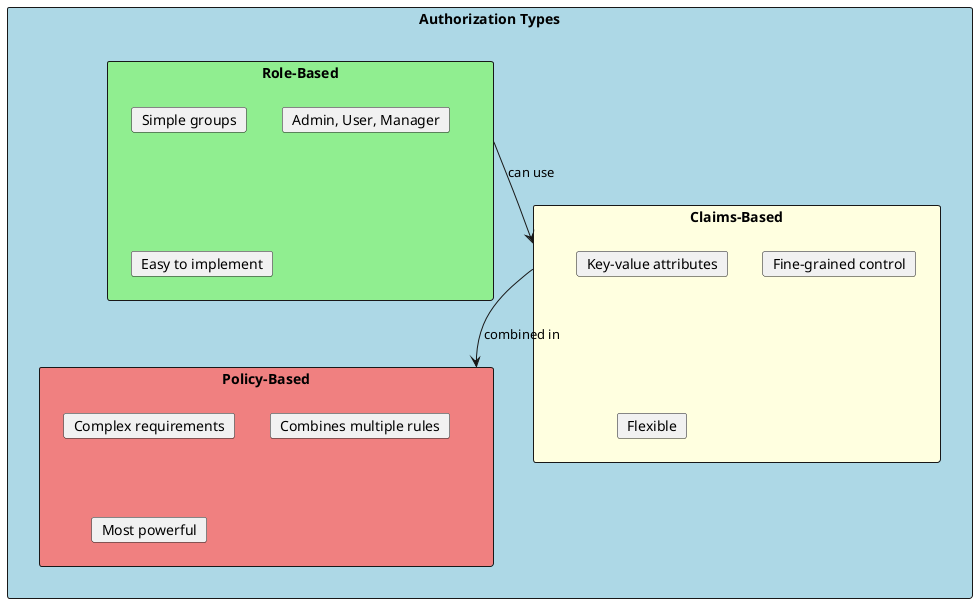
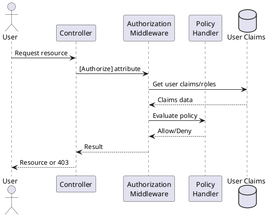
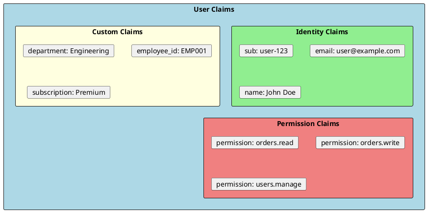
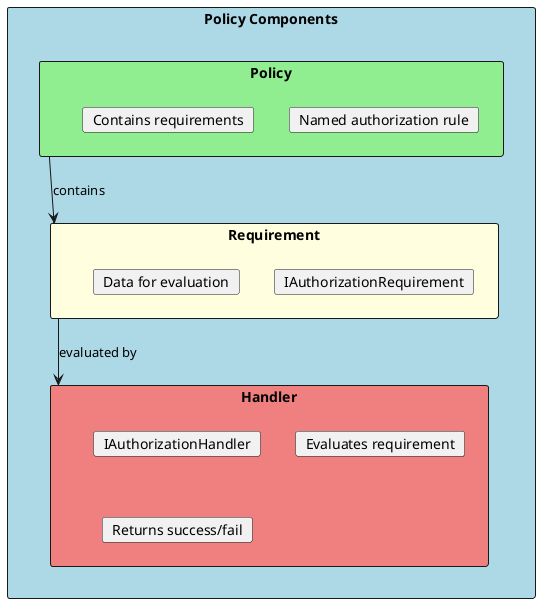

# Authorization in .NET

Authorization determines what an authenticated user can do. It answers: "What are you allowed to access?" ASP.NET Core provides role-based, claims-based, and policy-based authorization mechanisms.



## Authorization Flow



---

## Role-Based Authorization

The simplest form of authorization - users are assigned to roles.

```csharp
// Assign roles to user
await _userManager.AddToRoleAsync(user, "Admin");
await _userManager.AddToRolesAsync(user, new[] { "User", "Manager" });

// Controller-level authorization
[Authorize(Roles = "Admin")]
[ApiController]
[Route("api/[controller]")]
public class AdminController : ControllerBase
{
    [HttpGet("dashboard")]
    public IActionResult GetDashboard()
    {
        return Ok(new { message = "Admin dashboard" });
    }

    // Multiple roles - user needs ANY of them
    [HttpGet("reports")]
    [Authorize(Roles = "Admin,Manager")]
    public IActionResult GetReports()
    {
        return Ok(new { message = "Reports data" });
    }

    // Multiple attributes - user needs ALL of them
    [HttpDelete("users/{id}")]
    [Authorize(Roles = "Admin")]
    [Authorize(Roles = "SuperUser")]
    public IActionResult DeleteUser(int id)
    {
        return Ok(new { message = $"User {id} deleted" });
    }
}

// Check roles in code
public class UserService
{
    private readonly UserManager<ApplicationUser> _userManager;

    public async Task<bool> CanManageUsers(ApplicationUser user)
    {
        return await _userManager.IsInRoleAsync(user, "Admin") ||
               await _userManager.IsInRoleAsync(user, "UserManager");
    }
}
```

### Role Setup

```csharp
// Program.cs - Seed roles
app.MapGet("/seed-roles", async (RoleManager<IdentityRole> roleManager) =>
{
    string[] roles = { "Admin", "Manager", "User", "Guest" };

    foreach (var role in roles)
    {
        if (!await roleManager.RoleExistsAsync(role))
        {
            await roleManager.CreateAsync(new IdentityRole(role));
        }
    }

    return Results.Ok("Roles seeded");
});
```

---

## Claims-Based Authorization

Claims are key-value pairs that describe the user.



```csharp
// Add claims to user
var claims = new List<Claim>
{
    new Claim("department", "Engineering"),
    new Claim("employee_id", "EMP001"),
    new Claim("subscription", "Premium"),
    new Claim("permission", "orders.read"),
    new Claim("permission", "orders.write")
};

await _userManager.AddClaimsAsync(user, claims);

// Claims-based authorization policy
builder.Services.AddAuthorization(options =>
{
    options.AddPolicy("EngineeringOnly", policy =>
        policy.RequireClaim("department", "Engineering"));

    options.AddPolicy("PremiumUser", policy =>
        policy.RequireClaim("subscription", "Premium", "Enterprise"));

    options.AddPolicy("CanReadOrders", policy =>
        policy.RequireClaim("permission", "orders.read"));
});

// Use in controller
[Authorize(Policy = "EngineeringOnly")]
[HttpGet("engineering-data")]
public IActionResult GetEngineeringData()
{
    var department = User.FindFirst("department")?.Value;
    var employeeId = User.FindFirst("employee_id")?.Value;

    return Ok(new { department, employeeId });
}
```

### Claims Transformation

```csharp
// Transform claims on every request
public class CustomClaimsTransformation : IClaimsTransformation
{
    private readonly IPermissionService _permissionService;

    public CustomClaimsTransformation(IPermissionService permissionService)
    {
        _permissionService = permissionService;
    }

    public async Task<ClaimsPrincipal> TransformAsync(ClaimsPrincipal principal)
    {
        var identity = principal.Identity as ClaimsIdentity;
        if (identity == null || !identity.IsAuthenticated)
            return principal;

        var userId = principal.FindFirst(ClaimTypes.NameIdentifier)?.Value;
        if (userId == null)
            return principal;

        // Add dynamic claims from database
        var permissions = await _permissionService.GetUserPermissionsAsync(userId);
        foreach (var permission in permissions)
        {
            if (!identity.HasClaim("permission", permission))
            {
                identity.AddClaim(new Claim("permission", permission));
            }
        }

        return principal;
    }
}

// Register
builder.Services.AddScoped<IClaimsTransformation, CustomClaimsTransformation>();
```

---

## Policy-Based Authorization

The most flexible approach - policies combine requirements.



### Custom Policy Implementation

```csharp
// Requirement - defines what we're checking
public class MinimumAgeRequirement : IAuthorizationRequirement
{
    public int MinimumAge { get; }

    public MinimumAgeRequirement(int minimumAge)
    {
        MinimumAge = minimumAge;
    }
}

// Handler - performs the check
public class MinimumAgeHandler : AuthorizationHandler<MinimumAgeRequirement>
{
    protected override Task HandleRequirementAsync(
        AuthorizationHandlerContext context,
        MinimumAgeRequirement requirement)
    {
        var dateOfBirthClaim = context.User.FindFirst("date_of_birth");

        if (dateOfBirthClaim == null)
        {
            return Task.CompletedTask; // No claim, requirement not met
        }

        if (DateTime.TryParse(dateOfBirthClaim.Value, out var dateOfBirth))
        {
            var age = DateTime.Today.Year - dateOfBirth.Year;
            if (dateOfBirth.Date > DateTime.Today.AddYears(-age))
                age--;

            if (age >= requirement.MinimumAge)
            {
                context.Succeed(requirement);
            }
        }

        return Task.CompletedTask;
    }
}

// Registration
builder.Services.AddAuthorization(options =>
{
    options.AddPolicy("AtLeast18", policy =>
        policy.Requirements.Add(new MinimumAgeRequirement(18)));

    options.AddPolicy("AtLeast21", policy =>
        policy.Requirements.Add(new MinimumAgeRequirement(21)));
});

builder.Services.AddSingleton<IAuthorizationHandler, MinimumAgeHandler>();
```

### Resource-Based Authorization

```csharp
// Requirement for resource ownership
public class ResourceOwnerRequirement : IAuthorizationRequirement { }

// Handler checks if user owns the resource
public class DocumentAuthorizationHandler :
    AuthorizationHandler<ResourceOwnerRequirement, Document>
{
    protected override Task HandleRequirementAsync(
        AuthorizationHandlerContext context,
        ResourceOwnerRequirement requirement,
        Document resource)
    {
        var userId = context.User.FindFirst(ClaimTypes.NameIdentifier)?.Value;

        if (userId == resource.OwnerId)
        {
            context.Succeed(requirement);
        }

        // Admins can access any document
        if (context.User.IsInRole("Admin"))
        {
            context.Succeed(requirement);
        }

        return Task.CompletedTask;
    }
}

// Usage in controller
[ApiController]
[Route("api/[controller]")]
public class DocumentsController : ControllerBase
{
    private readonly IAuthorizationService _authorizationService;
    private readonly IDocumentRepository _repository;

    public DocumentsController(
        IAuthorizationService authorizationService,
        IDocumentRepository repository)
    {
        _authorizationService = authorizationService;
        _repository = repository;
    }

    [HttpGet("{id}")]
    public async Task<IActionResult> GetDocument(int id)
    {
        var document = await _repository.GetByIdAsync(id);
        if (document == null)
            return NotFound();

        var authResult = await _authorizationService.AuthorizeAsync(
            User, document, new ResourceOwnerRequirement());

        if (!authResult.Succeeded)
            return Forbid();

        return Ok(document);
    }

    [HttpPut("{id}")]
    public async Task<IActionResult> UpdateDocument(int id, [FromBody] UpdateDocumentRequest request)
    {
        var document = await _repository.GetByIdAsync(id);
        if (document == null)
            return NotFound();

        var authResult = await _authorizationService.AuthorizeAsync(
            User, document, new ResourceOwnerRequirement());

        if (!authResult.Succeeded)
            return Forbid();

        document.Title = request.Title;
        document.Content = request.Content;
        await _repository.UpdateAsync(document);

        return Ok(document);
    }
}
```

### Operation-Based Authorization

```csharp
// Define operations
public static class Operations
{
    public static OperationAuthorizationRequirement Create =
        new() { Name = nameof(Create) };
    public static OperationAuthorizationRequirement Read =
        new() { Name = nameof(Read) };
    public static OperationAuthorizationRequirement Update =
        new() { Name = nameof(Update) };
    public static OperationAuthorizationRequirement Delete =
        new() { Name = nameof(Delete) };
}

// Handler for different operations
public class DocumentOperationHandler :
    AuthorizationHandler<OperationAuthorizationRequirement, Document>
{
    protected override Task HandleRequirementAsync(
        AuthorizationHandlerContext context,
        OperationAuthorizationRequirement requirement,
        Document resource)
    {
        var userId = context.User.FindFirst(ClaimTypes.NameIdentifier)?.Value;
        var isOwner = userId == resource.OwnerId;
        var isAdmin = context.User.IsInRole("Admin");

        switch (requirement.Name)
        {
            case nameof(Operations.Read):
                if (isOwner || isAdmin || resource.IsPublic)
                    context.Succeed(requirement);
                break;

            case nameof(Operations.Update):
                if (isOwner || isAdmin)
                    context.Succeed(requirement);
                break;

            case nameof(Operations.Delete):
                if (isAdmin) // Only admins can delete
                    context.Succeed(requirement);
                break;

            case nameof(Operations.Create):
                if (context.User.Identity?.IsAuthenticated == true)
                    context.Succeed(requirement);
                break;
        }

        return Task.CompletedTask;
    }
}

// Usage
var authResult = await _authorizationService.AuthorizeAsync(
    User, document, Operations.Delete);
```

---

## Permission-Based Authorization

A scalable approach for complex systems.

```csharp
// Permission constants
public static class Permissions
{
    public static class Users
    {
        public const string View = "users.view";
        public const string Create = "users.create";
        public const string Edit = "users.edit";
        public const string Delete = "users.delete";
    }

    public static class Orders
    {
        public const string View = "orders.view";
        public const string Create = "orders.create";
        public const string Edit = "orders.edit";
        public const string Delete = "orders.delete";
        public const string Export = "orders.export";
    }
}

// Permission requirement
public class PermissionRequirement : IAuthorizationRequirement
{
    public string Permission { get; }

    public PermissionRequirement(string permission)
    {
        Permission = permission;
    }
}

// Permission handler
public class PermissionHandler : AuthorizationHandler<PermissionRequirement>
{
    protected override Task HandleRequirementAsync(
        AuthorizationHandlerContext context,
        PermissionRequirement requirement)
    {
        var permissions = context.User.Claims
            .Where(c => c.Type == "permission")
            .Select(c => c.Value);

        if (permissions.Contains(requirement.Permission))
        {
            context.Succeed(requirement);
        }

        return Task.CompletedTask;
    }
}

// Policy provider for dynamic policies
public class PermissionPolicyProvider : IAuthorizationPolicyProvider
{
    private const string PolicyPrefix = "Permission:";
    private readonly DefaultAuthorizationPolicyProvider _fallbackProvider;

    public PermissionPolicyProvider(IOptions<AuthorizationOptions> options)
    {
        _fallbackProvider = new DefaultAuthorizationPolicyProvider(options);
    }

    public Task<AuthorizationPolicy?> GetPolicyAsync(string policyName)
    {
        if (policyName.StartsWith(PolicyPrefix))
        {
            var permission = policyName[PolicyPrefix.Length..];
            var policy = new AuthorizationPolicyBuilder()
                .AddRequirements(new PermissionRequirement(permission))
                .Build();
            return Task.FromResult<AuthorizationPolicy?>(policy);
        }

        return _fallbackProvider.GetPolicyAsync(policyName);
    }

    public Task<AuthorizationPolicy> GetDefaultPolicyAsync() =>
        _fallbackProvider.GetDefaultPolicyAsync();

    public Task<AuthorizationPolicy?> GetFallbackPolicyAsync() =>
        _fallbackProvider.GetFallbackPolicyAsync();
}

// Custom attribute
public class HasPermissionAttribute : AuthorizeAttribute
{
    public HasPermissionAttribute(string permission)
        : base($"Permission:{permission}") { }
}

// Usage
[HasPermission(Permissions.Orders.Delete)]
[HttpDelete("{id}")]
public async Task<IActionResult> DeleteOrder(int id)
{
    await _orderService.DeleteAsync(id);
    return NoContent();
}
```

---

## Hierarchical Roles

```csharp
public class HierarchicalRoleHandler : AuthorizationHandler<RolesAuthorizationRequirement>
{
    private static readonly Dictionary<string, int> RoleHierarchy = new()
    {
        ["Guest"] = 0,
        ["User"] = 1,
        ["Manager"] = 2,
        ["Admin"] = 3,
        ["SuperAdmin"] = 4
    };

    protected override Task HandleRequirementAsync(
        AuthorizationHandlerContext context,
        RolesAuthorizationRequirement requirement)
    {
        var userRoles = context.User.Claims
            .Where(c => c.Type == ClaimTypes.Role)
            .Select(c => c.Value);

        var userMaxLevel = userRoles
            .Where(r => RoleHierarchy.ContainsKey(r))
            .Select(r => RoleHierarchy[r])
            .DefaultIfEmpty(-1)
            .Max();

        var requiredMinLevel = requirement.AllowedRoles
            .Where(r => RoleHierarchy.ContainsKey(r))
            .Select(r => RoleHierarchy[r])
            .DefaultIfEmpty(int.MaxValue)
            .Min();

        if (userMaxLevel >= requiredMinLevel)
        {
            context.Succeed(requirement);
        }

        return Task.CompletedTask;
    }
}
```

---

## Interview Questions & Answers

### Q1: What is the difference between Authentication and Authorization?

**Answer**:
- **Authentication**: Verifies identity ("Who are you?")
- **Authorization**: Verifies permissions ("What can you do?")

Authorization always comes after authentication.

### Q2: What are the authorization types in ASP.NET Core?

**Answer**:
1. **Role-based**: Simple group membership (Admin, User)
2. **Claims-based**: Key-value attributes about user
3. **Policy-based**: Complex rules combining requirements
4. **Resource-based**: Based on specific resource being accessed

### Q3: What is a Policy in ASP.NET Core authorization?

**Answer**: A policy is a named authorization rule containing:
- One or more **Requirements** (IAuthorizationRequirement)
- Evaluated by **Handlers** (IAuthorizationHandler)
- Returns success if ALL requirements are met

### Q4: How do you implement resource-based authorization?

**Answer**:
```csharp
var authResult = await _authorizationService.AuthorizeAsync(
    User, resource, requirement);

if (!authResult.Succeeded)
    return Forbid();
```
Handler receives the resource and can check ownership, permissions, etc.

### Q5: What is Claims Transformation?

**Answer**: `IClaimsTransformation` allows modifying claims on each request:
- Add claims from database
- Transform existing claims
- Add calculated permissions

Useful for dynamic permissions that can't be in the token.

### Q6: Role-based vs Policy-based authorization?

**Answer**:
| Role-based | Policy-based |
|------------|--------------|
| Simple groups | Complex rules |
| Hard-coded | Configurable |
| Limited flexibility | Highly flexible |
| Good for simple apps | Good for complex apps |

### Q7: How do you handle multiple authorization requirements?

**Answer**:
- Multiple `[Authorize]` attributes = ALL must pass (AND)
- Comma-separated roles = ANY must match (OR)
- Policy with multiple requirements = ALL must pass
- Custom handler can implement complex logic

### Q8: What is IAuthorizationService?

**Answer**: Service for imperative (code-based) authorization:
```csharp
var result = await _authorizationService.AuthorizeAsync(
    User, resource, policyName);
```
Use when authorization depends on data retrieved at runtime.
