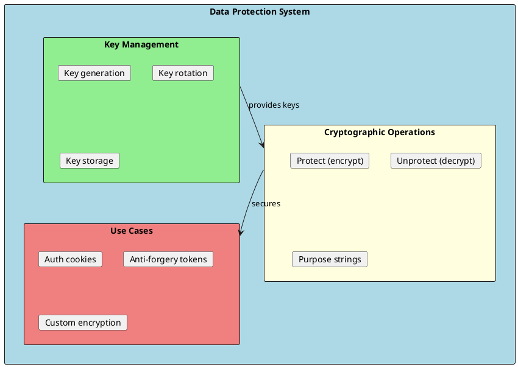
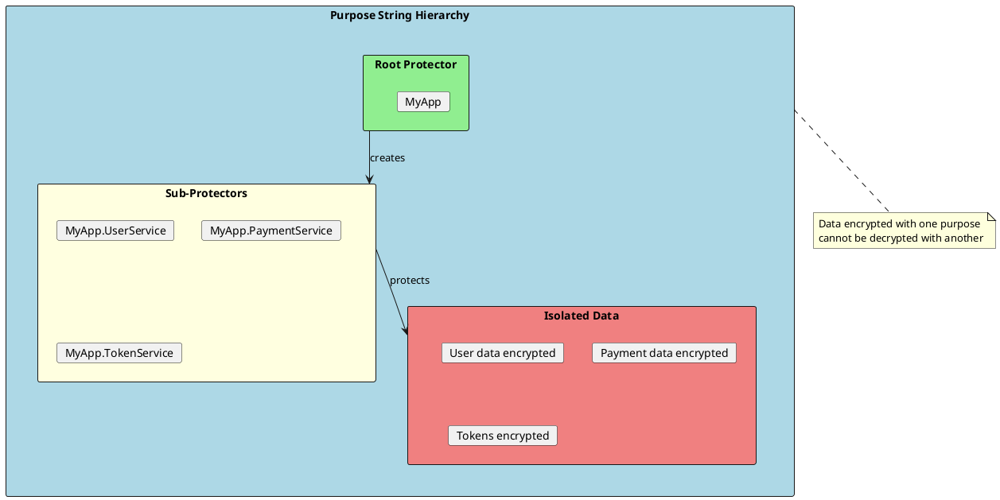
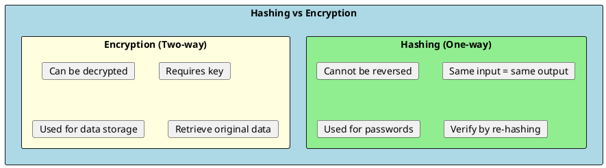
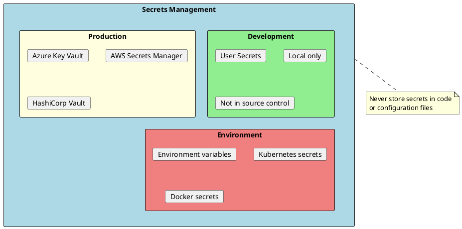
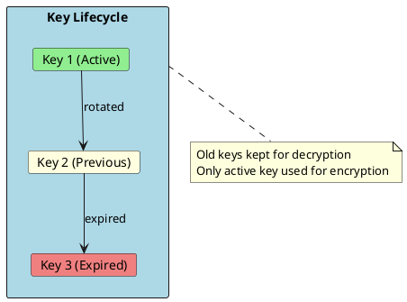

# Data Protection in .NET

Data Protection in ASP.NET Core provides cryptographic APIs to protect data. It handles key management, encryption, and decryption automatically, making it easy to secure sensitive data like authentication cookies, anti-forgery tokens, and custom data.



---

## Data Protection API Basics

### Configuration

```csharp
// Program.cs - Basic configuration
builder.Services.AddDataProtection()
    .SetApplicationName("MyApplication")
    .PersistKeysToFileSystem(new DirectoryInfo(@"C:\keys"))
    .SetDefaultKeyLifetime(TimeSpan.FromDays(14));

// Production configuration with Azure
builder.Services.AddDataProtection()
    .SetApplicationName("MyApplication")
    .PersistKeysToAzureBlobStorage(connectionString, "keys", "dataprotection")
    .ProtectKeysWithAzureKeyVault(keyVaultUri, credential);

// Production configuration with Redis
builder.Services.AddDataProtection()
    .SetApplicationName("MyApplication")
    .PersistKeysToStackExchangeRedis(
        ConnectionMultiplexer.Connect(redisConnection),
        "DataProtection-Keys");
```

### Basic Usage

```csharp
public class SecureDataService
{
    private readonly IDataProtector _protector;

    public SecureDataService(IDataProtectionProvider provider)
    {
        // Purpose string isolates encrypted data
        _protector = provider.CreateProtector("SecureDataService.v1");
    }

    public string Protect(string plaintext)
    {
        return _protector.Protect(plaintext);
    }

    public string Unprotect(string protectedData)
    {
        return _protector.Unprotect(protectedData);
    }
}

// Usage
var service = serviceProvider.GetRequiredService<SecureDataService>();
var encrypted = service.Protect("sensitive data");
var decrypted = service.Unprotect(encrypted);
```

### Purpose Strings



```csharp
public class MultiPurposeProtectionService
{
    private readonly IDataProtector _userDataProtector;
    private readonly IDataProtector _paymentProtector;
    private readonly IDataProtector _tokenProtector;

    public MultiPurposeProtectionService(IDataProtectionProvider provider)
    {
        // Each purpose creates isolated encryption
        _userDataProtector = provider.CreateProtector("UserData");
        _paymentProtector = provider.CreateProtector("PaymentData");
        _tokenProtector = provider.CreateProtector("Tokens");
    }

    public string ProtectUserId(string userId)
    {
        return _userDataProtector.Protect(userId);
    }

    public string ProtectPaymentInfo(string paymentData)
    {
        return _paymentProtector.Protect(paymentData);
    }

    // Hierarchical purposes for versioning
    public IDataProtector CreateVersionedProtector(string purpose, int version)
    {
        return _userDataProtector
            .CreateProtector(purpose)
            .CreateProtector($"v{version}");
    }
}
```

---

## Time-Limited Data Protection

```csharp
public class TimeLimitedTokenService
{
    private readonly ITimeLimitedDataProtector _protector;

    public TimeLimitedTokenService(IDataProtectionProvider provider)
    {
        _protector = provider
            .CreateProtector("TimeLimitedTokens")
            .ToTimeLimitedDataProtector();
    }

    public string CreateToken(string data, TimeSpan lifetime)
    {
        return _protector.Protect(data, lifetime);
    }

    public string CreateToken(string data, DateTimeOffset expiration)
    {
        return _protector.Protect(data, expiration);
    }

    public (bool Success, string? Data) ValidateToken(string token)
    {
        try
        {
            var data = _protector.Unprotect(token, out DateTimeOffset expiration);
            return (true, data);
        }
        catch (CryptographicException)
        {
            return (false, null);
        }
    }
}

// Usage - Password reset tokens
public class PasswordResetService
{
    private readonly ITimeLimitedDataProtector _protector;
    private readonly IUserRepository _userRepository;

    public async Task<string> GenerateResetTokenAsync(string email)
    {
        var user = await _userRepository.FindByEmailAsync(email);
        if (user == null) return string.Empty;

        var tokenData = $"{user.Id}|{user.SecurityStamp}|{DateTime.UtcNow.Ticks}";

        // Token valid for 1 hour
        return _protector.Protect(tokenData, TimeSpan.FromHours(1));
    }

    public async Task<bool> ResetPasswordAsync(string token, string newPassword)
    {
        try
        {
            var data = _protector.Unprotect(token, out _);
            var parts = data.Split('|');

            var userId = parts[0];
            var securityStamp = parts[1];

            var user = await _userRepository.FindByIdAsync(userId);

            // Verify security stamp hasn't changed (password not already reset)
            if (user?.SecurityStamp != securityStamp)
                return false;

            await _userRepository.UpdatePasswordAsync(user, newPassword);
            return true;
        }
        catch (CryptographicException)
        {
            return false;
        }
    }
}
```

---

## Encryption at Rest

### Database Field Encryption

```csharp
// Value converter for encrypted fields
public class EncryptedConverter : ValueConverter<string, string>
{
    public EncryptedConverter(IDataProtector protector)
        : base(
            v => protector.Protect(v),
            v => protector.Unprotect(v))
    {
    }
}

// Entity with encrypted fields
public class Customer
{
    public int Id { get; set; }
    public string Name { get; set; } = string.Empty;
    public string Email { get; set; } = string.Empty;

    // Sensitive fields
    public string SocialSecurityNumber { get; set; } = string.Empty;
    public string CreditCardNumber { get; set; } = string.Empty;
}

// DbContext configuration
public class ApplicationDbContext : DbContext
{
    private readonly IDataProtector _protector;

    public ApplicationDbContext(
        DbContextOptions<ApplicationDbContext> options,
        IDataProtectionProvider provider) : base(options)
    {
        _protector = provider.CreateProtector("DatabaseEncryption");
    }

    protected override void OnModelCreating(ModelBuilder modelBuilder)
    {
        var converter = new EncryptedConverter(_protector);

        modelBuilder.Entity<Customer>(entity =>
        {
            entity.Property(e => e.SocialSecurityNumber)
                .HasConversion(converter);

            entity.Property(e => e.CreditCardNumber)
                .HasConversion(converter);
        });
    }
}
```

### Secure Configuration Values

```csharp
// Encrypt sensitive configuration
public class SecureConfigurationService
{
    private readonly IDataProtector _protector;
    private readonly IConfiguration _configuration;

    public SecureConfigurationService(
        IDataProtectionProvider provider,
        IConfiguration configuration)
    {
        _protector = provider.CreateProtector("Configuration");
        _configuration = configuration;
    }

    public string GetDecryptedConnectionString(string name)
    {
        var encrypted = _configuration.GetConnectionString(name);
        if (string.IsNullOrEmpty(encrypted))
            throw new InvalidOperationException($"Connection string '{name}' not found");

        return _protector.Unprotect(encrypted);
    }

    // CLI tool to encrypt configuration values
    public string EncryptValue(string plaintext)
    {
        return _protector.Protect(plaintext);
    }
}
```

---

## Hashing and Password Storage



### Password Hashing

```csharp
// Using ASP.NET Core Identity's hasher
public class PasswordService
{
    private readonly IPasswordHasher<ApplicationUser> _hasher;

    public PasswordService(IPasswordHasher<ApplicationUser> hasher)
    {
        _hasher = hasher;
    }

    public string HashPassword(ApplicationUser user, string password)
    {
        return _hasher.HashPassword(user, password);
    }

    public bool VerifyPassword(ApplicationUser user, string hashedPassword, string providedPassword)
    {
        var result = _hasher.VerifyHashedPassword(user, hashedPassword, providedPassword);

        return result switch
        {
            PasswordVerificationResult.Success => true,
            PasswordVerificationResult.SuccessRehashNeeded => true, // Still valid, but should rehash
            _ => false
        };
    }
}

// Custom password hasher with Argon2
public class Argon2PasswordHasher<TUser> : IPasswordHasher<TUser> where TUser : class
{
    public string HashPassword(TUser user, string password)
    {
        return Argon2.Hash(password, timeCost: 3, memoryCost: 65536, parallelism: 4);
    }

    public PasswordVerificationResult VerifyHashedPassword(
        TUser user, string hashedPassword, string providedPassword)
    {
        if (Argon2.Verify(hashedPassword, providedPassword))
        {
            return PasswordVerificationResult.Success;
        }

        return PasswordVerificationResult.Failed;
    }
}

// Registration
builder.Services.AddScoped<IPasswordHasher<ApplicationUser>, Argon2PasswordHasher<ApplicationUser>>();
```

### Hashing Sensitive Data

```csharp
public static class HashingHelper
{
    // SHA256 for non-reversible hashing
    public static string ComputeSha256Hash(string input)
    {
        var bytes = SHA256.HashData(Encoding.UTF8.GetBytes(input));
        return Convert.ToHexString(bytes);
    }

    // HMAC for keyed hashing
    public static string ComputeHmacSha256(string input, string key)
    {
        var keyBytes = Encoding.UTF8.GetBytes(key);
        var inputBytes = Encoding.UTF8.GetBytes(input);

        using var hmac = new HMACSHA256(keyBytes);
        var hash = hmac.ComputeHash(inputBytes);
        return Convert.ToHexString(hash);
    }

    // Hash with salt for storing
    public static (string Hash, string Salt) HashWithSalt(string input)
    {
        var salt = new byte[32];
        RandomNumberGenerator.Fill(salt);

        var saltedInput = Encoding.UTF8.GetBytes(input).Concat(salt).ToArray();
        var hash = SHA256.HashData(saltedInput);

        return (Convert.ToBase64String(hash), Convert.ToBase64String(salt));
    }

    public static bool VerifyHash(string input, string hash, string salt)
    {
        var saltBytes = Convert.FromBase64String(salt);
        var saltedInput = Encoding.UTF8.GetBytes(input).Concat(saltBytes).ToArray();
        var computedHash = SHA256.HashData(saltedInput);

        return Convert.ToBase64String(computedHash) == hash;
    }
}
```

---

## Encryption with AES

```csharp
public class AesEncryptionService
{
    private readonly byte[] _key;

    public AesEncryptionService(IConfiguration configuration)
    {
        var keyString = configuration["Encryption:Key"]
            ?? throw new InvalidOperationException("Encryption key not configured");
        _key = Convert.FromBase64String(keyString);
    }

    public string Encrypt(string plaintext)
    {
        using var aes = Aes.Create();
        aes.Key = _key;
        aes.GenerateIV();

        using var encryptor = aes.CreateEncryptor();
        var plaintextBytes = Encoding.UTF8.GetBytes(plaintext);
        var ciphertext = encryptor.TransformFinalBlock(plaintextBytes, 0, plaintextBytes.Length);

        // Prepend IV to ciphertext
        var result = new byte[aes.IV.Length + ciphertext.Length];
        Buffer.BlockCopy(aes.IV, 0, result, 0, aes.IV.Length);
        Buffer.BlockCopy(ciphertext, 0, result, aes.IV.Length, ciphertext.Length);

        return Convert.ToBase64String(result);
    }

    public string Decrypt(string ciphertext)
    {
        var fullCipher = Convert.FromBase64String(ciphertext);

        using var aes = Aes.Create();
        aes.Key = _key;

        // Extract IV from beginning
        var iv = new byte[aes.BlockSize / 8];
        var cipher = new byte[fullCipher.Length - iv.Length];

        Buffer.BlockCopy(fullCipher, 0, iv, 0, iv.Length);
        Buffer.BlockCopy(fullCipher, iv.Length, cipher, 0, cipher.Length);

        aes.IV = iv;

        using var decryptor = aes.CreateDecryptor();
        var plaintext = decryptor.TransformFinalBlock(cipher, 0, cipher.Length);

        return Encoding.UTF8.GetString(plaintext);
    }

    // Generate a secure key
    public static string GenerateKey()
    {
        using var aes = Aes.Create();
        aes.KeySize = 256;
        aes.GenerateKey();
        return Convert.ToBase64String(aes.Key);
    }
}
```

---

## Secure Secrets Management



### User Secrets (Development)

```bash
# Initialize user secrets
dotnet user-secrets init

# Set secrets
dotnet user-secrets set "Database:Password" "my-secret-password"
dotnet user-secrets set "Jwt:SecretKey" "my-jwt-secret-key"
```

```csharp
// Automatically loaded in Development
var builder = WebApplication.CreateBuilder(args);
// User secrets are loaded if environment is Development
```

### Azure Key Vault (Production)

```csharp
// Program.cs
builder.Configuration.AddAzureKeyVault(
    new Uri($"https://{vaultName}.vault.azure.net/"),
    new DefaultAzureCredential());

// Usage
var connectionString = builder.Configuration["DatabaseConnectionString"];
var apiKey = builder.Configuration["ExternalApi:ApiKey"];
```

### Environment Variables

```csharp
// Program.cs - Environment variables with prefix
builder.Configuration.AddEnvironmentVariables(prefix: "MYAPP_");

// Set in environment:
// MYAPP_Database__Password=secret
// MYAPP_Jwt__SecretKey=secret

// Access:
var password = builder.Configuration["Database:Password"];
```

---

## HTTPS and TLS

```csharp
// Program.cs - HTTPS configuration
builder.WebHost.ConfigureKestrel(options =>
{
    options.ConfigureHttpsDefaults(https =>
    {
        https.SslProtocols = SslProtocols.Tls12 | SslProtocols.Tls13;
    });
});

// Force HTTPS
var app = builder.Build();

app.UseHttpsRedirection();
app.UseHsts();

// HSTS configuration
builder.Services.AddHsts(options =>
{
    options.Preload = true;
    options.IncludeSubDomains = true;
    options.MaxAge = TimeSpan.FromDays(365);
});
```

---

## Key Rotation



```csharp
// Configure key rotation
builder.Services.AddDataProtection()
    .SetApplicationName("MyApp")
    .SetDefaultKeyLifetime(TimeSpan.FromDays(14))
    .PersistKeysToAzureBlobStorage(connectionString, "keys", "dataprotection")
    .ProtectKeysWithAzureKeyVault(keyVaultUri, credential);

// Manual key management
public class KeyManagementService
{
    private readonly IKeyManager _keyManager;

    public KeyManagementService(IKeyManager keyManager)
    {
        _keyManager = keyManager;
    }

    public void CreateNewKey()
    {
        _keyManager.CreateNewKey(
            activationDate: DateTimeOffset.UtcNow,
            expirationDate: DateTimeOffset.UtcNow.AddDays(90));
    }

    public void RevokeKey(Guid keyId, string reason)
    {
        _keyManager.RevokeKey(keyId, reason);
    }

    public IEnumerable<IKey> GetAllKeys()
    {
        return _keyManager.GetAllKeys();
    }
}
```

---

## Interview Questions & Answers

### Q1: What is the Data Protection API in ASP.NET Core?

**Answer**: The Data Protection API provides:
- Cryptographic APIs for protecting data
- Automatic key management and rotation
- Purpose-based isolation (different purposes can't decrypt each other)
- Time-limited protection support

Used for: cookies, anti-forgery tokens, custom encryption.

### Q2: What is a purpose string?

**Answer**: Purpose strings isolate encrypted data:
- Data encrypted with one purpose cannot be decrypted with another
- Creates cryptographic isolation
- Can be hierarchical (e.g., "App.Users.Passwords")
- Prevents cross-component data access

### Q3: Hashing vs Encryption - when to use each?

**Answer**:
| Hashing | Encryption |
|---------|------------|
| One-way (irreversible) | Two-way (reversible) |
| Passwords, integrity checks | Sensitive data storage |
| Verify by re-hashing | Decrypt to get original |
| SHA256, Argon2, bcrypt | AES, Data Protection API |

### Q4: How do you store passwords securely?

**Answer**:
- Never store plain text
- Use slow hashing algorithms (Argon2, bcrypt, PBKDF2)
- Use unique salt per password
- ASP.NET Identity handles this automatically
- Consider checking against breached password databases

### Q5: How do you manage secrets in production?

**Answer**:
- **Never** store in code or config files
- Use Azure Key Vault, AWS Secrets Manager, HashiCorp Vault
- Environment variables for simpler cases
- Kubernetes secrets for containerized apps
- User Secrets for development only

### Q6: What is key rotation and why is it important?

**Answer**: Key rotation periodically replaces encryption keys:
- Limits damage if key is compromised
- Complies with security policies
- Old keys kept for decryption of existing data
- Only active key used for new encryption
- Data Protection API handles automatically

### Q7: How do you encrypt database fields?

**Answer**:
```csharp
// Using EF Core Value Converters
modelBuilder.Entity<Customer>()
    .Property(e => e.SSN)
    .HasConversion(
        v => _protector.Protect(v),
        v => _protector.Unprotect(v));
```
Consider: Performance impact, can't query encrypted fields, key management.

### Q8: What TLS versions should you support?

**Answer**:
- TLS 1.2 minimum (required for compliance)
- TLS 1.3 preferred (most secure)
- Disable TLS 1.0, 1.1, SSL 3.0
- Configure in Kestrel or reverse proxy
