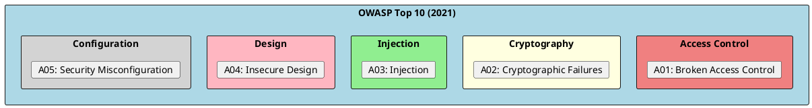
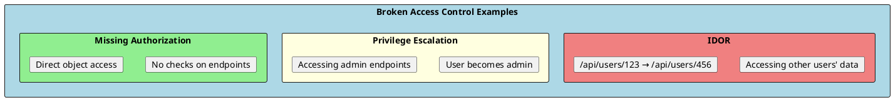
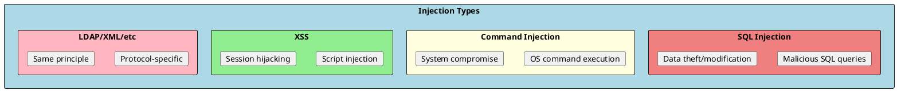

# OWASP Top 10 Security Risks

The OWASP Top 10 is a standard awareness document representing the most critical security risks to web applications. Understanding and mitigating these vulnerabilities is essential for building secure .NET applications.



---

## A01: Broken Access Control

Users acting outside their intended permissions.



### Vulnerable Code

```csharp
// ❌ VULNERABLE: No authorization check (IDOR)
[HttpGet("documents/{id}")]
public async Task<IActionResult> GetDocument(int id)
{
    var document = await _context.Documents.FindAsync(id);
    return Ok(document); // Any user can access any document!
}

// ❌ VULNERABLE: Trusting client-provided user ID
[HttpPost("transfer")]
public async Task<IActionResult> Transfer([FromBody] TransferRequest request)
{
    // User ID from request body - can be manipulated!
    var account = await _context.Accounts.FindAsync(request.FromAccountId);
    account.Balance -= request.Amount;
    await _context.SaveChangesAsync();
    return Ok();
}
```

### Secure Code

```csharp
// ✅ SECURE: Check resource ownership
[Authorize]
[HttpGet("documents/{id}")]
public async Task<IActionResult> GetDocument(int id)
{
    var userId = User.FindFirst(ClaimTypes.NameIdentifier)?.Value;
    var document = await _context.Documents
        .FirstOrDefaultAsync(d => d.Id == id && d.OwnerId == userId);

    if (document == null)
        return NotFound();

    return Ok(document);
}

// ✅ SECURE: Use authenticated user's ID
[Authorize]
[HttpPost("transfer")]
public async Task<IActionResult> Transfer([FromBody] TransferRequest request)
{
    var userId = User.FindFirst(ClaimTypes.NameIdentifier)?.Value;

    var account = await _context.Accounts
        .FirstOrDefaultAsync(a => a.Id == request.FromAccountId && a.UserId == userId);

    if (account == null)
        return Forbid();

    account.Balance -= request.Amount;
    await _context.SaveChangesAsync();
    return Ok();
}

// ✅ SECURE: Resource-based authorization
[Authorize]
[HttpDelete("documents/{id}")]
public async Task<IActionResult> DeleteDocument(int id)
{
    var document = await _context.Documents.FindAsync(id);
    if (document == null)
        return NotFound();

    var authResult = await _authorizationService.AuthorizeAsync(
        User, document, Operations.Delete);

    if (!authResult.Succeeded)
        return Forbid();

    _context.Documents.Remove(document);
    await _context.SaveChangesAsync();
    return NoContent();
}
```

---

## A02: Cryptographic Failures

Failures related to cryptography leading to sensitive data exposure.

### Vulnerable Code

```csharp
// ❌ VULNERABLE: Weak hashing
public string HashPassword(string password)
{
    using var md5 = MD5.Create();
    var hash = md5.ComputeHash(Encoding.UTF8.GetBytes(password));
    return Convert.ToBase64String(hash); // MD5 is broken!
}

// ❌ VULNERABLE: Hard-coded encryption key
private const string EncryptionKey = "MySecretKey12345"; // In source code!

// ❌ VULNERABLE: Sensitive data in logs
_logger.LogInformation("User {Email} logged in with password {Password}",
    user.Email, request.Password);

// ❌ VULNERABLE: HTTP for sensitive data
public class ApiClient
{
    private readonly HttpClient _client = new()
    {
        BaseAddress = new Uri("http://api.example.com") // Not HTTPS!
    };
}
```

### Secure Code

```csharp
// ✅ SECURE: Strong password hashing
public class PasswordService
{
    private readonly IPasswordHasher<ApplicationUser> _hasher;

    public string HashPassword(ApplicationUser user, string password)
    {
        return _hasher.HashPassword(user, password); // Uses PBKDF2
    }
}

// ✅ SECURE: Key from secure storage
public class EncryptionService
{
    private readonly byte[] _key;

    public EncryptionService(IConfiguration configuration)
    {
        // Key from Azure Key Vault or environment variable
        _key = Convert.FromBase64String(
            configuration["Encryption:Key"]
            ?? throw new InvalidOperationException("Key not configured"));
    }
}

// ✅ SECURE: Structured logging without sensitive data
_logger.LogInformation("User {Email} logged in", user.Email);
// Never log passwords, tokens, or sensitive data!

// ✅ SECURE: Always use HTTPS
public class ApiClient
{
    private readonly HttpClient _client = new()
    {
        BaseAddress = new Uri("https://api.example.com")
    };
}

// ✅ SECURE: Force HTTPS
app.UseHttpsRedirection();
app.UseHsts();
```

---

## A03: Injection

Untrusted data sent to an interpreter as part of a command or query.



### SQL Injection

```csharp
// ❌ VULNERABLE: String concatenation
public async Task<User?> GetUser(string username)
{
    var sql = $"SELECT * FROM Users WHERE Username = '{username}'";
    // Input: ' OR '1'='1' -- drops WHERE clause!
    return await _context.Users.FromSqlRaw(sql).FirstOrDefaultAsync();
}

// ✅ SECURE: Parameterized queries
public async Task<User?> GetUser(string username)
{
    return await _context.Users
        .FromSqlInterpolated($"SELECT * FROM Users WHERE Username = {username}")
        .FirstOrDefaultAsync();
}

// ✅ SECURE: LINQ (best approach)
public async Task<User?> GetUser(string username)
{
    return await _context.Users
        .FirstOrDefaultAsync(u => u.Username == username);
}

// ✅ SECURE: Dapper with parameters
public async Task<User?> GetUser(string username)
{
    const string sql = "SELECT * FROM Users WHERE Username = @Username";
    return await _connection.QuerySingleOrDefaultAsync<User>(
        sql, new { Username = username });
}
```

### Command Injection

```csharp
// ❌ VULNERABLE: Direct command execution
public string RunCommand(string filename)
{
    var process = Process.Start("cmd.exe", $"/c type {filename}");
    // Input: "file.txt & del *.*" executes delete!
    return process.StandardOutput.ReadToEnd();
}

// ✅ SECURE: Validate and sanitize input
public string RunCommand(string filename)
{
    // Whitelist allowed characters
    if (!Regex.IsMatch(filename, @"^[a-zA-Z0-9_\-\.]+$"))
        throw new ArgumentException("Invalid filename");

    // Use array arguments (no shell interpretation)
    var startInfo = new ProcessStartInfo
    {
        FileName = "type",
        Arguments = filename,
        UseShellExecute = false,
        RedirectStandardOutput = true
    };

    using var process = Process.Start(startInfo);
    return process!.StandardOutput.ReadToEnd();
}

// ✅ SECURE: Avoid shell entirely when possible
public string ReadFile(string filename)
{
    var safePath = Path.Combine(_allowedDirectory, Path.GetFileName(filename));
    return File.ReadAllText(safePath);
}
```

### Cross-Site Scripting (XSS)

```csharp
// ❌ VULNERABLE: Rendering raw HTML
public IActionResult Profile()
{
    ViewBag.Bio = user.Bio; // Contains <script>alert('xss')</script>
    return View(); // @Html.Raw(ViewBag.Bio) renders script!
}

// ✅ SECURE: Automatic encoding (Razor default)
// In .cshtml: @user.Bio (automatically HTML encoded)

// ✅ SECURE: Manual encoding when needed
public IActionResult Profile()
{
    ViewBag.Bio = HtmlEncoder.Default.Encode(user.Bio);
    return View();
}

// ✅ SECURE: Content Security Policy
app.Use(async (context, next) =>
{
    context.Response.Headers.Append(
        "Content-Security-Policy",
        "default-src 'self'; script-src 'self'; style-src 'self'");
    await next();
});
```

---

## A04: Insecure Design

Missing or ineffective security controls in design.

```csharp
// ❌ VULNERABLE: No rate limiting on login
[HttpPost("login")]
public async Task<IActionResult> Login(LoginRequest request)
{
    // Allows unlimited attempts - brute force possible!
    var user = await _userManager.FindByEmailAsync(request.Email);
    // ...
}

// ✅ SECURE: Rate limiting
builder.Services.AddRateLimiter(options =>
{
    options.AddFixedWindowLimiter("login", config =>
    {
        config.PermitLimit = 5;
        config.Window = TimeSpan.FromMinutes(15);
    });
});

[HttpPost("login")]
[EnableRateLimiting("login")]
public async Task<IActionResult> Login(LoginRequest request)
{
    // Limited to 5 attempts per 15 minutes
}

// ✅ SECURE: Account lockout
builder.Services.AddIdentity<ApplicationUser, IdentityRole>(options =>
{
    options.Lockout.MaxFailedAccessAttempts = 5;
    options.Lockout.DefaultLockoutTimeSpan = TimeSpan.FromMinutes(15);
});

// ✅ SECURE: Business logic validation
public class TransferService
{
    public async Task<Result> Transfer(TransferRequest request)
    {
        // Validate business rules
        if (request.Amount <= 0)
            return Result.Failure("Invalid amount");

        if (request.Amount > account.DailyLimit)
            return Result.Failure("Exceeds daily limit");

        if (request.Amount > account.Balance)
            return Result.Failure("Insufficient funds");

        // Additional verification for large amounts
        if (request.Amount > 10000)
        {
            if (!await VerifyTwoFactorAsync(request.UserId))
                return Result.Failure("2FA required for large transfers");
        }

        // Process transfer
    }
}
```

---

## A05: Security Misconfiguration

Insecure default configurations, incomplete setup, or misconfigured security settings.

```csharp
// ❌ VULNERABLE: Debug mode in production
if (app.Environment.IsDevelopment())
{
    app.UseDeveloperExceptionPage(); // Shows stack traces!
}
else
{
    app.UseDeveloperExceptionPage(); // Wrong! Still showing in production
}

// ❌ VULNERABLE: Default credentials
var connectionString = "Server=db;Database=app;User=sa;Password=password123";

// ❌ VULNERABLE: Permissive CORS
builder.Services.AddCors(options =>
{
    options.AddPolicy("AllowAll", policy =>
    {
        policy.AllowAnyOrigin()  // Allows any website!
              .AllowAnyMethod()
              .AllowAnyHeader();
    });
});
```

### Secure Configuration

```csharp
// ✅ SECURE: Environment-specific error handling
if (app.Environment.IsDevelopment())
{
    app.UseDeveloperExceptionPage();
}
else
{
    app.UseExceptionHandler("/error");
    app.UseHsts();
}

// ✅ SECURE: Security headers
app.Use(async (context, next) =>
{
    context.Response.Headers.Append("X-Content-Type-Options", "nosniff");
    context.Response.Headers.Append("X-Frame-Options", "DENY");
    context.Response.Headers.Append("X-XSS-Protection", "1; mode=block");
    context.Response.Headers.Append("Referrer-Policy", "strict-origin-when-cross-origin");
    context.Response.Headers.Append("Permissions-Policy", "geolocation=(), microphone=()");
    await next();
});

// ✅ SECURE: Restrictive CORS
builder.Services.AddCors(options =>
{
    options.AddPolicy("Production", policy =>
    {
        policy.WithOrigins("https://myapp.com", "https://admin.myapp.com")
              .WithMethods("GET", "POST", "PUT", "DELETE")
              .WithHeaders("Content-Type", "Authorization")
              .AllowCredentials();
    });
});

// ✅ SECURE: Remove server headers
builder.WebHost.ConfigureKestrel(options =>
{
    options.AddServerHeader = false;
});
```

---

## A06: Vulnerable and Outdated Components

Using components with known vulnerabilities.

```bash
# Check for vulnerabilities
dotnet list package --vulnerable

# Update packages
dotnet outdated
dotnet add package PackageName --version latest
```

```xml
<!-- ✅ Enable security auditing in CI/CD -->
<PropertyGroup>
  <TreatWarningsAsErrors>true</TreatWarningsAsErrors>
</PropertyGroup>
```

---

## A07: Identification and Authentication Failures

```csharp
// ✅ SECURE: Strong password policy
builder.Services.AddIdentity<ApplicationUser, IdentityRole>(options =>
{
    options.Password.RequiredLength = 12;
    options.Password.RequireDigit = true;
    options.Password.RequireLowercase = true;
    options.Password.RequireUppercase = true;
    options.Password.RequireNonAlphanumeric = true;
    options.Password.RequiredUniqueChars = 4;
});

// ✅ SECURE: Secure session management
builder.Services.AddSession(options =>
{
    options.IdleTimeout = TimeSpan.FromMinutes(20);
    options.Cookie.HttpOnly = true;
    options.Cookie.SecurePolicy = CookieSecurePolicy.Always;
    options.Cookie.SameSite = SameSiteMode.Strict;
});

// ✅ SECURE: Multi-factor authentication
if (await _userManager.GetTwoFactorEnabledAsync(user))
{
    // Require MFA verification before issuing token
}
```

---

## A08: Software and Data Integrity Failures

Failures related to code and infrastructure that doesn't protect against integrity violations.

```csharp
// ✅ SECURE: Verify file integrity
public async Task<bool> VerifyDownload(string filePath, string expectedHash)
{
    await using var stream = File.OpenRead(filePath);
    var hash = await SHA256.HashDataAsync(stream);
    return Convert.ToHexString(hash) == expectedHash;
}

// ✅ SECURE: Signed packages only
// In NuGet.config
// <config>
//   <add key="signatureValidationMode" value="require" />
// </config>
```

---

## A09: Security Logging and Monitoring Failures

Insufficient logging and monitoring allowing attacks to go undetected.

```csharp
// ✅ SECURE: Comprehensive security logging
public class SecurityAuditService
{
    private readonly ILogger<SecurityAuditService> _logger;

    public void LogLoginAttempt(string email, bool success, string ipAddress)
    {
        if (success)
        {
            _logger.LogInformation(
                "Successful login for {Email} from {IpAddress}",
                email, ipAddress);
        }
        else
        {
            _logger.LogWarning(
                "Failed login attempt for {Email} from {IpAddress}",
                email, ipAddress);
        }
    }

    public void LogAccessDenied(string userId, string resource, string action)
    {
        _logger.LogWarning(
            "Access denied: User {UserId} attempted {Action} on {Resource}",
            userId, action, resource);
    }

    public void LogSuspiciousActivity(string userId, string activity, string details)
    {
        _logger.LogError(
            "Suspicious activity detected: User {UserId} - {Activity}: {Details}",
            userId, activity, details);
    }
}

// ✅ SECURE: Alerting on suspicious patterns
public class LoginMonitorService
{
    private readonly IMemoryCache _cache;
    private readonly IAlertService _alertService;

    public async Task<bool> CheckAndRecordLoginAttempt(string email, string ipAddress)
    {
        var key = $"login_attempts:{ipAddress}";
        var attempts = _cache.GetOrCreate(key, entry =>
        {
            entry.AbsoluteExpirationRelativeToNow = TimeSpan.FromMinutes(15);
            return 0;
        });

        attempts++;
        _cache.Set(key, attempts);

        if (attempts > 10)
        {
            await _alertService.SendAlertAsync(
                $"Brute force attack detected from {ipAddress}");
            return false;
        }

        return true;
    }
}
```

---

## A10: Server-Side Request Forgery (SSRF)

Web application fetching remote resources without validating user-supplied URLs.

```csharp
// ❌ VULNERABLE: Unrestricted URL fetching
[HttpGet("fetch")]
public async Task<IActionResult> FetchUrl([FromQuery] string url)
{
    using var client = new HttpClient();
    var response = await client.GetStringAsync(url);
    // Attacker can access: http://169.254.169.254/metadata (AWS)
    // Or internal services: http://internal-api:8080/admin
    return Ok(response);
}

// ✅ SECURE: URL validation and restrictions
[HttpGet("fetch")]
public async Task<IActionResult> FetchUrl([FromQuery] string url)
{
    if (!IsAllowedUrl(url))
        return BadRequest("URL not allowed");

    using var client = new HttpClient();
    var response = await client.GetStringAsync(url);
    return Ok(response);
}

private bool IsAllowedUrl(string url)
{
    if (!Uri.TryCreate(url, UriKind.Absolute, out var uri))
        return false;

    // Only allow HTTPS
    if (uri.Scheme != "https")
        return false;

    // Block internal/private IPs
    if (IPAddress.TryParse(uri.Host, out var ip))
    {
        if (IsPrivateIp(ip))
            return false;
    }

    // Whitelist allowed domains
    var allowedDomains = new[] { "api.trusted.com", "cdn.trusted.com" };
    return allowedDomains.Contains(uri.Host);
}

private bool IsPrivateIp(IPAddress ip)
{
    var bytes = ip.GetAddressBytes();
    return bytes[0] switch
    {
        10 => true,                           // 10.x.x.x
        172 => bytes[1] >= 16 && bytes[1] <= 31, // 172.16-31.x.x
        192 => bytes[1] == 168,               // 192.168.x.x
        127 => true,                          // localhost
        169 => bytes[1] == 254,               // link-local
        _ => false
    };
}
```

---

## Interview Questions & Answers

### Q1: What is OWASP Top 10?

**Answer**: A standard awareness document listing the 10 most critical web application security risks:
1. Broken Access Control
2. Cryptographic Failures
3. Injection
4. Insecure Design
5. Security Misconfiguration
6. Vulnerable Components
7. Authentication Failures
8. Integrity Failures
9. Logging Failures
10. SSRF

### Q2: How do you prevent SQL Injection?

**Answer**:
- Use parameterized queries or ORMs (Entity Framework)
- Never concatenate user input into SQL
- Use stored procedures with parameters
- Input validation as defense-in-depth

### Q3: How do you prevent XSS?

**Answer**:
- Output encoding (Razor does automatically)
- Content Security Policy headers
- Input validation
- HttpOnly cookies for session tokens
- Avoid Html.Raw with user input

### Q4: What is IDOR?

**Answer**: Insecure Direct Object Reference - accessing resources by manipulating identifiers:
- `/api/users/123` → `/api/users/456`
- Prevention: Always verify ownership/authorization before returning resources

### Q5: What security headers should you set?

**Answer**:
```
X-Content-Type-Options: nosniff
X-Frame-Options: DENY
X-XSS-Protection: 1; mode=block
Content-Security-Policy: default-src 'self'
Strict-Transport-Security: max-age=31536000
Referrer-Policy: strict-origin-when-cross-origin
```

### Q6: What is SSRF?

**Answer**: Server-Side Request Forgery - tricking server into making requests:
- Access internal services
- Read cloud metadata
- Prevention: URL validation, allowlists, block private IPs
