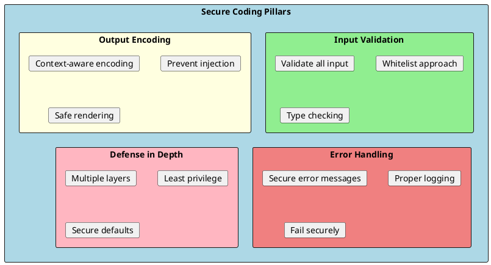
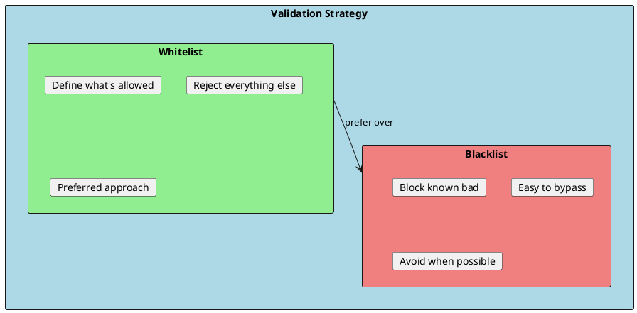
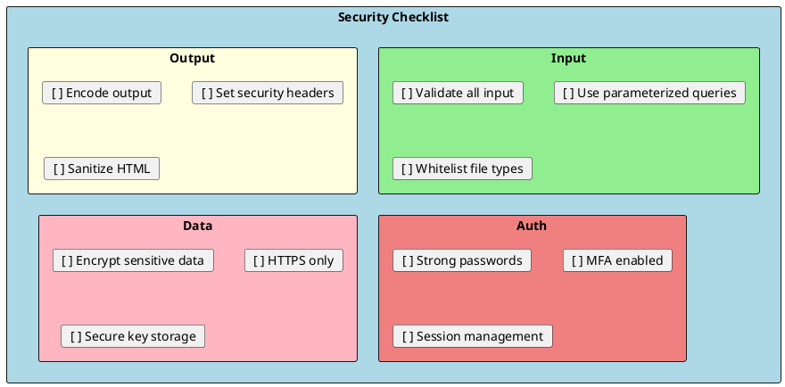

# Secure Coding Practices in .NET

Secure coding practices are essential for building applications that resist attacks. This guide covers defensive programming techniques, input validation, output encoding, and security-focused design patterns in .NET.



---

## Input Validation

Never trust user input. Validate everything at the boundary.



### Model Validation

```csharp
public class CreateUserRequest
{
    [Required(ErrorMessage = "Email is required")]
    [EmailAddress(ErrorMessage = "Invalid email format")]
    [MaxLength(255)]
    public string Email { get; set; } = string.Empty;

    [Required]
    [StringLength(100, MinimumLength = 12, ErrorMessage = "Password must be 12-100 characters")]
    [RegularExpression(@"^(?=.*[a-z])(?=.*[A-Z])(?=.*\d)(?=.*[^\da-zA-Z]).{12,}$",
        ErrorMessage = "Password must contain uppercase, lowercase, digit, and special character")]
    public string Password { get; set; } = string.Empty;

    [Required]
    [StringLength(50, MinimumLength = 1)]
    [RegularExpression(@"^[a-zA-Z\s\-']+$", ErrorMessage = "Name contains invalid characters")]
    public string FirstName { get; set; } = string.Empty;

    [Required]
    [StringLength(50, MinimumLength = 1)]
    [RegularExpression(@"^[a-zA-Z\s\-']+$")]
    public string LastName { get; set; } = string.Empty;

    [Range(18, 120, ErrorMessage = "Age must be between 18 and 120")]
    public int Age { get; set; }

    [Url(ErrorMessage = "Invalid URL format")]
    public string? Website { get; set; }
}

// Controller with validation
[ApiController]
[Route("api/[controller]")]
public class UsersController : ControllerBase
{
    [HttpPost]
    public IActionResult CreateUser([FromBody] CreateUserRequest request)
    {
        // ModelState automatically validated by [ApiController]
        // Returns 400 with validation errors if invalid
        return Ok();
    }
}
```

### Custom Validators

```csharp
// Custom validation attribute
public class NoScriptTagsAttribute : ValidationAttribute
{
    protected override ValidationResult? IsValid(object? value, ValidationContext context)
    {
        if (value is string str)
        {
            if (Regex.IsMatch(str, @"<script|javascript:|on\w+=", RegexOptions.IgnoreCase))
            {
                return new ValidationResult("Content contains potentially dangerous scripts");
            }
        }

        return ValidationResult.Success;
    }
}

// File extension validator
public class AllowedExtensionsAttribute : ValidationAttribute
{
    private readonly string[] _extensions;

    public AllowedExtensionsAttribute(params string[] extensions)
    {
        _extensions = extensions;
    }

    protected override ValidationResult? IsValid(object? value, ValidationContext context)
    {
        if (value is IFormFile file)
        {
            var extension = Path.GetExtension(file.FileName).ToLowerInvariant();
            if (!_extensions.Contains(extension))
            {
                return new ValidationResult($"Allowed extensions: {string.Join(", ", _extensions)}");
            }
        }

        return ValidationResult.Success;
    }
}

// Usage
public class UploadRequest
{
    [Required]
    [AllowedExtensions(".jpg", ".png", ".pdf")]
    [MaxFileSize(5 * 1024 * 1024)] // 5MB
    public IFormFile File { get; set; } = null!;

    [NoScriptTags]
    [MaxLength(500)]
    public string? Description { get; set; }
}
```

### FluentValidation

```csharp
public class CreateOrderValidator : AbstractValidator<CreateOrderRequest>
{
    public CreateOrderValidator()
    {
        RuleFor(x => x.CustomerId)
            .NotEmpty()
            .Must(BeValidGuid).WithMessage("Invalid customer ID format");

        RuleFor(x => x.Items)
            .NotEmpty().WithMessage("Order must have at least one item")
            .Must(items => items.Count <= 100).WithMessage("Maximum 100 items per order");

        RuleForEach(x => x.Items).SetValidator(new OrderItemValidator());

        RuleFor(x => x.ShippingAddress)
            .NotNull()
            .SetValidator(new AddressValidator());

        RuleFor(x => x.Notes)
            .MaximumLength(1000)
            .Must(NotContainScripts).WithMessage("Notes contain invalid content");
    }

    private bool BeValidGuid(Guid id) => id != Guid.Empty;

    private bool NotContainScripts(string? notes)
    {
        if (string.IsNullOrEmpty(notes)) return true;
        return !Regex.IsMatch(notes, @"<script|javascript:|on\w+=", RegexOptions.IgnoreCase);
    }
}

// Registration
builder.Services.AddValidatorsFromAssemblyContaining<CreateOrderValidator>();
```

---

## Output Encoding

Encode output based on context to prevent injection attacks.

```csharp
public class EncodingService
{
    private readonly HtmlEncoder _htmlEncoder;
    private readonly JavaScriptEncoder _jsEncoder;
    private readonly UrlEncoder _urlEncoder;

    public EncodingService(
        HtmlEncoder htmlEncoder,
        JavaScriptEncoder jsEncoder,
        UrlEncoder urlEncoder)
    {
        _htmlEncoder = htmlEncoder;
        _jsEncoder = jsEncoder;
        _urlEncoder = urlEncoder;
    }

    // For HTML content
    public string EncodeHtml(string input)
    {
        return _htmlEncoder.Encode(input);
        // <script> becomes &lt;script&gt;
    }

    // For JavaScript strings
    public string EncodeJavaScript(string input)
    {
        return _jsEncoder.Encode(input);
        // ' becomes \u0027
    }

    // For URL parameters
    public string EncodeUrl(string input)
    {
        return _urlEncoder.Encode(input);
        // spaces become %20
    }
}

// In Razor views
// HTML context (default - automatic encoding)
<p>@user.Name</p>

// JavaScript context
<script>
    var userName = '@Html.Raw(JavaScriptEncoder.Default.Encode(user.Name))';
</script>

// URL context
<a href="/search?q=@UrlEncoder.Default.Encode(searchTerm)">Search</a>

// When you need raw HTML (be careful!)
@Html.Raw(sanitizedHtml) // Only use with sanitized content!
```

### HTML Sanitization

```csharp
// Using HtmlSanitizer library
public class ContentSanitizer
{
    private readonly HtmlSanitizer _sanitizer;

    public ContentSanitizer()
    {
        _sanitizer = new HtmlSanitizer();

        // Allow only safe tags
        _sanitizer.AllowedTags.Clear();
        _sanitizer.AllowedTags.Add("p");
        _sanitizer.AllowedTags.Add("br");
        _sanitizer.AllowedTags.Add("b");
        _sanitizer.AllowedTags.Add("i");
        _sanitizer.AllowedTags.Add("u");
        _sanitizer.AllowedTags.Add("a");
        _sanitizer.AllowedTags.Add("ul");
        _sanitizer.AllowedTags.Add("ol");
        _sanitizer.AllowedTags.Add("li");

        // Allow only safe attributes
        _sanitizer.AllowedAttributes.Clear();
        _sanitizer.AllowedAttributes.Add("href");
        _sanitizer.AllowedAttributes.Add("class");

        // Restrict URLs
        _sanitizer.AllowedSchemes.Clear();
        _sanitizer.AllowedSchemes.Add("https");
        _sanitizer.AllowedSchemes.Add("mailto");
    }

    public string Sanitize(string html)
    {
        return _sanitizer.Sanitize(html);
    }
}
```

---

## Secure Error Handling

Never expose sensitive information in error messages.

```csharp
// ✅ SECURE: Global exception handler
public class GlobalExceptionHandler : IExceptionHandler
{
    private readonly ILogger<GlobalExceptionHandler> _logger;
    private readonly IHostEnvironment _env;

    public GlobalExceptionHandler(
        ILogger<GlobalExceptionHandler> logger,
        IHostEnvironment env)
    {
        _logger = logger;
        _env = env;
    }

    public async ValueTask<bool> TryHandleAsync(
        HttpContext httpContext,
        Exception exception,
        CancellationToken cancellationToken)
    {
        // Log full exception details
        _logger.LogError(exception, "Unhandled exception occurred");

        var response = new ProblemDetails
        {
            Status = StatusCodes.Status500InternalServerError,
            Title = "An error occurred"
        };

        // Only show details in development
        if (_env.IsDevelopment())
        {
            response.Detail = exception.Message;
            response.Extensions["stackTrace"] = exception.StackTrace;
        }
        else
        {
            response.Detail = "An unexpected error occurred. Please try again later.";
            // Include correlation ID for support
            response.Extensions["correlationId"] = httpContext.TraceIdentifier;
        }

        httpContext.Response.StatusCode = StatusCodes.Status500InternalServerError;
        await httpContext.Response.WriteAsJsonAsync(response, cancellationToken);

        return true;
    }
}

// Registration
builder.Services.AddExceptionHandler<GlobalExceptionHandler>();
app.UseExceptionHandler();

// ✅ SECURE: Custom exceptions without sensitive details
public class BusinessException : Exception
{
    public string UserMessage { get; }
    public string ErrorCode { get; }

    public BusinessException(string errorCode, string userMessage, string? internalMessage = null)
        : base(internalMessage ?? userMessage)
    {
        ErrorCode = errorCode;
        UserMessage = userMessage;
    }
}

// Usage
throw new BusinessException(
    "INVALID_TRANSFER",
    "Unable to process transfer. Please try again.",
    $"Transfer failed: insufficient funds in account {accountId}"); // Internal only
```

### Secure Logging

```csharp
public class SecureLogger
{
    private readonly ILogger _logger;

    // ❌ NEVER LOG
    // - Passwords
    // - Credit card numbers
    // - Social security numbers
    // - API keys/tokens
    // - Personal health information

    // ✅ SAFE TO LOG
    public void LogUserAction(string userId, string action)
    {
        _logger.LogInformation(
            "User {UserId} performed {Action} at {Timestamp}",
            userId, action, DateTime.UtcNow);
    }

    // ✅ Mask sensitive data if needed
    public void LogPaymentAttempt(string userId, string cardNumber)
    {
        var maskedCard = $"****-****-****-{cardNumber[^4..]}";
        _logger.LogInformation(
            "Payment attempt by {UserId} with card {MaskedCard}",
            userId, maskedCard);
    }
}

// Structured logging configuration
builder.Host.UseSerilog((context, config) =>
{
    config
        .ReadFrom.Configuration(context.Configuration)
        .Enrich.FromLogContext()
        .Destructure.ByTransforming<CreateUserRequest>(r => new
        {
            r.Email,
            Password = "***REDACTED***",
            r.FirstName,
            r.LastName
        });
});
```

---

## Secure File Handling

```csharp
public class SecureFileService
{
    private readonly string _uploadPath;
    private readonly string[] _allowedExtensions = { ".jpg", ".png", ".pdf", ".docx" };
    private readonly Dictionary<string, byte[]> _fileSignatures = new()
    {
        { ".jpg", new byte[] { 0xFF, 0xD8, 0xFF } },
        { ".png", new byte[] { 0x89, 0x50, 0x4E, 0x47 } },
        { ".pdf", new byte[] { 0x25, 0x50, 0x44, 0x46 } }
    };

    public async Task<string> SaveFileAsync(IFormFile file)
    {
        // Validate file size
        if (file.Length > 10 * 1024 * 1024) // 10MB
            throw new ValidationException("File too large");

        // Validate extension
        var extension = Path.GetExtension(file.FileName).ToLowerInvariant();
        if (!_allowedExtensions.Contains(extension))
            throw new ValidationException("File type not allowed");

        // Validate file signature (magic bytes)
        if (!await ValidateFileSignatureAsync(file, extension))
            throw new ValidationException("File content doesn't match extension");

        // Generate safe filename
        var safeFileName = $"{Guid.NewGuid()}{extension}";
        var filePath = Path.Combine(_uploadPath, safeFileName);

        // Ensure path is within allowed directory (prevent path traversal)
        var fullPath = Path.GetFullPath(filePath);
        if (!fullPath.StartsWith(_uploadPath))
            throw new SecurityException("Invalid file path");

        // Save file
        await using var stream = new FileStream(filePath, FileMode.Create);
        await file.CopyToAsync(stream);

        return safeFileName;
    }

    private async Task<bool> ValidateFileSignatureAsync(IFormFile file, string extension)
    {
        if (!_fileSignatures.TryGetValue(extension, out var signature))
            return true; // No signature check for this type

        using var reader = new BinaryReader(file.OpenReadStream());
        var headerBytes = reader.ReadBytes(signature.Length);

        return headerBytes.SequenceEqual(signature);
    }

    public Stream GetFile(string fileName)
    {
        // Sanitize filename
        var sanitizedName = Path.GetFileName(fileName);
        var filePath = Path.Combine(_uploadPath, sanitizedName);

        // Verify path is within allowed directory
        var fullPath = Path.GetFullPath(filePath);
        if (!fullPath.StartsWith(_uploadPath))
            throw new SecurityException("Invalid file path");

        if (!File.Exists(fullPath))
            throw new FileNotFoundException();

        return File.OpenRead(fullPath);
    }
}
```

---

## Secure Random Generation

```csharp
public static class SecureRandom
{
    // ✅ SECURE: Cryptographically secure random
    public static string GenerateToken(int length = 32)
    {
        var bytes = new byte[length];
        RandomNumberGenerator.Fill(bytes);
        return Convert.ToBase64String(bytes);
    }

    public static string GenerateCode(int length = 6)
    {
        var bytes = new byte[length];
        RandomNumberGenerator.Fill(bytes);

        var code = new StringBuilder();
        foreach (var b in bytes)
        {
            code.Append((b % 10).ToString());
        }

        return code.ToString();
    }

    public static Guid GenerateSecureGuid()
    {
        var bytes = new byte[16];
        RandomNumberGenerator.Fill(bytes);
        return new Guid(bytes);
    }

    // ❌ INSECURE: Don't use for security
    // var random = new Random();
    // var token = random.Next().ToString(); // Predictable!
}
```

---

## Least Privilege Principle

```csharp
// Database connection with minimal permissions
// Don't use 'sa' or admin accounts for application connections

// ✅ Create specific database user
/*
CREATE USER AppUser WITH PASSWORD = 'SecurePassword';
GRANT SELECT, INSERT, UPDATE ON dbo.Orders TO AppUser;
GRANT SELECT ON dbo.Products TO AppUser;
-- No DELETE permission unless needed
-- No access to system tables
*/

// ✅ Service with minimal scope
public class OrderService
{
    private readonly IOrderRepository _orderRepository; // Can only access orders

    // Not: IDbContext that can access everything
}

// ✅ File system access
public class ReportService
{
    private readonly string _reportDirectory = "/app/reports";

    public string GenerateReport()
    {
        // Can only write to specific directory
        var filePath = Path.Combine(_reportDirectory, $"report_{DateTime.UtcNow:yyyyMMdd}.pdf");
        // ...
    }
}
```

---

## Secure Dependencies

```csharp
// Check for vulnerabilities regularly
// dotnet list package --vulnerable

// Use dependabot or similar for automatic updates
// .github/dependabot.yml
/*
version: 2
updates:
  - package-ecosystem: "nuget"
    directory: "/"
    schedule:
      interval: "weekly"
    open-pull-requests-limit: 10
*/

// Pin versions in production
// <PackageReference Include="Newtonsoft.Json" Version="13.0.3" />
// Not: Version="*" or Version="13.*"
```

---

## Secure Configuration

```csharp
// ✅ SECURE: Strongly-typed configuration
public class SecuritySettings
{
    [Required]
    [MinLength(32)]
    public string JwtSecretKey { get; set; } = string.Empty;

    [Required]
    public string AllowedOrigins { get; set; } = string.Empty;

    [Range(1, 60)]
    public int TokenExpirationMinutes { get; set; } = 15;
}

// Validation at startup
builder.Services.AddOptions<SecuritySettings>()
    .BindConfiguration("Security")
    .ValidateDataAnnotations()
    .ValidateOnStart();

// ✅ SECURE: Fail fast if configuration is invalid
var settings = builder.Configuration.GetSection("Security").Get<SecuritySettings>();
if (string.IsNullOrEmpty(settings?.JwtSecretKey))
{
    throw new InvalidOperationException("JWT secret key must be configured");
}
```

---

## Security Checklist



---

## Interview Questions & Answers

### Q1: What is input validation and why is it important?

**Answer**: Input validation ensures data meets expected format before processing:
- Prevents injection attacks (SQL, XSS, command)
- Ensures data integrity
- Protects business logic

Best practices:
- Validate at boundary (API entry points)
- Use whitelist approach
- Validate type, length, format, range
- Server-side validation is mandatory (client-side is UX only)

### Q2: What is the difference between encoding and encryption?

**Answer**:
| Encoding | Encryption |
|----------|------------|
| Transforms data format | Protects data confidentiality |
| No secret key | Requires key |
| Reversible by anyone | Only reversible with key |
| Prevents injection | Prevents unauthorized access |
| Example: HTML encoding | Example: AES encryption |

### Q3: How do you handle errors securely?

**Answer**:
- Never expose stack traces in production
- Log detailed errors server-side
- Return generic messages to users
- Include correlation IDs for support
- Don't reveal system information
- Fail securely (deny by default)

### Q4: What is the principle of least privilege?

**Answer**: Grant minimum permissions needed to perform a task:
- Database users with limited permissions
- Service accounts with specific roles
- File system access restricted to needed directories
- API endpoints require specific scopes

Benefits: Limits damage from compromised accounts.

### Q5: How do you prevent path traversal attacks?

**Answer**:
```csharp
// Get only filename, remove path
var safeName = Path.GetFileName(userInput);
var fullPath = Path.Combine(allowedDir, safeName);

// Verify final path is within allowed directory
if (!Path.GetFullPath(fullPath).StartsWith(allowedDir))
    throw new SecurityException();
```

### Q6: How do you generate secure random values?

**Answer**:
```csharp
// Use RandomNumberGenerator (cryptographic)
var bytes = new byte[32];
RandomNumberGenerator.Fill(bytes);

// Never use Random class for security
// var random = new Random(); // Predictable!
```

### Q7: What should you never log?

**Answer**:
- Passwords and credentials
- Credit card numbers
- Social security numbers
- API keys and tokens
- Personal health information
- Full request bodies with sensitive data

Instead: Log user IDs, actions, timestamps, masked values.

### Q8: How do you validate file uploads?

**Answer**:
1. Check file size limits
2. Validate extension (whitelist)
3. Verify file signature (magic bytes)
4. Generate new filename (GUID)
5. Store outside web root
6. Scan for malware (if possible)
7. Validate path to prevent traversal
