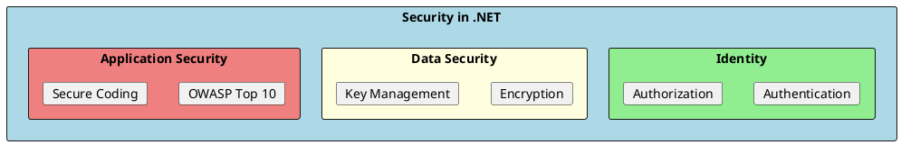

# Security

Security best practices in .NET applications covering authentication, authorization, data protection, and secure coding.

## Overview

## Key Components

| Topic | Description | Document |
|-------|-------------|----------|
| **Authentication** | Identity verification, JWT, OAuth, MFA | [01-Authentication.md](./01-Authentication.md) |
| **Authorization** | Access control, roles, policies, claims | [02-Authorization.md](./02-Authorization.md) |
| **Data Protection** | Encryption, hashing, key management | [03-DataProtection.md](./03-DataProtection.md) |
| **OWASP Top 10** | Critical web security risks | [04-OWASP-Top10.md](./04-OWASP-Top10.md) |
| **Secure Coding** | Defensive programming practices | [05-SecureCoding.md](./05-SecureCoding.md) |

## Quick Reference

### Authentication vs Authorization

| Authentication | Authorization |
|---------------|---------------|
| "Who are you?" | "What can you do?" |
| Verifies identity | Verifies permissions |
| Login process | Access control |
| JWT, Cookies, OAuth | Roles, Claims, Policies |

### Security Checklist

- [ ] HTTPS everywhere
- [ ] Strong password policies
- [ ] Multi-factor authentication
- [ ] Input validation
- [ ] Output encoding
- [ ] Parameterized queries
- [ ] Security headers
- [ ] Secure error handling
- [ ] Dependency scanning
- [ ] Security logging

## Learning Path

1. Start with **Authentication** - understand identity management
2. Learn **Authorization** - implement access control
3. Study **Data Protection** - secure sensitive data
4. Review **OWASP Top 10** - know common vulnerabilities
5. Apply **Secure Coding** - write defensive code
