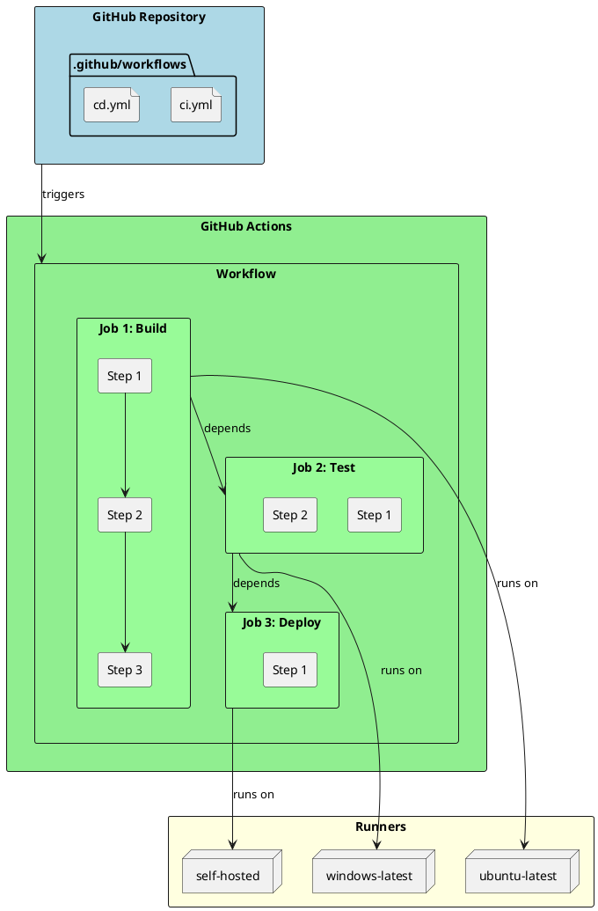
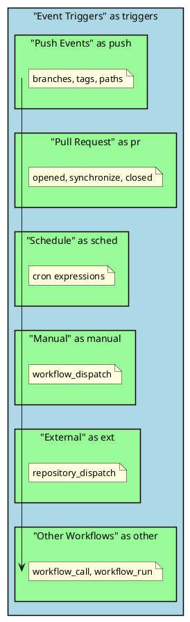

# GitHub Actions for .NET

GitHub Actions is GitHub's built-in CI/CD platform that enables automated workflows directly from your repository. As a senior .NET engineer, mastering GitHub Actions is essential for building robust, maintainable pipelines.

## Why GitHub Actions Matters for Senior Engineers

- **Native Integration**: Deeply integrated with GitHub's ecosystem (PRs, Issues, Releases)
- **Marketplace Ecosystem**: Thousands of reusable actions for common tasks
- **Matrix Builds**: Test across multiple .NET versions and OS platforms simultaneously
- **Cost-Effective**: Generous free tier for public repositories

## GitHub Actions Architecture



## Core Concepts

### Workflow Structure

```yaml
# .github/workflows/dotnet-ci.yml
name: .NET CI/CD Pipeline

# Triggers - when the workflow runs
on:
  push:
    branches: [ main, develop ]
  pull_request:
    branches: [ main ]
  workflow_dispatch:  # Manual trigger
    inputs:
      environment:
        description: 'Deployment environment'
        required: true
        default: 'staging'
        type: choice
        options:
          - staging
          - production

# Environment variables available to all jobs
env:
  DOTNET_VERSION: '8.0.x'
  CONFIGURATION: 'Release'

jobs:
  build:
    runs-on: ubuntu-latest

    steps:
      - uses: actions/checkout@v4

      - name: Setup .NET
        uses: actions/setup-dotnet@v4
        with:
          dotnet-version: ${{ env.DOTNET_VERSION }}

      - name: Restore dependencies
        run: dotnet restore

      - name: Build
        run: dotnet build --configuration ${{ env.CONFIGURATION }} --no-restore

      - name: Test
        run: dotnet test --configuration ${{ env.CONFIGURATION }} --no-build --verbosity normal
```

### Workflow Triggers Deep Dive



```yaml
# Comprehensive trigger examples
on:
  # Push to specific branches
  push:
    branches:
      - main
      - 'release/**'
    paths:
      - 'src/**'
      - '!src/**/*.md'  # Exclude markdown files
    tags:
      - 'v*'

  # Pull request events
  pull_request:
    types: [opened, synchronize, reopened]
    branches: [main]

  # Scheduled runs (cron syntax)
  schedule:
    - cron: '0 2 * * 1-5'  # 2 AM UTC, Mon-Fri

  # Manual trigger with inputs
  workflow_dispatch:
    inputs:
      version:
        description: 'Version to deploy'
        required: true
        type: string

  # Triggered by another workflow
  workflow_call:
    inputs:
      artifact-name:
        required: true
        type: string
    secrets:
      deploy-token:
        required: true
```

## Complete .NET CI/CD Pipeline

```yaml
name: .NET Complete CI/CD

on:
  push:
    branches: [ main ]
  pull_request:
    branches: [ main ]

env:
  DOTNET_VERSION: '8.0.x'
  REGISTRY: ghcr.io
  IMAGE_NAME: ${{ github.repository }}

jobs:
  # ============================================
  # BUILD JOB
  # ============================================
  build:
    runs-on: ubuntu-latest
    outputs:
      version: ${{ steps.version.outputs.version }}

    steps:
      - uses: actions/checkout@v4
        with:
          fetch-depth: 0  # Full history for versioning

      - name: Setup .NET
        uses: actions/setup-dotnet@v4
        with:
          dotnet-version: ${{ env.DOTNET_VERSION }}

      # Caching for faster builds
      - name: Cache NuGet packages
        uses: actions/cache@v4
        with:
          path: ~/.nuget/packages
          key: ${{ runner.os }}-nuget-${{ hashFiles('**/*.csproj') }}
          restore-keys: |
            ${{ runner.os }}-nuget-

      - name: Restore dependencies
        run: dotnet restore

      - name: Build
        run: dotnet build --configuration Release --no-restore

      # Generate version from git
      - name: Generate version
        id: version
        run: |
          VERSION=$(date +'%Y.%m.%d').${{ github.run_number }}
          echo "version=$VERSION" >> $GITHUB_OUTPUT

      # Upload build artifacts
      - name: Publish
        run: dotnet publish src/MyApp/MyApp.csproj -c Release -o ./publish

      - name: Upload artifact
        uses: actions/upload-artifact@v4
        with:
          name: app-${{ steps.version.outputs.version }}
          path: ./publish
          retention-days: 5

  # ============================================
  # TEST JOB
  # ============================================
  test:
    runs-on: ubuntu-latest
    needs: build

    services:
      # Spin up SQL Server for integration tests
      sqlserver:
        image: mcr.microsoft.com/mssql/server:2022-latest
        env:
          ACCEPT_EULA: Y
          SA_PASSWORD: YourStrong@Passw0rd
        ports:
          - 1433:1433
        options: >-
          --health-cmd "/opt/mssql-tools/bin/sqlcmd -S localhost -U sa -P YourStrong@Passw0rd -Q 'SELECT 1'"
          --health-interval 10s
          --health-timeout 5s
          --health-retries 5

    steps:
      - uses: actions/checkout@v4

      - name: Setup .NET
        uses: actions/setup-dotnet@v4
        with:
          dotnet-version: ${{ env.DOTNET_VERSION }}

      - name: Restore
        run: dotnet restore

      - name: Run Unit Tests
        run: |
          dotnet test tests/UnitTests \
            --configuration Release \
            --logger "trx;LogFileName=unit-tests.trx" \
            --collect:"XPlat Code Coverage"

      - name: Run Integration Tests
        env:
          ConnectionStrings__DefaultConnection: "Server=localhost;Database=TestDb;User Id=sa;Password=YourStrong@Passw0rd;TrustServerCertificate=True"
        run: |
          dotnet test tests/IntegrationTests \
            --configuration Release \
            --logger "trx;LogFileName=integration-tests.trx"

      # Upload test results
      - name: Upload Test Results
        uses: actions/upload-artifact@v4
        if: always()
        with:
          name: test-results
          path: |
            **/TestResults/*.trx
            **/TestResults/**/coverage.cobertura.xml

      # Code coverage report
      - name: Code Coverage Report
        uses: codecov/codecov-action@v4
        with:
          files: '**/coverage.cobertura.xml'
          fail_ci_if_error: true
          token: ${{ secrets.CODECOV_TOKEN }}

  # ============================================
  # SECURITY SCANNING JOB
  # ============================================
  security:
    runs-on: ubuntu-latest
    needs: build
    permissions:
      security-events: write

    steps:
      - uses: actions/checkout@v4

      - name: Setup .NET
        uses: actions/setup-dotnet@v4
        with:
          dotnet-version: ${{ env.DOTNET_VERSION }}

      # Dependency vulnerability scanning
      - name: Run Security Scan
        run: |
          dotnet tool install --global security-scan
          security-scan ./MySolution.sln --export=sarif --output=security-results.sarif

      # Upload to GitHub Security tab
      - name: Upload SARIF results
        uses: github/codeql-action/upload-sarif@v3
        with:
          sarif_file: security-results.sarif

  # ============================================
  # BUILD AND PUSH DOCKER IMAGE
  # ============================================
  docker:
    runs-on: ubuntu-latest
    needs: [test, security]
    if: github.event_name == 'push' && github.ref == 'refs/heads/main'
    permissions:
      contents: read
      packages: write

    steps:
      - uses: actions/checkout@v4

      - name: Log in to Container Registry
        uses: docker/login-action@v3
        with:
          registry: ${{ env.REGISTRY }}
          username: ${{ github.actor }}
          password: ${{ secrets.GITHUB_TOKEN }}

      - name: Extract metadata
        id: meta
        uses: docker/metadata-action@v5
        with:
          images: ${{ env.REGISTRY }}/${{ env.IMAGE_NAME }}
          tags: |
            type=sha,prefix=
            type=ref,event=branch
            type=semver,pattern={{version}}

      - name: Build and push
        uses: docker/build-push-action@v5
        with:
          context: .
          push: true
          tags: ${{ steps.meta.outputs.tags }}
          labels: ${{ steps.meta.outputs.labels }}
          cache-from: type=gha
          cache-to: type=gha,mode=max

  # ============================================
  # DEPLOY TO STAGING
  # ============================================
  deploy-staging:
    runs-on: ubuntu-latest
    needs: docker
    environment:
      name: staging
      url: https://staging.myapp.com

    steps:
      - name: Download artifact
        uses: actions/download-artifact@v4
        with:
          name: app-${{ needs.build.outputs.version }}

      - name: Deploy to Azure Web App
        uses: azure/webapps-deploy@v3
        with:
          app-name: myapp-staging
          publish-profile: ${{ secrets.AZURE_WEBAPP_PUBLISH_PROFILE_STAGING }}

  # ============================================
  # DEPLOY TO PRODUCTION
  # ============================================
  deploy-production:
    runs-on: ubuntu-latest
    needs: deploy-staging
    environment:
      name: production
      url: https://myapp.com

    steps:
      - name: Deploy to Azure Web App
        uses: azure/webapps-deploy@v3
        with:
          app-name: myapp-production
          publish-profile: ${{ secrets.AZURE_WEBAPP_PUBLISH_PROFILE_PRODUCTION }}
```

## Matrix Builds

Test across multiple configurations simultaneously:

```yaml
jobs:
  test-matrix:
    runs-on: ${{ matrix.os }}
    strategy:
      fail-fast: false  # Continue other jobs if one fails
      matrix:
        os: [ubuntu-latest, windows-latest, macos-latest]
        dotnet-version: ['6.0.x', '7.0.x', '8.0.x']
        include:
          # Add specific configuration
          - os: ubuntu-latest
            dotnet-version: '8.0.x'
            run-sonar: true
        exclude:
          # Skip .NET 6 on macOS
          - os: macos-latest
            dotnet-version: '6.0.x'

    steps:
      - uses: actions/checkout@v4

      - name: Setup .NET ${{ matrix.dotnet-version }}
        uses: actions/setup-dotnet@v4
        with:
          dotnet-version: ${{ matrix.dotnet-version }}

      - name: Test
        run: dotnet test --configuration Release

      - name: SonarCloud Analysis
        if: matrix.run-sonar
        run: |
          # Run SonarCloud analysis only on specific matrix combination
          echo "Running SonarCloud..."
```

## Secrets Management

```plantuml
@startuml Secrets Management
skinparam monochrome false
skinparam shadowing false

rectangle "Secrets Hierarchy" as sh #LightBlue {
    rectangle "Organization Secrets" as org #LightGreen {
        note right: Shared across repos
    }
    rectangle "Repository Secrets" as repo #LightYellow {
        note right: Repo-specific
    }
    rectangle "Environment Secrets" as env #LightCoral {
        note right: Environment-specific\n(staging, production)
    }
}

org --> repo : inherited
repo --> env : overridden

@enduml
```

```yaml
# Using secrets securely
jobs:
  deploy:
    runs-on: ubuntu-latest
    environment: production

    steps:
      - name: Configure AWS credentials
        uses: aws-actions/configure-aws-credentials@v4
        with:
          aws-access-key-id: ${{ secrets.AWS_ACCESS_KEY_ID }}
          aws-secret-access-key: ${{ secrets.AWS_SECRET_ACCESS_KEY }}
          aws-region: us-east-1

      # NEVER echo secrets!
      - name: Deploy
        env:
          API_KEY: ${{ secrets.API_KEY }}
          DATABASE_URL: ${{ secrets.DATABASE_URL }}
        run: |
          # Secrets are masked in logs
          ./deploy.sh
```

## Reusable Workflows

Create shared workflows for consistency:

```yaml
# .github/workflows/dotnet-build.yml (Reusable workflow)
name: Reusable .NET Build

on:
  workflow_call:
    inputs:
      dotnet-version:
        required: false
        type: string
        default: '8.0.x'
      configuration:
        required: false
        type: string
        default: 'Release'
      project-path:
        required: true
        type: string
    outputs:
      artifact-name:
        description: "Name of uploaded artifact"
        value: ${{ jobs.build.outputs.artifact-name }}
    secrets:
      nuget-auth-token:
        required: false

jobs:
  build:
    runs-on: ubuntu-latest
    outputs:
      artifact-name: ${{ steps.artifact.outputs.name }}

    steps:
      - uses: actions/checkout@v4

      - name: Setup .NET
        uses: actions/setup-dotnet@v4
        with:
          dotnet-version: ${{ inputs.dotnet-version }}

      - name: Build
        run: |
          dotnet restore ${{ inputs.project-path }}
          dotnet build ${{ inputs.project-path }} \
            --configuration ${{ inputs.configuration }} \
            --no-restore

      - name: Publish
        run: |
          dotnet publish ${{ inputs.project-path }} \
            --configuration ${{ inputs.configuration }} \
            --output ./publish

      - name: Upload artifact
        id: artifact
        run: |
          ARTIFACT_NAME="build-${{ github.run_number }}"
          echo "name=$ARTIFACT_NAME" >> $GITHUB_OUTPUT

      - uses: actions/upload-artifact@v4
        with:
          name: ${{ steps.artifact.outputs.name }}
          path: ./publish
```

```yaml
# Calling the reusable workflow
name: CI

on:
  push:
    branches: [main]

jobs:
  build-api:
    uses: ./.github/workflows/dotnet-build.yml
    with:
      project-path: src/MyApi/MyApi.csproj
      configuration: Release
    secrets:
      nuget-auth-token: ${{ secrets.NUGET_TOKEN }}

  build-worker:
    uses: ./.github/workflows/dotnet-build.yml
    with:
      project-path: src/MyWorker/MyWorker.csproj
```

## Caching Strategies

```yaml
jobs:
  build:
    runs-on: ubuntu-latest
    steps:
      # NuGet package cache
      - name: Cache NuGet
        uses: actions/cache@v4
        with:
          path: ~/.nuget/packages
          key: ${{ runner.os }}-nuget-${{ hashFiles('**/*.csproj', '**/packages.lock.json') }}
          restore-keys: |
            ${{ runner.os }}-nuget-

      # Node modules for front-end
      - name: Cache npm
        uses: actions/cache@v4
        with:
          path: ~/.npm
          key: ${{ runner.os }}-npm-${{ hashFiles('**/package-lock.json') }}

      # Docker layer caching
      - name: Set up Docker Buildx
        uses: docker/setup-buildx-action@v3

      - name: Build with cache
        uses: docker/build-push-action@v5
        with:
          context: .
          push: false
          cache-from: type=gha
          cache-to: type=gha,mode=max
```

## Quick Reference Card

```
┌─────────────────────────────────────────────────────────────────────────────┐
│                       GITHUB ACTIONS QUICK REFERENCE                        │
├─────────────────────────────────────────────────────────────────────────────┤
│                                                                             │
│  WORKFLOW FILE LOCATION:  .github/workflows/*.yml                           │
│                                                                             │
│  COMMON TRIGGERS:                                                           │
│  • push: branches, tags, paths                                              │
│  • pull_request: types, branches                                            │
│  • schedule: cron expressions                                               │
│  • workflow_dispatch: manual with inputs                                    │
│  • workflow_call: reusable workflows                                        │
│                                                                             │
│  CONTEXT VARIABLES:                                                         │
│  • ${{ github.sha }}         - Commit SHA                                   │
│  • ${{ github.ref }}         - Branch/tag ref                               │
│  • ${{ github.actor }}       - User who triggered                           │
│  • ${{ github.run_number }}  - Workflow run number                          │
│  • ${{ secrets.NAME }}       - Access secrets                               │
│  • ${{ env.VARIABLE }}       - Environment variable                         │
│                                                                             │
│  JOB DEPENDENCIES:                                                          │
│  needs: [job1, job2]         - Run after specified jobs                     │
│  if: success()               - Conditional execution                        │
│                                                                             │
│  ARTIFACTS:                                                                 │
│  actions/upload-artifact@v4  - Upload files                                 │
│  actions/download-artifact@v4- Download files                               │
│                                                                             │
│  ESSENTIAL ACTIONS:                                                         │
│  • actions/checkout@v4       - Clone repository                             │
│  • actions/setup-dotnet@v4   - Install .NET SDK                             │
│  • actions/cache@v4          - Cache dependencies                           │
│  • docker/build-push-action@v5 - Build/push images                          │
│                                                                             │
└─────────────────────────────────────────────────────────────────────────────┘
```

## Conditional Execution

```yaml
jobs:
  conditional:
    runs-on: ubuntu-latest
    steps:
      # Run only on main branch
      - name: Deploy
        if: github.ref == 'refs/heads/main'
        run: ./deploy.sh

      # Run only on pull requests
      - name: PR Check
        if: github.event_name == 'pull_request'
        run: ./pr-check.sh

      # Run on failure
      - name: Notify on Failure
        if: failure()
        run: ./notify-slack.sh

      # Run always (even if previous steps fail)
      - name: Cleanup
        if: always()
        run: ./cleanup.sh

      # Complex conditions
      - name: Conditional Deploy
        if: |
          github.event_name == 'push' &&
          github.ref == 'refs/heads/main' &&
          contains(github.event.head_commit.message, '[deploy]')
        run: ./deploy.sh
```

## Self-Hosted Runners

```yaml
jobs:
  build:
    # Use self-hosted runner with labels
    runs-on: [self-hosted, linux, x64, gpu]

    steps:
      - uses: actions/checkout@v4

      - name: Build with GPU
        run: |
          # Access to local resources
          nvidia-smi
          dotnet build
```

## Senior Interview Questions

**Q: How do you handle secrets rotation in GitHub Actions?**

Key considerations:
- Use environment secrets for per-environment rotation
- Implement OIDC for cloud providers (no static credentials)
- Use short-lived tokens via `GITHUB_TOKEN`
- Audit secret usage via GitHub's audit log
- Consider HashiCorp Vault integration for enterprise

```yaml
# OIDC authentication (no static secrets!)
jobs:
  deploy:
    runs-on: ubuntu-latest
    permissions:
      id-token: write
      contents: read

    steps:
      - name: Azure Login (OIDC)
        uses: azure/login@v2
        with:
          client-id: ${{ secrets.AZURE_CLIENT_ID }}
          tenant-id: ${{ secrets.AZURE_TENANT_ID }}
          subscription-id: ${{ secrets.AZURE_SUBSCRIPTION_ID }}
```

**Q: How do you optimize GitHub Actions for a large monorepo?**

Strategies:
- Path filters to run only affected workflows
- Reusable workflows for common patterns
- Matrix builds with fail-fast disabled
- Aggressive caching (NuGet, npm, Docker layers)
- Self-hosted runners for compute-intensive tasks
- Workflow concurrency controls

```yaml
on:
  push:
    paths:
      - 'services/api/**'
      - 'shared/**'

concurrency:
  group: ${{ github.workflow }}-${{ github.ref }}
  cancel-in-progress: true  # Cancel redundant runs
```

**Q: Explain the difference between `needs` and job dependencies in GitHub Actions.**

- `needs`: Explicit job ordering, shares outputs between jobs
- Jobs run in parallel by default
- Use `if: always()` with `needs` for cleanup jobs that must run
- Outputs must be explicitly declared and passed

```yaml
jobs:
  build:
    outputs:
      version: ${{ steps.v.outputs.version }}
    steps:
      - id: v
        run: echo "version=1.0.${{ github.run_number }}" >> $GITHUB_OUTPUT

  deploy:
    needs: build
    steps:
      - run: echo "Deploying ${{ needs.build.outputs.version }}"
```
