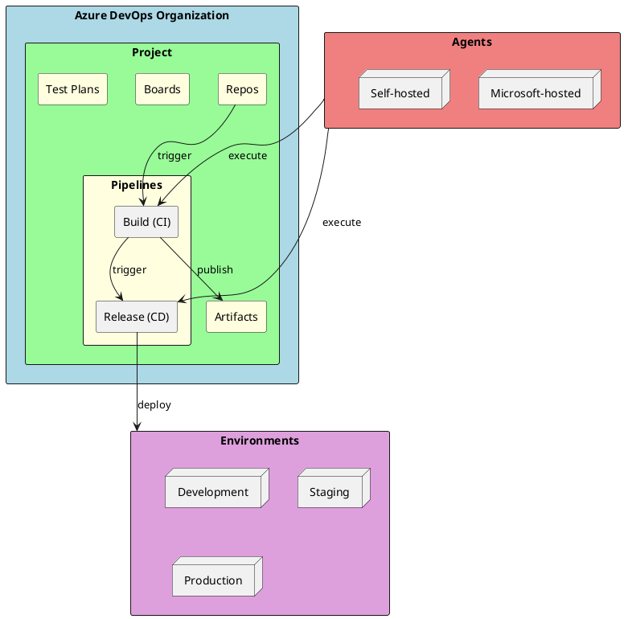
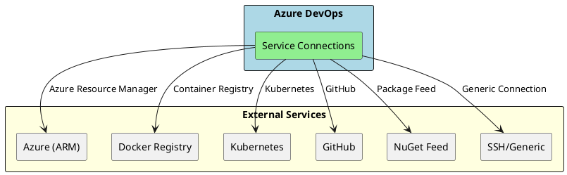
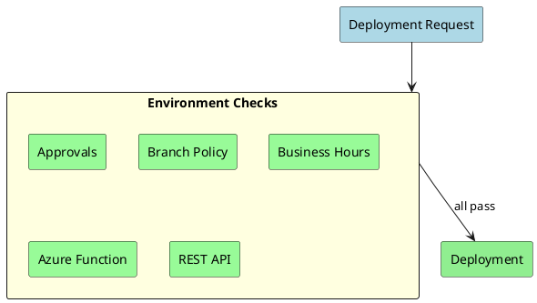

# Azure DevOps Pipelines

Azure DevOps is Microsoft's comprehensive DevOps platform providing CI/CD pipelines, artifact management, and release orchestration. As a senior .NET engineer, understanding Azure DevOps is crucial for enterprise environments.

## Why Azure DevOps Matters for Senior Engineers

- **Enterprise Integration**: Deep integration with Azure services and Active Directory
- **Hybrid Deployments**: Supports on-premises, cloud, and hybrid scenarios
- **Advanced Release Management**: Approval gates, deployment strategies, environments
- **Complete ALM Solution**: Boards, Repos, Pipelines, Test Plans, Artifacts in one platform

## Azure DevOps Architecture



## Pipeline Types Comparison

```plantuml
@startuml Pipeline Types
skinparam monochrome false
skinparam shadowing false

rectangle "Classic Pipelines" as classic #LightCoral {
    note right
        • GUI-based configuration
        • Task-based visual editor
        • Separate Build/Release
        • Legacy approach
    end note
}

rectangle "YAML Pipelines" as yaml #LightGreen {
    note right
        • Code-based (azure-pipelines.yml)
        • Version controlled
        • Multi-stage (CI + CD)
        • Modern approach
        • Recommended
    end note
}

classic -[hidden]-> yaml

@enduml
```

## YAML Pipeline Structure

```yaml
# azure-pipelines.yml
trigger:
  branches:
    include:
      - main
      - develop
  paths:
    include:
      - src/*
    exclude:
      - docs/*

pr:
  branches:
    include:
      - main
  paths:
    include:
      - src/*

# Pipeline-level variables
variables:
  buildConfiguration: 'Release'
  dotnetVersion: '8.0.x'

# Agent pool
pool:
  vmImage: 'ubuntu-latest'

# Stages
stages:
  - stage: Build
    displayName: 'Build Stage'
    jobs:
      - job: BuildJob
        displayName: 'Build .NET Application'
        steps:
          - task: UseDotNet@2
            displayName: 'Install .NET SDK'
            inputs:
              packageType: 'sdk'
              version: '$(dotnetVersion)'

          - task: DotNetCoreCLI@2
            displayName: 'Restore packages'
            inputs:
              command: 'restore'
              projects: '**/*.csproj'

          - task: DotNetCoreCLI@2
            displayName: 'Build solution'
            inputs:
              command: 'build'
              projects: '**/*.csproj'
              arguments: '--configuration $(buildConfiguration) --no-restore'

  - stage: Test
    displayName: 'Test Stage'
    dependsOn: Build
    jobs:
      - job: TestJob
        steps:
          - task: DotNetCoreCLI@2
            displayName: 'Run tests'
            inputs:
              command: 'test'
              projects: '**/*Tests.csproj'
              arguments: '--configuration $(buildConfiguration) --collect:"XPlat Code Coverage"'

  - stage: Deploy
    displayName: 'Deploy Stage'
    dependsOn: Test
    condition: and(succeeded(), eq(variables['Build.SourceBranch'], 'refs/heads/main'))
    jobs:
      - deployment: DeployWeb
        displayName: 'Deploy to Azure'
        environment: 'production'
        strategy:
          runOnce:
            deploy:
              steps:
                - task: AzureWebApp@1
                  inputs:
                    azureSubscription: 'MyAzureSubscription'
                    appName: 'my-web-app'
                    package: '$(Pipeline.Workspace)/**/*.zip'
```

## Complete Multi-Stage Pipeline

```yaml
# azure-pipelines.yml - Enterprise .NET Pipeline
trigger:
  branches:
    include:
      - main
      - release/*
  tags:
    include:
      - v*

pr:
  branches:
    include:
      - main

variables:
  - group: 'Common-Variables'  # Variable group from Library
  - name: buildConfiguration
    value: 'Release'
  - name: dotnetVersion
    value: '8.0.x'
  - name: solution
    value: '**/*.sln'
  - name: isMain
    value: $[eq(variables['Build.SourceBranch'], 'refs/heads/main')]
  - name: isTag
    value: $[startsWith(variables['Build.SourceBranch'], 'refs/tags/v')]

# Template resources
resources:
  repositories:
    - repository: templates
      type: git
      name: DevOps/pipeline-templates

stages:
# ============================================
# BUILD STAGE
# ============================================
- stage: Build
  displayName: 'Build & Package'
  jobs:
  - job: Build
    displayName: 'Build Solution'
    pool:
      vmImage: 'ubuntu-latest'

    steps:
    - checkout: self
      fetchDepth: 0  # Full history for GitVersion

    # Install GitVersion for semantic versioning
    - task: gitversion/setup@0
      displayName: 'Install GitVersion'
      inputs:
        versionSpec: '5.x'

    - task: gitversion/execute@0
      displayName: 'Calculate Version'
      inputs:
        useConfigFile: true
        configFilePath: 'GitVersion.yml'

    - task: UseDotNet@2
      displayName: 'Install .NET SDK'
      inputs:
        packageType: 'sdk'
        version: '$(dotnetVersion)'

    # Cache NuGet packages
    - task: Cache@2
      displayName: 'Cache NuGet packages'
      inputs:
        key: 'nuget | "$(Agent.OS)" | **/packages.lock.json'
        restoreKeys: |
          nuget | "$(Agent.OS)"
        path: $(Pipeline.Workspace)/.nuget/packages
        cacheHitVar: NUGET_CACHE_RESTORED

    - task: DotNetCoreCLI@2
      displayName: 'Restore packages'
      inputs:
        command: 'restore'
        projects: '$(solution)'
        feedsToUse: 'config'
        nugetConfigPath: 'nuget.config'

    - task: DotNetCoreCLI@2
      displayName: 'Build solution'
      inputs:
        command: 'build'
        projects: '$(solution)'
        arguments: >-
          --configuration $(buildConfiguration)
          --no-restore
          /p:Version=$(GitVersion.NuGetVersion)
          /p:AssemblyVersion=$(GitVersion.AssemblySemVer)

    # Publish Web API
    - task: DotNetCoreCLI@2
      displayName: 'Publish Web API'
      inputs:
        command: 'publish'
        publishWebProjects: false
        projects: '**/MyApi.csproj'
        arguments: >-
          --configuration $(buildConfiguration)
          --output $(Build.ArtifactStagingDirectory)/api
          --no-build

    # Publish Worker Service
    - task: DotNetCoreCLI@2
      displayName: 'Publish Worker'
      inputs:
        command: 'publish'
        projects: '**/MyWorker.csproj'
        arguments: >-
          --configuration $(buildConfiguration)
          --output $(Build.ArtifactStagingDirectory)/worker
          --no-build

    # Build Docker image
    - task: Docker@2
      displayName: 'Build Docker image'
      inputs:
        command: 'build'
        Dockerfile: '**/Dockerfile'
        tags: |
          $(GitVersion.NuGetVersion)
          latest

    # Publish artifacts
    - task: PublishBuildArtifacts@1
      displayName: 'Publish API artifact'
      inputs:
        PathtoPublish: '$(Build.ArtifactStagingDirectory)/api'
        ArtifactName: 'api'

    - task: PublishBuildArtifacts@1
      displayName: 'Publish Worker artifact'
      inputs:
        PathtoPublish: '$(Build.ArtifactStagingDirectory)/worker'
        ArtifactName: 'worker'

# ============================================
# TEST STAGE
# ============================================
- stage: Test
  displayName: 'Test'
  dependsOn: Build
  jobs:
  - job: UnitTests
    displayName: 'Unit Tests'
    pool:
      vmImage: 'ubuntu-latest'
    steps:
    - task: UseDotNet@2
      inputs:
        packageType: 'sdk'
        version: '$(dotnetVersion)'

    - task: DotNetCoreCLI@2
      displayName: 'Run Unit Tests'
      inputs:
        command: 'test'
        projects: '**/UnitTests.csproj'
        arguments: >-
          --configuration $(buildConfiguration)
          --collect:"XPlat Code Coverage"
          --logger trx
          --results-directory $(Agent.TempDirectory)/TestResults

    - task: PublishTestResults@2
      displayName: 'Publish Test Results'
      inputs:
        testResultsFormat: 'VSTest'
        testResultsFiles: '**/*.trx'
        searchFolder: '$(Agent.TempDirectory)/TestResults'

    - task: PublishCodeCoverageResults@1
      displayName: 'Publish Code Coverage'
      inputs:
        codeCoverageTool: 'Cobertura'
        summaryFileLocation: '$(Agent.TempDirectory)/**/coverage.cobertura.xml'

  - job: IntegrationTests
    displayName: 'Integration Tests'
    pool:
      vmImage: 'ubuntu-latest'
    services:
      sqlserver:
        image: mcr.microsoft.com/mssql/server:2022-latest
        ports:
          - 1433:1433
        env:
          ACCEPT_EULA: Y
          SA_PASSWORD: $(TestDbPassword)
    steps:
    - task: DotNetCoreCLI@2
      displayName: 'Run Integration Tests'
      env:
        ConnectionStrings__DefaultConnection: 'Server=localhost;Database=TestDb;User Id=sa;Password=$(TestDbPassword);TrustServerCertificate=True'
      inputs:
        command: 'test'
        projects: '**/IntegrationTests.csproj'
        arguments: '--configuration $(buildConfiguration)'

  - job: SecurityScan
    displayName: 'Security Scan'
    pool:
      vmImage: 'ubuntu-latest'
    steps:
    - task: UseDotNet@2
      inputs:
        packageType: 'sdk'
        version: '$(dotnetVersion)'

    - script: |
        dotnet tool install --global security-scan
        security-scan MySolution.sln
      displayName: 'Run Security Scan'

# ============================================
# DEPLOY TO STAGING
# ============================================
- stage: DeployStaging
  displayName: 'Deploy to Staging'
  dependsOn: Test
  condition: and(succeeded(), eq(variables.isMain, true))
  jobs:
  - deployment: DeployToStaging
    displayName: 'Deploy to Staging Environment'
    pool:
      vmImage: 'ubuntu-latest'
    environment: 'staging'
    strategy:
      runOnce:
        deploy:
          steps:
          - download: current
            artifact: api

          - task: AzureWebApp@1
            displayName: 'Deploy to Azure Web App'
            inputs:
              azureSubscription: 'Azure-Staging-Connection'
              appType: 'webAppLinux'
              appName: 'myapi-staging'
              package: '$(Pipeline.Workspace)/api/**/*.zip'
              runtimeStack: 'DOTNETCORE|8.0'

          - task: AzureAppServiceManage@0
            displayName: 'Restart App Service'
            inputs:
              azureSubscription: 'Azure-Staging-Connection'
              action: 'Restart Azure App Service'
              webAppName: 'myapi-staging'

# ============================================
# DEPLOY TO PRODUCTION
# ============================================
- stage: DeployProduction
  displayName: 'Deploy to Production'
  dependsOn: DeployStaging
  condition: and(succeeded(), or(eq(variables.isMain, true), eq(variables.isTag, true)))
  jobs:
  - deployment: DeployToProduction
    displayName: 'Deploy to Production Environment'
    pool:
      vmImage: 'ubuntu-latest'
    environment: 'production'
    strategy:
      canary:
        increments: [10, 50]
        deploy:
          steps:
          - download: current
            artifact: api

          - task: AzureWebApp@1
            displayName: 'Deploy to Production Slot'
            inputs:
              azureSubscription: 'Azure-Production-Connection'
              appType: 'webAppLinux'
              appName: 'myapi-production'
              deployToSlotOrASE: true
              slotName: 'canary'
              package: '$(Pipeline.Workspace)/api/**/*.zip'

        routeTraffic:
          steps:
          - task: AzureAppServiceManage@0
            displayName: 'Route traffic to canary'
            inputs:
              azureSubscription: 'Azure-Production-Connection'
              action: 'Start Azure App Service'
              webAppName: 'myapi-production'
              specifySlotOrASE: true
              slotName: 'canary'

        postRouteTraffic:
          steps:
          - task: AzureMonitor@1
            displayName: 'Monitor health'
            inputs:
              connectedServiceNameARM: 'Azure-Production-Connection'
              resourceGroupName: 'myapi-rg'
              resourceType: 'Microsoft.Web/sites'
              resourceName: 'myapi-production'
              alertRules: 'error-rate,response-time'

        on:
          failure:
            steps:
            - task: AzureAppServiceManage@0
              displayName: 'Rollback - Route to production'
              inputs:
                azureSubscription: 'Azure-Production-Connection'
                action: 'Swap Slots'
                webAppName: 'myapi-production'
                sourceSlot: 'canary'
                targetSlot: 'production'
```

## Variable Management

```plantuml
@startuml Variable Hierarchy
skinparam monochrome false
skinparam shadowing false

rectangle "Variable Sources" as vs #LightBlue {
    rectangle "Pipeline Variables" as pv #LightGreen {
        note right: Defined in YAML
    }
    rectangle "Variable Groups" as vg #LightYellow {
        note right: Library -> Variable Groups
    }
    rectangle "Azure Key Vault" as kv #LightCoral {
        note right: Linked from Library
    }
    rectangle "Runtime Variables" as rv #Plum {
        note right: Set during execution
    }
}

kv --> vg : link secrets
vg --> pv : reference
rv --> pv : override

@enduml
```

```yaml
# Variable management examples
variables:
  # Inline variables
  - name: buildConfiguration
    value: 'Release'

  # Variable groups (from Library)
  - group: 'Production-Secrets'
  - group: 'Common-Settings'

  # Conditional variables
  - name: environment
    ${{ if eq(variables['Build.SourceBranch'], 'refs/heads/main') }}:
      value: 'production'
    ${{ else }}:
      value: 'development'

  # Template expressions
  - name: imageName
    value: 'myregistry.azurecr.io/myapp:$(Build.BuildId)'

# Using Key Vault secrets (linked in Library)
steps:
  - task: AzureKeyVault@2
    inputs:
      azureSubscription: 'MySubscription'
      KeyVaultName: 'my-keyvault'
      SecretsFilter: 'DatabasePassword,ApiKey'
      RunAsPreJob: true

  - script: |
      echo "Using secret (masked): $(DatabasePassword)"
```

## Service Connections



```yaml
# Using service connections
steps:
  # Azure deployment
  - task: AzureWebApp@1
    inputs:
      azureSubscription: 'My-Azure-Subscription'  # Service connection name
      appName: 'myapp'

  # Docker push
  - task: Docker@2
    inputs:
      containerRegistry: 'My-ACR-Connection'  # Service connection name
      repository: 'myapp'
      command: 'push'

  # Kubernetes deployment
  - task: KubernetesManifest@1
    inputs:
      kubernetesServiceConnection: 'My-AKS-Connection'
      namespace: 'production'
      manifests: 'k8s/*.yaml'
```

## Environments and Approvals

```yaml
# Environments configuration in YAML
stages:
  - stage: DeployProduction
    jobs:
      - deployment: Deploy
        environment: 'production'  # References environment in Azure DevOps
        strategy:
          runOnce:
            deploy:
              steps:
                - script: echo "Deploying to production"
```

Environment settings (configured in Azure DevOps UI):
- **Approvals**: Required approvers before deployment
- **Checks**: Branch policies, business hours, Azure Function gates
- **Resources**: Kubernetes clusters, VMs, App Services



## Templates and Reusability

```yaml
# templates/build-template.yml
parameters:
  - name: project
    type: string
  - name: configuration
    type: string
    default: 'Release'
  - name: publishArtifact
    type: boolean
    default: true

steps:
  - task: DotNetCoreCLI@2
    displayName: 'Build ${{ parameters.project }}'
    inputs:
      command: 'build'
      projects: '${{ parameters.project }}'
      arguments: '--configuration ${{ parameters.configuration }}'

  - ${{ if eq(parameters.publishArtifact, true) }}:
    - task: DotNetCoreCLI@2
      displayName: 'Publish ${{ parameters.project }}'
      inputs:
        command: 'publish'
        projects: '${{ parameters.project }}'
        arguments: '--configuration ${{ parameters.configuration }} --output $(Build.ArtifactStagingDirectory)'

    - task: PublishBuildArtifacts@1
      inputs:
        PathtoPublish: '$(Build.ArtifactStagingDirectory)'
        ArtifactName: 'drop'
```

```yaml
# templates/stages-template.yml
parameters:
  - name: environments
    type: object
    default:
      - name: staging
        subscription: 'Azure-Staging'
        appName: 'myapp-staging'
      - name: production
        subscription: 'Azure-Production'
        appName: 'myapp-production'

stages:
  - ${{ each env in parameters.environments }}:
    - stage: Deploy_${{ env.name }}
      displayName: 'Deploy to ${{ env.name }}'
      jobs:
        - deployment: Deploy
          environment: ${{ env.name }}
          strategy:
            runOnce:
              deploy:
                steps:
                  - task: AzureWebApp@1
                    inputs:
                      azureSubscription: ${{ env.subscription }}
                      appName: ${{ env.appName }}
                      package: '$(Pipeline.Workspace)/drop/**/*.zip'
```

```yaml
# Main pipeline using templates
trigger:
  - main

resources:
  repositories:
    - repository: templates
      type: git
      name: DevOps/pipeline-templates

stages:
  - stage: Build
    jobs:
      - job: BuildAPI
        steps:
          - template: templates/build-template.yml@templates
            parameters:
              project: 'src/MyApi/MyApi.csproj'
              configuration: 'Release'

  - template: templates/stages-template.yml@templates
    parameters:
      environments:
        - name: staging
          subscription: 'Azure-Staging'
          appName: 'myapi-staging'
        - name: production
          subscription: 'Azure-Production'
          appName: 'myapi-production'
```

## Quick Reference Card

```
┌─────────────────────────────────────────────────────────────────────────────┐
│                      AZURE DEVOPS QUICK REFERENCE                           │
├─────────────────────────────────────────────────────────────────────────────┤
│                                                                             │
│  PIPELINE FILE:  azure-pipelines.yml (root of repository)                   │
│                                                                             │
│  TRIGGERS:                                                                  │
│  • trigger: branches, tags, paths                                           │
│  • pr: pull request triggers                                                │
│  • schedules: cron-based                                                    │
│  • resources: pipeline completion                                           │
│                                                                             │
│  PREDEFINED VARIABLES:                                                      │
│  • $(Build.SourceBranch)      - Full branch name                            │
│  • $(Build.BuildId)           - Unique build ID                             │
│  • $(Build.ArtifactStagingDirectory) - Artifact output                      │
│  • $(Pipeline.Workspace)      - Working directory                           │
│  • $(System.AccessToken)      - Pipeline OAuth token                        │
│                                                                             │
│  DEPLOYMENT STRATEGIES:                                                     │
│  • runOnce: Single deployment                                               │
│  • rolling: Gradual replacement                                             │
│  • canary: Incremental traffic shift                                        │
│                                                                             │
│  COMMON TASKS:                                                              │
│  • UseDotNet@2           - Install .NET SDK                                 │
│  • DotNetCoreCLI@2       - Build, test, publish                             │
│  • Docker@2              - Docker operations                                │
│  • AzureWebApp@1         - Deploy to App Service                            │
│  • KubernetesManifest@1  - Deploy to Kubernetes                             │
│  • PublishBuildArtifacts@1 - Upload artifacts                               │
│                                                                             │
│  CONDITIONS:                                                                │
│  • succeeded()           - Previous stage succeeded                         │
│  • failed()              - Previous stage failed                            │
│  • always()              - Run regardless                                   │
│  • eq(var, 'value')      - Variable equals value                            │
│                                                                             │
└─────────────────────────────────────────────────────────────────────────────┘
```

## Self-Hosted Agents

```yaml
# Using self-hosted agents
pool:
  name: 'My-Agent-Pool'
  demands:
    - Agent.OS -equals Linux
    - dotnet8

# Agent capabilities
steps:
  - script: |
      echo "Running on self-hosted agent"
      echo "Has access to internal resources"
```

## Deployment Strategies Comparison

| Strategy | Use Case | Rollback | Risk |
|----------|----------|----------|------|
| **runOnce** | Simple deployments, dev environments | Manual | High |
| **rolling** | Zero-downtime, stateless apps | Automatic | Medium |
| **canary** | Production, risk mitigation | Automatic | Low |
| **blue-green** | Critical apps, instant rollback | Instant switch | Very Low |

## Senior Interview Questions

**Q: How do you implement blue-green deployments in Azure DevOps?**

```yaml
stages:
  - stage: DeployGreen
    jobs:
      - deployment: BlueGreen
        environment: 'production'
        strategy:
          runOnce:
            deploy:
              steps:
                # Deploy to green slot
                - task: AzureWebApp@1
                  inputs:
                    azureSubscription: 'Production'
                    appName: 'myapp'
                    deployToSlotOrASE: true
                    slotName: 'green'
                    package: '$(Pipeline.Workspace)/drop/*.zip'

                # Run smoke tests
                - task: PowerShell@2
                  inputs:
                    targetType: 'inline'
                    script: |
                      $response = Invoke-WebRequest -Uri "https://myapp-green.azurewebsites.net/health"
                      if ($response.StatusCode -ne 200) { throw "Health check failed" }

                # Swap slots
                - task: AzureAppServiceManage@0
                  inputs:
                    azureSubscription: 'Production'
                    action: 'Swap Slots'
                    webAppName: 'myapp'
                    sourceSlot: 'green'
                    targetSlot: 'production'
```

**Q: How do you manage secrets across multiple environments in Azure DevOps?**

Best practices:
- Use Azure Key Vault linked to Variable Groups
- Separate Key Vaults per environment
- Use service principal with minimal permissions
- Never log secrets (they're automatically masked)
- Rotate secrets regularly via Key Vault policies

```yaml
variables:
  - group: 'Common-Settings'
  - ${{ if eq(variables['Build.SourceBranch'], 'refs/heads/main') }}:
    - group: 'Production-Secrets'  # Linked to prod Key Vault
  - ${{ else }}:
    - group: 'Development-Secrets'  # Linked to dev Key Vault
```

**Q: Compare Azure DevOps YAML pipelines with Classic pipelines.**

| Aspect | YAML Pipelines | Classic Pipelines |
|--------|----------------|-------------------|
| Version Control | Yes (in repo) | No (stored in Azure DevOps) |
| Code Review | Via PR | Not applicable |
| Portability | High | Low |
| Multi-stage | Native | Separate Build/Release |
| Complexity | Learning curve | Visual, intuitive |
| Recommended | Yes | Legacy/migration only |

**Q: How do you optimize pipeline performance in Azure DevOps?**

Strategies:
- Cache NuGet packages and npm modules
- Use parallel jobs for independent tests
- Incremental builds with path filters
- Self-hosted agents for specific workloads
- Pipeline artifacts instead of Publish artifacts (faster)
- Conditional stages to skip unnecessary work
