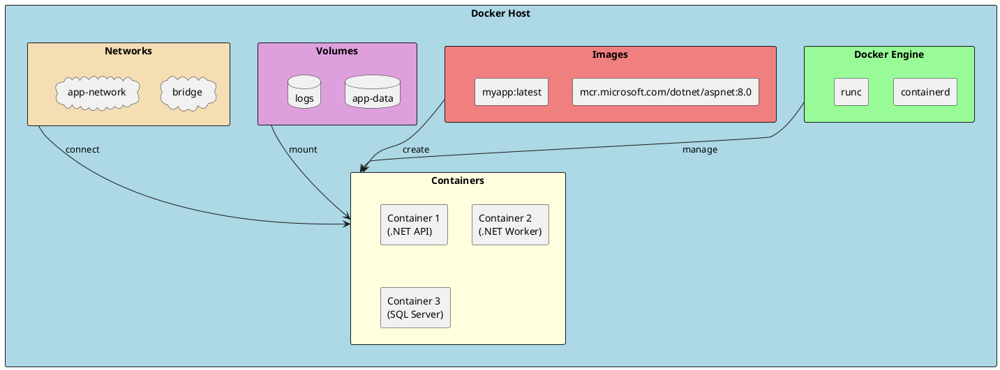
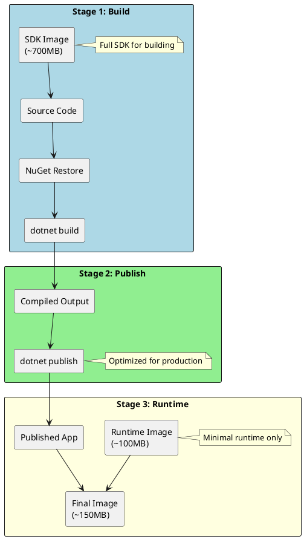
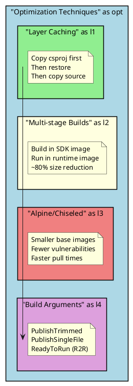

# Docker Containerization for .NET

Docker containerization is essential for modern .NET applications, enabling consistent deployments across environments. As a senior .NET engineer, mastering Docker best practices ensures secure, efficient, and production-ready containers.

## Why Docker Matters for Senior Engineers

- **Environment Consistency**: "Works on my machine" problem eliminated
- **Microservices Architecture**: Foundation for distributed systems
- **Cloud-Native Deployment**: Required for Kubernetes, AKS, ECS
- **CI/CD Integration**: Immutable artifacts for reliable deployments

## Docker Architecture



## Dockerfile Fundamentals

### Basic .NET Dockerfile

```dockerfile
# Basic .NET 8 Web API Dockerfile
FROM mcr.microsoft.com/dotnet/aspnet:8.0 AS base
WORKDIR /app
EXPOSE 8080
EXPOSE 8081

FROM mcr.microsoft.com/dotnet/sdk:8.0 AS build
WORKDIR /src
COPY ["MyApi.csproj", "."]
RUN dotnet restore
COPY . .
RUN dotnet build -c Release -o /app/build

FROM build AS publish
RUN dotnet publish -c Release -o /app/publish /p:UseAppHost=false

FROM base AS final
WORKDIR /app
COPY --from=publish /app/publish .
ENTRYPOINT ["dotnet", "MyApi.dll"]
```

### Optimized Multi-Stage Dockerfile

```dockerfile
# Production-optimized .NET 8 Dockerfile
# Stage 1: Build
FROM mcr.microsoft.com/dotnet/sdk:8.0-alpine AS build
WORKDIR /src

# Copy only project files first (better layer caching)
COPY ["src/MyApi/MyApi.csproj", "MyApi/"]
COPY ["src/MyApi.Core/MyApi.Core.csproj", "MyApi.Core/"]
COPY ["src/MyApi.Infrastructure/MyApi.Infrastructure.csproj", "MyApi.Infrastructure/"]
COPY ["Directory.Build.props", "."]
COPY ["Directory.Packages.props", "."]

# Restore as distinct layer
RUN dotnet restore "MyApi/MyApi.csproj"

# Copy everything else
COPY src/ .

# Build
WORKDIR /src/MyApi
RUN dotnet build -c Release -o /app/build --no-restore

# Stage 2: Publish
FROM build AS publish
RUN dotnet publish -c Release -o /app/publish \
    --no-restore \
    /p:UseAppHost=false \
    /p:PublishTrimmed=false

# Stage 3: Final runtime image
FROM mcr.microsoft.com/dotnet/aspnet:8.0-alpine AS final

# Security: Run as non-root user
RUN addgroup -g 1000 appgroup && \
    adduser -u 1000 -G appgroup -D appuser

WORKDIR /app

# Copy published output
COPY --from=publish --chown=appuser:appgroup /app/publish .

# Security: Switch to non-root user
USER appuser

# Health check
HEALTHCHECK --interval=30s --timeout=3s --start-period=5s --retries=3 \
    CMD wget --no-verbose --tries=1 --spider http://localhost:8080/health || exit 1

# Expose port (non-privileged)
EXPOSE 8080

# Set environment variables
ENV ASPNETCORE_URLS=http://+:8080 \
    DOTNET_RUNNING_IN_CONTAINER=true \
    DOTNET_SYSTEM_GLOBALIZATION_INVARIANT=false

ENTRYPOINT ["dotnet", "MyApi.dll"]
```

## Multi-Stage Build Explained



## .NET Docker Images Reference

```
┌─────────────────────────────────────────────────────────────────────────────┐
│                        .NET DOCKER IMAGES REFERENCE                         │
├─────────────────────────────────────────────────────────────────────────────┤
│                                                                             │
│  BASE IMAGES:                                                               │
│  ┌─────────────────────────────────────────────────────────────────────┐   │
│  │ mcr.microsoft.com/dotnet/sdk:8.0        SDK (build)     ~700MB      │   │
│  │ mcr.microsoft.com/dotnet/aspnet:8.0     ASP.NET runtime ~220MB      │   │
│  │ mcr.microsoft.com/dotnet/runtime:8.0    Console runtime ~190MB      │   │
│  │ mcr.microsoft.com/dotnet/runtime-deps:8.0 Self-contained ~110MB     │   │
│  └─────────────────────────────────────────────────────────────────────┘   │
│                                                                             │
│  ALPINE VARIANTS (Smaller):                                                 │
│  ┌─────────────────────────────────────────────────────────────────────┐   │
│  │ mcr.microsoft.com/dotnet/sdk:8.0-alpine           ~500MB            │   │
│  │ mcr.microsoft.com/dotnet/aspnet:8.0-alpine        ~100MB            │   │
│  │ mcr.microsoft.com/dotnet/runtime:8.0-alpine       ~80MB             │   │
│  └─────────────────────────────────────────────────────────────────────┘   │
│                                                                             │
│  DISTROLESS (Most Secure):                                                  │
│  ┌─────────────────────────────────────────────────────────────────────┐   │
│  │ mcr.microsoft.com/dotnet/aspnet:8.0-jammy-chiseled  ~110MB          │   │
│  │ mcr.microsoft.com/dotnet/runtime:8.0-jammy-chiseled ~80MB           │   │
│  └─────────────────────────────────────────────────────────────────────┘   │
│                                                                             │
│  TAGS FORMAT: {version}-{os}-{architecture}                                 │
│  Examples: 8.0-alpine, 8.0-jammy, 8.0-bookworm-slim                        │
│                                                                             │
└─────────────────────────────────────────────────────────────────────────────┘
```

## Docker Compose for Development

```yaml
# docker-compose.yml - Development environment
version: '3.8'

services:
  api:
    build:
      context: .
      dockerfile: src/MyApi/Dockerfile
      target: build  # Use build stage for development
    ports:
      - "5000:8080"
    environment:
      - ASPNETCORE_ENVIRONMENT=Development
      - ConnectionStrings__DefaultConnection=Server=sqlserver;Database=MyApp;User Id=sa;Password=YourStrong@Passw0rd;TrustServerCertificate=True
      - Redis__ConnectionString=redis:6379
    volumes:
      - ./src:/src  # Hot reload
    depends_on:
      sqlserver:
        condition: service_healthy
      redis:
        condition: service_started
    networks:
      - app-network

  worker:
    build:
      context: .
      dockerfile: src/MyWorker/Dockerfile
    environment:
      - DOTNET_ENVIRONMENT=Development
      - ConnectionStrings__DefaultConnection=Server=sqlserver;Database=MyApp;User Id=sa;Password=YourStrong@Passw0rd;TrustServerCertificate=True
      - RabbitMQ__Host=rabbitmq
    depends_on:
      - sqlserver
      - rabbitmq
    networks:
      - app-network

  sqlserver:
    image: mcr.microsoft.com/mssql/server:2022-latest
    environment:
      - ACCEPT_EULA=Y
      - SA_PASSWORD=YourStrong@Passw0rd
      - MSSQL_PID=Developer
    ports:
      - "1433:1433"
    volumes:
      - sqlserver-data:/var/opt/mssql
    healthcheck:
      test: /opt/mssql-tools/bin/sqlcmd -S localhost -U sa -P "YourStrong@Passw0rd" -Q "SELECT 1"
      interval: 10s
      timeout: 5s
      retries: 5
    networks:
      - app-network

  redis:
    image: redis:7-alpine
    ports:
      - "6379:6379"
    volumes:
      - redis-data:/data
    networks:
      - app-network

  rabbitmq:
    image: rabbitmq:3-management-alpine
    ports:
      - "5672:5672"
      - "15672:15672"  # Management UI
    environment:
      - RABBITMQ_DEFAULT_USER=guest
      - RABBITMQ_DEFAULT_PASS=guest
    volumes:
      - rabbitmq-data:/var/lib/rabbitmq
    networks:
      - app-network

  seq:
    image: datalust/seq:latest
    ports:
      - "5341:80"
    environment:
      - ACCEPT_EULA=Y
    volumes:
      - seq-data:/data
    networks:
      - app-network

volumes:
  sqlserver-data:
  redis-data:
  rabbitmq-data:
  seq-data:

networks:
  app-network:
    driver: bridge
```

## Production Docker Compose

```yaml
# docker-compose.prod.yml
version: '3.8'

services:
  api:
    image: myregistry.azurecr.io/myapi:${IMAGE_TAG:-latest}
    deploy:
      replicas: 3
      resources:
        limits:
          cpus: '1'
          memory: 512M
        reservations:
          cpus: '0.25'
          memory: 256M
      restart_policy:
        condition: on-failure
        delay: 5s
        max_attempts: 3
      update_config:
        parallelism: 1
        delay: 10s
        failure_action: rollback
    ports:
      - "8080:8080"
    environment:
      - ASPNETCORE_ENVIRONMENT=Production
    env_file:
      - .env.production
    healthcheck:
      test: ["CMD", "wget", "--spider", "-q", "http://localhost:8080/health"]
      interval: 30s
      timeout: 10s
      retries: 3
      start_period: 40s
    logging:
      driver: "json-file"
      options:
        max-size: "10m"
        max-file: "3"
    networks:
      - app-network

  nginx:
    image: nginx:alpine
    ports:
      - "80:80"
      - "443:443"
    volumes:
      - ./nginx.conf:/etc/nginx/nginx.conf:ro
      - ./certs:/etc/nginx/certs:ro
    depends_on:
      - api
    networks:
      - app-network

networks:
  app-network:
    driver: overlay
```

## Security Best Practices

```plantuml
@startuml Docker Security
skinparam monochrome false
skinparam shadowing false

rectangle "Docker Security Layers" as layers #LightBlue {
    rectangle "1. Base Image" as l1 #LightGreen {
        note right
            • Use official images
            • Prefer Alpine/Distroless
            • Pin specific versions
            • Scan for vulnerabilities
        end note
    }

    rectangle "2. Build Process" as l2 #LightYellow {
        note right
            • Multi-stage builds
            • Don't include secrets
            • Minimize layers
            • Use .dockerignore
        end note
    }

    rectangle "3. Runtime" as l3 #LightCoral {
        note right
            • Run as non-root
            • Read-only filesystem
            • Drop capabilities
            • Resource limits
        end note
    }

    rectangle "4. Network" as l4 #Plum {
        note right
            • Use custom networks
            • Limit exposed ports
            • TLS everywhere
            • Network policies
        end note
    }
}

l1 --> l2
l2 --> l3
l3 --> l4

@enduml
```

### Secure Dockerfile Example

```dockerfile
# Security-hardened .NET 8 Dockerfile
FROM mcr.microsoft.com/dotnet/sdk:8.0-alpine AS build
WORKDIR /src

# Copy and restore
COPY ["*.csproj", "."]
RUN dotnet restore

COPY . .
RUN dotnet publish -c Release -o /app/publish \
    /p:UseAppHost=false

# Use distroless for maximum security
FROM mcr.microsoft.com/dotnet/aspnet:8.0-jammy-chiseled AS final

# Security: Create non-root user
# Note: Chiseled images already run as non-root (app user)

WORKDIR /app

# Copy with proper ownership
COPY --from=build /app/publish .

# Security configurations
ENV ASPNETCORE_URLS=http://+:8080 \
    DOTNET_RUNNING_IN_CONTAINER=true \
    COMPlus_EnableDiagnostics=0

# Expose non-privileged port
EXPOSE 8080

# Health check
HEALTHCHECK --interval=30s --timeout=3s --start-period=5s --retries=3 \
    CMD ["dotnet", "MyApi.dll", "--urls", "http://localhost:8080/health"]

ENTRYPOINT ["dotnet", "MyApi.dll"]
```

### .dockerignore Best Practices

```dockerignore
# .dockerignore
**/.git
**/.gitignore
**/.vs
**/.vscode
**/.idea
**/bin
**/obj
**/node_modules
**/*.md
**/Dockerfile*
**/docker-compose*
**/.dockerignore
**/*.user
**/*.suo
**/TestResults
**/.env*
**/appsettings.Development.json
**/*.log
**/coverage
```

## Container Registry Operations

```bash
# Azure Container Registry
az acr login --name myregistry
docker tag myapi:latest myregistry.azurecr.io/myapi:v1.0.0
docker push myregistry.azurecr.io/myapi:v1.0.0

# Docker Hub
docker login
docker tag myapi:latest mydockerhub/myapi:v1.0.0
docker push mydockerhub/myapi:v1.0.0

# GitHub Container Registry
echo $GITHUB_TOKEN | docker login ghcr.io -u USERNAME --password-stdin
docker tag myapi:latest ghcr.io/myorg/myapi:v1.0.0
docker push ghcr.io/myorg/myapi:v1.0.0
```

## Image Optimization



### Trimmed and AOT Publishing

```dockerfile
# Native AOT for maximum performance (Console apps)
FROM mcr.microsoft.com/dotnet/sdk:8.0-alpine AS build
RUN apk add --no-cache clang build-base zlib-dev
WORKDIR /src
COPY . .
RUN dotnet publish -c Release -r linux-musl-x64 \
    /p:PublishAot=true \
    -o /app/publish

FROM mcr.microsoft.com/dotnet/runtime-deps:8.0-alpine
WORKDIR /app
COPY --from=build /app/publish .
USER 1000
ENTRYPOINT ["./MyApp"]
```

```dockerfile
# Trimmed publishing (Web API)
FROM mcr.microsoft.com/dotnet/sdk:8.0 AS build
WORKDIR /src
COPY . .
RUN dotnet publish -c Release \
    /p:PublishTrimmed=true \
    /p:TrimMode=partial \
    -o /app/publish

FROM mcr.microsoft.com/dotnet/aspnet:8.0-alpine
WORKDIR /app
COPY --from=build /app/publish .
USER 1000
EXPOSE 8080
ENTRYPOINT ["dotnet", "MyApi.dll"]
```

## Health Checks in .NET

```csharp
// Program.cs - Health check configuration
var builder = WebApplication.CreateBuilder(args);

builder.Services.AddHealthChecks()
    .AddCheck("self", () => HealthCheckResult.Healthy())
    .AddSqlServer(
        connectionString: builder.Configuration.GetConnectionString("DefaultConnection")!,
        name: "sqlserver",
        tags: new[] { "db", "sql" })
    .AddRedis(
        redisConnectionString: builder.Configuration["Redis:ConnectionString"]!,
        name: "redis",
        tags: new[] { "cache" })
    .AddUrlGroup(
        new Uri("https://external-api.com/health"),
        name: "external-api",
        tags: new[] { "external" });

var app = builder.Build();

// Basic health endpoint (for container orchestrators)
app.MapHealthChecks("/health", new HealthCheckOptions
{
    Predicate = _ => false,  // Just return healthy/unhealthy
    ResponseWriter = async (context, report) =>
    {
        context.Response.ContentType = "text/plain";
        await context.Response.WriteAsync(report.Status.ToString());
    }
});

// Detailed health endpoint (for monitoring)
app.MapHealthChecks("/health/ready", new HealthCheckOptions
{
    Predicate = check => check.Tags.Contains("db") || check.Tags.Contains("cache"),
    ResponseWriter = UIResponseWriter.WriteHealthCheckUIResponse
});

// Liveness probe (is the app running?)
app.MapHealthChecks("/health/live", new HealthCheckOptions
{
    Predicate = check => check.Tags.Contains("self")
});
```

## Quick Reference Card

```
┌─────────────────────────────────────────────────────────────────────────────┐
│                       DOCKER QUICK REFERENCE                                │
├─────────────────────────────────────────────────────────────────────────────┤
│                                                                             │
│  BUILD COMMANDS:                                                            │
│  docker build -t myapp:v1 .                    Build image                  │
│  docker build -t myapp:v1 -f Dockerfile.prod . Build with specific file    │
│  docker build --no-cache -t myapp:v1 .         Build without cache         │
│  docker build --target build -t myapp:dev .    Build specific stage        │
│                                                                             │
│  RUN COMMANDS:                                                              │
│  docker run -d -p 8080:8080 myapp:v1           Run detached with port      │
│  docker run -it --rm myapp:v1 /bin/sh          Interactive shell           │
│  docker run -e "VAR=value" myapp:v1            With environment variable   │
│  docker run -v $(pwd):/app myapp:v1            With volume mount           │
│  docker run --memory="256m" --cpus="0.5"       With resource limits        │
│                                                                             │
│  IMAGE COMMANDS:                                                            │
│  docker images                                 List images                  │
│  docker tag myapp:v1 registry/myapp:v1         Tag image                    │
│  docker push registry/myapp:v1                 Push to registry             │
│  docker pull registry/myapp:v1                 Pull from registry           │
│  docker image prune -a                         Remove unused images         │
│                                                                             │
│  CONTAINER COMMANDS:                                                        │
│  docker ps                                     List running containers      │
│  docker logs -f container_id                   Follow logs                  │
│  docker exec -it container_id /bin/sh          Execute shell               │
│  docker stop $(docker ps -q)                   Stop all containers          │
│                                                                             │
│  COMPOSE COMMANDS:                                                          │
│  docker compose up -d                          Start all services           │
│  docker compose down -v                        Stop and remove volumes      │
│  docker compose logs -f api                    Follow service logs          │
│  docker compose exec api /bin/sh               Shell into service           │
│                                                                             │
└─────────────────────────────────────────────────────────────────────────────┘
```

## Senior Interview Questions

**Q: Explain the difference between CMD and ENTRYPOINT in Dockerfile.**

```dockerfile
# ENTRYPOINT: Defines the executable (harder to override)
ENTRYPOINT ["dotnet", "MyApi.dll"]
# Run: docker run myapi (runs dotnet MyApi.dll)
# Override: docker run --entrypoint /bin/sh myapi

# CMD: Default arguments (easy to override)
CMD ["--urls", "http://+:8080"]
# Run: docker run myapi (runs with default args)
# Override: docker run myapi --urls http://+:5000

# Combined (best practice):
ENTRYPOINT ["dotnet", "MyApi.dll"]
CMD ["--urls", "http://+:8080"]
# Allows: docker run myapi --urls http://+:5000
```

**Q: How do you reduce Docker image size for .NET applications?**

Strategies:
1. Use multi-stage builds (separate SDK from runtime)
2. Use Alpine or Chiseled base images
3. Use `.dockerignore` to exclude unnecessary files
4. Order Dockerfile instructions for better layer caching
5. Combine RUN commands to reduce layers
6. Use `PublishTrimmed` for smaller outputs
7. Consider Native AOT for console applications

**Q: How do you handle secrets in Docker containers?**

Never hardcode secrets in Dockerfiles. Best practices:
1. Use environment variables at runtime
2. Use Docker secrets (Swarm) or Kubernetes secrets
3. Use Azure Key Vault or HashiCorp Vault
4. Use `.env` files (not committed to source control)
5. Use build arguments only for non-sensitive build-time values

```yaml
# docker-compose with secrets
services:
  api:
    image: myapi
    secrets:
      - db_password
    environment:
      - DB_PASSWORD_FILE=/run/secrets/db_password

secrets:
  db_password:
    external: true
```

**Q: What's the difference between COPY and ADD in Dockerfile?**

| Feature | COPY | ADD |
|---------|------|-----|
| Copy local files | Yes | Yes |
| Copy from URL | No | Yes |
| Extract tar archives | No | Yes (auto) |
| Recommended | Yes | Only for tar extraction |

Use `COPY` unless you specifically need `ADD`'s features.
