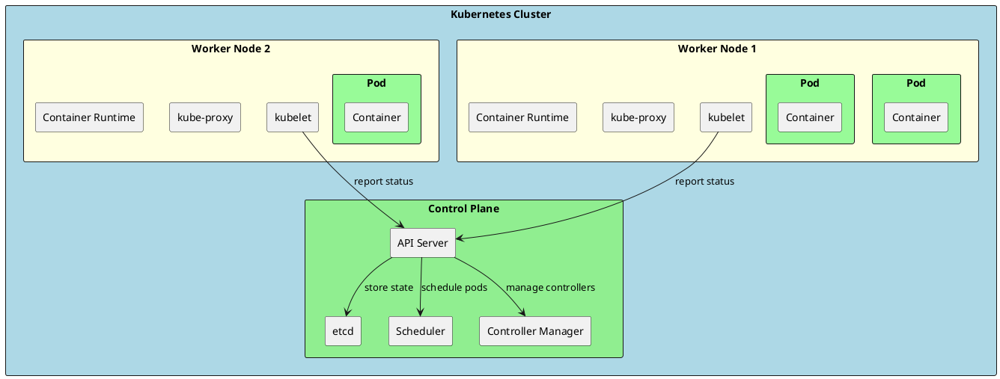
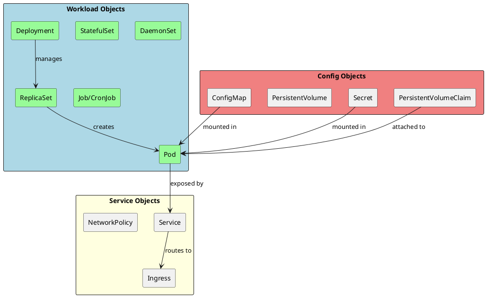
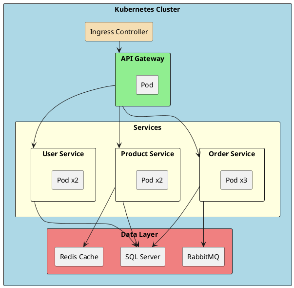
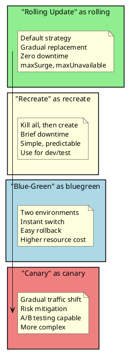

# Kubernetes Basics for .NET

Kubernetes (K8s) is the industry-standard container orchestration platform. As a senior .NET engineer, understanding Kubernetes is essential for deploying and managing containerized .NET applications at scale.

## Why Kubernetes Matters for Senior Engineers

- **Container Orchestration**: Automated deployment, scaling, and management
- **High Availability**: Self-healing, load balancing, rolling updates
- **Cloud-Native Standard**: Supported by all major cloud providers (AKS, EKS, GKE)
- **Microservices Foundation**: Essential for distributed .NET architectures

## Kubernetes Architecture



## Core Kubernetes Objects



## Basic .NET Application Deployment

### Deployment Manifest

```yaml
# deployment.yaml
apiVersion: apps/v1
kind: Deployment
metadata:
  name: myapi
  labels:
    app: myapi
    version: v1
spec:
  replicas: 3
  selector:
    matchLabels:
      app: myapi
  template:
    metadata:
      labels:
        app: myapi
        version: v1
    spec:
      containers:
        - name: myapi
          image: myregistry.azurecr.io/myapi:v1.0.0
          ports:
            - containerPort: 8080
              name: http
          env:
            - name: ASPNETCORE_ENVIRONMENT
              value: "Production"
            - name: ConnectionStrings__DefaultConnection
              valueFrom:
                secretKeyRef:
                  name: myapi-secrets
                  key: connection-string
          resources:
            requests:
              memory: "128Mi"
              cpu: "100m"
            limits:
              memory: "256Mi"
              cpu: "500m"
          livenessProbe:
            httpGet:
              path: /health/live
              port: 8080
            initialDelaySeconds: 10
            periodSeconds: 10
            timeoutSeconds: 5
            failureThreshold: 3
          readinessProbe:
            httpGet:
              path: /health/ready
              port: 8080
            initialDelaySeconds: 5
            periodSeconds: 5
            timeoutSeconds: 3
            failureThreshold: 3
          volumeMounts:
            - name: config
              mountPath: /app/config
              readOnly: true
      volumes:
        - name: config
          configMap:
            name: myapi-config
      securityContext:
        runAsNonRoot: true
        runAsUser: 1000
      affinity:
        podAntiAffinity:
          preferredDuringSchedulingIgnoredDuringExecution:
            - weight: 100
              podAffinityTerm:
                labelSelector:
                  matchLabels:
                    app: myapi
                topologyKey: kubernetes.io/hostname
```

### Service Manifest

```yaml
# service.yaml
apiVersion: v1
kind: Service
metadata:
  name: myapi
  labels:
    app: myapi
spec:
  type: ClusterIP
  ports:
    - port: 80
      targetPort: 8080
      protocol: TCP
      name: http
  selector:
    app: myapi
---
# LoadBalancer for external access
apiVersion: v1
kind: Service
metadata:
  name: myapi-external
  annotations:
    service.beta.kubernetes.io/azure-load-balancer-internal: "false"
spec:
  type: LoadBalancer
  ports:
    - port: 80
      targetPort: 8080
  selector:
    app: myapi
```

### Ingress Manifest

```yaml
# ingress.yaml
apiVersion: networking.k8s.io/v1
kind: Ingress
metadata:
  name: myapi-ingress
  annotations:
    kubernetes.io/ingress.class: nginx
    nginx.ingress.kubernetes.io/ssl-redirect: "true"
    nginx.ingress.kubernetes.io/proxy-body-size: "10m"
    cert-manager.io/cluster-issuer: "letsencrypt-prod"
spec:
  tls:
    - hosts:
        - api.myapp.com
      secretName: myapi-tls
  rules:
    - host: api.myapp.com
      http:
        paths:
          - path: /
            pathType: Prefix
            backend:
              service:
                name: myapi
                port:
                  number: 80
```

## ConfigMaps and Secrets

```yaml
# configmap.yaml
apiVersion: v1
kind: ConfigMap
metadata:
  name: myapi-config
data:
  appsettings.Production.json: |
    {
      "Logging": {
        "LogLevel": {
          "Default": "Warning",
          "Microsoft.AspNetCore": "Warning"
        }
      },
      "FeatureFlags": {
        "EnableNewFeature": true
      }
    }
  CACHE_EXPIRATION_MINUTES: "30"
---
# secret.yaml
apiVersion: v1
kind: Secret
metadata:
  name: myapi-secrets
type: Opaque
stringData:
  connection-string: "Server=sqlserver;Database=MyApp;User Id=sa;Password=SecretPassword"
  api-key: "super-secret-api-key"
---
# Using environment variables from ConfigMap/Secret
apiVersion: apps/v1
kind: Deployment
spec:
  template:
    spec:
      containers:
        - name: myapi
          envFrom:
            - configMapRef:
                name: myapi-config
            - secretRef:
                name: myapi-secrets
          env:
            - name: SPECIFIC_CONFIG
              valueFrom:
                configMapKeyRef:
                  name: myapi-config
                  key: CACHE_EXPIRATION_MINUTES
```

## Horizontal Pod Autoscaler

```yaml
# hpa.yaml
apiVersion: autoscaling/v2
kind: HorizontalPodAutoscaler
metadata:
  name: myapi-hpa
spec:
  scaleTargetRef:
    apiVersion: apps/v1
    kind: Deployment
    name: myapi
  minReplicas: 2
  maxReplicas: 10
  metrics:
    - type: Resource
      resource:
        name: cpu
        target:
          type: Utilization
          averageUtilization: 70
    - type: Resource
      resource:
        name: memory
        target:
          type: Utilization
          averageUtilization: 80
  behavior:
    scaleDown:
      stabilizationWindowSeconds: 300
      policies:
        - type: Percent
          value: 10
          periodSeconds: 60
    scaleUp:
      stabilizationWindowSeconds: 0
      policies:
        - type: Percent
          value: 100
          periodSeconds: 15
        - type: Pods
          value: 4
          periodSeconds: 15
      selectPolicy: Max
```

## Complete Microservices Deployment



```yaml
# Complete microservices deployment
# namespace.yaml
apiVersion: v1
kind: Namespace
metadata:
  name: myapp
  labels:
    name: myapp
---
# api-gateway-deployment.yaml
apiVersion: apps/v1
kind: Deployment
metadata:
  name: api-gateway
  namespace: myapp
spec:
  replicas: 2
  selector:
    matchLabels:
      app: api-gateway
  template:
    metadata:
      labels:
        app: api-gateway
    spec:
      containers:
        - name: api-gateway
          image: myregistry/api-gateway:v1.0.0
          ports:
            - containerPort: 8080
          env:
            - name: ASPNETCORE_ENVIRONMENT
              value: Production
            - name: OrderService__Url
              value: "http://order-service"
            - name: ProductService__Url
              value: "http://product-service"
            - name: UserService__Url
              value: "http://user-service"
          resources:
            limits:
              memory: "256Mi"
              cpu: "500m"
---
# order-service-deployment.yaml
apiVersion: apps/v1
kind: Deployment
metadata:
  name: order-service
  namespace: myapp
spec:
  replicas: 3
  selector:
    matchLabels:
      app: order-service
  template:
    metadata:
      labels:
        app: order-service
    spec:
      containers:
        - name: order-service
          image: myregistry/order-service:v1.0.0
          ports:
            - containerPort: 8080
          env:
            - name: ConnectionStrings__DefaultConnection
              valueFrom:
                secretKeyRef:
                  name: db-secrets
                  key: order-connection-string
            - name: RabbitMQ__Host
              value: "rabbitmq"
          livenessProbe:
            httpGet:
              path: /health/live
              port: 8080
            initialDelaySeconds: 10
          readinessProbe:
            httpGet:
              path: /health/ready
              port: 8080
            initialDelaySeconds: 5
---
# services.yaml
apiVersion: v1
kind: Service
metadata:
  name: api-gateway
  namespace: myapp
spec:
  ports:
    - port: 80
      targetPort: 8080
  selector:
    app: api-gateway
---
apiVersion: v1
kind: Service
metadata:
  name: order-service
  namespace: myapp
spec:
  ports:
    - port: 80
      targetPort: 8080
  selector:
    app: order-service
---
apiVersion: v1
kind: Service
metadata:
  name: product-service
  namespace: myapp
spec:
  ports:
    - port: 80
      targetPort: 8080
  selector:
    app: product-service
---
apiVersion: v1
kind: Service
metadata:
  name: user-service
  namespace: myapp
spec:
  ports:
    - port: 80
      targetPort: 8080
  selector:
    app: user-service
```

## Helm Charts

```plaintext
myapi-chart/
├── Chart.yaml
├── values.yaml
├── values-staging.yaml
├── values-production.yaml
└── templates/
    ├── _helpers.tpl
    ├── deployment.yaml
    ├── service.yaml
    ├── ingress.yaml
    ├── configmap.yaml
    ├── secret.yaml
    └── hpa.yaml
```

```yaml
# Chart.yaml
apiVersion: v2
name: myapi
description: A Helm chart for MyAPI .NET application
version: 1.0.0
appVersion: "1.0.0"
```

```yaml
# values.yaml (default values)
replicaCount: 2

image:
  repository: myregistry.azurecr.io/myapi
  tag: latest
  pullPolicy: IfNotPresent

service:
  type: ClusterIP
  port: 80

ingress:
  enabled: true
  className: nginx
  annotations:
    cert-manager.io/cluster-issuer: letsencrypt-prod
  hosts:
    - host: api.myapp.com
      paths:
        - path: /
          pathType: Prefix
  tls:
    - secretName: myapi-tls
      hosts:
        - api.myapp.com

resources:
  limits:
    cpu: 500m
    memory: 256Mi
  requests:
    cpu: 100m
    memory: 128Mi

autoscaling:
  enabled: true
  minReplicas: 2
  maxReplicas: 10
  targetCPUUtilizationPercentage: 70

env:
  ASPNETCORE_ENVIRONMENT: Production

secrets:
  connectionString: ""
```

```yaml
# templates/deployment.yaml
apiVersion: apps/v1
kind: Deployment
metadata:
  name: {{ include "myapi.fullname" . }}
  labels:
    {{- include "myapi.labels" . | nindent 4 }}
spec:
  {{- if not .Values.autoscaling.enabled }}
  replicas: {{ .Values.replicaCount }}
  {{- end }}
  selector:
    matchLabels:
      {{- include "myapi.selectorLabels" . | nindent 6 }}
  template:
    metadata:
      labels:
        {{- include "myapi.selectorLabels" . | nindent 8 }}
    spec:
      containers:
        - name: {{ .Chart.Name }}
          image: "{{ .Values.image.repository }}:{{ .Values.image.tag }}"
          imagePullPolicy: {{ .Values.image.pullPolicy }}
          ports:
            - containerPort: 8080
          env:
            {{- range $key, $value := .Values.env }}
            - name: {{ $key }}
              value: {{ $value | quote }}
            {{- end }}
            - name: ConnectionStrings__DefaultConnection
              valueFrom:
                secretKeyRef:
                  name: {{ include "myapi.fullname" . }}-secrets
                  key: connection-string
          resources:
            {{- toYaml .Values.resources | nindent 12 }}
          livenessProbe:
            httpGet:
              path: /health/live
              port: 8080
            initialDelaySeconds: 10
          readinessProbe:
            httpGet:
              path: /health/ready
              port: 8080
            initialDelaySeconds: 5
```

```bash
# Helm commands
helm install myapi ./myapi-chart -n myapp --create-namespace
helm upgrade myapi ./myapi-chart -n myapp -f values-production.yaml
helm rollback myapi 1 -n myapp
helm uninstall myapi -n myapp
```

## Network Policies

```yaml
# network-policy.yaml
apiVersion: networking.k8s.io/v1
kind: NetworkPolicy
metadata:
  name: api-network-policy
  namespace: myapp
spec:
  podSelector:
    matchLabels:
      app: myapi
  policyTypes:
    - Ingress
    - Egress
  ingress:
    # Allow traffic from ingress controller
    - from:
        - namespaceSelector:
            matchLabels:
              name: ingress-nginx
      ports:
        - protocol: TCP
          port: 8080
    # Allow traffic from other services in same namespace
    - from:
        - podSelector: {}
      ports:
        - protocol: TCP
          port: 8080
  egress:
    # Allow DNS
    - to:
        - namespaceSelector: {}
      ports:
        - protocol: UDP
          port: 53
    # Allow database access
    - to:
        - podSelector:
            matchLabels:
              app: sqlserver
      ports:
        - protocol: TCP
          port: 1433
    # Allow Redis access
    - to:
        - podSelector:
            matchLabels:
              app: redis
      ports:
        - protocol: TCP
          port: 6379
```

## Quick Reference Card

```
┌─────────────────────────────────────────────────────────────────────────────┐
│                      KUBERNETES QUICK REFERENCE                             │
├─────────────────────────────────────────────────────────────────────────────┤
│                                                                             │
│  KUBECTL BASICS:                                                            │
│  kubectl get pods -n myapp                    List pods                     │
│  kubectl get pods -o wide                     Detailed pod info             │
│  kubectl describe pod <name>                  Pod details                   │
│  kubectl logs <pod-name> -f                   Stream logs                   │
│  kubectl exec -it <pod> -- /bin/sh            Shell into pod                │
│                                                                             │
│  DEPLOYMENT OPERATIONS:                                                     │
│  kubectl apply -f deployment.yaml             Apply manifest                │
│  kubectl delete -f deployment.yaml            Delete resources              │
│  kubectl rollout status deployment/myapi      Check rollout                 │
│  kubectl rollout undo deployment/myapi        Rollback                      │
│  kubectl scale deployment/myapi --replicas=5  Scale                         │
│                                                                             │
│  DEBUGGING:                                                                 │
│  kubectl get events --sort-by='.lastTimestamp'  Recent events               │
│  kubectl top pods                              Resource usage                │
│  kubectl describe node <name>                  Node details                  │
│  kubectl port-forward pod/myapi 8080:8080      Local port forward            │
│                                                                             │
│  CONTEXT & NAMESPACE:                                                       │
│  kubectl config get-contexts                   List contexts                 │
│  kubectl config use-context <name>             Switch context                │
│  kubectl config set-context --current --namespace=myapp  Set namespace      │
│                                                                             │
│  COMMON RESOURCE TYPES:                                                     │
│  pods (po), deployments (deploy), services (svc), configmaps (cm)           │
│  secrets, ingress (ing), persistentvolumeclaims (pvc), namespaces (ns)      │
│                                                                             │
│  HELM COMMANDS:                                                             │
│  helm install <name> <chart>                   Install chart                 │
│  helm upgrade <name> <chart>                   Upgrade release               │
│  helm rollback <name> <revision>               Rollback release              │
│  helm list -n <namespace>                      List releases                 │
│                                                                             │
└─────────────────────────────────────────────────────────────────────────────┘
```

## Deployment Strategies



```yaml
# Rolling Update Strategy
spec:
  strategy:
    type: RollingUpdate
    rollingUpdate:
      maxSurge: 25%        # Max pods over desired count
      maxUnavailable: 25%  # Max pods that can be unavailable

# Recreate Strategy
spec:
  strategy:
    type: Recreate
```

## Persistent Storage

```yaml
# persistentvolumeclaim.yaml
apiVersion: v1
kind: PersistentVolumeClaim
metadata:
  name: sqlserver-data
  namespace: myapp
spec:
  accessModes:
    - ReadWriteOnce
  storageClassName: managed-premium  # Azure managed disk
  resources:
    requests:
      storage: 100Gi
---
# StatefulSet for SQL Server
apiVersion: apps/v1
kind: StatefulSet
metadata:
  name: sqlserver
  namespace: myapp
spec:
  serviceName: sqlserver
  replicas: 1
  selector:
    matchLabels:
      app: sqlserver
  template:
    metadata:
      labels:
        app: sqlserver
    spec:
      containers:
        - name: sqlserver
          image: mcr.microsoft.com/mssql/server:2022-latest
          ports:
            - containerPort: 1433
          env:
            - name: ACCEPT_EULA
              value: "Y"
            - name: SA_PASSWORD
              valueFrom:
                secretKeyRef:
                  name: db-secrets
                  key: sa-password
          volumeMounts:
            - name: data
              mountPath: /var/opt/mssql
  volumeClaimTemplates:
    - metadata:
        name: data
      spec:
        accessModes: ["ReadWriteOnce"]
        storageClassName: managed-premium
        resources:
          requests:
            storage: 100Gi
```

## Senior Interview Questions

**Q: Explain the difference between a Deployment and a StatefulSet.**

| Aspect | Deployment | StatefulSet |
|--------|------------|-------------|
| Pod Identity | Random names | Stable, ordered names (web-0, web-1) |
| Storage | Shared PVC | Unique PVC per pod |
| Scaling | Parallel | Sequential, ordered |
| Use Case | Stateless apps | Databases, message queues |
| Updates | Rolling, simultaneous | Ordered, one at a time |

**Q: How do you handle zero-downtime deployments in Kubernetes?**

Key components:
1. **Proper readiness probes**: Ensure pod is ready before receiving traffic
2. **Rolling update strategy**: Gradual replacement with maxSurge/maxUnavailable
3. **Pod Disruption Budget**: Guarantee minimum availability during updates
4. **Pre-stop hooks**: Allow graceful connection draining

```yaml
spec:
  template:
    spec:
      containers:
        - name: myapi
          lifecycle:
            preStop:
              exec:
                command: ["/bin/sh", "-c", "sleep 10"]  # Drain connections
          readinessProbe:
            httpGet:
              path: /health/ready
              port: 8080
            initialDelaySeconds: 5
            periodSeconds: 5
---
apiVersion: policy/v1
kind: PodDisruptionBudget
metadata:
  name: myapi-pdb
spec:
  minAvailable: 2  # Or use maxUnavailable: 1
  selector:
    matchLabels:
      app: myapi
```

**Q: How would you implement service-to-service communication in Kubernetes?**

Options:
1. **ClusterIP Service**: Internal DNS (service-name.namespace.svc.cluster.local)
2. **Service Mesh** (Istio/Linkerd): mTLS, traffic management, observability
3. **Headless Service**: Direct pod-to-pod (for StatefulSets)
4. **gRPC**: High-performance RPC with built-in load balancing

```csharp
// Using HttpClient with Kubernetes DNS
services.AddHttpClient("OrderService", client =>
{
    client.BaseAddress = new Uri("http://order-service.myapp.svc.cluster.local");
});
```

**Q: What's the difference between ConfigMap and Secret?**

| Aspect | ConfigMap | Secret |
|--------|-----------|--------|
| Encoding | Plain text | Base64 encoded |
| Size limit | 1 MB | 1 MB |
| Encryption at rest | No | Yes (with KMS) |
| Use case | Config files, env vars | Passwords, API keys, certs |

Both can be mounted as volumes or environment variables, but Secrets have additional security features like RBAC restrictions and optional encryption.
