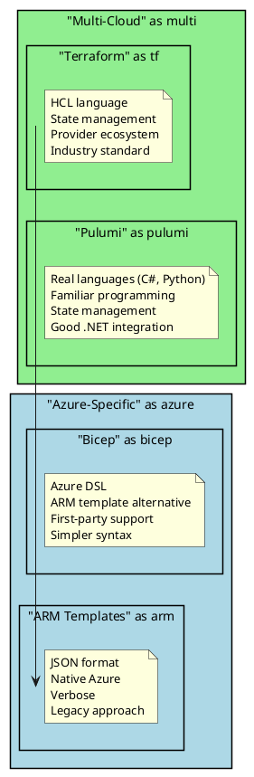

# Infrastructure as Code (IaC)

Infrastructure as Code (IaC) is the practice of managing and provisioning infrastructure through code rather than manual processes. As a senior .NET engineer, understanding IaC is essential for creating reproducible, version-controlled infrastructure for your applications.

## Why IaC Matters for Senior Engineers

- **Reproducibility**: Identical environments from dev to production
- **Version Control**: Track changes, review, and rollback infrastructure
- **Automation**: Integrate infrastructure with CI/CD pipelines
- **Documentation**: Code serves as living documentation of your infrastructure
- **Cost Control**: Prevent drift and manage resources efficiently

## IaC Tools Comparison



| Tool | Language | Cloud Support | State | Learning Curve |
|------|----------|---------------|-------|----------------|
| Terraform | HCL | Multi-cloud | Remote/Local | Medium |
| Bicep | DSL | Azure only | Azure-managed | Low |
| Pulumi | C#/Python/TS | Multi-cloud | Pulumi Cloud | Low (if you know the language) |
| ARM | JSON | Azure only | Azure-managed | High |

## Terraform for Azure

### Project Structure

```plaintext
terraform/
├── environments/
│   ├── dev/
│   │   ├── main.tf
│   │   ├── variables.tf
│   │   └── terraform.tfvars
│   ├── staging/
│   │   └── ...
│   └── production/
│       └── ...
├── modules/
│   ├── aks/
│   │   ├── main.tf
│   │   ├── variables.tf
│   │   └── outputs.tf
│   ├── sql-server/
│   │   └── ...
│   └── app-service/
│       └── ...
└── shared/
    ├── providers.tf
    └── backend.tf
```

### Basic Azure Infrastructure

```hcl
# providers.tf
terraform {
  required_version = ">= 1.5.0"

  required_providers {
    azurerm = {
      source  = "hashicorp/azurerm"
      version = "~> 3.80"
    }
    azuread = {
      source  = "hashicorp/azuread"
      version = "~> 2.45"
    }
  }

  backend "azurerm" {
    resource_group_name  = "tfstate-rg"
    storage_account_name = "tfstatestore"
    container_name       = "tfstate"
    key                  = "prod.terraform.tfstate"
  }
}

provider "azurerm" {
  features {
    key_vault {
      purge_soft_delete_on_destroy = false
    }
  }
}
```

```hcl
# variables.tf
variable "environment" {
  description = "Environment name"
  type        = string
  validation {
    condition     = contains(["dev", "staging", "production"], var.environment)
    error_message = "Environment must be dev, staging, or production."
  }
}

variable "location" {
  description = "Azure region"
  type        = string
  default     = "eastus"
}

variable "app_name" {
  description = "Application name"
  type        = string
}

variable "sql_admin_password" {
  description = "SQL Server admin password"
  type        = string
  sensitive   = true
}

variable "tags" {
  description = "Tags to apply to resources"
  type        = map(string)
  default     = {}
}
```

```hcl
# main.tf
locals {
  resource_prefix = "${var.app_name}-${var.environment}"
  common_tags = merge(var.tags, {
    Environment = var.environment
    ManagedBy   = "Terraform"
    Application = var.app_name
  })
}

# Resource Group
resource "azurerm_resource_group" "main" {
  name     = "${local.resource_prefix}-rg"
  location = var.location
  tags     = local.common_tags
}

# App Service Plan
resource "azurerm_service_plan" "main" {
  name                = "${local.resource_prefix}-plan"
  location            = azurerm_resource_group.main.location
  resource_group_name = azurerm_resource_group.main.name
  os_type             = "Linux"
  sku_name            = var.environment == "production" ? "P1v3" : "B1"
  tags                = local.common_tags
}

# Web App
resource "azurerm_linux_web_app" "api" {
  name                = "${local.resource_prefix}-api"
  location            = azurerm_resource_group.main.location
  resource_group_name = azurerm_resource_group.main.name
  service_plan_id     = azurerm_service_plan.main.id
  https_only          = true

  site_config {
    always_on = var.environment == "production"

    application_stack {
      dotnet_version = "8.0"
    }

    health_check_path = "/health"
  }

  app_settings = {
    "ASPNETCORE_ENVIRONMENT"                = title(var.environment)
    "ApplicationInsights__ConnectionString" = azurerm_application_insights.main.connection_string
    "KeyVault__Url"                         = azurerm_key_vault.main.vault_uri
  }

  identity {
    type = "SystemAssigned"
  }

  tags = local.common_tags
}

# SQL Server
resource "azurerm_mssql_server" "main" {
  name                         = "${local.resource_prefix}-sql"
  resource_group_name          = azurerm_resource_group.main.name
  location                     = azurerm_resource_group.main.location
  version                      = "12.0"
  administrator_login          = "sqladmin"
  administrator_login_password = var.sql_admin_password
  minimum_tls_version          = "1.2"

  azuread_administrator {
    login_username = "AzureAD Admin"
    object_id      = data.azuread_client_config.current.object_id
  }

  tags = local.common_tags
}

resource "azurerm_mssql_database" "main" {
  name         = "${var.app_name}db"
  server_id    = azurerm_mssql_server.main.id
  collation    = "SQL_Latin1_General_CP1_CI_AS"
  license_type = "LicenseIncluded"
  sku_name     = var.environment == "production" ? "S1" : "Basic"

  short_term_retention_policy {
    retention_days = var.environment == "production" ? 35 : 7
  }

  tags = local.common_tags
}

# Key Vault
resource "azurerm_key_vault" "main" {
  name                        = "${local.resource_prefix}-kv"
  location                    = azurerm_resource_group.main.location
  resource_group_name         = azurerm_resource_group.main.name
  tenant_id                   = data.azurerm_client_config.current.tenant_id
  sku_name                    = "standard"
  soft_delete_retention_days  = 7
  purge_protection_enabled    = var.environment == "production"
  enable_rbac_authorization   = true

  tags = local.common_tags
}

# Application Insights
resource "azurerm_application_insights" "main" {
  name                = "${local.resource_prefix}-ai"
  location            = azurerm_resource_group.main.location
  resource_group_name = azurerm_resource_group.main.name
  application_type    = "web"

  tags = local.common_tags
}

# Key Vault Access for Web App
resource "azurerm_role_assignment" "webapp_keyvault" {
  scope                = azurerm_key_vault.main.id
  role_definition_name = "Key Vault Secrets User"
  principal_id         = azurerm_linux_web_app.api.identity[0].principal_id
}
```

```hcl
# outputs.tf
output "resource_group_name" {
  value = azurerm_resource_group.main.name
}

output "webapp_url" {
  value = "https://${azurerm_linux_web_app.api.default_hostname}"
}

output "webapp_identity_principal_id" {
  value = azurerm_linux_web_app.api.identity[0].principal_id
}

output "sql_server_fqdn" {
  value = azurerm_mssql_server.main.fully_qualified_domain_name
}

output "key_vault_uri" {
  value = azurerm_key_vault.main.vault_uri
}
```

### Terraform Modules

```hcl
# modules/aks/main.tf
resource "azurerm_kubernetes_cluster" "main" {
  name                = var.cluster_name
  location            = var.location
  resource_group_name = var.resource_group_name
  dns_prefix          = var.dns_prefix
  kubernetes_version  = var.kubernetes_version

  default_node_pool {
    name                = "system"
    node_count          = var.system_node_count
    vm_size             = var.system_node_size
    enable_auto_scaling = true
    min_count           = var.system_node_min
    max_count           = var.system_node_max
    vnet_subnet_id      = var.subnet_id

    upgrade_settings {
      max_surge = "33%"
    }
  }

  identity {
    type = "SystemAssigned"
  }

  network_profile {
    network_plugin    = "azure"
    network_policy    = "calico"
    load_balancer_sku = "standard"
    service_cidr      = "10.0.0.0/16"
    dns_service_ip    = "10.0.0.10"
  }

  oms_agent {
    log_analytics_workspace_id = var.log_analytics_workspace_id
  }

  key_vault_secrets_provider {
    secret_rotation_enabled = true
  }

  tags = var.tags
}

# User node pool for workloads
resource "azurerm_kubernetes_cluster_node_pool" "user" {
  name                  = "user"
  kubernetes_cluster_id = azurerm_kubernetes_cluster.main.id
  vm_size               = var.user_node_size
  enable_auto_scaling   = true
  min_count             = var.user_node_min
  max_count             = var.user_node_max
  vnet_subnet_id        = var.subnet_id

  node_labels = {
    "workload" = "user"
  }

  tags = var.tags
}
```

```hcl
# modules/aks/variables.tf
variable "cluster_name" {
  type = string
}

variable "location" {
  type = string
}

variable "resource_group_name" {
  type = string
}

variable "dns_prefix" {
  type = string
}

variable "kubernetes_version" {
  type    = string
  default = "1.28"
}

variable "system_node_count" {
  type    = number
  default = 2
}

variable "system_node_size" {
  type    = string
  default = "Standard_D2s_v3"
}

variable "system_node_min" {
  type    = number
  default = 2
}

variable "system_node_max" {
  type    = number
  default = 5
}

variable "user_node_size" {
  type    = string
  default = "Standard_D4s_v3"
}

variable "user_node_min" {
  type    = number
  default = 1
}

variable "user_node_max" {
  type    = number
  default = 10
}

variable "subnet_id" {
  type = string
}

variable "log_analytics_workspace_id" {
  type = string
}

variable "tags" {
  type    = map(string)
  default = {}
}
```

```hcl
# Using the module
module "aks" {
  source = "./modules/aks"

  cluster_name               = "${local.resource_prefix}-aks"
  location                   = azurerm_resource_group.main.location
  resource_group_name        = azurerm_resource_group.main.name
  dns_prefix                 = var.app_name
  subnet_id                  = azurerm_subnet.aks.id
  log_analytics_workspace_id = azurerm_log_analytics_workspace.main.id

  system_node_min = var.environment == "production" ? 3 : 1
  system_node_max = var.environment == "production" ? 5 : 3
  user_node_min   = var.environment == "production" ? 2 : 1
  user_node_max   = var.environment == "production" ? 20 : 5

  tags = local.common_tags
}
```

## Azure Bicep

```bicep
// main.bicep
@description('Environment name')
@allowed(['dev', 'staging', 'production'])
param environment string

@description('Azure region')
param location string = resourceGroup().location

@description('Application name')
param appName string

@secure()
@description('SQL Server admin password')
param sqlAdminPassword string

var resourcePrefix = '${appName}-${environment}'
var tags = {
  Environment: environment
  ManagedBy: 'Bicep'
  Application: appName
}

// App Service Plan
resource appServicePlan 'Microsoft.Web/serverfarms@2023-01-01' = {
  name: '${resourcePrefix}-plan'
  location: location
  kind: 'linux'
  properties: {
    reserved: true
  }
  sku: {
    name: environment == 'production' ? 'P1v3' : 'B1'
  }
  tags: tags
}

// Web App
resource webApp 'Microsoft.Web/sites@2023-01-01' = {
  name: '${resourcePrefix}-api'
  location: location
  identity: {
    type: 'SystemAssigned'
  }
  properties: {
    serverFarmId: appServicePlan.id
    httpsOnly: true
    siteConfig: {
      linuxFxVersion: 'DOTNETCORE|8.0'
      alwaysOn: environment == 'production'
      healthCheckPath: '/health'
      appSettings: [
        {
          name: 'ASPNETCORE_ENVIRONMENT'
          value: toUpper(substring(environment, 0, 1)) + substring(environment, 1)
        }
        {
          name: 'ApplicationInsights__ConnectionString'
          value: appInsights.properties.ConnectionString
        }
        {
          name: 'KeyVault__Url'
          value: keyVault.properties.vaultUri
        }
      ]
    }
  }
  tags: tags
}

// SQL Server
resource sqlServer 'Microsoft.Sql/servers@2023-05-01-preview' = {
  name: '${resourcePrefix}-sql'
  location: location
  properties: {
    administratorLogin: 'sqladmin'
    administratorLoginPassword: sqlAdminPassword
    minimalTlsVersion: '1.2'
  }
  tags: tags
}

// SQL Database
resource sqlDatabase 'Microsoft.Sql/servers/databases@2023-05-01-preview' = {
  parent: sqlServer
  name: '${appName}db'
  location: location
  sku: {
    name: environment == 'production' ? 'S1' : 'Basic'
  }
  properties: {
    collation: 'SQL_Latin1_General_CP1_CI_AS'
  }
  tags: tags
}

// Key Vault
resource keyVault 'Microsoft.KeyVault/vaults@2023-07-01' = {
  name: '${resourcePrefix}-kv'
  location: location
  properties: {
    tenantId: subscription().tenantId
    sku: {
      family: 'A'
      name: 'standard'
    }
    enableRbacAuthorization: true
    enableSoftDelete: true
    softDeleteRetentionInDays: 7
    enablePurgeProtection: environment == 'production'
  }
  tags: tags
}

// Application Insights
resource appInsights 'Microsoft.Insights/components@2020-02-02' = {
  name: '${resourcePrefix}-ai'
  location: location
  kind: 'web'
  properties: {
    Application_Type: 'web'
  }
  tags: tags
}

// Key Vault access for Web App
resource keyVaultRoleAssignment 'Microsoft.Authorization/roleAssignments@2022-04-01' = {
  name: guid(keyVault.id, webApp.id, 'Key Vault Secrets User')
  scope: keyVault
  properties: {
    roleDefinitionId: subscriptionResourceId('Microsoft.Authorization/roleDefinitions', '4633458b-17de-408a-b874-0445c86b69e6') // Key Vault Secrets User
    principalId: webApp.identity.principalId
    principalType: 'ServicePrincipal'
  }
}

// Outputs
output webAppUrl string = 'https://${webApp.properties.defaultHostName}'
output sqlServerFqdn string = sqlServer.properties.fullyQualifiedDomainName
output keyVaultUri string = keyVault.properties.vaultUri
```

### Bicep Modules

```bicep
// modules/aks.bicep
@description('Cluster name')
param clusterName string

@description('Location')
param location string

@description('DNS prefix')
param dnsPrefix string

@description('Kubernetes version')
param kubernetesVersion string = '1.28'

@description('System node count')
param systemNodeCount int = 2

@description('System node VM size')
param systemNodeSize string = 'Standard_D2s_v3'

@description('Subnet ID')
param subnetId string

@description('Log Analytics Workspace ID')
param logAnalyticsWorkspaceId string

@description('Tags')
param tags object = {}

resource aks 'Microsoft.ContainerService/managedClusters@2023-10-01' = {
  name: clusterName
  location: location
  identity: {
    type: 'SystemAssigned'
  }
  properties: {
    kubernetesVersion: kubernetesVersion
    dnsPrefix: dnsPrefix
    agentPoolProfiles: [
      {
        name: 'system'
        count: systemNodeCount
        vmSize: systemNodeSize
        mode: 'System'
        vnetSubnetID: subnetId
        enableAutoScaling: true
        minCount: 2
        maxCount: 5
      }
    ]
    networkProfile: {
      networkPlugin: 'azure'
      networkPolicy: 'calico'
      loadBalancerSku: 'standard'
      serviceCidr: '10.0.0.0/16'
      dnsServiceIP: '10.0.0.10'
    }
    addonProfiles: {
      omsagent: {
        enabled: true
        config: {
          logAnalyticsWorkspaceResourceID: logAnalyticsWorkspaceId
        }
      }
    }
  }
  tags: tags
}

output clusterName string = aks.name
output kubeletIdentityObjectId string = aks.properties.identityProfile.kubeletidentity.objectId
```

## Pulumi with C#

```csharp
// Program.cs
using Pulumi;
using Pulumi.AzureNative.Resources;
using Pulumi.AzureNative.Web;
using Pulumi.AzureNative.Web.Inputs;
using Pulumi.AzureNative.Sql;
using Pulumi.AzureNative.KeyVault;
using Pulumi.AzureNative.Insights;

return await Pulumi.Deployment.RunAsync(() =>
{
    var config = new Config();
    var environment = config.Require("environment");
    var appName = config.Require("appName");
    var sqlPassword = config.RequireSecret("sqlAdminPassword");

    var resourcePrefix = $"{appName}-{environment}";
    var tags = new InputMap<string>
    {
        { "Environment", environment },
        { "ManagedBy", "Pulumi" },
        { "Application", appName }
    };

    // Resource Group
    var resourceGroup = new ResourceGroup($"{resourcePrefix}-rg", new ResourceGroupArgs
    {
        Tags = tags
    });

    // App Service Plan
    var appServicePlan = new AppServicePlan($"{resourcePrefix}-plan", new AppServicePlanArgs
    {
        ResourceGroupName = resourceGroup.Name,
        Kind = "Linux",
        Reserved = true,
        Sku = new SkuDescriptionArgs
        {
            Name = environment == "production" ? "P1v3" : "B1",
            Tier = environment == "production" ? "PremiumV3" : "Basic"
        },
        Tags = tags
    });

    // Application Insights
    var appInsights = new Component($"{resourcePrefix}-ai", new ComponentArgs
    {
        ResourceGroupName = resourceGroup.Name,
        Kind = "web",
        ApplicationType = "web",
        Tags = tags
    });

    // Key Vault
    var keyVault = new Vault($"{resourcePrefix}-kv", new VaultArgs
    {
        ResourceGroupName = resourceGroup.Name,
        Properties = new VaultPropertiesArgs
        {
            TenantId = config.Require("tenantId"),
            Sku = new SkuArgs
            {
                Family = SkuFamily.A,
                Name = SkuName.Standard
            },
            EnableRbacAuthorization = true,
            EnableSoftDelete = true,
            SoftDeleteRetentionInDays = 7
        },
        Tags = tags
    });

    // Web App
    var webApp = new WebApp($"{resourcePrefix}-api", new WebAppArgs
    {
        ResourceGroupName = resourceGroup.Name,
        ServerFarmId = appServicePlan.Id,
        HttpsOnly = true,
        Identity = new ManagedServiceIdentityArgs
        {
            Type = Pulumi.AzureNative.Web.ManagedServiceIdentityType.SystemAssigned
        },
        SiteConfig = new SiteConfigArgs
        {
            LinuxFxVersion = "DOTNETCORE|8.0",
            AlwaysOn = environment == "production",
            HealthCheckPath = "/health",
            AppSettings = new[]
            {
                new NameValuePairArgs
                {
                    Name = "ASPNETCORE_ENVIRONMENT",
                    Value = char.ToUpper(environment[0]) + environment[1..]
                },
                new NameValuePairArgs
                {
                    Name = "ApplicationInsights__ConnectionString",
                    Value = appInsights.ConnectionString
                },
                new NameValuePairArgs
                {
                    Name = "KeyVault__Url",
                    Value = keyVault.Properties.Apply(p => p.VaultUri)
                }
            }
        },
        Tags = tags
    });

    // SQL Server
    var sqlServer = new Server($"{resourcePrefix}-sql", new ServerArgs
    {
        ResourceGroupName = resourceGroup.Name,
        AdministratorLogin = "sqladmin",
        AdministratorLoginPassword = sqlPassword,
        MinimalTlsVersion = "1.2",
        Tags = tags
    });

    // SQL Database
    var sqlDatabase = new Database($"{appName}db", new DatabaseArgs
    {
        ResourceGroupName = resourceGroup.Name,
        ServerName = sqlServer.Name,
        Collation = "SQL_Latin1_General_CP1_CI_AS",
        Sku = new Pulumi.AzureNative.Sql.Inputs.SkuArgs
        {
            Name = environment == "production" ? "S1" : "Basic"
        },
        Tags = tags
    });

    // Outputs
    return new Dictionary<string, object?>
    {
        ["resourceGroupName"] = resourceGroup.Name,
        ["webAppUrl"] = webApp.DefaultHostName.Apply(h => $"https://{h}"),
        ["sqlServerFqdn"] = sqlServer.FullyQualifiedDomainName,
        ["keyVaultUri"] = keyVault.Properties.Apply(p => p.VaultUri)
    };
});
```

## State Management

```plantuml
@startuml State Management
skinparam monochrome false
skinparam shadowing false

rectangle "Terraform State" as state #LightBlue {
    rectangle "terraform.tfstate" as tfstate #LightGreen {
        note right
            JSON file
            Resource mappings
            Metadata
            Sensitive data
        end note
    }
}

rectangle "State Backends" as backends #LightYellow {
    rectangle "Local" as local {
        note right: Development only
    }
    rectangle "Azure Blob" as blob {
        note right: Team/Production
    }
    rectangle "Terraform Cloud" as tfc {
        note right: Enterprise
    }
    rectangle "AWS S3" as s3 {
        note right: AWS projects
    }
}

state --> backends : stored in

@enduml
```

```hcl
# Remote state configuration
terraform {
  backend "azurerm" {
    resource_group_name  = "tfstate-rg"
    storage_account_name = "tfstatestore"
    container_name       = "tfstate"
    key                  = "production.terraform.tfstate"

    # State locking
    use_azuread_auth = true
  }
}

# State locking prevents concurrent modifications
# Azure Blob Storage uses blob lease for locking
```

## CI/CD Integration

```yaml
# GitHub Actions with Terraform
name: Infrastructure Deployment

on:
  push:
    branches: [main]
    paths:
      - 'terraform/**'
  pull_request:
    branches: [main]
    paths:
      - 'terraform/**'

env:
  TF_VERSION: '1.6.0'
  ARM_CLIENT_ID: ${{ secrets.AZURE_CLIENT_ID }}
  ARM_CLIENT_SECRET: ${{ secrets.AZURE_CLIENT_SECRET }}
  ARM_SUBSCRIPTION_ID: ${{ secrets.AZURE_SUBSCRIPTION_ID }}
  ARM_TENANT_ID: ${{ secrets.AZURE_TENANT_ID }}

jobs:
  plan:
    runs-on: ubuntu-latest
    steps:
      - uses: actions/checkout@v4

      - name: Setup Terraform
        uses: hashicorp/setup-terraform@v3
        with:
          terraform_version: ${{ env.TF_VERSION }}

      - name: Terraform Init
        working-directory: terraform/environments/production
        run: terraform init

      - name: Terraform Format Check
        working-directory: terraform/environments/production
        run: terraform fmt -check

      - name: Terraform Validate
        working-directory: terraform/environments/production
        run: terraform validate

      - name: Terraform Plan
        working-directory: terraform/environments/production
        run: |
          terraform plan \
            -var-file="terraform.tfvars" \
            -out=tfplan

      - name: Upload Plan
        uses: actions/upload-artifact@v4
        with:
          name: tfplan
          path: terraform/environments/production/tfplan

  apply:
    needs: plan
    runs-on: ubuntu-latest
    if: github.ref == 'refs/heads/main' && github.event_name == 'push'
    environment: production

    steps:
      - uses: actions/checkout@v4

      - name: Setup Terraform
        uses: hashicorp/setup-terraform@v3
        with:
          terraform_version: ${{ env.TF_VERSION }}

      - name: Download Plan
        uses: actions/download-artifact@v4
        with:
          name: tfplan
          path: terraform/environments/production

      - name: Terraform Init
        working-directory: terraform/environments/production
        run: terraform init

      - name: Terraform Apply
        working-directory: terraform/environments/production
        run: terraform apply -auto-approve tfplan
```

## Quick Reference Card

```
┌─────────────────────────────────────────────────────────────────────────────┐
│                       IAC QUICK REFERENCE                                   │
├─────────────────────────────────────────────────────────────────────────────┤
│                                                                             │
│  TERRAFORM COMMANDS:                                                        │
│  terraform init                    Initialize working directory             │
│  terraform plan                    Preview changes                          │
│  terraform apply                   Apply changes                            │
│  terraform destroy                 Destroy infrastructure                   │
│  terraform fmt                     Format code                              │
│  terraform validate                Validate configuration                   │
│  terraform state list              List resources in state                  │
│  terraform import <addr> <id>      Import existing resource                 │
│                                                                             │
│  BICEP COMMANDS:                                                            │
│  az bicep build -f main.bicep      Compile to ARM                          │
│  az deployment group create \                                               │
│    -f main.bicep -g myRG           Deploy to resource group                │
│  az bicep decompile -f arm.json    Convert ARM to Bicep                    │
│                                                                             │
│  PULUMI COMMANDS:                                                           │
│  pulumi new azure-csharp           Create new project                       │
│  pulumi preview                    Preview changes                          │
│  pulumi up                         Deploy changes                           │
│  pulumi destroy                    Destroy infrastructure                   │
│  pulumi stack                      Manage stacks                            │
│                                                                             │
│  BEST PRACTICES:                                                            │
│  • Use remote state with locking                                            │
│  • Modularize infrastructure                                                │
│  • Use workspaces/stacks per environment                                    │
│  • Store secrets in Key Vault, not state                                    │
│  • Run terraform plan in CI, apply only on main                             │
│  • Tag all resources consistently                                           │
│                                                                             │
└─────────────────────────────────────────────────────────────────────────────┘
```

## Senior Interview Questions

**Q: How do you handle secrets in Infrastructure as Code?**

Best practices:
1. **Never store secrets in code or state files**
2. Use Azure Key Vault, AWS Secrets Manager, or HashiCorp Vault
3. Reference secrets at deployment time, not in code
4. Use managed identities to avoid storing credentials
5. Encrypt state files at rest

```hcl
# Reference Key Vault secret in Terraform
data "azurerm_key_vault_secret" "db_password" {
  name         = "db-admin-password"
  key_vault_id = azurerm_key_vault.main.id
}

resource "azurerm_mssql_server" "main" {
  administrator_login_password = data.azurerm_key_vault_secret.db_password.value
}
```

**Q: Explain Terraform state and why it matters.**

Terraform state:
- Maps configuration to real resources
- Tracks metadata (dependencies, resource IDs)
- Enables plan/apply workflow
- Must be consistent across team

State management concerns:
- **Remote backends**: Share state across team
- **State locking**: Prevent concurrent modifications
- **Sensitive data**: State may contain secrets
- **State drift**: Resources changed outside Terraform

**Q: How do you structure Terraform for multiple environments?**

Common approaches:
1. **Workspaces**: Same code, different state files
2. **Directory per environment**: Separate folders with tfvars
3. **Terragrunt**: DRY wrapper for Terraform

```plaintext
# Recommended: Directory per environment
terraform/
├── modules/           # Shared modules
├── environments/
│   ├── dev/
│   │   ├── main.tf
│   │   └── terraform.tfvars
│   ├── staging/
│   └── production/
```

**Q: Compare Terraform vs Bicep for Azure-only projects.**

| Aspect | Terraform | Bicep |
|--------|-----------|-------|
| Learning curve | Medium (HCL) | Low (simpler DSL) |
| State management | External (you manage) | Azure-managed |
| Provider updates | Community-driven | First-party (faster) |
| Multi-cloud | Yes | No (Azure only) |
| Modularity | Excellent | Good |
| IDE support | Good | Excellent (VS Code) |

Recommendation: Use Bicep for Azure-only; Terraform for multi-cloud or existing Terraform expertise.
