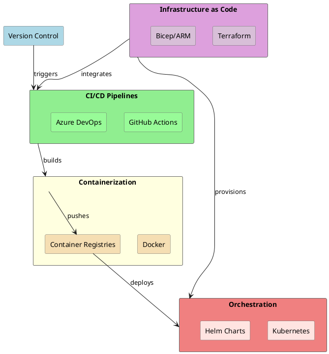
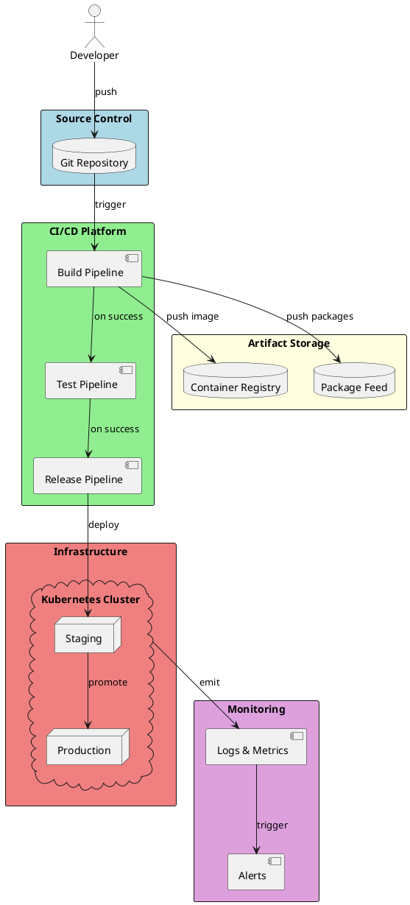

# DevOps & CI/CD - Senior Level

Master modern DevOps practices for .NET applications: CI/CD pipelines, containerization, orchestration, and Infrastructure as Code.

## Study Order

| # | File | Key Concepts |
|---|------|--------------|
| 1 | [GitHub Actions](./01-GitHubActions.md) | Workflows, Actions, Runners, Secrets, Matrix builds, Caching, Artifacts |
| 2 | [Azure DevOps](./02-AzureDevOps.md) | Pipelines, YAML, Stages, Environments, Deployment gates, Service connections |
| 3 | [Docker Containerization](./03-DockerContainerization.md) | Dockerfiles, Multi-stage builds, Images, Registries, Compose, Best practices |
| 4 | [Kubernetes Basics](./04-KubernetesBasics.md) | Pods, Deployments, Services, ConfigMaps, Secrets, Ingress, Helm |
| 5 | [Infrastructure as Code](./05-InfrastructureAsCode.md) | Terraform, Bicep, ARM templates, Pulumi, State management, Modules |

## Concept Dependencies



## Quick Reference Card

```
┌─────────────────────────────────────────────────────────────────────────────┐
│                          DEVOPS & CI/CD OVERVIEW                            │
├─────────────────────────────────────────────────────────────────────────────┤
│                                                                             │
│  CI/CD PIPELINE STAGES:                                                     │
│  ┌──────────┐  ┌──────────┐  ┌──────────┐  ┌──────────┐  ┌──────────┐      │
│  │  Source  │→ │  Build   │→ │   Test   │→ │  Stage   │→ │  Deploy  │      │
│  │   Code   │  │  Compile │  │  Unit/E2E│  │  Preview │  │   Prod   │      │
│  └──────────┘  └──────────┘  └──────────┘  └──────────┘  └──────────┘      │
│                                                                             │
│  CONTAINER LIFECYCLE:                                                       │
│  Dockerfile → Build Image → Push Registry → Pull → Run Container            │
│                                                                             │
│  KUBERNETES CORE OBJECTS:                                                   │
│  Pod (container) → ReplicaSet (scaling) → Deployment (updates)              │
│       ↓                                                                     │
│  Service (networking) → Ingress (external access)                           │
│                                                                             │
│  INFRASTRUCTURE AS CODE FLOW:                                               │
│  Define (.tf/.bicep) → Plan (preview) → Apply (provision) → State (track)  │
│                                                                             │
└─────────────────────────────────────────────────────────────────────────────┘
```

## DevOps Architecture Overview



## Key Interview Topics

- **CI/CD Pipeline Design**: Multi-stage pipelines, parallel jobs, caching strategies
- **Containerization Best Practices**: Multi-stage builds, security scanning, image optimization
- **Kubernetes Architecture**: Control plane, worker nodes, networking, storage
- **GitOps Workflows**: Declarative deployments, drift detection, rollback strategies
- **Infrastructure as Code**: State management, modules, secrets handling
- **Security in DevOps**: Secret management, RBAC, vulnerability scanning, supply chain security

## Practice Exercises

1. **GitHub Actions Workflow**: Create a complete CI/CD pipeline for a .NET Web API with build, test, security scan, and multi-environment deployment
2. **Multi-Stage Dockerfile**: Build an optimized .NET 8 container with security best practices
3. **Kubernetes Deployment**: Deploy a microservices application with proper resource limits, health checks, and autoscaling
4. **Terraform Module**: Create reusable infrastructure modules for Azure resources with proper state management
5. **End-to-End Pipeline**: Implement a complete GitOps workflow with automated infrastructure provisioning and application deployment

## Real-World Applications

| Concept | Application | Why It Matters |
|---------|-------------|----------------|
| GitHub Actions | Automated PR checks | Ensures code quality before merge |
| Docker Multi-stage | Production images | Reduces attack surface, smaller images |
| Kubernetes HPA | Auto-scaling | Handles traffic spikes cost-effectively |
| Terraform Modules | Reusable infrastructure | Consistent environments, reduces drift |
| GitOps | Declarative deployments | Audit trail, easy rollbacks |

## DevOps Maturity Model

```
┌─────────────────────────────────────────────────────────────────────────────┐
│                         DEVOPS MATURITY LEVELS                              │
├─────────────────────────────────────────────────────────────────────────────┤
│                                                                             │
│  Level 1: Initial                                                           │
│  • Manual deployments, no version control for infrastructure                │
│                                                                             │
│  Level 2: Managed                                                           │
│  • Basic CI/CD, manual approval gates, some automation                      │
│                                                                             │
│  Level 3: Defined                                                           │
│  • Standardized pipelines, containerization, basic IaC                      │
│                                                                             │
│  Level 4: Measured                                                          │
│  • Metrics-driven, automated testing, security scanning                     │
│                                                                             │
│  Level 5: Optimized                                                         │
│  • Full GitOps, self-healing infrastructure, chaos engineering              │
│                                                                             │
└─────────────────────────────────────────────────────────────────────────────┘
```

## Senior Interview Questions Preview

**Q: How would you design a CI/CD pipeline for a microservices architecture?**

A senior engineer should discuss:
- Monorepo vs polyrepo strategies and their impact on pipeline design
- Parallel builds for independent services
- Shared library versioning and dependency management
- Environment promotion strategies (dev → staging → production)
- Feature flags for gradual rollouts
- Canary deployments and automated rollback mechanisms
- Integration testing strategies for distributed systems

**Q: What are the key security considerations in a DevOps pipeline?**

Key areas to cover:
- Secret management (never in code, use vaults)
- Supply chain security (dependency scanning, SBOM)
- Container image scanning and signing
- RBAC and least privilege access
- Network policies in Kubernetes
- Audit logging and compliance
- Infrastructure security through code review
